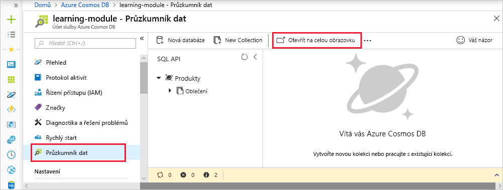
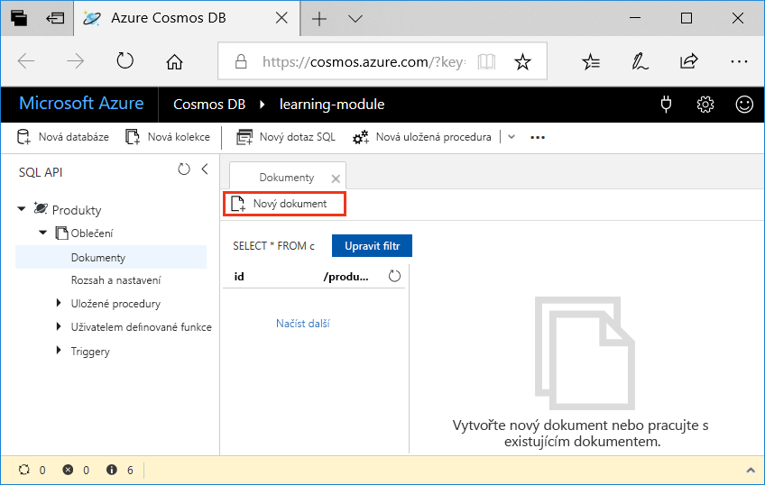
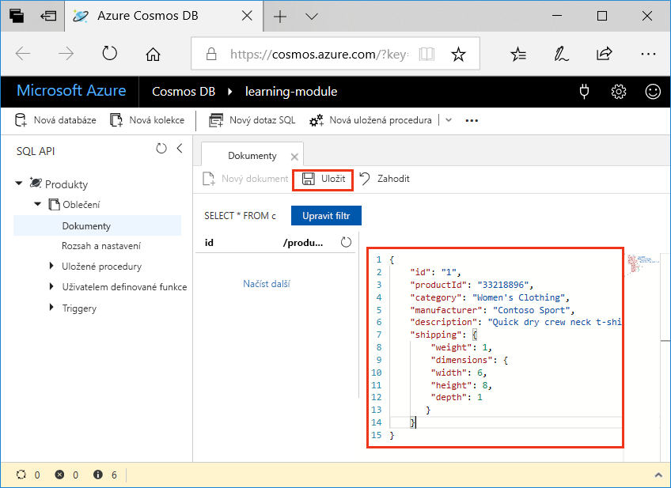

Přidávání dat do databáze Azure Cosmos DB je jednoduché. Otevřete Azure Portal, přejdete do databáze a v Průzkumníku dat přidáte dokumenty JSON do databáze. Existují pokročilejší způsoby přidání dat, ale my začneme s Průzkumníkem dat, protože jde o skvělý nástroj, který vás seznámí s vnitřními mechanismy a funkcemi Azure Cosmos DB.

## <a name="what-is-the-data-explorer"></a>Co je Průzkumník dat?
Průzkumník dat Azure Cosmos DB je nástroj, který je součástí webu Azure Portal a slouží ke správě dat uložených v Azure Cosmos DB. Poskytuje uživatelské rozhraní pro zobrazení kolekcí dat a úpravy dokumentů v databázi, dotazování dat a vytváření a spouštění uložených procedur.

## <a name="add-data-using-the-data-explorer"></a>Přidání dat pomocí Průzkumníku dat

1. Pomocí stejného účtu, kterým jste aktivovali sandbox, se přihlaste k portálu [Azure Portal pro Sandbox](https://portal.azure.com/learn.docs.microsoft.com?azure-portal=true).

    > [!IMPORTANT]
    > Přihlaste se na portál Azure Portal a k sandboxu pomocí stejného účtu.
    >
    > Přihlaste se na web Azure Portal pomocí odkazu uvedeného výše, abyste měli jistotu, že jste připojení k sandboxu, který poskytuje přístup k předplatnému Concierge.

1. Klikněte na tlačítko **Všechny služby** > **Databáze** > **Azure Cosmos DB**. Potom vyberte svůj účet, klikněte na **Průzkumník dat** a pak klikněte na **Otevřít na celou obrazovku**.

   

2. V poli zobrazení na **celé obrazovce** klikněte na **Otevřít**.

    Webový prohlížeč zobrazí Průzkumník dat na nové celé obrazovce, abyste měli více místa a vyhrazené prostředí pro práci s databází.

3. Chcete-li vytvořit nový dokument JSON, v podokně rozhraní SQL API rozbalte **Oblečení**, klikněte na tlačítko **Dokumenty** a pak klikněte na tlačítko **Nový dokument**.

   

4. Teď do kolekce přidejte dokument s následující strukturou. Zkopírujte a vložte následující kód na kartu **Dokumenty** a přepište stávající obsah:

     ```json
    {
        "id": "1",
        "productId": "33218896",
        "category": "Women's Clothing",
        "manufacturer": "Contoso Sport",
        "description": "Quick dry crew neck t-shirt",
        "price": "14.99",
        "shipping": {
            "weight": 1,
            "dimensions": {
            "width": 6,
            "height": 8,
            "depth": 1
           }
        }
    }
     ```

5. Po přidání formátu JSON na kartu **Dokumenty** klikněte na **Uložit**.

    

6. Zkopírováním následujícího objektu JSON do Průzkumníku dat a kliknutím na **Uložit** vytvořte a uložte další dokument kliknutím na tlačítko **Nový dokument**.

     ```json
    {
        "id": "2",
        "productId": "33218897",
        "category": "Women's Outerwear",
        "manufacturer": "Contoso",
        "description": "Black wool pea-coat",
        "price": "49.99",
        "shipping": {
            "weight": 2,
            "dimensions": {
            "width": 8,
            "height": 11,
            "depth": 3
           }
        }
    }
     ```

7. Zkontrolujte, že se dokumenty uložily, kliknutím na **Dokumenty** v nabídce nalevo.

    Průzkumník dat zobrazí na kartě **Dokumenty** dva dokumenty.

V této lekci jste pomocí Průzkumníku dat přidali do databáze dva dokumenty, které představují produkty v produktovém katalogu. Průzkumník dat představuje dobrý způsob vytváření a úpravy dokumentů a vhodný výchozí bod pro práci s Azure Cosmos DB.
