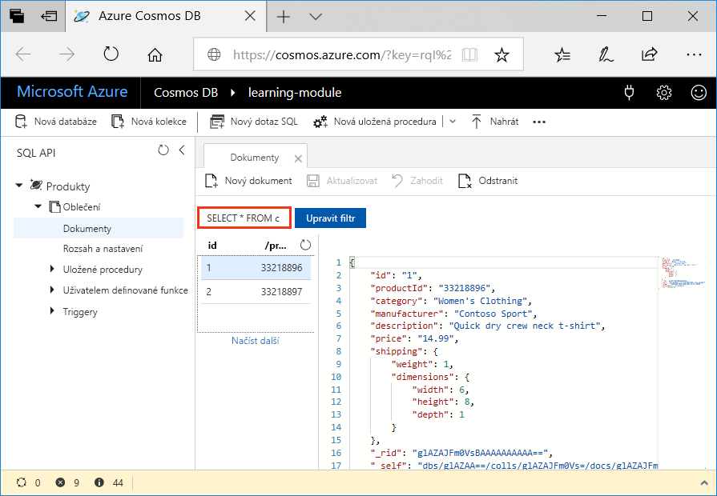
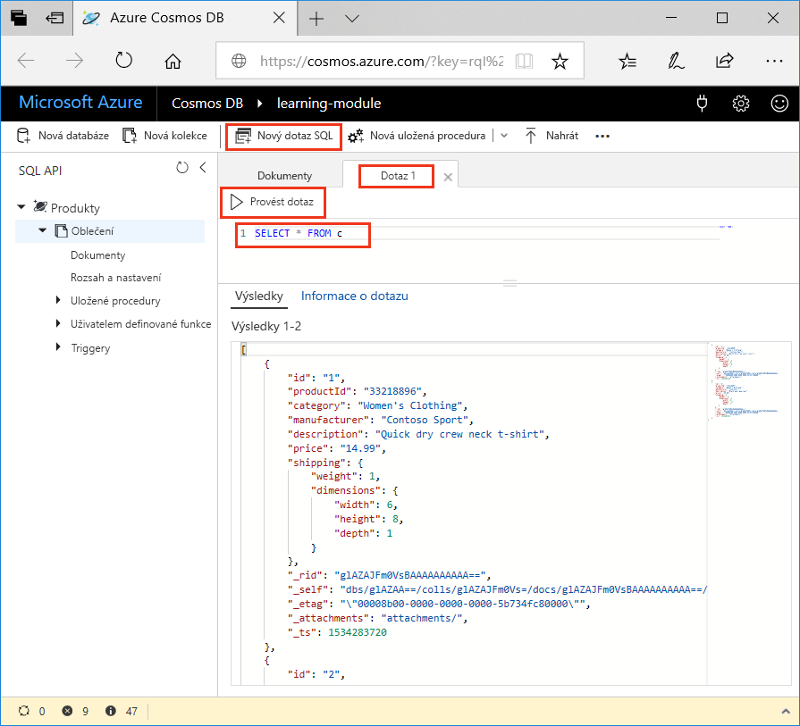
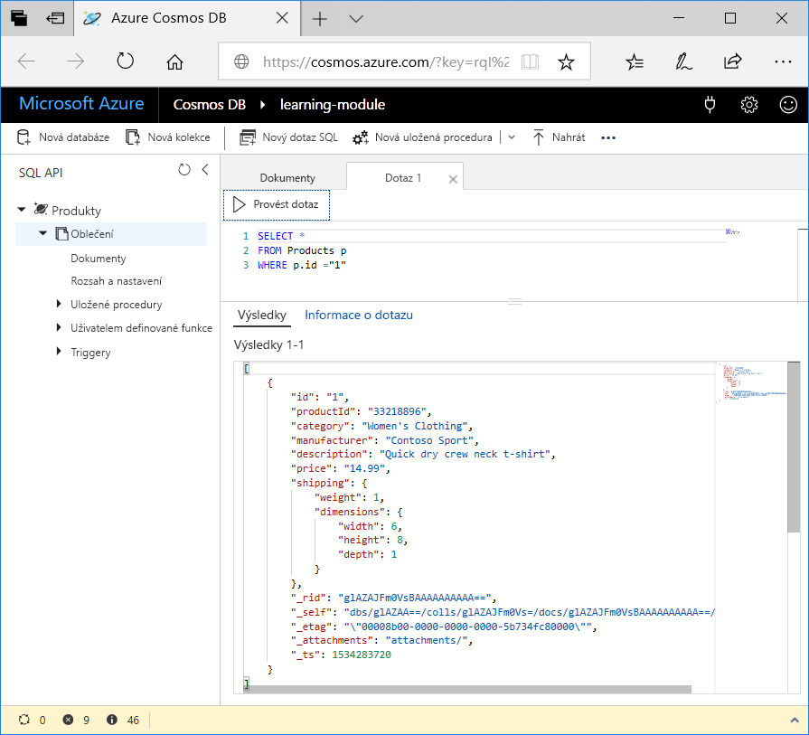

Nyní, když už víte, které druhy dotazů můžete vytvořit, použijme Průzkumníka dat na webu Azure Portal, abyste načetli a vyfiltrovali produktová data.

V okně Průzkumníku dat si všimněte, že ve výchozím nastavení je dotaz na kartě **Dokument** nastaven na `SELECT * FROM c`, jak vidíte na následujícím obrázku. Tento výchozí dotaz načte a zobrazí všechny dokumenty v kolekci.



## <a name="create-a-new-query"></a>Vytvoření nového dotazu

1. V Průzkumníku dat klikněte na možnost **Nový dotaz SQL**. Všimněte si, že výchozí dotaz na nové kartě **Dotaz 1** je znovu `SELECT * from c`, což vrátí všechny dokumenty v kolekci. 

1. Klikněte na možnost **Provést dotaz**. Tento dotaz vrátí všechny výsledky v databázi.

    

2. Nyní spusťme některé z dotazů, kterým jsme se věnovali v předchozí lekci. Na kartě dotazu odstraňte `SELECT * from c`, zkopírujte a vložte následující dotaz a potom klikněte na **Provést dotaz**:

    ```sql
    SELECT * 
    FROM Products p 
    WHERE p.id ="1"
    ```

    Výsledky vrátí produkt, jehož `productId` je 1.

    

3. Odstraňte předchozí dotaz, zkopírujte a vložte následující dotaz a klikněte na **Provést dotaz**. Tento dotaz vrátí cenu, popis a ID produktu pro všechny produkty, seřazené vzestupně podle ceny.
 
    ```sql
    SELECT p.price, p.description, p.productId 
    FROM Products p 
    ORDER BY p.price ASC
    ```

## <a name="summary"></a>Shrnutí

Nyní jste dokončili některé základní dotazy na data v Azure Cosmos DB. 