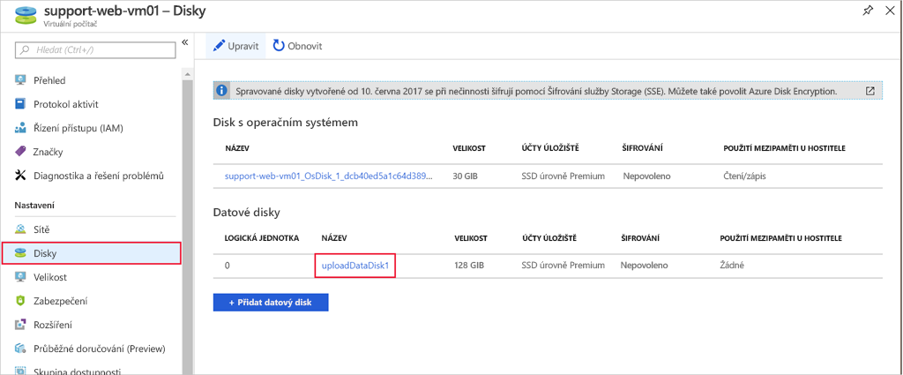
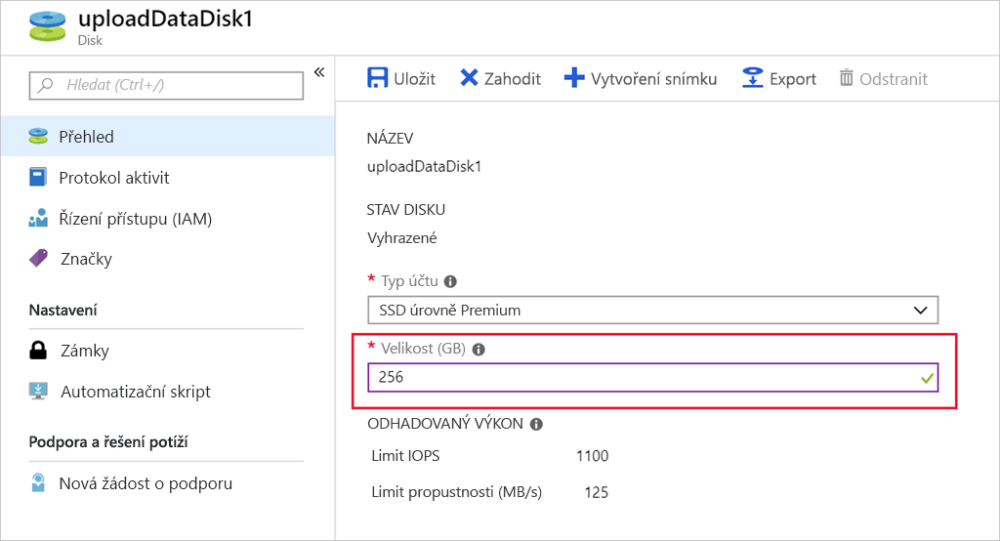

Azure ukládá image virtuálních pevných disků jako objekty blob stránky v účtu služby Azure Storage. U spravovaných disků se Azure stará o správu úložiště za vás – to je jeden z hlavních důvodů, proč zvolit spravované disky.

Když virtuální počítač vytváříte, zvolí si velikost disku operačního systému. Konkrétní velikost je založená na imagi, kterou vyberete. V Linuxu je to často kolem 30 GB a ve Windows přibližně 127 GB.

Pokud chcete další úložný prostor, můžete přidat datové disky nebo můžete rozšířit existující disk – třeba když starší verze aplikace nemůže rozdělit svoje data mezi disky nebo když migrujete fyzický disk počítače do Azure a potřebujete větší jednotku operačního systému.

> [!NOTE]
> Velikost disku můžete změnit jenom na _větší_. Zmenšení spravovaných disků není podporované.

Změnou velikosti disku se může také změnit úroveň disku (například z P10 na P20). Pamatujte na to – může to být výhodné pro upgrady ke zvýšení výkonu, ale přechod k úrovním Premium také znamená větší náklady.

## <a name="vm-size-versus-disk-size"></a>Velikost virtuálního počítače a velikost disku

To, jakou velikost virtuálního počítače zvolíte při jeho vytváření, určuje, kolik prostředků může virtuální počítač přidělit. V případě úložiště tato velikost určuje počet disků, které můžete k virtuálnímu počítači přidat, a maximální velikost každého disku.

Jak bylo uvedeno dříve, některé velikosti virtuálních počítačů podporují jenom jednotky úložiště úrovně Standard – to omezuje výkon vstupně-výstupních operací.

Pokud zjistíte, že potřebujete větší úložiště, než vaše velikost virtuálního počítače umožňuje, můžete velikost virtuálního počítače změnit. Toto téma je popsané v modulu [Úvod do virtuálních počítačů Azure](/learn/modules/intro-to-azure-virtual-machines?azure-portal=true).

## <a name="expanding-a-disk-using-the-azure-cli"></a>Rozšíření disku pomocí Azure CLI

> [!WARNING]
> Než budete provádět operace změny velikosti disků, nezapomeňte zálohovat data!

Operace na virtuálních pevných discích se nedají provádět při spuštěném virtuálním počítači. Nejdřív je potřeba virtuální počítač zastavit a uvolnit pomocí příkazu `az vm deallocate`, ve kterém zadáte název virtuálního počítače a název skupiny prostředků.

Uvolněním virtuálního počítače, na rozdíl od jeho pouhého _zastavení_, se uvolní přidružené výpočetní prostředky a Azure pak může provádět změny konfigurace virtualizovaného hardwaru.

> [!NOTE]
> Tyto příkazy zatím nespouštějte. Tento proces si procvičíte v další části.

```azurecli
az vm deallocate \
  --resource-group <resource-group-name> \
  --name <vm-name>
```

Potom pro změnu velikosti disku použijete příkaz `az disk update`, kterému předáte název disku, název skupiny prostředků a nově požadovanou velikost. Když rozšiřujete spravovaný disk, namapuje se zadaná velikost na nejbližší velikost spravovaného disku.

```azurecli
az disk update \
  --resource-group <resource-group-name> \
  --name <disk-name> \
  --size-gb 200
```

Nakonec spuštěním příkazu `az vm start` restartujte virtuální počítač.

```azurecli
az vm start \
  --resource-group <resource-group-name> \
  --name <vm-name>
```

## <a name="expanding-a-disk-using-the-azure-portal"></a>Rozšíření disku pomocí portálu Azure Portal

Rozšířit disk můžete také pomocí portálu Azure Portal.

1. Zastavte virtuální počítač pomocí tlačítka **Zastavit** na panelu nástrojů na stránce **Přehled** pro daný virtuální počítač.

1. V části **Nastavení** klikněte na **Disky**.

1. Vyberte datový disk, jehož velikost chcete změnit.

    

1. V podrobnostech disku zadejte velikost _větší_ než aktuální velikost. Můžete tady také změnit úroveň Premium na úroveň Standard (nebo naopak). Tímto nastavením se upraví výkon, jak je vidět v části předpokládaných vstupně-výstupních operací za sekundu.

    

1. Kliknutím na **Uložit** uložte změny.

1. Restartujte virtuální počítač.


### <a name="expanding-the-partition"></a>Rozšíření oddílu

Stejně jako při přidání nového datového disku se při rozšíření disku žádný použitelný prostor nepřidá, dokud nerozšíříte oddíl a systém souborů. Dělá se to pomocí nástrojů operačního systému dostupných pro virtuální počítač.

Ve Windows můžete použít nástroj Správce disků nebo nástroj příkazového řádku `diskpart`.

V Linuxu můžete použít nástroje `parted` a `resize2fs`. Tento postup budete provádět v další části.