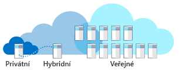

Představte si, že pracujete ve společnosti, která podniká v oboru zdravotní péče. Máte zastaralé systémy, oborové systémy a plány na zavedení nových systémů. Slyšeli jste, že je výhodné používat cloud computing. Jak zvolíte nejvhodnější model nasazení různých řešení – veřejný, privátní nebo hybridní cloud?

## Co je cloud computing?

Cloud computing je zřizování služeb a aplikací na vyžádání prostřednictvím internetu. Servery, aplikace, data a další prostředky se poskytují jako služby. 

Uživatelé nepřicházejí do kontaktu s podrobnými aspekty těchto služeb. Můžete tak rychle zřizovat výpočetní prostředky a používat službu s minimálními nároky na správu. Cloud computing byste neměli brát jako datové centrum dostupné přes internet. Cloud computing totiž prostřednictvím virtualizace, běžného hardwaru a automatizovaných procesů poskytuje zákazníkům samoobslužné uživatelské prostředí, podobně jako veřejné služby.

Cloud computing existuje ve třech modelech nasazení: veřejný cloud, privátní cloud a hybridní cloud. Následující obrázek ukazuje přehled těchto modelů nasazení.

#### Veřejný, privátní a hybridní

> [!VIDEO https://www.microsoft.com/videoplayer/embed/RE2yEv7]

## Veřejný cloud

Veřejné cloudy jsou nejčastějším způsobem nasazení cloud computingu. Služby se nabízejí přes veřejný internet a jsou dostupné každému, kdo si je chce koupit. Cloudové prostředky, jako jsou servery a úložiště, vlastní a provozuje externí poskytovatel cloudových služeb a poskytuje je přes internet. Služby můžou být zdarma nebo zpoplatněné a poskytované na vyžádání, takže zákazníci platí jenom za využité cykly CPU, úložiště nebo šířku pásma. Příkladem veřejného cloudu je Microsoft Azure. 

Představte si, že vaše společnost v oboru zdravotní péče potřebuje náborový web. Web musí být škálovatelný a musí rychle reagovat i při největším náporu náborových aktivit, který nastává několikrát do roka. Vaši zákazníci budou k webu získávat přístup z celého světa. Veřejný cloud vám umožní automatické navýšení kapacity úměrné k požadavkům při největším náporu. Při nízké návštěvnosti webu se kapacita sníží, takže ušetříte na nákladech. Váš web rychle reaguje i při největším náporu a vy platíte za prostředky navíc jen tehdy, když je potřebujete. Web můžete také nasadit do různých geografických oblastí, aby se zvýšila jeho spolehlivost a rychlost reakcí.

Během vývoje vašeho webu chtějí vývojáři vytvořit několik vývojových prostředí, aby vývoj urychlili. Vývojáři můžou při vývoji řešení prostřednictvím veřejného cloudu rychle zřizovat virtuální počítače pro izolovaná prostředí. Když už vývojáři některé prostředí nepotřebují, můžou ho odstranit.

### Proč zvolit veřejný cloud?

Veřejné cloudy se dají nasadit rychleji než místní infrastruktury a jejich platforma je skoro neomezeně škálovatelná. Každý zaměstnanec společnosti může používat aplikaci z kterékoli kanceláře nebo pobočky na zařízení s přístupem k internetu, které si sám zvolí. 

Příklady situací, kdy je dobré zvolit veřejný cloud:

- **Využívání služeb prostřednictvím modelu na vyžádání nebo modelu předplatného:** Model na vyžádání nebo model předplatného umožňuje platit jen za objem procesoru, úložiště a jiných prostředků, který využijete nebo si rezervujete.
- **Žádné počáteční investice do hardwaru:** Není potřeba pořizovat, spravovat ani udržovat místní hardware a aplikační infrastrukturu. Za veškerou správu a údržbu systému zodpovídá poskytovatel cloudových služeb. 
- **Automatizace:** Prostředky infrastruktury můžete rychle zřizovat pomocí webového portálu, skriptů nebo automaticky. 
- **Geografický rozptyl:** Data můžete ukládat v blízkosti svých zákazníků nebo v požadovaných lokalitách bez nutnosti provozování vlastních datacenter.
- **Menší nároky na údržbu hardwaru:** Za údržbu hardwaru zodpovídá poskytovatel služeb.

## Privátní cloud

Privátní cloud se skládá z výpočetních prostředků, které používají výhradně uživatelé z jedné firmy nebo organizace. Může se fyzicky nacházet v místním datovém centru vaší organizace nebo ho může hostovat externí poskytovatel služeb. Výraz „privátní cloud“ by se neměl považovat za jiné označení klasických místních datových center. Privátní cloud nabízí podobné výhody jako veřejný cloud, jen s využitím místní infrastruktury a služeb. K poskytování služeb *podobných těm cloudovým* používá platformu pro abstrakci, jako jsou clustery Kubernetes, nebo kompletní cloudové prostředí jako Azure Stack. Pořízení, konfiguraci a údržbu hardwaru má na starosti sama organizace. Komunikace mezi systémy většinou probíhá pomocí síťové infrastruktury vlastněné a udržované danou společností. Může to být třeba privátní interní síť nebo vyhrazené připojení mezi budovami přes optické vlákno.

Představte si, že pracujete ve společnosti podnikající v oboru zdravotní péče a máte aplikaci, která se používá v jednom z vašich datových center. Provozní prostředí se nedá replikovat ve veřejném cloudu. Dostanete nový požadavek na přístup k datům z jiného datového centra. Databáze obsahující příslušná data musí kvůli dodržení předpisů zůstat v původní lokalitě. Tomuto scénáři odpovídá privátní cloud. Vaše organizace vlastní dvě datová centra. Mohli byste k propojení těchto datových center použít síť VPN ve veřejném cloudu přes internet. I tak by ale tento scénář zahrnoval privátní cloud, protože se jedná o soukromé řešení dané organizace.

### Proč zvolit privátní cloud?

Privátní cloud může organizaci poskytnout větší flexibilitu. Vaše organizace může přizpůsobit své cloudové prostředí konkrétním obchodním potřebám. Vzhledem k tomu, že nedochází ke sdílení s jinými stranami, je možné zachovat vysokou úroveň kontroly a zabezpečení. Privátní cloudy navíc můžou poskytnout určitou úroveň škálovatelnosti a efektivity.

Příklady situací, kdy je dobré zvolit privátní cloud:

- **Už existující prostředí:** Máte existující provozní prostředí, které se nedá replikovat ve veřejném cloudu. Investovali jste velkou částku do hardwaru a pracovníků s odbornými znalostmi řešení. Velká organizace se může rozhodnout, že zpřístupní své výpočetní prostředky ke komerčnímu využití.
- **Zastaralé aplikace:** Máte zastaralé aplikace, které jsou zásadní pro provoz společnosti a nedají se snadno fyzicky přemístit.
- **Zabezpečení a suverenita dat:** Politické hranice nebo právní požadavky můžou stanovovat, kde se smějí data fyzicky nacházet.
- **Dodržování předpisů / certifikace:** Je potřeba dodržovat předpisy PCI nebo HIPAA. Certifikované místní datové centrum.

## Hybridní cloud

Hybridní cloud je výpočetní prostředí, které kombinuje veřejný a privátní cloud a umožňuje sdílení dat a aplikací mezi nimi. V případě kolísajících nároků na výpočetní prostředky a zpracování umožňuje hybridní cloud computing společnostem plynulé škálování místní infrastruktury do veřejného cloudu, který poskytne potřebnou kapacitu, aniž by ovšem získala datová centra třetích stran přístup ke všem datům společnosti. Organizace získají flexibilitu a výpočetní výkon veřejného cloudu pro potřeby základních a méně citlivých výpočetních úloh a zároveň si zásadní podnikové aplikace a data uchovají v místním prostředí, v bezpečí za podnikovou bránou firewall.

Použití hybridního cloudu přispívá k tomu, aby se společnost vyhnula vysokým pořizovacím nákladům na zpracování krátkodobých špiček v poptávce. Zároveň nabízí flexibilní možnosti určení toho, které prostředky zůstanou v místním prostředí a které přejdou do cloudu. Společnosti platí jenom za prostředky, které dočasně využívají, a nemusejí tak pořizovat, programovat a udržovat nadbytečné prostředky a zařízení, které by jinak většinu času nebyly vytížené. Integrace většinou probíhá prostřednictvím zabezpečené sítě VPN mezi poskytovatelem cloudu, jako je Azure, a místními datovými centry.

Představte si, že pracujete ve společnosti podnikající v oboru zdravotní péče a máte aplikaci, ve které můžou zákazníci získat přístup k informacím o své zdravotní péči. Podle předpisů musejí tato data zůstat ve fyzickém umístění. Zákaznický web musí rychle reagovat na požadavky mnoha uživatelů z celého světa.  Řešením může být situace, kdy je databáze hostovaná v místním datovém středisku a web ve veřejném cloudu. Místní datové centrum je s veřejným cloudem spojené sítí VPN. Tento scénář představuje hybridní cloud.

### Proč zvolit hybridní cloud?

Díky hybridnímu cloudu může mít vaše organizace kontrolu nad privátní infrastrukturou obsahující citlivé prostředky a udržovat ji. Zároveň tak získáte flexibilitu, abyste mohli v případě potřeby využívat dodatečné prostředky ve veřejném cloudu. Díky možnosti škálování ve veřejném cloudu platíte za mimořádný výpočetní výkon jen tehdy, když ho potřebujete. Také se tím usnadní přechod do cloudu. Migrace může probíhat postupně a jednotlivé úlohy se dají rozložit v čase.

Příklady situací, kdy je dobré zvolit hybridní cloud:

- **Investice do existujícího hardwaru:** Z obchodních důvodů musíte využívat existující provozní prostředí a hardware.
- **Zákonné požadavky:** Podle předpisů musejí data zůstat ve fyzickém umístění.
- **Jedinečné provozní prostředí:** Veřejný cloud nedokáže replikovat zastaralé provozní prostředí.
- **Migrace:** Úlohy můžete postupně přesouvat do cloudu.
