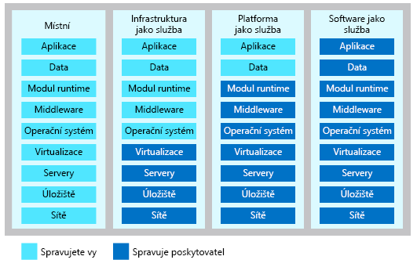

K poskytování prostředků cloud computingu slouží tři různé modely služeb.

- **Infrastruktura jako služba (IaaS)** okamžitě poskytuje výpočetní infrastrukturu, kterou můžete zřídit a spravovat přes internet.
- **Platforma jako služba (PaaS)** poskytuje předem připravená prostředí pro vývoj a nasazení, které můžete použít k poskytování vlastních cloudových služeb.
- **Software jako služba (SaaS)** poskytuje aplikace po internetu ve formě webové služby.

#### Porovnání IaaS, Sass a PaaS

> [!VIDEO https://www.microsoft.com/videoplayer/embed/RE2yEbs]

Při výběru modelu služby je potřeba zvážit, kdo má mít daný výpočetní prostředek na starost. Podle svého scénáře se můžete rozhodnout, jak velkou odpovědnost chcete mít za sdílenou správu. Následující obrázek ukazuje seznam prostředků, které spravujete a které váš poskytovatel služeb spravuje v jednotlivých kategoriích cloudové služby.

