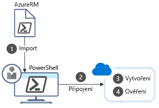

PowerShell umožňuje psát příkazy a okamžitě je spouštět. To se označuje jako **interaktivní režim**.

Připomínáme, že v příkladu, ve kterém jsme používali systém správy vztahů se zákazníky (CRM), bylo celkovým cílem vytvořit tři testovací prostředí s virtuálními počítači. Pomocí skupin prostředků zajistíte uspořádání virtuálních počítačů do různých prostředí: do jednoho pro testování jednotek, jednoho pro testování integrace a jednoho pro testování přijetí. Skupiny prostředků stačí vytvořit jednou, což znamená, že se vyplatí použít interaktivní režim PowerShellu.

Po zadání příkazu v PowerShellu se příkaz spáruje s _rutinou_, která provede požadovanou akci. Teď se podíváme na některé z běžných příkazů, které můžete použít, a potom na instalaci podpory Azure pro prostředí PowerShell.

## <a name="what-are-powershell-cmdlets"></a>Co jsou rutiny PowerShellu?
Příkazu PowerShellu se říká **rutina**. Rutina je příkaz, který pracuje s jedinou funkcí. Výrazem **rutina** se jednoduše označuje „malý příkaz“. V rámci konvencí se autorům rutin doporučuje vytvářet rutiny jednoduché a jednoúčelové.

Základní produkt PowerShellu se dodává s rutinami, které pracují s funkcemi, jako jsou relace a úlohy na pozadí. Pokud chcete získat rutiny, které pracují s jinými funkcemi, stačí přidat do instalace PowerShellu moduly. Existují například moduly třetích stran, které pracují s funkcí FTP, správou operačního systému, přístupem k systému souborů a podobně.

U rutin se používá zásada vytváření názvů sloveso-podstatné jméno, například: **Get-Process**, **Format-Table** nebo **Start-Service**. Existuje také zásada pro volbu sloves: k načtení dat se používá „get“, k vložení nebo aktualizaci dat „set“, k formátování dat „format“, k nasměrování výstupu do určitého cíle „out“ a podobně.

Autorům rutin se doporučuje přidat ke každé rutině soubor nápovědy. Rutina **Get-Help** zobrazí soubor nápovědy pro kteroukoli rutinu. Můžeme například získat nápovědu pro rutinu `Get-ChildItem` pomocí následujícího příkazu:

```powershell
Get-Help Get-ChildItem -detailed
```

## <a name="what-is-a-powershell-module"></a>Co je modul PowerShellu?

Rutiny se dodávají v _modulech_. Modul PowerShellu je knihovna DLL, která obsahuje kód ke zpracování každé dostupné rutiny. Rutiny můžete načíst do prostředí PowerShell načtením modulu, ve kterém jsou. Seznam načtených modulů můžete získat pomocí příkazu `Get-Module`:

```powershell
Get-Module
```

Výsledek bude vypadat zhruba takto:

```output
ModuleType Version    Name                                ExportedCommands
---------- -------    ----                                ----------------
Manifest   3.1.0.0    Microsoft.PowerShell.Management     {Add-Computer, Add-Content, Checkpoint-Computer, Clear-Con...
Manifest   3.1.0.0    Microsoft.PowerShell.Utility        {Add-Member, Add-Type, Clear-Variable, Compare-Object...}
Binary     1.0.0.1    PackageManagement                   {Find-Package, Find-PackageProvider, Get-Package, Get-Pack...
Script     1.0.0.1    PowerShellGet                       {Find-Command, Find-DscResource, Find-Module, Find-RoleCap...
Script     2.0.0      PSReadline                          {Get-PSReadLineKeyHandler, Get-PSReadLineOption, Remove-PS...
```

## <a name="what-is-the-az-module"></a>Co je modul Az?
**Az** je formální název modulu Azure PowerShellu, který obsahuje rutiny pro práci s funkcemi Azure. Obsahuje stovky rutin, které umožňují řídit skoro všechny aspekty všech prostředků Azure. Můžete pracovat se skupinami prostředků, úložištěm, virtuálními počítači, Azure Active Directory, kontejnery, strojovým učením a podobně. Tento modul je komponenta open source a je [k dispozici na GitHubu](https://github.com/Azure/azure-powershell).

> [!NOTE]
> Je možné, že jste viděli nebo používali příkazy Azure PowerShellu, které měly formát `-AzureRM`. V říjnu 2018 jsme oznámili nahrazení modulu **AzureRM** modulem **Az**. Tento nový modul má určité odlišnosti, zejména zkrácený prefix názvu rutiny `-Az` místo `-AzureRM`. Modul **Az** se dodává se zpětnou kompatibilitu s modulem **AzureRM**, takže formát rutiny `-AzureRM` bude fungovat. Měli byste ale přejít na modul **Az** a dále používat příkazy `-Az`.

### <a name="install-the-az-module"></a>Instalace modulu Az

Modul Az je k dispozici v globálním úložišti, označovaném také Galerie prostředí PowerShell. Modul můžete nainstalovat na místním počítači prostřednictvím příkazu `Install-Module`. K instalaci modulu z Galerie prostředí PowerShell potřebujete PowerShell se zvýšenými oprávněními. 

::: zone pivot="windows"

Pokud chcete nainstalovat nejnovější modul Azure PowerShellu, spusťte následující příkazy:

1. Otevřete nabídku **Start** a zadejte **Windows PowerShell**.

1. Klikněte pravým tlačítkem na ikonu **Windows PowerShellu** a vyberte **Spustit jako správce**.

1. V dialogovém okně **Řízení uživatelských účtů** vyberte **Ano**.

1. Zadejte následující příkaz a stiskněte Enter:

    ```powershell
    Install-Module -Name Az -AllowClobber
    ```

Tím se nainstaluje modul ve výchozím nastavení pro všechny uživatele (řízeno parametrem oboru).

Tento příkaz využívá NuGet k načítání komponent. V závislosti na verzi Nugetu, kterou jste si nainstalovali, se může zobrazit výzva ke stažení a instalaci nejnovější verze Nugetu.

```output
NuGet provider is required to continue
PowerShellGet requires NuGet provider version '2.8.5.201' or newer to interact with NuGet-based repositories. The NuGet
 provider must be available in 'C:\Program Files (x86)\PackageManagement\ProviderAssemblies' or
'C:\Users\<username>\AppData\Local\PackageManagement\ProviderAssemblies'. You can also install the NuGet provider by running
'Install-PackageProvider -Name NuGet -MinimumVersion 2.8.5.201 -Force'. Do you want PowerShellGet to install and import
 the NuGet provider now?
```

Ve výchozím nastavení není Galerie prostředí PowerShell nakonfigurovaná jako důvěryhodné úložiště pro PowerShellGet. Při prvním použití PSGallery se zobrazí tato výzva:

```output
You are installing the modules from an untrusted repository. If you trust this repository, change its
InstallationPolicy value by running the Set-PSRepository cmdlet. Are you sure you want to install the modules from
'PSGallery'?
```

#### <a name="script-execution-failed"></a>Spuštění skriptu se nezdařilo
V závislosti na konfiguraci zabezpečení může příkaz `Import-Module` selhat podobně jako v následujícím příkladu.

```output
import-module : File C:\Program Files (x86)\WindowsPowerShell\Modules\az\0.7.0\Az.psm1 cannot be loaded
because running scripts is disabled on this system. For more information, see about_Execution_Policies at
https:/go.microsoft.com/fwlink/?LinkID=135170.
At line:1 char:1
+ import-module Az
+ ~~~~~~~~~~~~~~~~~~~~~
    + CategoryInfo          : SecurityError: (:) [Import-Module], PSSecurityException
    + FullyQualifiedErrorId : UnauthorizedAccess,Microsoft.PowerShell.Commands.ImportModuleCommand
```

To obvykle znamená, že zásady spouštění jsou „Restricted“. To znamená, že nelze spustit moduly, které stáhnete z externího zdroje – včetně Galerie prostředí PowerShell. Můžete ověřit, jestli je to i váš případ, spuštěním příkazu `Get-ExecutionPolicy`. Pokud vrátí „Restricted“, postupujte takto:

1. Otevřete příkazový řádek PowerShellu se zvýšenými oprávněními.
1. Použijte rutinu `SetExecutionPolicy` ke změně zásady na „RemoteSigned“:

```powershell
Set-ExecutionPolicy RemoteSigned
```

Budete požádáni o povolení:

```output
The execution policy helps protect you from scripts that you do not trust. Changing the execution policy might expose
you to the security risks described in the about_Execution_Policies help topic at
https:/go.microsoft.com/fwlink/?LinkID=135170. Do you want to change the execution policy?
[Y] Yes  [A] Yes to All  [N] No  [L] No to All  [S] Suspend  [?] Help (default is "N"): Y
```

Pak by mělo být možné použít příkaz `Import-Module` k načtení rutin.

:::zone-end

::: zone pivot="linux,macos"

Pomocí stejných příkazů můžeme nainstalovat Azure PowerShell v systému Linux nebo macOS.

1. V terminálu zadejte následující příkaz, který spustí PowerShell Core se zvýšenými oprávněními.

    ```bash
    sudo pwsh
    ```

1. Spuštěním následujícího příkazu na příkazovém řádku PowerShellu Core nainstalujte Azure PowerShell.

    ```powershell
    Install-Module Az -AllowClobber
    ```

1. Pokud se zobrazí dotaz, jestli důvěřujete modulům z **PSGallery**, vyberte možnost **Ano** nebo **Ano všem**.

:::zone-end

### <a name="update-a-module"></a>Aktualizace modulu

Pokud se zobrazí upozornění nebo chybová zpráva, že je již nainstalovaná nějaká verze modulu Azure PowerShell, můžete provést aktualizaci na _nejnovější_ verzi spuštěním tohoto příkazu:

```powershell
Update-Module -Name Az
```

Stejně jako u příkazu `Install-Module` po zobrazení dotazu, jestli modulu důvěřujete, vyberte možnost **Ano** nebo **Ano všem**. Můžete také použít příkaz `Update-Module` a znovu nainstalovat modul, pokud s ním máte potíže.

## <a name="example-how-to-create-a-resource-group-with-azure-powershell"></a>Příklad: Jak vytvořit skupinu prostředků pomocí Azure PowerShellu
Jakmile je modul Azure načten, můžete začít pracovat s Azure. Pojďme provést běžný úkol – vytvoření skupiny prostředků. Jak už víte, skupiny prostředků používáme, když chceme související prostředky spravovat najednou. Vytvoření nové skupiny prostředků je jedním z prvních úkolů, které budete provádět při spuštění nového řešení Azure.

Potřebujeme provést čtyři kroky:

1. Importujte rutiny Azure.

1. Připojte se ke svému předplatnému Azure.

1. Vytvořte skupinu prostředků.

1. Ověřte, jestli vytvoření proběhlo úspěšně (viz níže).

Následující obrázek znázorňuje přehled těchto kroků.



Každý krok odpovídá jiné rutině.

### <a name="import-the-azure-cmdlets"></a>Import rutin Azure
Při spuštění PowerShell ve výchozím nastavení načte jenom základní rutiny. To znamená, že se nenačtou rutiny, které potřebujete při práci s Azure. Nejspolehlivější způsob, jak načíst potřebné rutiny, spočívá v jejich ručním importování na začátku relace PowerShellu.

K načtení modulů použijte rutinu **Import-Module**. Tato rutina má řadu parametrů určených pro různé situace. Může třeba načíst několik modulů, určitou verzi modulu, část modulu a podobně.

Například můžeme načíst všechny rutiny Az pomocí následujícího příkazu **v relaci PowerShellu se zvýšenými oprávněními**:

```powershell
Import-Module Az
```

> [!TIP]
> Pokud zjistíte, že s Azure PowerShellem pracujete často, existují dva způsoby, jak proces načítání modulů zautomatizovat. Můžete do svého profilu PowerShellu přidat položku, která zajistí import modulu Azure při spuštění, nebo použít nejnovější verzi PowerShellu, která při použití určité rutiny automaticky načte příslušný modul.

### <a name="connect"></a>Připojení
Když pracujete s místní instalací Azure PowerShellu, před spouštěním příkazů Azure bude potřeba provést ověření. Rutina **Connect-AzAccount** zobrazí výzvu k zadání přihlašovacích údajů Azure a potom se připojí k vašemu předplatnému Azure. Má řadu volitelných parametrů, ale pokud potřebujete jenom interaktivní výzvu, žádné parametry nejsou nutné:

```powershell
Connect-AzAccount
```

Tyto kroky bude potřeba zopakovat pro každou nově spuštěnou relaci PowerShellu, protože tento modul není součástí základní sady.


### <a name="working-with-subscriptions"></a>Práce s předplatnými
Pokud jste novým uživatelem Azure, máte nejspíš jen jedno předplatné. Pokud ale používáte Azure už delší dobu, pravděpodobně jste si vytvořili více předplatných Azure. Prostředí Azure PowerShell můžete nakonfigurovat tak, aby se příkazy spouštěly pro konkrétní předplatné.

V jeden okamžik můžete být pouze v jednom předplatném. Pomocí rutiny `Get-AzContext` můžete určit, které předplatné je aktivní. Pokud to není to správné, můžete ho změnit.

1. Seznam všech názvů předplatných ve vašem účtu můžete získat pomocí příkazu `Get-AzSubscription`. 

2. Změňte předplatné předáním názvu toho, které chcete vybrat.

```powershell
Select-AzSubscription -Subscription "Visual Studio Enterprise"
```

### <a name="get-a-list-of-all-resource-groups"></a>Získání seznamu všech skupin prostředků

Můžete načíst seznam všech skupin prostředků v aktivním předplatném:

```powershell
Get-AzResourceGroup
```

Pokud chcete získat přehlednější zobrazení, můžete pomocí svislé čáry (|) odeslat výstup rutiny `Get-AzResourceGroup` do rutiny `Format-Table`.

```powershell
Get-AzResourceGroup | Format-Table
```

Výsledek bude vypadat zhruba takto:

```output
ResourceGroupName                  Location       ProvisioningState Tags TagsTable ResourceId
-----------------                  --------       ----------------- ---- --------- ----------
cloud-shell-storage-southcentralus southcentralus Succeeded                        /subscriptions/xxxxxxxx-d3ce-4172...
ExerciseResources                  eastus         Succeeded                        /subscriptions/xxxxxxxx-d3ce-4172...
```

### <a name="create-a-resource-group"></a>Vytvoření skupiny prostředků

Jak už víte, když vytváříte prostředky v Azure, můžete je vždy umístit do skupiny prostředků pro účely správy. Skupina prostředků je často jedna z prvních věcí, které budete vytvářet při spuštění nové aplikace.

Skupiny prostředků můžete vytvářet pomocí rutiny `New-AzResourceGroup`. Je potřeba zadat název a umístění. Název musí být v rámci předplatného jedinečný. Umístění určuje, kde budou uložená metadata pro vaši skupinu prostředků (to pro vás může být důležité kvůli dodržování předpisů). K zadání umístění se používají řetězce jako Západní USA, Severní Evropa nebo Západní Indie. Stejně jako u většiny rutin Azure má rutina `New-AzResourceGroup` řadu volitelných parametrů. Základní syntaxe nicméně vypadá takto:

```powershell
New-AzResourceGroup -Name <name> -Location <location>
```

> [!NOTE]
> Pamatujte, že budeme pracovat v izolovaném prostředí Azure Sandbox, které pro vás skupinu prostředků vytvoří. Výše uvedený příkaz byste použili, pokud byste pracovali ve svém vlastním předplatném.

### <a name="verify-the-resources"></a>Ověření prostředků
Rutina `Get-AzResource` zobrazí seznam vašich prostředků Azure. To nám teď umožní ověřit, jestli se skupina prostředků úspěšně vytvořila.

```powershell
Get-AzResource
```

Podobně jako v případě příkazu `Get-AzResourceGroup` můžete získat stručnější zobrazení pomocí rutiny `Format-Table`. Tady použijeme zkrácenou verzi `ft`:

```powershell
Get-AzResource | ft
```

Můžete také filtrovat na konkrétní skupiny prostředků, abyste získali seznam jenom prostředků přidružených k dané skupině:

```powershell
Get-AzResource -ResourceGroup ExerciseResources
```

### <a name="creating-an-azure-virtual-machine"></a>Vytvoření virtuálního počítače Azure

Další běžný úkol, který jde provést pomocí PowerShellu, je k vytvoření virtuálních počítačů.

Azure PowerShell poskytuje k vytvoření virtuálního počítače rutinu `New-AzVm`. Rutina má velký počet parametrů, aby mohla zpracovávat velké množství nastavení konfigurace virtuálního počítače. Většina parametrů má přiměřené výchozí hodnoty, takže je potřeba zadat jenom pět věcí:

- **ResourceGroupName**: Skupina prostředků, do které se má nový virtuální počítač umístit.
- **Name**: Název virtuálního počítače v Azure.
- **Location**: Zeměpisné umístění, kde se má virtuální počítač zřídit.
- **Credential**: Objekt obsahující uživatelské jméno a heslo účtu správce virtuálního počítače. Použijeme k tomu rutinu `Get-Credential`. Tato rutina vyzve k zadání uživatelského jména a hesla a zabalí je do objektu přihlašovacích údajů.
- **Image**: Image operačního systému, která se má použít k vytvoření virtuálního počítače. Často to bývá linuxová distribuce nebo Windows Server.

```powershell
   New-AzVm 
       -ResourceGroupName <resource group name> 
       -Name <machine name> 
       -Credential <credentials object> 
       -Location <location> 
       -Image <image name>
```

Tyto parametry můžete zadat přímo do rutiny, jak je znázorněno výše. Alternativně můžete použít ke konfiguraci virtuálního počítače i jiné rutiny, jako například `Set-AzVMOperatingSystem`, `Set-AzVMSourceImage`, `Add-AzVMNetworkInterface` a `Set-AzVMOSDisk`.

Tady je příklad, který vytvoří řetězec rutiny `Get-Credential` spolu s parametrem `-Credential`:

```powershell
New-AzVM -Name MyVm -ResourceGroupName ExerciseResources -Credential (Get-Credential) ...
```

Přípona `AzVM` je specifická pro příkazy založené na virtuálních počítačích v PowerShellu. Existuje několik dalších, které můžete použít:

| Příkaz | Popis |
|---------|-------------|
| `Remove-AzVM` | Odstraní virtuální počítač Azure. |
| `Start-AzVM` | Spuštění zastaveného virtuálního počítače. |
| `Stop-AzVM` | Zastavení spuštěného virtuálního počítače. |
| `Restart-AzVM` | Restartování virtuálního počítače. |
| `Update-AzVM` | Aktualizuje konfiguraci pro virtuální počítač. |

#### <a name="example-getting-the-information-for-a-vm"></a>Příklad: Získání informací pro virtuální počítač

Můžete vytvořit seznam virtuálních počítačů ve vašem předplatném pomocí příkazu `Get-AzVM -Status`. Tento příkaz můžete také určit virtuální počítač pomocí vlastnosti `-Name`. Tady ho přiřadíme k proměnné prostředí PowerShell:

```powershell
$vm = Get-AzVM  -Name MyVM -ResourceGroupName ExerciseResources
```

Zajímavým aspektem je, že se jedná o _objekt_, se kterým můžete provádět interakce. Například můžete tento objekt vzít, provést změny a potom nasdílet změny zpět do Azure pomocí příkazu `Update-AzVM`:

```powershell
$ResourceGroupName = "ExerciseResources"
$vm = Get-AzVM  -Name MyVM -ResourceGroupName $ResourceGroupName
$vm.HardwareProfile.vmSize = "Standard_DS3_v2"

Update-AzVM -ResourceGroupName $ResourceGroupName  -VM $vm
```

Interaktivní režim PowerShellu je vhodný pro jednorázové úlohy. V našem příkladu budeme pravděpodobně používat stejnou skupinu prostředků po celou dobu životnosti projektu, takže dává smysl ji vytvořit v interaktivním režimu. Použití interaktivního režimu je při podobných úlohách často rychlejší a snazší než psát skript, který stejně spustíte jenom jednou.