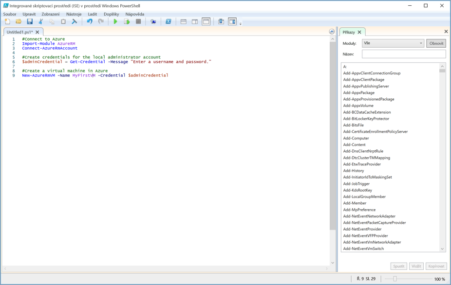

Složité nebo opakující se úlohy často zaberou značnou část času stráveného správou. Organizace proto tyto úlohy raději automatizují, aby snížily náklady a zabránily chybám.

To je důležité i v příkladu společnosti se systémem správy vztahů se zákazníky (CRM). Budete testovat software na několika virtuálních počítačích s Linuxem, které je potřeba průběžně odstraňovat a znovu vytvářet. Budete chtít použít skript PowerShellu k automatizaci vytváření virtuálních počítačů namísto jejich vytváření pokaždé ručně, jako jsme to dělali my.

Vedle základní operace vytvoření virtuálního počítače máte na skript ještě pár dalších požadavků. 
- Budete vytvářet několik virtuálních počítačů, takže chcete vytváření uzavřít do smyčky.
- Potřebujete vytvořit virtuální počítače ve třech různých skupinách prostředků, takže by se měl název skupiny prostředků předat do skriptu jako parametr.

V této části se dozvíte, jak napsat a spustit skript Azure PowerShellu, který těmto požadavkům vyhoví.

## <a name="what-is-a-powershell-script"></a>Co je skript PowerShellu?
Skript PowerShellu je textový soubor obsahující příkazy a konstrukty ovládacích prvků. Příkazy představují volání rutin. Konstrukty ovládacích prvků jsou programovací funkce jako smyčky, proměnné, parametry, komentáře atd. poskytované PowerShellem.

Soubory skriptu PowerShellu mají příponu **PS1**. Tyto soubory můžete vytvořit a uložit v libovolném textovém editoru. 

> [!TIP]
> Pokud píšete skripty PowerShellu ve Windows, můžete použít integrované skriptovací prostředí (ISE) Windows PowerShellu. Tento editor poskytuje funkce, jako jsou barevné zvýrazňování syntaxe a seznam dostupných rutin.
>
Následující snímek obrazovky ukazuje integrované skriptovací prostředí (ISE) Windows PowerShellu s ukázkovým skriptem pro připojení k Azure a vytvoření virtuálního počítače v Azure.

>

Jakmile napíšete skript, spusťte ho z příkazového řádku PowerShellu zadáním názvu souboru, kterému předchází tečka a zpětné lomítko:

```powershell
.\myScript.ps1
```

## <a name="powershell-techniques"></a>Techniky prostředí PowerShell
PowerShell obsahuje řadu funkcí obsažených v běžných programovacích jazycích. Můžete tady definovat proměnné, používat větve a smyčky, zachycovat parametry příkazového řádku, psát funkce, přidávat komentáře a podobně. Pro náš skript budeme potřebovat tři z těchto funkcí: proměnné, smyčky a parametry.

### <a name="variables"></a>Proměnné
Jak jste viděli v poslední lekci, prostředí PowerShell podporuje proměnné. K deklaraci proměnné použijte **$** a k přiřazení hodnoty **=**. Příklad:

```powershell
$loc = "East US"
$iterations = 3
```

Proměnné můžou obsahovat objekty. Například následující definice nastaví proměnnou **adminCredential** objektu vráceného rutinou **Get-Credential**.

```powershell
$adminCredential = Get-Credential
```

Pokud chcete získat hodnotu uloženou v proměnné, použijte předponu **$** a její název, jak je vidět tady: 

```powershell
$loc = "East US"
New-AzResourceGroup -Name "MyResourceGroup" -Location $loc
```

### <a name="loops"></a>Smyčky
Prostředí PowerShell obsahuje několik smyček: **For**, **Do...While**, **For...Each** atd. Smyčka **For** je pro naše účely nejvhodnější, protože budeme spouštět rutinu s pevným počtem opakování.

Základní syntaxe je uvedená níže. Příklad se spustí se dvěma iteracemi a pokaždé zobrazí hodnotu **i**. Operátory porovnání jsou **-lt** s významem „menší než“, **-le** s významem „menší než nebo rovná se“, **eq** s významem „rovná se“, **ne** s významem „nerovná se“ atd.

```powershell
For ($i = 1; $i -lt 3; $i++)
{
    $i
}
```

### <a name="parameters"></a>Parametry
Při spouštění skriptu můžete na příkazovém řádku zadat argumenty. Pro každý parametr můžete zadat název, který pomůže skriptu při extrahování hodnot. Příklad:

```powershell
.\setupEnvironment.ps1 -size 5 -location "East US"
```

Uvnitř skriptu zachycujete hodnoty do proměnných. V tomto příkladu se u parametrů hledá shoda podle názvu:

```powershell
param([string]$location, [int]$size)
```

Názvy můžete na příkazovém řádku vynechat. Příklad:

```powershell
.\setupEnvironment.ps1 5 "East US"
```

Pokud nejsou parametry pojmenované, v rámci skriptu závisí hledání shody na pozici:

```powershell
param([int]$size, [string]$location)
```

Mohli bychom vzít tyto parametry jako vstup a použít smyčku k vytvoření sady virtuálních počítačů ze zadaných parametrů. To zkusíme příště.

Kombinace prostředí PowerShell a Azure PowerShell poskytuje všechny nástroje, které potřebujete k automatizaci Azure. V našem příkladu se systémem CRM budete moct vytvořit několik virtuálních počítačů díky použití parametru, který umožňuje ponechat skript v generickém stavu, a smyčky, která umožňuje vyhnout se opakování kódu. To znamená, že dříve složitá operace se teď dá provést v jednom kroku.