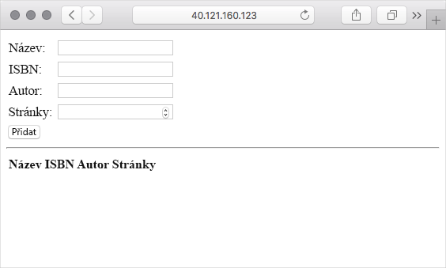
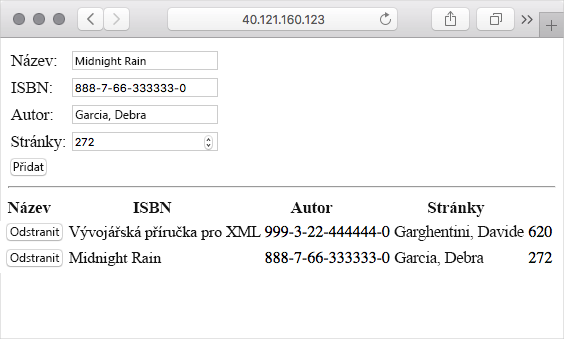

Zatím jste na virtuální počítač s Ubuntu nainstalovali MongoDB a Node.js. Teď vytvoříte základní webovou aplikaci, abyste se mohli podívat, jak to celé funguje. Dozvíte se také, k čemu slouží AngularJS a Express.

Naučíte se to na příkladech. Vytvářená webová aplikace představuje základní databázi knih. V této webové aplikaci můžete zobrazovat informace o knihách, přidávat nové knihy nebo odstraňovat ty stávající.

Zobrazená webová aplikace obsahuje řadu prvků, které se používají ve většině webových aplikací zásobníku MEAN. Pokud tyto funkce potřebujete nebo se o ně zajímáte, můžete je prozkoumat a použít k vytvoření vlastních aplikací zásobníku MEAN.

Webová aplikace Books bude vypadat takto:



Spolupráce jednotlivých komponent zásobníku MEAN

* V databázi MongoDB jsou uložené informace o knihách.
* Express přesměruje každý požadavek HTTP na příslušnou obslužnou rutinu.
* AngularJS spojuje uživatelské rozhraní s obchodní logikou programu.
* Node.js hostuje serverovou aplikaci.

> [!IMPORTANT]
> Pro studijní účely budete vytvářet základní webovou aplikaci. Na této aplikaci otestujete zásobník MEAN, abyste získali představu o jeho funkci. Tato aplikace není dostatečně zabezpečená ani není připravená k použití v ostrém provozu.

## <a name="what-about-express"></a>A co komponenta Express?

Zatím jste na virtuální počítač nainstalovali MongoDB a Node.js. Express, představuje ve zkratce MEAN písmeno **E**.

Expres je platforma webového serveru vytvořená pro Node.js, která zjednodušuje proces vytváření webových aplikací.

Hlavním úkolem platformy Express je směrování požadavků. _Směrování_ se týká způsobu, jakým aplikace reaguje na požadavek určitého koncového bodu. Koncový bod se skládá z cesty nebo identifikátoru URI a metody požadavku, jako je GET nebo POST. Například na požadavek GET, který se týká koncového bodu `/book`, můžete reagovat tak, že poskytnete seznam všech knih v databázi. Na požadavek POST, který se týká stejného koncového bodu, můžete reagovat přidáním záznamu do databáze. Tento záznam vychází z polí zadaných uživatelem ve webovém formuláři.

Ve webové aplikaci, kterou za chvíli vytvoříte, použijete Express ke směrování požadavků HTTP a vrácení webového obsahu uživateli. Express také umožňuje webovým aplikacím pracovat s HTTP soubory cookie a zpracovávat řetězce požadavků.

Express je balíčkem Node.js. K instalaci a správě balíčků Node.js slouží utilita **npm**, která je součástí Node.js. V této části dále vytvoříte soubor s názvem `package.json`, který definuje Express a další závislosti, a pak tyto závislosti nainstalujete příkazem `npm install`.

## <a name="what-about-angularjs"></a>A co komponenta AngularJS?

Stejně jako Express je potřeba také nainstalovat komponentu AngularJS, která ve zkratce MEAN představuje písmeno **A**.

AngularJS usnadňuje psaní a testování webových aplikací. Umožňuje lépe oddělit _vzhled_ webové aplikace, tj. kód HTML, od chování webové stránky. Pokud znáte vzorec MVC (Model-View-Controller) nebo pojem datové vazby, bude pro vás známá i komponenta AngularJS.

AngularJS je front-endové javascriptové rozhraní. Toto rozhraní potřebuje mít k dispozici klient, který přistupuje k aplikaci. Jinými slovy AngularJS běží ve webovém prohlížeči uživatele, nikoli ve vašem webovém prohlížeči. AngularJS je JavaScript, který můžete použít k jednoduchému načtení dat z webového serveru, aby bylo možné je zobrazit na stránce.

Ve skutečnosti se AngularJS _neinstaluje_. Místo toho na stránku HTML přidáváte odkazy na javascriptový soubor na stránce HTML úplně stejně jako u jiných javascriptových knihoven. Existují různé způsoby, jak zahrnout AngularJS do svých webových stránek. Tady načtete AngularJS ze sítě pro doručování obsahu (CDN). CDN představuje způsob geografické distribuce obrázků, videa a dalšího obsahu, který zlepšuje rychlost stahování.

Zatím tento kód nepřidávejte, ale tady je příklad načtení AngularJS z CDN. Tento kód byste obvykle přidali do oddílu `<head>` stránky HTML.

```html
<script src="https://ajax.googleapis.com/ajax/libs/angularjs/1.7.2/angular.min.js"></script>
```

> [!NOTE]
> Pozor na záměnu AngularJS s Angular. I když mají řadu věcí společných, AngularJS je předchůdcem rozhraní Angular. AngularJS se stále běžně používá k vytváření webových aplikací. AngularJS je založený na jazyku JavaScript. Angular je založený na programovacím jazyku TypeScript, který usnadňuje psaní javascriptových programů.

## <a name="how-will-i-build-the-application"></a>Jak vytvořím aplikaci?

Tady použijete základní postup. Kód aplikace napíšete v editoru Cloud Shell a pak použijete protokol SCP (Secure Copy Protocol) ke zkopírování souborů do virtuálního počítače. Dále nainstalujete aplikaci Node.js a podíváte se na výsledek v prohlížeči.

V praxi byste k napsání a otestování webové aplikace většinou použili místní prostředí, třeba svůj přenosný počítač nebo místně spuštěný virtuální počítač. Potom můžete kód uložit do systému pro správu verzí, jako je Git, a použít některý systém nepřetržité integrace a nepřetržitého doručování (systém CI/CD), jako je Azure DevOps, k testování změn a jejich nahrání na virtuální počítač. Na konci tohoto modulu vás upozorníme na další prostředky.

## <a name="create-the-books-web-application"></a>Vytvoření webové aplikace Books

Tady vytvoříte veškerý kód, skripty a soubory HTML, které tvoří webovou aplikaci. Kvůli stručnosti zdůrazníme jenom nejdůležitější části každého souboru, a nebudeme se zabývat úplnými detaily.

Pokud jste stále připojeni k virtuálnímu počítači přes SSH, spusťte příkaz `exit`, kterým ukončíte relaci SSH a vrátíte se do editoru Cloud Shell.

```bash
exit
```

Teď jste zpátky v relaci editoru Cloud Shell.

### <a name="create-the-files"></a>Vytvoření souborů

1. V editoru Cloud Shell spusťte tyto příkazy, kterými vytvoříte soubory a složky webové aplikace.

    ```bash
    cd ~
    mkdir Books
    touch Books/server.js
    touch Books/package.json
    mkdir Books/app
    touch Books/app/model.js
    touch Books/app/routes.js
    mkdir Books/public
    touch Books/public/script.js
    touch Books/public/index.html
    ```

    Co je její součástí:

    * `Books` – kořenový adresář projektu.
      * `server.js` definuje vstupní bod webové aplikace. Načte potřebné balíčky Node.js, určí port používaný k naslouchání a začne naslouchat příchozímu provozu protokolu HTTP.
      * `package.json` poskytuje informace o aplikaci, jako je její název, popis a balíčky Node.js, které aplikace potřebuje spustit.
    * `Books/app` – obsahuje kód, který běží na serveru.
      * `model.js` definuje připojení a schéma databáze. Můžete si ho představit jako datový model aplikace.
      * `routes.js` zpracovává směrování požadavků. Definuje třeba požadavky GET, které se týkají koncového bodu `/book`, poskytnutím seznamu všech knih v databázi.
    * `Books/public` – obsahuje soubory poskytované přímo prohlížeči klienta.
      * `index.html` obsahuje indexovou stránku. Obsahuje webový formulář, který uživateli umožňuje odesílat informace o knihách. Zobrazuje také všechny knihy v databázi a umožňuje z databáze odstraňovat záznamy.
      * `script.js` obsahuje javascriptový kód, který se spouští v prohlížeči uživatele. Umožňuje posílat serveru požadavky na výpis knih, přidávat knihy do databáze nebo je z ní odstraňovat.

1. Když spustíte příkaz `code`, otevřete soubory v editoru Cloud Shell.

    ```bash
    code Books
    ```

### <a name="create-the-data-model"></a>Vytvoření datového modelu

1. V editoru otevřete `app/model.js` a přidejte do něj následující kód.

    ```javascript
    var mongoose = require('mongoose');
    var dbHost = 'mongodb://localhost:27017/Books';
    mongoose.connect(dbHost, { useNewUrlParser: true } );
    mongoose.connection;
    mongoose.set('debug', true);
    var bookSchema = mongoose.Schema( {
        name: String,
        isbn: {type: String, index: true},
        author: String,
        pages: Number
    });
    var Book = mongoose.model('Book', bookSchema);
    module.exports = Book;
    ```

    > [!IMPORTANT]
    > Pokaždé, když v editoru změníte kód, nezapomeňte soubor uložit. Použijte nabídku „...“ nebo klávesovou zkratku (ve Windows a Linuxu <kbd>Ctrl+S</kbd>, v macOS <kbd>Command+S</kbd>).

    V tomto kódu se pro zjednodušení k přenosu dat do nebo z databáze MongoDB používá Mongoose. Mongoose je systém založený na schématu, který se používá k modelování dat.

    Tímto kódem se připojíte k databázi „Books“ na lokálním serveru MongoDB. Potom se použije zadané schéma k definici databázového dokumentu s názvem „Book“. Schéma definuje čtyři pole používaná k popisu jedné knihy:

    * Název knihy nebo její nadpis
    * Mezinárodní standardní číslo knihy (ISBN) používané jako jedinečný identifikátor knihy
    * Autor knihy
    * Počet stránek

    Dále vytvoříme obslužné rutiny HTTP, které mapují požadavky GET, POST a DELETE na databázové operace.

### <a name="create-the-express-routes-that-handle-http-requests"></a>Vytvoření tras Express na zpracování požadavků HTTP

1. V editoru otevřete soubor `app/routes.js` a přidejte následující kód.

    ```javascript
    var path = require('path');
    var Book = require('./model');
    var routes = function(app) {
        app.get('/book', function(req, res) {
            Book.find({}, function(err, result) {
                if ( err ) throw err;
                res.json(result);
            });
        });
        app.post('/book', function(req, res) {
            var book = new Book( {
                name:req.body.name,
                isbn:req.body.isbn,
                author:req.body.author,
                pages:req.body.pages
            });
            book.save(function(err, result) {
                if ( err ) throw err;
                res.json( {
                    message:"Successfully added book",
                    book:result
                });
            });
        });
        app.delete("/book/:isbn", function(req, res) {
            Book.findOneAndRemove(req.query, function(err, result) {
                if ( err ) throw err;
                res.json( {
                    message: "Successfully deleted the book",
                    book: result
                });
            });
        });
        app.get('*', function(req, res) {
            res.sendFile(path.join(__dirname + '/public', 'index.html'));
        });
    };
    module.exports = routes;
    ```

    Kód vytvoří pro aplikaci čtyři trasy. Tady je stručný popis každé trasy.

    | Příkaz HTTP | Koncový bod      | Popis                                                                                                           |
    |-----------|---------------|-----------------------------------------------------------------------------------------------------------------------|
    | GET       | `/book`       | Načte z databáze všechny knihy.                                                                                |
    | POST      | `/book`       | Vytvoří objekt `Book`, který je založený na polích zadaných uživatelem ve webovém formuláři, a zapíše ho do databáze. |
    | DELETE    | `/book/:isbn` | Odstraní z databáze knihu s odpovídajícím číslem ISBN.                                                         |
    | GET       | `*`           | Pokud nenajde vyhovující trasu, vrátí indexovou stránku.                                                                |

    Express může poskytovat odpovědi HTTP přímo v kódu, který zpracovává trasy, nebo může poskytovat statický obsah ze souborů. V tomto kódu si ukážeme obojí. První tři trasy vrací na požadavky z rozhraní API, které se týkají knih, data JSON. Čtvrtá trasa (výchozí) vrátí obsah souboru s indexem `index.html`.

### <a name="create-the-client-side-javascript-application"></a>Vytvoření klientské javascriptové aplikace

1. V editoru otevřete soubor `public/script.js` a přidejte do něj tento kód:

    ```javascript
    var app = angular.module('myApp', []);
    app.controller('myCtrl', function($scope, $http) {
        var getData = function() {
            return $http( {
                method: 'GET',
                url: '/book'
            }).then(function successCallback(response) {
                $scope.books = response.data;
            }, function errorCallback(response) {
                console.log('Error: ' + response);
            });
        };
        getData();
        $scope.del_book = function(book) {
            $http( {
                method: 'DELETE',
                url: '/book/:isbn',
                params: {'isbn': book.isbn}
            }).then(function successCallback(response) {
                console.log(response);
                return getData();
            }, function errorCallback(response) {
                console.log('Error: ' + response);
            });
        };
        $scope.add_book = function() {
            var body = '{ "name": "' + $scope.Name +
            '", "isbn": "' + $scope.Isbn +
            '", "author": "' + $scope.Author +
            '", "pages": "' + $scope.Pages + '" }';
            $http({
                method: 'POST',
                url: '/book',
                data: body
            }).then(function successCallback(response) {
                console.log(response);
                return getData();
            }, function errorCallback(response) {
                console.log('Error: ' + response);
            });
        };
    });
    ```

    Všimněte si, jak kód definuje modul s názvem „myApp“ a kontroler s názvem „myCtrl“. Nebudeme se tu podrobně zabývat funkcí modulu a kontrolerů, ale použijeme tyto názvy v dalším kroku, ve kterém svážete uživatelské rozhraní (kód HTML) s obchodní logikou aplikace.

    Předtím jste vytvořili čtyři trasy, které na serveru zpracovávají jednotlivé operace GET, POST a DELETE. Tento kód odpovídá stejným operacím, akorát na straně klienta (ve webovém prohlížeči uživatele).

    Například funkce `getData` pošle koncovému bodu `/book` požadavek GET. Možná si vzpomínáte, že server tento požadavek zpracuje tak, že načte z databáze informace o všech knihách a vrátí je jako data JSON. Všimněte si, že výsledná data JSON jsou přiřazená proměnné `$scope.books`. V dalším kroku uvidíte, že to má vliv na obsah zobrazený uživateli na webové stránce.

    Tento kód při načtení stránky volá funkci `getData`. Prohlédněte si funkce `del_book` a `add_book`, abyste zjistili, jak fungují. Na straně klienta nepotřebujete kód, který by vybral na serveru výchozí obslužnou rutinu, protože tuto výchozí rutinu vrací indexová stránka, nikoli data JSON.

### <a name="create-the-user-interface"></a>Vytvoření uživatelského rozhraní

1. V editoru otevřete soubor `public/index.html` a přidejte do něj tento kód:

    ```html
    <!doctype html>
    <html ng-app="myApp" ng-controller="myCtrl">
    <head>
        <script src="https://ajax.googleapis.com/ajax/libs/angularjs/1.7.2/angular.min.js"></script>
        <script src="script.js"></script>
    </head>
    <body>
        <div>
        <table>
            <tr>
            <td>Name:</td>
            <td><input type="text" ng-model="Name"></td>
            </tr>
            <tr>
            <td>Isbn:</td>
            <td><input type="text" ng-model="Isbn"></td>
            </tr>
            <tr>
            <td>Author:</td>
            <td><input type="text" ng-model="Author"></td>
            </tr>
            <tr>
            <td>Pages:</td>
            <td><input type="number" ng-model="Pages"></td>
            </tr>
        </table>
        <button ng-click="add_book()">Add</button>
        </div>
        <hr>
        <div>
        <table>
            <tr>
            <th>Name</th>
            <th>Isbn</th>
            <th>Author</th>
            <th>Pages</th>
            </tr>
            <tr ng-repeat="book in books">
            <td><input type="button" value="Delete" data-ng-click="del_book(book)"></td>
            <td>{{book.name}}</td>
            <td>{{book.isbn}}</td>
            <td>{{book.author}}</td>
            <td>{{book.pages}}</td>
            </tr>
        </table>
        </div>
    </body>
    </html>
    ```

    Tento kód vytvoří základní formulář HTML se čtyřmi poli, který slouží k odeslání údajů o knize, a dále tabulku všech knih uložených v databázi.

    I když se jedná o standardní kód HTML, možná nebudete znát atributy HTML `ng-`. Tyto atributy HTML spojují kód AngularJS s uživatelským rozhraním. Například když uživatel klikne na tlačítko **Přidat**, volá kód AngularJS funkci `add_book`, která odešle data z formuláře na server.

    Prohlédněte si kód, abyste získali představu o tom, jak ho každý atribut `ng-` spojuje s obchodní logikou aplikace.

### <a name="create-the-express-server-to-host-the-application"></a>Vytvoření serveru Express k hostování aplikace

1. V editoru otevřete soubor `server.js` a přidejte do něj tento kód:

    ```javascript
    var express = require('express');
    var bodyParser = require('body-parser');
    var app = express();
    app.use(express.static(__dirname + '/public'));
    app.use(bodyParser.json());
    require('./app/routes')(app);
    app.set('port', 80);
    app.listen(app.get('port'), function() {
        console.log('Server up: http://localhost:' + app.get('port'));
    });
    ```

    Tento kód vytvoří samotnou webovou aplikaci. Poskytuje statické soubory z adresáře `public` a používá ke zpracování požadavků dříve definované trasy.

### <a name="define-package-information-and-dependencies"></a>Definování informací o balíčku a jeho závislostí

Možná si vzpomínáte, že `package.json` poskytuje informace o vaší aplikaci, jako je její název a popis, a také o balíčcích Node.js, které aplikace potřebuje spustit.

1. V editoru otevřete soubor `package.json` a přidejte do něj tento kód:

    ```json
    {
      "name": "books",
      "description": "Sample web app that manages book information.",
      "license": "MIT",
      "repository": {
        "type": "git",
        "url": "https://github.com/MicrosoftDocs/mslearn-build-a-web-app-with-mean-on-a-linux-vm"
      },
      "main": "server.js",
      "dependencies": {
        "express": "~4.16",
        "mongoose": "~5.3",
        "body-parser": "~1.18"
      }
    }
    ```

Zobrazí se informace neboli metadata o vaší aplikaci, včetně jejího názvu, popisu a licence.

Pole `repository` určuje, kde je uložený kód. Později si kód můžete prohlédnout na GitHubu na uvedené adrese URL.

Pole `main` definuje vstupní bod aplikace. Je zde jenom pro úplnost, a není důležité, protože aplikaci nebudete publikovat jako balíček Node.js, který si můžou ostatní stáhnout a používat.

Pole `dependencies` je důležité. Definuje balíčky Node.js, které aplikace potřebuje. Za chvíli se podruhé připojíte ke svému virtuálnímu počítači a spustíte příkaz `npm install`, který tyto balíčky nainstaluje.

U balíčků Node.js se většinou používá schéma [sémantických verzí](https://semver.org?azure-portal=true). Číslo verze má tři části: hlavní verzi, dílčí verzi a opravu. Tilda `~` zde říká utilitě npm, aby pod zadanou hlavní a dílčí verzi nainstalovala nejnovější verzi balíčku. Zobrazené verze jsou nejnovější, se kterými byl modul testován. V praxi můžete postupně zvyšovat verzi, když aplikaci aktualizujete a testujete kvůli použití nejnovějších funkcí, které nabízí každý závislý balíček.

### <a name="copy-the-files-to-your-vm"></a>Kopírování souborů do virtuálního počítače

1. Všechny soubory jsou upravené. Ujistěte se, že jste uložili změny každého souboru a zavřete editor.

    Editor zavřete tak, že v rohu kliknete na tři tečky a vyberete **Zavřít editor**.

1. Spuštěním příkazu `scp` zkopírujte obsah adresáře `~/Books` v relaci editoru Cloud Shell do stejného adresáře ve virtuálním počítači.

    ```bash
    scp -r ~/Books azureuser@$ipaddress:~/Books
    ```

## <a name="install-additional-node-packages"></a>Instalace dalších balíčků Node

Představte si, že v průběhu vývoje zjistíte, že chcete používat další balíčky Node. Možná si vzpomínáte, že `app/model.js` začíná tímto řádkem:

```javascript
var mongoose = require('mongoose');
```

Řekli jsme si, že aplikace používá k přenosu dat do nebo z databáze MongoDB webový server Mongoose.

Aplikace také vyžaduje Express a balíčky modulu body-parser. Body-parser je modul plug-in, který umožňuje serveru Express pracovat s daty, která klient odešle z webového formuláře.

Pojďme se připojit k virtuálnímu počítači a nainstalovat balíčky uvedené v souboru `package.json`.

1. Před připojením k virtuálnímu počítači si nezapomeňte připravit ID adresu virtuálního počítače. Pokud ji nemáte, spusťte v editoru Cloud Shell tyto příkazy, kterými ji načtete.

    ```azurecli
    ipaddress=$(az vm show \
      --name MeanStack \
      --resource-group <rgn>[sandbox resource group name]</rgn> \
      --show-details \
      --query [publicIps] \
      --output tsv)
    ```

    ```bash
    echo $ipaddress
    ```

1. Tak jako předtím vytvořte připojení SSH k virtuálnímu počítači.

    ```bash
    ssh azureuser@$ipaddress
    ```

1. V domovském adresáři přejděte k adresáři `Books`.

    ```bash
    cd ~/Books
    ```

1. Spusťte příkaz `npm install`, kterým nainstalujete související balíčky.

    ```bash
    npm install
    ```

Pro další část nechte připojení SSH otevřené.

## <a name="test-the-application"></a>Testování aplikace

Teď můžete svou webovou aplikaci Node.js otestovat.

1. Z adresáře `~/Books` použijte tento příkaz, kterým spustíte webovou aplikaci.

    ```bash
    sudo node server.js
    ```

    Tímto příkazem spustíte aplikaci, která naslouchá příchozím požadavkům HTTP na portu 80.

1. Na oddělené kartě prohlížeče přejděte na veřejnou IP adresu virtuálního počítače.

    Zobrazí se indexová stránka, která obsahuje webový formulář.

    

    Zkuste do databáze přidat několik knížek. Pokaždé, když přidáte knížku, se na stránce aktualizuje seznam všech knih.

    

    Pokud chcete knihu z databáze odstranit, klikněte na tlačítko **Odstranit**.