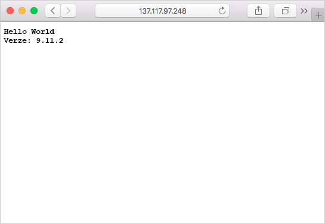

Image kontejneru se dají načíst z Azure Container Registry pomocí mnoha platforem pro správu kontejnerů, třeba z Azure Container Instances, Azure Kubernetes Service a Docker for Windows nebo Docker for Mac. My zde nasadíme image do instance kontejneru Azure.

<!-- Activate the sandbox -->
[!include[](../../../includes/azure-sandbox-activate.md)]

Nejprve v Cloud Shellu vytvořte proměnnou `ACR_NAME` s názvem registru kontejneru zapsaným malými písmeny (například hodnotu „MyContainer“ byste změnili na „mycontainer“). Tato proměnná se bude používat v celé této lekci.

```azurecli
ACR_NAME=<acrName>
```

## <a name="about-registry-authentication"></a>Informace o ověřování registru

Azure Container Registry nepodporuje neověřený přístup – všechny operace u registru vyžadují přihlášení. Registry podporují dva typy identit:

- **Identity Azure Active Directory**, včetně identity uživatele a instančních objektů. Přístup k registru pomocí identity Azure Active Directory je založený na rolích a identitám je možné přiřadit některou z těchto tří rolí: **čtenář** (pouze přístup pro čtení), **přispěvatel** (přístup pro zápis i čtení) nebo **vlastník** (čtení, zápis a přiřazování rolí ostatním uživatelům).
- **Účet správce** zahrnutý v každém registru. Účet správce je ve výchozím nastavení zakázán.

Účet správce představuje rychlý a snadný způsob, jak si vyzkoušet nový registr: jednoduše povolíte účet a použijete jeho uživatelské jméno a heslo v pracovních postupech a aplikacích, které vyžadují přístup. Jakmile si ověříte, že registr funguje podle očekávání, měli byste účet správce zakázat a používat identity Azure Active Directory pouze k zajištění zabezpečení registru.

> [!IMPORTANT]
> Účet správce používejte pouze pro počáteční testování a prozkoumávání a s nikým jeho uživatelské jméno a heslo nesdílejte. Zakažte účet správce a používejte pouze přístup založený na rolích s identitami Azure Active Directory, abyste maximalizovali zabezpečení registru.

## <a name="enable-the-registry-admin-account"></a>Povolení účtu správce registru

V tomto cvičení povolíte účet správce registru a použijete ho k nasazení image do instance kontejneru Azure z příkazového řádku.

Spuštěním následujících příkazů povolte u registru účet správce a načtěte jeho uživatelské jméno a heslo.

```azurecli
az acr update -n $ACR_NAME --admin-enabled true
az acr credential show --name $ACR_NAME
```

Dostanete podobný výstup. Poznamenejte si hodnoty `username` a `password`.

```output
{  
  "passwords": [
    {
      "name": "password",
      "value": "aaaaa"
    },
    {
      "name": "password2",
      "value": "bbbbb"
    }
  ],
  "username": "ccccc"
}
```

## <a name="deploy-a-container-with-azure-cli"></a>Nasazení kontejneru pomocí Azure CLI

1. Instanci kontejneru nasadíte následujícím příkazem `az container create`. Nahraďte `<username>` a `<password>` v následujícím příkazu uživatelským jménem a heslem správce registru.

    ```azurecli
    az container create \
        --resource-group <rgn>[sandbox resource group name]</rgn> \
        --name acr-tasks \
        --image $ACR_NAME.azurecr.io/helloacrtasks:v1 \
        --registry-login-server $ACR_NAME.azurecr.io \
        --ip-address Public \
        --location eastus \
        --registry-username <username> \
        --registry-password <password>
    ```

1. Pomocí následujícího příkazu získejte IP adresu instance kontejneru Azure.

    ```azurecli
    az container show --resource-group  <rgn>[sandbox resource group name]</rgn> --name acr-tasks --query ipAddress.ip --output table
    ```

1. Otevřete prohlížeč a přejděte na IP adresu kontejneru. Pokud je všechno správně nakonfigurované, měli byste v tuto chvíli vidět tyto výsledky:

