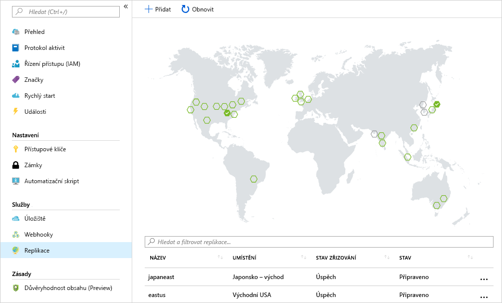

Řekněme, že vaše společnost má výpočetní úlohy nasazené v několika oblastech, abyste mohli na místě obsluhovat distribuovanou zákaznickou základnu. 

Vaším cílem je umístit registr kontejneru do každé oblasti, kde se image budou spouštět. Tato strategie umožní operace v blízkosti sítě, takže přenosy vrstvy image budou rychlé a spolehlivé. 

Geografická replikace umožňuje službě Azure Container Registry fungovat jako jeden registr, který obsluhuje několik oblastí s místními registry multi-master.

Geograficky replikovaný registr nabízí tyto výhody:

- V několika oblastech se dá použít jediný název registru, image nebo značky.
- Přístup k registru v blízkosti sítě z místních nasazení
- Žádné další poplatky za výchozí provoz, protože se image načítají z místního replikovaného registru ve stejné oblasti jako hostitel kontejneru
- Jedna správa registru mezi různými oblastmi

## <a name="replicate-a-registry-to-multiple-locations"></a>Replikace registru do několika lokalit

V tomto cvičení k replikaci registru z jedné oblasti do jiné použijete příkaz Azure CLI `az acr replication create`. 

1. Spuštěním následujícího příkazu replikujte registr do jiné oblasti. V tomto příkladu provádíme replikaci do oblasti `japaneast`. *$ACR_NAME* je proměnná, kterou jste definovali dříve v modulu pro uchovávání názvu registru kontejneru.

    ```azurecli
    az acr replication create --registry $ACR_NAME --location japaneast
    ```

    Výstup z tohoto příkazu vypadá asi takto:
    
    ```output
    {
      "id": "/subscriptions/00000000-0000-0000-0000-000000000000/resourceGroups/myresourcegroup/providers/Microsoft.ContainerRegistry/registries/myACR0007/replications/japaneast",
      "location": "japaneast",
      "name": "japaneast",
      "provisioningState": "Succeeded",
      "resourceGroup": "myresourcegroup",
      "status": {
        "displayStatus": "Syncing",
        "message": null,
        "timestamp": "2018-08-15T20:22:09.275792+00:00"
      },
      "tags": {},
      "type": "Microsoft.ContainerRegistry/registries/replications"
    }
    ```

1. Nakonec načtěte všechny repliky image kontejneru vytvořené následujícím příkazem. 

    ```azurecli
    az acr replication list --registry $ACR_NAME --output table
    ```

    Výstup by měl vypadat zhruba takto:
    
    ```console
    NAME       LOCATION    PROVISIONING STATE    STATUS
    ---------  ----------  --------------------  --------
    japaneast  japaneast   Succeeded             Ready
    eastus     eastus      Succeeded             Ready
    ```

Pamatujte na to, že při výpisu replik image nejste omezeni na Azure CLI. Když na portálu Azure Portal vyberete pro Azure Container Registry `Replications`, zobrazí se mapa, která ukazuje podrobnosti aktuálních replikací. Image kontejnerů se dají replikovat do jiných oblastí tak, že se na mapě vyberou dané oblasti.



<!-- Cleanup sandbox -->
[!include[](../../../includes/azure-sandbox-cleanup.md)]
 

## <a name="summary"></a>Shrnutí

Úspěšně jste pomocí Azure CLI replikovali image kontejneru do několika datacenter Azure. 