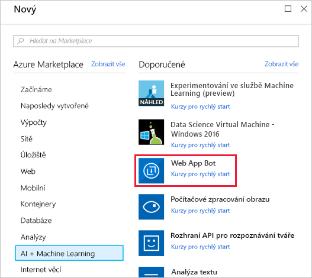
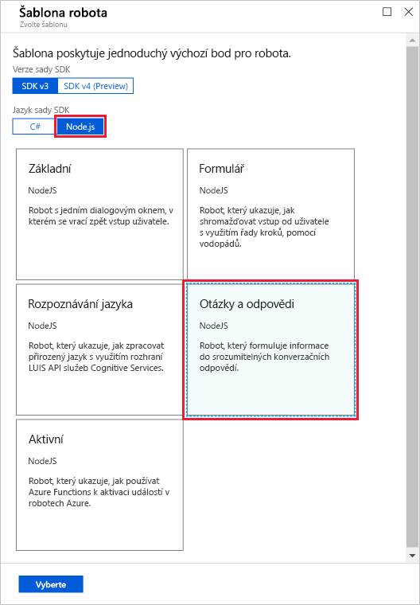
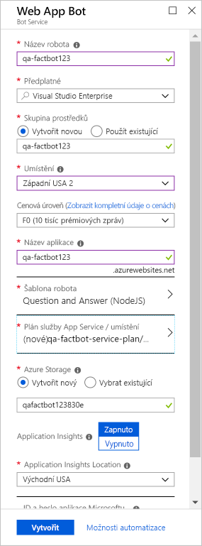

> [!NOTE]
> Po spuštění virtuálního počítače budete pro přihlášení potřebovat uživatelské jméno a heslo. Najdete je na kartě **Prostředky** vedle pokynů.

Prvním krokem při vytváření robota je zadat umístění pro robota, který má být hostovaný v Azure. Funkce Web Apps služby Azure App Service jsou ideální pro hostování aplikací robotů a Azure Bot Service slouží k jejich zřizování. V této lekci použijete portál Azure Portal ke zřízení robota webové aplikace Azure.

1. Přihlaste se k webu Azure portal tak, že otevřete https://portal.azure.com v prohlížeči virtuálního počítače.

1. Klikněte na **+ Vytvořit prostředek**, potom na **AI + Machine Learning** a pak na **Web App Bot**.

    

1. Do pole **Název aplikace** zadejte název, třeba „qa-factbot“. *Tento název musí být v Azure jedinečný. Dejte proto pozor, aby se vedle něj objevila zelená značka zaškrtnutí.*

1. Vyberte již existující prostředky v části **Předplatné** a **Skupina prostředků**.

1. Vyberte **Umístění** z následujícího seznamu:
    - Střed USA
    - Východní USA
    - Východní USA 2
    - Střed USA – sever
    - Střed USA – jih
    - Západní USA
    - Západní USA 2

    > [!NOTE]
    > Pokud se vám při vytváření prostředku Web App Bot zobrazí chyba zásady prostředku, zkontrolujte, že je umístění nastavené na jednu z výše uvedených možností.

1. Vyberte cenovou úroveň **S1**.

1. Vyberte **šablonu robota**. Vyberte **SDK v3**jako verzi, **Node.js** jako jazyk sady SDK a **Otázka a odpověď** jako typ šablony. Pak v dolní části okna klikněte na **Vybrat**.

    

1. Teď vyberte **Plán služby App Service/Umístění**, pak **Vytvořit nový** a vytvořte plán služby App Service s názvem „qa-factbot-service-plan“ nebo podobným ve stejné oblasti, kterou jste vybrali v předchozím kroku. Až to budete hotové, kliknutím na **Vytvořit** v dolní části okna „Web App Bot“ začněte s nasazením.

    

    > [!NOTE]
    > Nasazení obvykle trvá maximálně dvě minuty.

1. Po dokončení nasazení vyberte **Skupiny prostředků** na pásu karet na levé straně portálu.
1. Vyberte skupinu prostředků, které jsou předem vytvořené pro tuto skupinu a otevřete skupinu prostředků, ve které jsme nasadili robota webové aplikace Azure.

Teď byste měli vidět několik prostředků vytvořených pro vašeho robota webové aplikace Azure. Při nasazování robota webové aplikace Azure se toho na pozadí hodně odehrálo. Vytvořil a zaregistroval se robot, vytvořila se [webová aplikace Azure](https://azure.microsoft.com/services/app-service/web/) k jeho hostování a robot byl nakonfigurován pro práci s [Microsoft QnA Makerem](https://www.qnamaker.ai/). Dalším krokem je použití QnA Makeru k vytvoření znalostní báze otázek a odpovědí pro naplnění robota informacemi.
