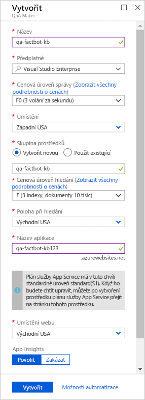
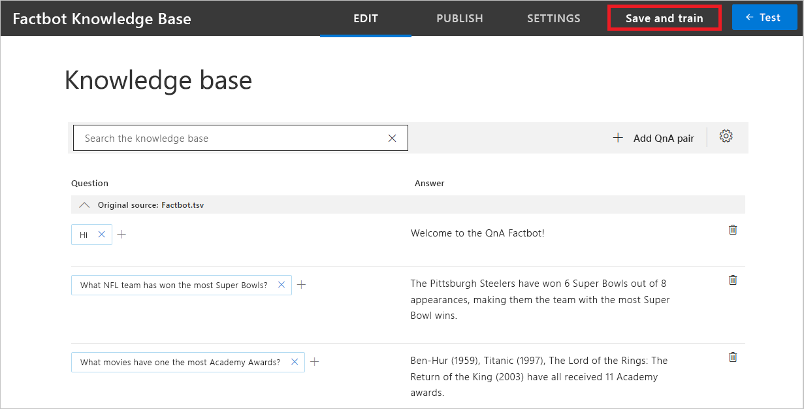
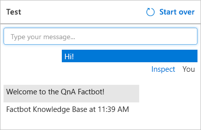

[!INCLUDE [0-vm-note](0-vm-note.md)]

[QnA Maker](https://www.qnamaker.ai/) je součástí služeb [Azure Cognitive Services](https://www.microsoft.com/cognitive-services/), což je sada služeb a rozhraní API podporovaná umělou inteligencí (AI) a strojovým učením a určená k vytváření inteligentních aplikací. Místo abyste robota naprogramovali tak, aby předvídal všechny možné otázky uživatelů a poskytl příslušnou odpověď, můžete ho připojit ke znalostní bázi otázek a odpovědí vytvořené pomocí QnA Makeru. Běžný scénář použití je takový, že vytvoříte znalostní bázi z adresy URL stránky častých otázek, aby robot mohl odpovídat na otázky specifické pro doménu, například „How do I find my Windows product key?“ (Jak najdu kód Product Key systému Windows?) nebo „Where can I download Visual Studio Code?“ (Odkud si můžu stáhnout Visual Studio Code?).

V této lekci pomoci QnA Makeru vytvoříte znalostní bázi obsahující otázky jako třeba „What NFL teams have won the most Super Bowls?“ (Které týmy NFL vyhrály nejvíce Super Bowlů?) nebo „What is the largest city in the world?“ (Které je největší město světa?). Znalostní bázi pak nasadíte ve webové aplikaci Azure, aby byla přístupná prostřednictvím koncového bodu HTTPS.

1. Otevřením https://www.qnamaker.ai v prohlížeči virtuálního počítače otevřete portál QnA Maker. Potom vyberte **Přihlásit se**, abyste se přihlásili pomocí stejného účtu testovacího prostředí, který jste použili pro přihlášení na web Azure Portal. 

1. Vyberte hamburgerovou nabídku a potom **Create a knowledge base** (Vytvoření znalostní báze). 

1. Vyberte **Create a QnA service** (Vytvořit službu QnA).

1. Na nově otevřené kartě portálu Azure Portal zadejte název do pole **Name** (Název). Tento název musí být v Azure jedinečný. Dejte proto pozor, aby se vedle něj objevila zelená značka zaškrtnutí *a* aby byla také níže ve stejném okně v poli **App name** (Název aplikace).

1. Vyberte **Use existing** (Použít existující) pod **Resource group** (Skupina prostředků) a pak vyberte skupinu prostředků cvičení, která byla pro toto cvičení vytvořená předem.

1. V rozevíracím seznamu vyberte **Location** (Umístění). 

1. Vyberte **F0** jako **Management pricing tier** (Cenová úroveň správy). 

1. Vyberte **F** pro **Search pricing tier** (Cenová úroveň hledání). 

1. Ověřte, jestli je **App name** (Název aplikace) v Azure jedinečný.

1. V obou rozevíracích seznamech vyberte umístění, které je k vám nejblíže, a pak v dolní části okna klikněte na tlačítko **Create** (Vytvořit).

    

1. Na pásu karet na levé straně portálu klikněte na **Resource groups** (Skupiny prostředků) a otevřete předem připravenou skupinu prostředků cvičení. Počkejte, až se nápis „Deploying“ (Nasazuje se) v horní části okna změní na „Succeeded“ (Úspěch) na znamení, že služba QnA a prostředky s ní spojené byly úspěšně nasazeny. Pokud zpráva zmizí, můžete tav zobrazit výběrem ikony zvonku na řádku nabídek. Stav nasazení můžete aktualizovat kliknutím na **Refresh** (Aktualizovat) v horní části okna.

1. Otevřením https://www.qnamaker.ai/Create v prohlížeči virtuálního počítače se vraťte na **Create a knowledge base** (Vytvoření znalostní báze), přejděte ke **kroku 2** a připojte se ke službě QnA.

1. V části **Microsoft Azure Directory ID** (ID Microsoft Azure Directory) zvolte **Microsoft Learn Hosting**.

1. V rozevíracím seznamu **Azure subscription name** (Název předplatného Azure) vyberte **Microsoft Learn Hosting**.

1. V části **Azure QnA service** (Služba Azure QnA) vyberte název služby QnA, který jste už zadali. Pokud tam nejsou žádné služby uvedeny, zkuste aktualizovat stránku.

1. Pak přiřaďte znalostní bázi název, například „Factbot Knowledge Base“.

1. Do znalostní báze QnA Makeru můžete zadat otázky a odpovědi ručně nebo je můžete naimportovat z online Otázek a odpovědí nebo místních souborů. K podporovaným formátům patří textové soubory s tabulátory jako oddělovači, dokumenty Microsoft Wordu, excelové tabulky a soubory PDF.

    Abychom si to předvedli, otevřete https://github.com/MicrosoftDocs/mslearn-build-chat-bot-with-azure-bot-service/blob/master/Factbot.tsv.zip v prohlížeči virtuálního počítače a pak stáhněte soubor **Factbot.tsv.zip**. Složka zip obsahuje textový soubor s názvem **Factbot.tsv**. Rozbalte soubor a zkopírujte ho do počítače. Potom se v prohlížeči virtuálního počítače posuňte na portálu QnA Maker dolů, vyberte **+ Add file** (+Přidat soubor) a pak **Factbot.tsv**. Tento soubor obsahuje 20 otázek a odpovědí v textovém formátu s tabulátory jako oddělovači.

1. V dolní části stránky vyberte **Create your KB** (Vytvořit znalostní bázi) a počkejte, až se znalostní báze vytvoří. Mělo by to trvat necelou minutu.

1. Zkontrolujte, jestli se ve znalostní bázi objeví otázky a odpovědi importované ze souboru **Factbot.tsv**. Potom vyberte **Save and train** (Uložit a trénovat) a počkejte, až se trénování dokončí.

    

1. Vyberte tlačítko **Test** (Testovat), které je napravo od tlačítka **Save and train** (Uložit a trénovat). Do okna se zprávou zadejte „Hi“ a stiskněte **Enter**. Zkontrolujte, jestli odpověď je „Welcome to the QnA Factbot“, jak je ukázáno níže.

    

1. Do okna se zprávou zadejte „What book has sold the most copies?“ (Která kniha se prodala v největším počtu kusů?). a stiskněte **Enter**. Jaká je odpověď?

1. Opětovným výběrem tlačítka **Test** (Testovat) testovací panel sbalíte. 
1. Potom v nabídce v horní části stránky vyberte **Publish** (Publikovat) a výběrem tlačítka **Publish** (Publikovat) v dolní části stránky publikujte znalostní bázi. *Publikováním* zpřístupníte znalostní bázi v koncovém bodě HTTPS.

Počkejte, až proces publikování skončí, a potvrďte, že se služba QnA nasadila. Znalostní báze je teď hostovaná ve vlastní webové aplikaci Azure. Dalším krokem je nasazení robota, který ji bude umět používat.
