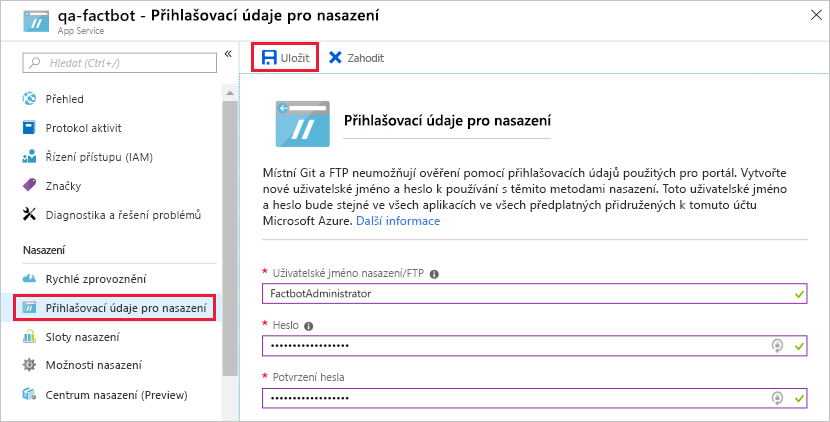

[!INCLUDE [0-vm-note](0-vm-note.md)]

Když jste vytvářeli robota webové aplikace Azure, měli jste jako hostitele nasazenou webovou aplikaci Azure. Robot ale vyžaduje kód, který je potřeba nasadit do webové aplikace Azure. Máte štěstí, protože tento kód za vás vygenerovala služba Azure Bot Service. V této lekci použijete editor Visual Studio Code k umístění kódu do místního úložiště Git a k publikování robota do Azure na základě sdílení změn z místního úložiště do vzdáleného úložiště připojeného k webové aplikaci Azure, která hostí robota. Je to proces, který se označuje jako [kontinuální integrace](https://wikipedia.org/wiki/Continuous_integration).

1. V umístění podle vlastního výběru vytvořte na pevném disku složku s názvem Factbot, kde bude zdrojový kód robota.

1. V prohlížeči virtuálního počítače se vraťte na web Azure Portal a otevřete předem vytvořenou skupinu prostředků pro cvičení. Vyberte robota webové aplikace vytvořeného v předchozím cvičení.

1. V nabídce na levé straně vyberte **Sestavit** a pak **Stáhnout zdrojový kód robota**. Tím připravíte soubor ZIP, který bude obsahovat zdrojový kód robota. Až bude soubor zip připravený, vyberte tlačítko **Stáhnout zdrojový kód robota** a stáhněte ho. Po dokončení stahování extrahujte obsah souboru ZIP do složky Factbot, kterou jste před chvílí vytvořili.

1. Na webu Azure Portal o okně buildu Web App Bot vyberte **Konfigurovat průběžné nasazování**.

1. V horní části okna **Nasazení** vyberte **Nastavení** a pak **Vybrat zdroj**.

1. Potom vyberte jako zdroj nasazení **Místní úložiště Git**.

1. V dalším kroku vyberte **Nastavit připojení** a zadejte uživatelské jméno a heslo. Budete pravděpodobně muset zadat uživatelské jméno jiné než FactbotAdministrator, protože toto jméno musí být v Azure jedinečné. Vyberte **OK** a vraťte se tím do okna **Možnost nasazení** a pak znovu **OK** pro návrat do okna **Nasazení**.

    

1. Zatímco probíhá nasazení systému, zavřete okno **Nasazení** a v nabídce na levé straně vyberte **Všechna nastavení služby aplikací**.

1. Spusťte **Visual Studio Code** a po výběru **Soubor** > **Otevřít složku...** otevřete složku „Factbot“, kam jste zkopírovali zdrojový kód robota.

1. V nástroji Visual Studio Code na panelu aktivit na levé straně vyberte tlačítko **Správa zdrojového kódu**.

1. V horní části vyberte ikonu **Inicializovat úložiště**.

1. V dialogovém okně vyberte tlačítko **Inicializovat úložiště**.

1. Napište „First commit.“ (Nejprve potvrdit.) do okna se zprávou.

1. Po zobrazení výzvy zaškrtněte políčko pro potvrzení změn u všech souborů.

    > [!NOTE]
    > Pokud se zobrazí chyba služby Git, která říká, že nemáte nastavenou svou identitu pro Git, spusťte příkazový řádek a spusťte následující příkazy. Pokud chcete, nahraďte zástupné hodnoty e-mailu a názvu. Opakujte tlačítko Potvrdit.
    >
    > ```bash
    > git config --global user.email "Lab User"
    > git config --global user.name "LabUser#######@learn"
    > ```

1. V editoru Visual Studio Code vyberte v nabídce **Zobrazit** možnost **Terminál** a otevřete integrovaný terminál.

1. Spusťte v integrovaném terminálu následující příkaz a nahraďte tak na dvou následujících místech BOT_NAME názvem robota, který jste zadali ve cvičení 1.

    > [!NOTE]
    > Úplnou adresu URL vzdálené služby Git najdete také v prostředku služby App Service **Přehled** v části **Adresa URL klonu Git**.

    ```bash
    git remote add qna-factbot https://BOT_NAME.scm.azurewebsites.net:443/BOT_NAME.git
    ```

1. Vraťte se na panel **Správa zdrojového kódu** a v jeho horní části vyberte tlačítko se třemi tečkami. V nabídce vyberte **Publish Branch** (Publikovat větev), aby se kód robota nasdílel z místního úložiště do Azure. Pokud se zobrazí výzva k zadání přihlašovacích údajů, zadejte uživatelské jméno a heslo, které jste zadali v tomto cvičení dříve.

Váš robot se publikoval do Azure. Předtím, než ho tady otestujete, ho ale spusťte ho místně a naučte se ho ladit v editoru Visual Studio Code.
