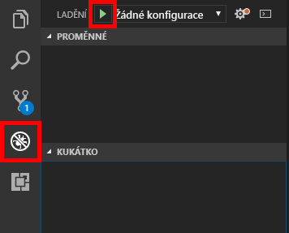
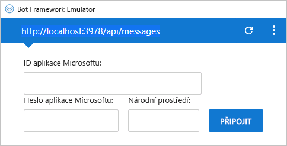

[!INCLUDE [0-vm-note](0-vm-note.md)]

Stejně jako u každého kódu aplikace, který napíšete, je potřeba změny kódu robota otestovat a odladit nejdříve místně, než se nasadí do produkčního prostředí. Microsoft k ladění robotů nabízí Bot Framework Emulator. V této lekci se dozvíte, jak ladit roboty pomocí nástroje Visual Studio Code a emulátoru.

1. Spuštěním následujícího příkazu v integrovaném terminálu editoru Visual Studio Code nainstalujte [Restify](http://restify.com/), oblíbený balíček Node.js pro vytváření a používání webových služeb RESTful:

    ```bash
    npm install restify
    ```

1. Opakujte tento krok pro následující příkazy a nainstalujte tak [sadu SDK Microsoft Bot Framework Bot Builder pro Node.js](https://docs.microsoft.com/bot-framework/nodejs/bot-builder-nodejs-quickstart):

    ```bash
    npm install botbuilder
    npm install botbuilder-azure
    npm install botbuilder-cognitiveservices
    ```

1. Na panelu aktivit nástroje Visual Studio Code klikněte na tlačítko **Explorer** (Průzkumník). 
1. Vyberte soubor **app.js** a otevřete ho v editoru kódu. Tento soubor obsahuje kód, který řídí robota – kód, který byl vygenerovaný službou Azure Bot Service a stažený z webu Azure Portal.

1. Obsah souboru **app.js** nahraďte následujícím kódem a potom soubor uložte.

    ```JavaScript
    "use strict";
    var builder = require("botbuilder");
    var botbuilder_azure = require("botbuilder-azure");

    var useEmulator = true;
    var userName = "";
    var yearsCoding = "";
    var selectedLanguage = "";

    var connector = useEmulator ? new builder.ChatConnector() : new botbuilder_azure.BotServiceConnector({
        appId: process.env.MicrosoftAppId,
        appPassword: process.env.MicrosoftAppPassword
    });

    var bot = new builder.UniversalBot(connector);

    bot.dialog('/', [

    function (session) {
        builder.Prompts.text(session, "Hello, and welcome to QnA Factbot! What's your name?");
    },

    function (session, results) {
        userName = results.response;
        builder.Prompts.number(session, "Hi " + userName + ", how many years have you been writing code?");
    },

    function (session, results) {
        yearsCoding = results.response;
        builder.Prompts.choice(session, "What language do you love the most?", ["C#", "Python", "Node.js", "Visual FoxPro"]);
    },

    function (session, results) {
        selectedLanguage = results.response.entity;

        session.send("Okay, " + userName + ", I think I've got it:" +
            " You've been writing code for " + yearsCoding + " years," +
            " and prefer to use " + selectedLanguage + ".");
    }]);

    var restify = require('restify');
    var server = restify.createServer();

    server.listen(3978, function() {
        console.log('test bot endpoint at http://localhost:3978/api/messages');
    });

    server.post('/api/messages', connector.listen());
    ```

1. Klikáním v levém okraji nastavte zarážky na řádky 20, 25 a 30 (`builder.Prompts...` volání).

1. Na panelu aktivit klikněte na tlačítko **Debug** (Ladit) a potom kliknutím na tlačítko se zelenou šipkou **Start Debugging** (Spustit ladění) spusťte ladicí relaci. Zkontrolujte, jestli se v konzole ladění zobrazí „test bot endpoint at http://localhost:3978/api/messages“ (koncový bod testovacího robota na adrese...).

    

    Kód robota je teď spuštěný místně.

1. Z nabídky Start spusťte **Bot Framework Emulator**.

1. Klikněte na pole **Enter your endpoint URL** (Zadejte adresu URL koncového bodu). Zadejte název robota a adresu URL robota, která se v konzole ladění zobrazila v předchozím kroku.

1. Pole Microsoft App ID (ID aplikace Microsoft), Microsoft App Password (Heslo aplikace Microsoft) a Locale (Národní prostředí) ponechte prázdná a klikněte na **CONNECT** (Připojit).

1. Potom klikněte na **Save and connect** (Uložit a připojit) a uložte konfigurační soubor, kam chcete.

    >[!NOTE]
    > V budoucnu se můžete k robotovi jednoduše znovu připojit kliknutím na jeho název v části My Bots (Moji roboti).

    

1. Do pole v dolní části emulátoru zadejte „hi“ a stiskněte **Enter**. Zkontrolujte, jestli se Visual Studio Code zarazí na řádku 20 souboru **app.js**. Potom na panelu nástrojů ladění v editoru Visual Studio Code klikněte na tlačítko **Continue** (Pokračovat) a vraťte se do emulátoru, abyste viděli odpověď robota.

1. Robot vám položí řadu otázek. Odpovězte na ně a při každém dosažení zarážky ve Visual Studio Code klikněte na **Continue** (Pokračovat). Až budete hotovi, klikněte na panelu nástrojů ladění na tlačítko **Stop** (Zastavit) a ukončete tak ladicí relaci.

Teď máte plně funkčního robota a víte, jak ho ladit jeho spuštěním v emulátoru Microsoft Bot Framework Emulator. V dalším kroku učiníte robota inteligentnějším – připojíte ho ke znalostní bázi, kterou jste publikovali.