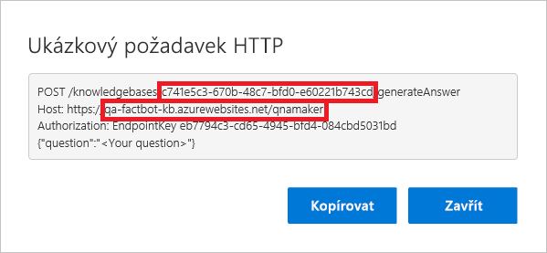
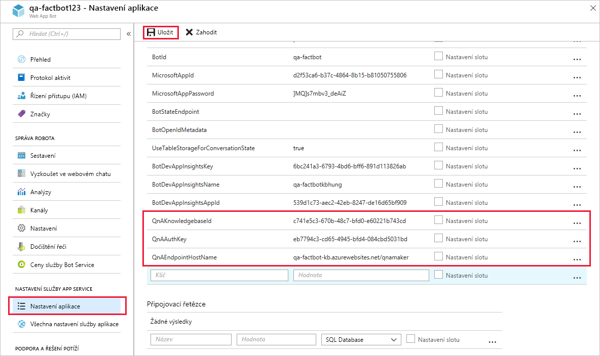

[!INCLUDE [0-vm-note](0-vm-note.md)]

V této lekci připojíte robota ke znalostní bázi QnA Maker, kterou jste vytvořili dříve, abyste mohli pokračovat v inteligentní konverzaci. Připojení ke znalostní bázi zahrnuje načtení určitých informací z portálu QnA Maker, jejich zkopírování na portál Azure Portal, aktualizaci kódu bota a potom opakované nasazení bota do Azure.

1. Vraťte se v prohlížeči virtuálního počítače na portál QnA Maker na https://www.qnamaker.ai a vyberte tlačítko účtu v pravém horním rohu.
1. V rozevírací nabídce vyberte **Manage endpoint keys** (Spravovat klíče koncových bodů).
1. Vyberte **Show** (Zobrazit), zobrazte **Primary** (Primární) klíč koncového bodu a pomocí **Copy** (Kopírovat) ho zkopírujte do schránky. Vložte ho do textového souboru, abyste ho za chvíli mohli snadno načíst.

    > [!NOTE]
    > V závislosti na nastavení prohlížeče může být k dokončení této lekce potřeba povolit soubory cookie třetích stran.

1. V nabídce v horní části stránky klikněte na **My knowledge bases** (Moje znalostní báze).
1. Potom vyberte **View Code** (Zobrazit kód) u znalostní báze, kterou jste vytvořili dříve.

1. Zkopírujte ID znalostní báze z prvního řádku a název hostitele z druhého řádku. Vložte je také do textového souboru. Potom dialogové okno zavřete. Z kopírovaného názvu hostitele **vynechejte** prefix https://.

    

1. Vraťte se k Web App Botu na portálu Azure Portal. V nabídce nalevo vyberte **Application settings** (Nastavení aplikace) a posouváním dolů vyhledejte nastavení aplikace s názvem „QnAKnowledgebaseId“, „QnAAuthKey“ a „QnAEndpointHostName“. Do těchto polí vložte ID znalostní báze a název hostitele, které jste právě získali, a klíč koncového bodu získaný dříve. Potom v horní části vyberte **Save** (Uložit).

    

1. Vraťte se do nástroje **Visual Studio Code** a nahraďte obsah souboru **app.js** kódem uvedeným níže. Pak soubor uložte.

    ```JavaScript
    var restify = require('restify');
    var builder = require('botbuilder');
    var botbuilder_azure = require("botbuilder-azure");
    var builder_cognitiveservices = require("botbuilder-cognitiveservices");

    // Setup Restify Server
    var server = restify.createServer();
    server.listen(process.env.port || process.env.PORT || 3978, function () {
        console.log('%s listening to %s', server.name, server.url);
    });

    // Create chat connector for communicating with the Bot Framework Service
    var connector = new builder.ChatConnector({
        appId: process.env.MicrosoftAppId,
        appPassword: process.env.MicrosoftAppPassword,
        openIdMetadata: process.env.BotOpenIdMetadata
    });

    // Listen for messages from users
    server.post('/api/messages', connector.listen());

    var tableName = 'botdata';
    var azureTableClient = new botbuilder_azure.AzureTableClient(tableName, process.env['AzureWebJobsStorage']);
    var tableStorage = new botbuilder_azure.AzureBotStorage({ gzipData: false }, azureTableClient);

    // Create your bot with a function to receive messages from the user
    var bot = new builder.UniversalBot(connector);
    bot.set('storage', tableStorage);

    // Recognizer and and Dialog for preview QnAMaker service
    var previewRecognizer = new builder_cognitiveservices.QnAMakerRecognizer({
        knowledgeBaseId: process.env.QnAKnowledgebaseId,
        authKey: process.env.QnAAuthKey || process.env.QnASubscriptionKey
    });

    var basicQnAMakerPreviewDialog = new builder_cognitiveservices.QnAMakerDialog({
        recognizers: [previewRecognizer],
        defaultMessage: 'No match! Try changing the query terms!',
        qnaThreshold: 0.3
    }
    );

    bot.dialog('basicQnAMakerPreviewDialog', basicQnAMakerPreviewDialog);

    // Recognizer and and Dialog for GA QnAMaker service
    var recognizer = new builder_cognitiveservices.QnAMakerRecognizer({
        knowledgeBaseId: process.env.QnAKnowledgebaseId,
        authKey: process.env.QnAAuthKey || process.env.QnASubscriptionKey, // Backward compatibility with QnAMaker (Preview)
        endpointHostName: process.env.QnAEndpointHostName
    });

    var basicQnAMakerDialog = new builder_cognitiveservices.QnAMakerDialog({
        recognizers: [recognizer],
        defaultMessage: "I'm not quite sure what you're asking. Please ask your question again.",
        qnaThreshold: 0.3
    });

    bot.dialog('basicQnAMakerDialog', basicQnAMakerDialog);

    bot.dialog('/', //basicQnAMakerDialog);
        [
            function (session) {
                var qnaKnowledgebaseId = process.env.QnAKnowledgebaseId;
                var qnaAuthKey = process.env.QnAAuthKey || process.env.QnASubscriptionKey;
                var endpointHostName = process.env.QnAEndpointHostName;

                // QnA Subscription Key and KnowledgeBase Id null verification
                if ((qnaAuthKey == null || qnaAuthKey == '') || (qnaKnowledgebaseId == null || qnaKnowledgebaseId == ''))
                    session.send('Please set QnAKnowledgebaseId, QnAAuthKey and QnAEndpointHostName (if applicable) in App Settings. Learn how to get them at https://aka.ms/qnaabssetup.');
                else {
                    if (endpointHostName == null || endpointHostName == '')
                        // Replace with Preview QnAMakerDialog service
                        session.replaceDialog('basicQnAMakerPreviewDialog');
                    else
                        // Replace with GA QnAMakerDialog service
                        session.replaceDialog('basicQnAMakerDialog');
                }
            }
        ]);
    ```

    > [!NOTE]
    > Volání pro vytvoření instance `QnAMakerDialog` je na řádku 30. Toto volání vytvoří dialogové okno, které integruje robota vytvořeného ve službě Azure Bot Service se znalostní bází vytvořenou ve službě Microsoft QnA Maker.

1. V nástroji Visual Studio Code vyberte na panelu aktivit na tlačítko **Source Control** (Správa zdrojového kódu).
1. Najeďte myší na soubor **app.js** a výběrem tlačítka __ + __ připravte změny tohoto souboru k dalšímu potvrzení.
1. Do pole zprávy zadejte text „Připojeno ke znalostní bázi“ a zaškrtnutím políčka potvrďte změny.

    > [!Warning]
    > Pokud si všimnete změn v souboru **package.json**, ujistěte se, že je do potvrzení NEZAHRNETE. Potvrzení musí zahrnovat pouze vaše změny v souboru **app.js**.

1. Potom vyberte tlačítko s výpustkou (__...__) a pomocí příkazu **Publish Branch** (Publikovat větev) tyto změny odešlete do vzdáleného úložiště a do webové aplikace Azure.

1. Vraťte se k robotovi webové aplikace na portálu Azure Portal a výběrem **Test in Web Chat** (Otestovat ve webovém chatu) nalevo otevřete testovací konzolu. Do pole v dolní části chatovacího okna zadejte „What's the most popular software programming language in the world?“ a stiskněte **Enter**. Zkontrolujte, že robot reaguje.

Blahopřejeme! Váš robot je připojený k znalostní bázi a může odpovídat na otázky.
