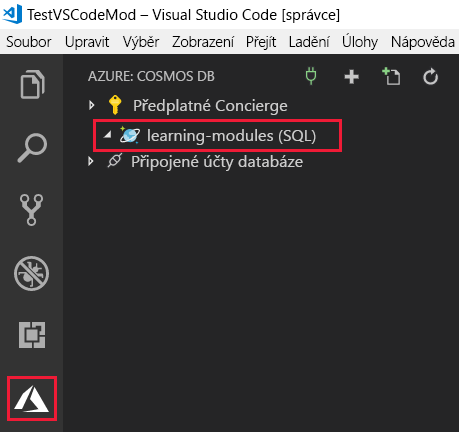

Rozšíření Azure Cosmos DB pro Visual Studio Code zjednodušuje vytvoření účtu, databáze a kolekce tím, že umožňuje vytvořit prostředky pomocí příkazového okna.

V této lekci nainstalujete rozšíření Azure Cosmos DB pro Visual Studio a pak je použijete k vytvoření účtu, databáze a kolekce.

## Instalace rozšíření Azure Cosmos DB pro Visual Studio

1. Přejděte na [Visual Studio Marketplace](https://marketplace.visualstudio.com/items?itemName=ms-azuretools.vscode-cosmosdb) a nainstalujte rozšíření **Azure Cosmos DB** pro Visual Studio Code.

1. Po načtení karty rozšíření do editoru Visual Studio Code klikněte na **Install** (Nainstalovat).

1. Po dokončení instalace klikněte na **Reload** (Znovu načíst).

    Visual Studio Code po instalaci rozšíření a opětovném načtení zobrazí  ikonu Azure na levé straně obrazovky.

## Vytvoření účtu Azure Cosmos DB v editoru Visual Studio Code

[!include]

1. V editoru Visual Studio Code se přihlaste do Azure kliknutím na **View** (Zobrazit)  > **Command Palette** (Paleta příkazů) a zadáním textu **Azure: Sign In** (Azure: Přihlásit se). Abyste mohli použít příkaz Azure: Sign In, musíte mít nainstalované rozšíření [Azure Account](https://marketplace.visualstudio.com/items?itemName=ms-vscode.azure-account).

    > [!IMPORTANT]
    > Přihlaste se k Azure pomocí stejného účtu, jaký jste použili k vytvoření sandboxu. Sandbox poskytuje přístup k předplatnému Concierge Subscription.

    Postupujte podle pokynů. Zkopírujte poskytnutý kód a vložte ho do webového prohlížeče, čímž ověříte relaci editoru Visual Studio Code.

1. Klikněte v nabídce vlevo na ikona  **Azure** a pak klikněte pravým tlačítkem na **Concierge Subscription** a klikněte na **Create Account** (Vytvořit účet).

    Pokud Concierge Subscription nevidíte, ujistěte se, že jste se k Azure ve Visual Studio Codu přihlásili pomocí stejného účtu, jaký jste použili k vytvoření sandboxu. Dále, pokud jste svá předplatná Azure v rozšíření Azure Account filtrovali, zkontrolujte, jestli je Concierge Subscription zaškrtnuté v příkazu `> Azure: Select Subscriptions`.

1. Kliknutím na tlačítko __+__ začněte vytvářet účet Cosmos DB. Pokud máte více než jedno předplatné, zobrazí se výzva k výběru předplatného.

1. Do textového pole v horní části obrazovky zadejte jedinečný název pro svůj účet Azure Cosmos DB a stiskněte klávesu Enter. Název účtu může obsahovat jenom malá písmena, číslice a znak spojovníku a musí se skládat ze 3 až 31 znaků.

1. Dále vyberte **SQL (DocumentDB)** > **<rgn>[název sandboxové skupiny prostředků]</rgn>** a pak vyberte umístění.

    [!include]

    Na kartě výstupu v editoru Visual Studio Code se zobrazuje průběh vytváření účtu, které bude trvat několik minut.

1. Po vytvoření účtu rozbalte předplatné Azure v podokně **Azure: Cosmos DB** a v rozšíření se zobrazí nový účet Azure Cosmos DB. Na následujícím obrázku je nový účet s názvem **learning-modules**.

    

## Vytvoření databáze a kolekce Azure Cosmos DB v editoru Visual Studio Code

Teď vytvoříme novou databázi a kolekci pro vaše zákazníky.

1. V podokně Azure: Cosmos DB klikněte pravým tlačítkem na nový účet a pak na **Create Database** (Vytvořit databázi).
1. Na vstupní paletě v horní části obrazovky zadejte jako název databáze `Users` a pak stiskněte klávesu Enter.
1. Jako název kolekce zadejte `WebCustomers` a pak stiskněte klávesu Enter.
1. Jako název klíče oddílu zadejte `userId` a pak stiskněte klávesu Enter.
1. Nakonec potvrďte `1000` jako počáteční kapacitu prostupnosti a pak stiskněte klávesu Enter.
1. Rozbalte účet v podokně **Azure: Cosmos DB**. Zobrazí se nová databáze **Users** a kolekce **WebCustomers**.

    

Teď, když máte účet Azure Cosmos DB, se pustíme do práce v editoru Visual Studio Code.
