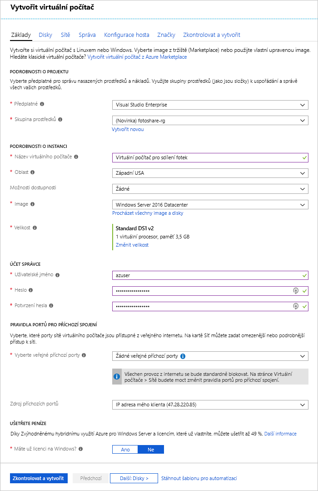

Předpokládejme, že provozujete web pro sdílení fotek a data jsou uložená na virtuálních počítačích Azure s SQL Serverem a vlastními aplikacemi. Chcete provést následující úpravy:

- Potřebujete změnit nastavení mezipaměti disku na virtuálním počítači.
- Chcete do virtuálního počítače přidat nový datový disk s povolenou mezipamětí.

Rozhodli jste se, že tyto změny provedete na portálu Azure Portal.

V tomto cvičení si projdeme provedení výše popsaných změn na virtuálním počítači. Nejdříve se přihlásíme k portálu a vytvoříme virtuální počítač.

[!include]

## Vytvoření virtuálního počítače

V tomto kroku vytvoříme virtuální počítač s následujícími vlastnostmi:

| Vlastnost        | Hodnota   |
|-----------------|---------|
| Image           | **Windows Server 2016 Datacenter** |
| Název            | **fotoshareVM** |
| Skupina prostředků  |   **<rgn>[název skupiny prostředků sandboxu]</rgn>** |
| Umístění        | Viz níže. |

1. Pomocí stejného účtu, kterým jste aktivovali sandbox, se přihlaste k portálu [Azure Portal](https://portal.azure.com/learn.docs.microsoft.com?azure-portal=true).

1. V nabídce bočního panelu vlevo vyberte **Vytvořit prostředek**.

1. V seznamu **Oblíbené** na Marketplace by se měl nacházet _Virtuální počítač s Windows Serverem 2016_. Pokud tomu tak není, zkuste pomocí vyhledávacího pole v horní části vyhledat „Windows Server 2016 DataCenter“.

1. Vyberte virtuální počítač s Windows a kliknutím na **Vytvořit** spusťte proces vytváření virtuálního počítače.

1. Na panelu **Základy** ověřte, že je vybrané **předplatné** _Concierge_.

1. V části **Skupina prostředků** vyberte **Použít existující** a zvolte _<rgn>[název skupiny prostředků sandboxu]</rgn>_.

1. Do pole **Název virtuálního počítače** zadejte _fotoshareVM_.

1. V rozevíracím seznamu **Umístění** vyberte oblast, která je k vám nejblíže.

    [!include]

1. Pro **Velikost** virtuálního počítače je výchozí hodnotou **DS1 v2**, která poskytuje jeden procesor a 3,5 GB paměti. Pro účely tohoto příkladu to vyhovuje.

1. V části **ÚČET SPRÁVCE** zadejte hodnoty **Uživatelské jméno** a **Heslo**/**Potvrdit heslo** pro účet správce v novém virtuálním počítači.

1. Na následujícím obrázku je příklad vyplněné konfigurace **Základy**. Ponechejte výchozí hodnoty pro zbývající karty a pole a klikněte na **Zkontrolovat a vytvořit**.

    

1. Po zkontrolování nastavení nového virtuálního počítače klikněte na **Vytvořit** a zahajte tak jeho nasazení.

Vytvoření virtuálního počítače může trvat několik minut. Během této doby se vytvoří různé prostředky (úložiště, síťové rozhraní atd.) pro podporu virtuálního počítače. Počkejte, než se virtuální počítač nasadí, a teprve pak v tomto cvičení pokračujte.

## Zobrazení stavu mezipaměti disku s operačním systémem na portálu

Po nasazení virtuálního počítače můžeme pomocí následujících kroků zkontrolovat stav mezipaměti disku s operačním systémem:

1. Vyberte prostředek **fotoshareVM** a otevřete tak na portálu podrobnosti o virtuálním počítači. Můžete také na levém bočním panelu kliknout na **Všechny prostředky** a pak vybrat virtuální počítač **fotoshareVM**.

1. V části **Nastavení** vyberte **Disky**.

1. V podokně **Disky** má virtuální počítač jeden disk, disk s operačním systémem. Jeho typ mezipaměti je aktuálně nastavený na výchozí hodnotu **Čtení či zápis**.

## Změna nastavení mezipaměti disku s operačním systémem na portálu

1. V podokně **Disky** vyberte v levém horním rohu obrazovky **Upravit**.

1. Pomocí rozevíracího seznamu změňte hodnotu **POUŽITÍ MEZIPAMĚTI U HOSTITELE** disku s operačním systémem na **Jen pro čtení** a pak v levém horním rohu obrazovky vyberte **Uložit**.

1. Tato aktualizace může chvíli trvat. Je to proto, že při změně nastavení mezipaměti disku Azure se cílový disk odpojí a znovu připojí. Pokud jde o disk s operačním systémem, restartuje se také celý virtuální počítač. Po dokončení operace se zobrazí oznámení o tom, že disky virtuálního počítače se aktualizovaly.

1. Po dokončení je typ mezipaměti disku operačního systému nastavený na **Jen pro čtení**.

Můžeme přejít ke konfiguraci mezipaměti datového disku. Abychom mohli disk konfigurovat, nejdříve ho musíme vytvořit.

## Přidání datového disku do virtuálního počítače a nastavení typu mezipaměti

1. Zpátky v zobrazení **Disky** našeho virtuálního počítače na portálu klikněte na **Přidat datový disk**. V poli **Název** se hned zobrazí chyba upozorňující, že pole nemůže být prázdné. Zatím datový disk nemáme, tak ho vytvoříme.

1. Klikněte do seznamu **Název** a pak klikněte na **Vytvořit disk**.

1. V podokně **Vytvořit spravovaný disk** do pole **Název** zadejte **fotosharesVM-data**.

1. V části **Skupina prostředků** vyberte **Použít existující** a pak vyberte _<rgn>[název skupiny prostředků sandboxu]</rgn>_.

1. Všimněte si výchozích hodnot pro zbývající pole:
    - SSD úrovně Premium
    - Velikost 1023 GB
    - Ve stejném umístění jako virtuální počítač (nelze změnit)
    - Limit IOPS – 5000
    - Limit propustnosti (MB/s) – 200

1. V dolní části obrazovky klikněte na **Vytvořit**.

    Počkejte, než se disk vytvoří, a teprve pak pokračujte.

1. Pomocí rozevíracího seznamu změňte hodnotu **POUŽITÍ MEZIPAMĚTI U HOSTITELE** našeho nového datového disku na **Jen pro čtení** (může to být už nastaveno) a pak v levém horním rohu obrazovky klikněte na **Uložit**.

    Počkejte, než virtuální počítač dokončí aktualizaci nového datového disku. Po dokončení budete mít na virtuálním počítači nový datový disk.

V tomto cvičení jsme použili portál Azure Portal ke konfiguraci mezipaměti u nového virtuálního počítače, změně nastavení mezipaměti existujícího disku a konfiguraci mezipaměti nového datového disku. Následující snímek obrazovky ukazuje finální konfiguraci:

