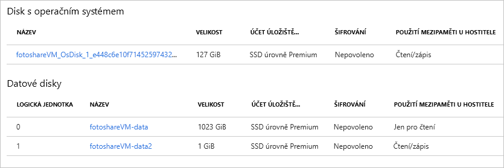

V předchozím cvičení jsme pomocí webu Azure Portal provedli následující úlohy:

- Zobrazení stavu mezipaměti disku s operačním systémem
- Změna nastavení mezipaměti disku s operačním systémem
- Přidání datového disku k virtuálnímu počítači
- Změna typu ukládání do mezipaměti na novém datovém disku

Pojďme si tyto operace vyzkoušet s použitím Azure PowerShellu. 

> [!NOTE]
> Budeme používat Azure PowerShell, ale mohli byste také použít rozhraní příkazového řádku Azure, které poskytuje podobné funkce jako konzolový nástroj. Funguje v systémech macOS, Linux a Windows. Pokud se chcete o rozhraní příkazového řádku Azure dozvědět více, nahlédněte do modulu **Správa virtuálních počítačů pomocí nástroje Azure CLI**.

Použijeme virtuální počítač, který jsme vytvořili v předchozím cvičení. Operace v tomto cvičení předpokládají následující:

- Náš virtuální počítač existuje a má název **fotoshareVM**.
- Náš virtuální počítač se nachází ve skupině prostředků s názvem **<rgn>[název skupiny prostředků sandboxu]</rgn>**.

Pokud jste se rozhodli použít jiné názvy, nahraďte tyto hodnoty vlastními.

Tady je aktuální stav disků našeho virtuálního počítače z předchozího cvičení:


Pomocí portálu jsme u disku s operačním systémem i datového disku nastavili pole **POUŽITÍ MEZIPAMĚTI U HOSTITELE**. Při procházení následujících kroků mějte tento počáteční stav na paměti.

### <a name="set-up-some-variables"></a>Nastavení několika proměnných

Nejprve uložíme názvy několika prostředků, abychom je mohli použít později.

1. Na terminálu Azure Cloud Shell na pravé straně spusťte následující příkazy PowerShellu.

    > [!NOTE]
    > Než se pokusíte tyto příkazy spustit, přejděte z relace Cloud Shell na **PowerShell**, pokud tato změna ještě neproběhla.
    
    ```powershell
    $myRgName = "<rgn>[sandbox resource group name]</rgn>"
    $myVMName = "fotoshareVM"
    ```
    
    > [!TIP]
    > Pokud vyprší časový limit relace služby Cloud Shell, bude potřeba nastavit tyto proměnné znovu. Proto celé toto cvičení dokončete v rámci jedné relace, pokud je to možné.
    
### <a name="get-info-about-our-vm"></a>Získání informací o virtuálním počítači

1. Spusťte následující příkaz, který načte vlastnosti našeho virtuálního počítače:

    ```powershell
    $myVM = Get-AzVM -ResourceGroupName $myRgName -VMName $myVmName
    ```
    
1. Odpověď uložíme do naší proměnné `$myVM`. Výstup můžete směrovat do rutiny `select-object`, aby bylo možné zobrazení filtrovat podle konkrétních vlastností:

    ```powershell
    $myVM | select-object -property ResourceGroupName, Name, Type, Location
    ```
    
1. Mělo by se zobrazit zhruba něco takového.

    ```powershell
    ResourceGroupName Name        Type                              Location
    ----------------- ----        ----                              --------
    <rgn>[sandbox resource group name]</rgn> fotoshareVM Microsoft.Compute/virtualMachines eastus
    ```
    
### <a name="view-os-disk-cache-status"></a>Zobrazení stavu mezipaměti disku s operačním systémem

1. Nastavení ukládání do mezipaměti můžeme zkontrolovat přes objekt `StorageProfile`, jak je znázorněno níže:

    ```powershell
    $myVM.StorageProfile.OsDisk.Caching
    ```

    ```output
    ReadOnly
    ```
   
1. U disku s operačním systémem ji změníme zpět na výchozí hodnotu, což je _ReadWrite_.

### <a name="change-the-cache-settings-of-the-os-disk"></a>Změna nastavení mezipaměti disku s operačním systémem

1. Hodnotu pro typ ukládání do mezipaměti můžeme nastavit pomocí stejného objektu `StorageProfile`, jak je znázorněno níže:

    ```powershell
    $myVM.StorageProfile.OsDisk.Caching = "ReadWrite"
    ```
    
    Tento příkaz se provede rychle, což by mělo značit, že něco dělá místně. Příkaz jen změní vlastnost objektu `myVM`. Jak je vidět na následujícím snímku obrazovky, pokud aktualizujete proměnnou `$myVM` tím, že ji znovu přiřadíte pomocí rutiny `Get-AzVM`, hodnota ukládání do mezipaměti na virtuálním počítači se nezmění.

1. Pokud chcete provést změnu na samotném virtuálním počítači, zavolejte `Update-AzVM`, jak je znázorněno níže:

    ```powershell
    Update-AzVM -ResourceGroupName $myRGName -VM $myVM
    ```
    
    Všimněte si, že dokončení tohoto volání chvíli trvá. Je to proto, že aktualizujeme samotný virtuální počítač a Azure ho restartuje, aby se změna projevila.

    ```output
    RequestId IsSuccessStatusCode StatusCode ReasonPhrase
    --------- ------------------- ---------- ------------
                             True         OK OK
    ```
    
1. Pokud znovu aktualizujete proměnnou `$myVM`, uvidíte změnu objektu. Změna se projeví také při zobrazení disku na portálu. 

    ```powershell
    $myVM = Get-AzVM -ResourceGroupName $myRgName -VMName $myVmName
    $myVM.StorageProfile.OsDisk.Caching
    ```
    
    ```output
    ReadWrite
    ```
    
### <a name="list-data-disk-info"></a>Výpis informací o datových discích

1. Pokud chcete zjistit, jaké datové disky virtuální počítač obsahuje, spusťte následující příkaz:

    ```powershell
    $myVM.StorageProfile.DataDisks
    ```
    
    ```output
    Name            : fotosharesVM-data
    DiskSizeGB      : 1023
    Lun             : 0
    Caching         : ReadOnly
    CreateOption    : Attach
    SourceImage     :
    VirtualHardDisk :
    ```
    
V tuto chvíli máme pouze jeden datový disk. Důležité je pole `Lun`. Jedná se o jedinečnou logickou jednotku (**L**ogical **U**nit **N**umber). Když přidáme další datový disk, přidělíme mu jedinečnou hodnotu `Lun`.

### <a name="add-a-new-data-disk-to-our-vm"></a>Přidání nového datového disku k virtuálnímu počítači

1. Pro usnadnění práce si název nového disku uložíme:

    ```powershell
    $newDiskName = "fotoshareVM-data2"
    ```
    
1. Spuštěním následujícího příkazu `Add-AzVMDataDisk` definujte nový prázdný datový disk o velikosti 1 GB.

    ```powershell
    Add-AzVMDataDisk -VM $myVM -Name $newDiskName  -LUN 1  -DiskSizeinGB 1 -CreateOption Empty
    ```
    Dostanete odpověď, jako je tato:

    ```powershell
    ResourceGroupName  : xxxxxxxx-xxxx-xxxx-xxxx-xxxxxxxx
    Id                 : /subscriptions/xxxxxxxx-xxxx-xxxx-xxx-xxxxxxx/resourceGroups/<rgn>[sandbox resource group name]</rgn>/providers/Microsoft.Compute/virtualMachines/fotoshareVM
    VmId               : xxxxxxxx-xxxx-xxxx-xxxx-xxxxxxxxxxx
    Name               : fotoshareVM
    Type               : Microsoft.Compute/virtualMachines
    Location           : eastus
    Tags               : {}
    DiagnosticsProfile : {BootDiagnostics}
    HardwareProfile    : {VmSize}
    NetworkProfile     : {NetworkInterfaces}
    OSProfile          : {ComputerName, AdminUsername, WindowsConfiguration, Secrets}
    ProvisioningState  : Succeeded
    StorageProfile     : {ImageReference, OsDisk, DataDisks}
    ```
    
1. Tomuto disku jsme přidělili hodnotu `Lun` `1`, protože ještě nebyla zabraná. Nadefinovali jsme disk, který chceme vytvořit, takže je čas spustit příkaz `Update-AzVM`, který provede vlastní změnu:

    ```powershell
    Update-AzVM -ResourceGroupName $myRGName -VM $myVM
    ```
    
1. Znovu se podívejme na informace o našich datových discích:

    ```powershell
    $myVM.StorageProfile.DataDisks
    ```
    
    ```output
    Name            : fotosharesVM-data
    DiskSizeGB      : 1023
    Lun             : 0
    Caching         : ReadOnly
    CreateOption    : Attach
    SourceImage     :
    VirtualHardDisk :
    
    Name            : fotoshareVM-data2
    DiskSizeGB      : 1
    Lun             : 1
    Caching         : None
    CreateOption    : Empty
    SourceImage     :
    VirtualHardDisk :
    ```

Teď máme dva disky. Náš nový disk má hodnotu `Lun` `1` a výchozí hodnota pro `Caching` (Ukládání do mezipaměti) je `None` (Žádný). Tuto hodnotu změníme.

### <a name="change-cache-settings-of-new-data-disk"></a>Změna nastavení mezipaměti nového datového disku

1. Vlastnosti datového disku virtuálního počítače můžeme upravit pomocí rutiny `Set-AzVMDataDisk`, jak je znázorněno níže:

    ```powershell
    Set-AzVMDataDisk -VM $myVM -Lun "1" -Caching ReadWrite
    ```
    
1. Změny jako vždy potvrďte pomocí příkazu `Update-AzVM`:

    ```powershell
    Update-AzVM -ResourceGroupName $myRGName -VM $myVM
    ```
    
Tady je zobrazení z portálu s tím, čeho jsme v tomto cvičení dosáhli. Náš virtuální počítač teď má dva datové disky a upravili jsme všechna nastavení **POUŽITÍ MEZIPAMĚTI U HOSTITELE**. Toto vše jsme provedli pomocí několika příkazů. V tom je síla Azure PowerShellu.


