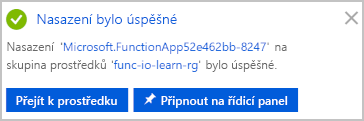
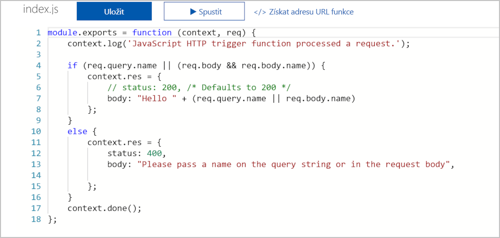
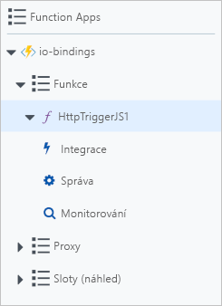
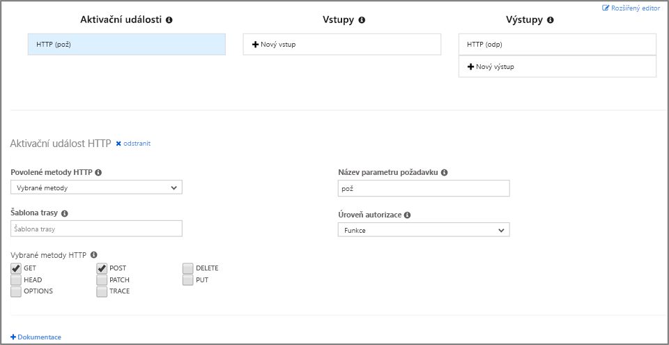
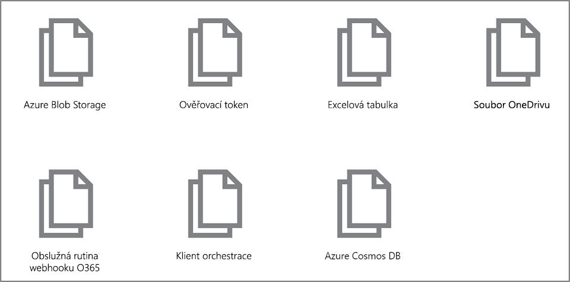
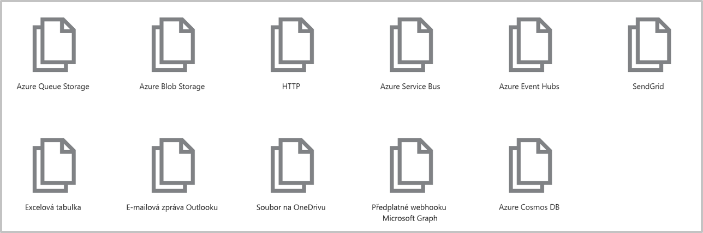

Tady je obecné znázornění toho, co budeme v tomto cvičení vytvářet.


Vytvoříme funkci, která se spustí, když přijme požadavek HTTP, a odpoví na každý požadavek tím, že odešle zpět zprávu. Parametry `req` a `res` jsou vazba aktivační události a výstupní vazba.

[!include[](../../../includes/azure-sandbox-activate.md)]

## <a name="create-a-function-app"></a>Vytvoření aplikace funkcí

Pojďme vytvořit aplikaci funkcí, kterou budeme používat v celém tomto modulu. Aplikace funkcí umožňuje seskupit funkce jako logickou jednotku pro snadnější správu, nasazení a sdílení prostředků.

1. Pomocí stejného účtu, kterým jste aktivovali sandbox, se přihlaste k webu [Portál Microsoft Azure](https://portal.azure.com/learn.docs.microsoft.com?azure-portal=true).

1. V levém horním rohu webu Azure Portal vyberte tlačítko **Vytvořit prostředek** a pak vyberte **Compute** > **Function App**.

1. Nastavte vlastnosti aplikace funkcí následujícím způsobem:

    | Vlastnost     | Navrhovaná hodnota  | Popis  |
    |--------------|------------------|--------------|
    | **Název aplikace** | Globálně jedinečný název | Název identifikující novou aplikaci funkcí. Platné znaky jsou `a-z`, `0-9` a `-`.  |
    | **Předplatné** | Vaše předplatné | Předplatné, pod kterým je tato nová aplikace funkcí vytvořena. |
    | **Skupina prostředků**|  Vyberte **Použít existující** a zvolte _<rgn>[název skupiny prostředků sandboxu]</rgn>_ | Název skupiny prostředků, ve které chcete vytvořit aplikaci funkcí |
    | **OS** | Windows | Operační systém hostující aplikaci funkcí  |
    | **Plán hostování** |   Plán Consumption | Plán hostování, který určuje způsob přidělování prostředků aplikaci Function App. Ve výchozím **plánu Consumption** se prostředky přidávají dynamicky podle požadavků příslušných funkcí. U tohoto modelu hostování bez serveru platíte jenom za dobu, kdy jsou funkce spuštěné.   |
    | **Umístění** | Vyberte ze seznamu | Vyberte tu, která je vám nejblíž, a je také jednou z povolených *oblastí snadboxu* uvedených níže. |
    | **Zásobník modulu runtime** | JavaScript | Ukázkový kód v tomto modulu je napsaný v JavaScriptu.  |
    | **Storage** |  Globálně jedinečný název |  Název nového účtu úložiště, který bude aplikace funkcí používat. Názvy účtů úložiště musí mít délku 3 až 24 znaků a můžou obsahovat jenom číslice a malá písmena. Toto dialogové okno vyplní pole jedinečným názvem odvozeným od názvu aplikace. Můžete však použít i jiný název nebo dokonce existující účet. |

    ### <a name="sandbox-regions"></a>Oblastí sandboxu
    [!include[](../../../includes/azure-sandbox-regions-first-mention-note-friendly.md)]

1. Klikněte na možnost **Vytvořit** a zřiďte a nasaďte aplikaci funkcí.

1. V pravém horním rohu portálu vyberte ikonu oznámení a sledujte, kdy se objeví zpráva **Probíhá nasazení** podobná následující zprávě.

    

1. Nasazení může chvíli trvat. Zůstaňte v centru oznámení a čekejte na zprávu **Nasazení bylo úspěšné** podobné následující zprávě.

    

 1. Po nasazení aplikace funkcí přejděte na portálu na **Všechny prostředky**. Aplikace funkcí bude uvedena s typem **App Service** a s názvem, který jste jí dali. Vyberte aplikaci funkcí ze seznamu a tím ji otevřete.

    >[!TIP]
    >Pokud se vám nedaří najít vaši aplikaci funkcí na portálu, podívejte se, [jak přidat aplikaci funkcí do oblíbených položek na portálu](https://docs.microsoft.com/azure/azure-functions/functions-how-to-use-azure-function-app-settings#favorite).

## <a name="create-a-function"></a>Vytvoření funkce

Když teď máme aplikaci funkcí, je načase vytvořit funkci. Funkce se aktivuje pomocí aktivační události. V tomto modulu použijeme HTTP trigger.

1. Klikněte na tlačítko Přidat (**+**) vedle **Funkce**. Tato akce spustí proces vytváření funkce.

1. Na stránce **Azure Functions pro JavaScript – Začínáme** vyberte **Na portálu** a potom **Pokračovat**.

1. V kroku **Vytvořit funkci** vyberte **Další šablony...** a pak vyberte **Dokončit a zobrazit šablony**.

1. V seznamu všech šablon dostupných pro tuto aplikaci funkcí vyberte **Trigger HTTP** .

1. Na obrazovce **Nová funkce** můžete podle potřeby změnit název. Pro **Úroveň autorizace** nechejte vybranou možnost _Funkce_ a klikněte na **Vytvořit**.

1. V nové funkci klikněte vpravo nahoře na odkaz **</> Získat adresu URL funkce**, vyberte **výchozí (klíč funkce)** a potom vyberte **Kopírovat**.

1. Ve svém prohlížeči vložte zkopírovanou adresu URL funkce do adresního řádku na nové záložce.

1. Na konec této adresy URL připojte hodnotu řetězce dotazu `&name=Azure` a stisknutím klávesy Enter na klávesnici pak požadavek proveďte. Měli byste v prohlížeči vidět odpověď vrácenou funkcí podobnou následující odpovědi.

    ```output
    <string xmlns="http://schemas.microsoft.com/2003/10/Serialization/">Hello Azure</string>
    ```

Jak jste zatím mohli v tomto cvičení vidět, při vytváření funkce je nutné vybrat typ aktivační události. Každá funkce má jednu a jenom jednu aktivační událost. V tomto příkladu používáme aktivační událost HTTP, což znamená, že naše funkce se spustí, když přijme požadavek HTTP. Výchozí implementace, znázorněná na následujícím snímku obrazovky v JavaScriptu, vrátí jako odpověď hodnotu parametru *name*, který přijala v řetězci dotazu nebo textu žádosti. Pokud nebyl žádný řetězec poskytnut, funkce jako odpověď vrátí volajícímu zprávu, že má poskytnout hodnotu name.



Veškerý tento kód je v souboru **index.js** ve složce funkce. Pojďme se krátce podívat na druhý soubor funkce – konfigurační soubor **function.json**. Tato konfigurační data jsou znázorněna v následujícím výpisu JSON.

```json
{
    "bindings": [
    {
        "authLevel": "function",
        "type": "httpTrigger",
        "direction": "in",
        "name": "req",
        "methods": [
        "get",
        "post"
        ]
    },
    {
        "type": "http",
        "direction": "out",
        "name": "res"
    }
    ],
    "disabled": false
}
```

Jak můžete vidět, má tato funkce vazbu aktivační události s názvem **req** typu `httpTrigger` a výstupní vazbu s názvem **res**`HTTP`. V předchozím kódu pro naši funkci jsme viděli, jak jsme přistupovali k datové části příchozího požadavku HTTP prostřednictvím našeho parametru **req**. Podobně jsme poslali odpověď HTTP jednoduše tak, že jsme nastavili parametr **res**. Vazby se za nás postarají o spoustu náročných operací.

>[!TIP]
>Po rozbalení nabídky **Zobrazit soubory**, kterou uvidíte na pravé straně obrazovky, když vyberete svoji funkci, uvidíte soubory **index.js** a **function.json**. Abyste viděli tuto nabídku, budete si možná muset posunout zobrazení doprava.

### <a name="explore-binding-types"></a>Prozkoumejte typy vazeb

1. Všimněte si, že pod položkou funkce existuje sada položek nabídky, jak je znázorněno na následujícím snímku obrazovky.

    

1. Vyberte položku nabídky **Integrace**. Otevře se karta integrace pro naši funkci. Pokud jste postupovali podle dosavadních pokynů v této lekci, karta integrace by měla vypadat velmi podobně jako na následujícím snímku obrazovky.

    

    > [!NOTE]
    > Definovali jsme aktivační událost a výstupní vazbu, jak je znázorněno na tomto snímku obrazovky. Můžete vidět, že nemůžeme přidat více než _jednu_ aktivační událost. Pokud bychom ve skutečnosti chtěli změnit aktivační událost pro naši funkci, museli bychom nejprve aktivační událost odstranit a potom vytvořit novou. V částech **Vstupy** a **Výstupy** tohoto uživatelského rozhraní se ale zobrazuje symbol plus (+) pro přidání dalších vazeb, abychom mohli přijmout více než jednu vstupní hodnotu a generovat více než jednu výstupní hodnotu.

1. Vyberte **+ Nový vstup** pod sloupcem **Vstupy**. Zobrazí seznam všech možných typů vstupních vazeb, jak je znázorněno na následujícím snímku obrazovky.

    

   Chvíli se nad každou z těchto vstupních vazeb zamyslete, jak byste je mohli použít v řešení. Výběr máte velký. Tento seznam může být v době, kdy čtete tyto řádky, ještě delší. Stále přidáváme další zdroje dat.

1. V tomto modulu se ještě k přidávání vstupních vazeb později vrátíme, ale teď výběrem možnosti **Zrušit** tento seznam zavřete.

1. Vyberte **+ Nový výstup** pod sloupcem **Výstupy**. Zobrazí se seznam všech možných typů výstupních vazeb, jak je znázorněno na následujícím snímku obrazovky.\

    

   Jak můžete vidět, k dispozici máte několik typů výstupních vazeb. V tomto modulu se ještě k přidávání výstupních vazeb později vrátíme, ale teď výběrem možnosti **Zrušit** tento seznam zavřete.

Zatím jsme se seznámili s postupem vytvoření aplikace funkcí a s tím, jak do ní přidat funkce. Viděli jsme v akci jednoduchou funkci, která se spustí při přijetí požadavku HTTP. Také jsme jste prozkoumali uživatelské rozhraní portálu Azure Portal a typy vstupních a výstupních vazeb, které jsou pro naše funkce k dispozici. V další lekci použijeme vstupní vazbu ke čtení textu z databáze.