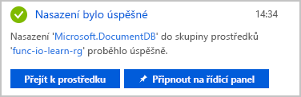
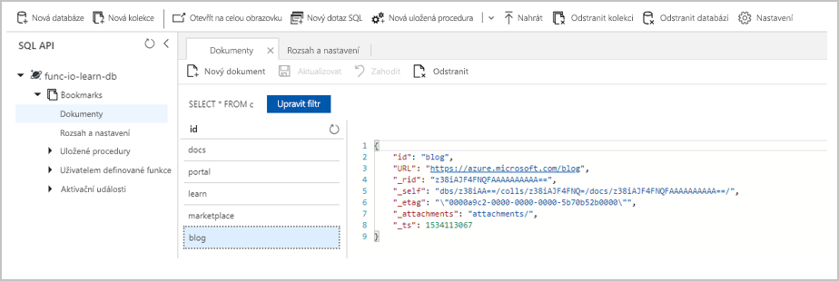
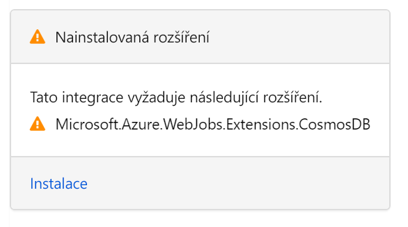

Představte si, že chcete vytvořit jednoduchou službu vyhledávání záložek. Vaše služba je zpočátku jenom pro čtení. Pokud uživatelé chtějí najít určitou položku, odešlou požadavek s ID položky a vy jim pak vrátíte adresu URL. Následující vývojový diagram tento tok popisuje:


Když nám uživatel odešle žádost s nějakým textem, pokusíme se najít záznam v naší back-endové databázi, která obsahuje tento text jako klíč nebo ID. Vrátíte výsledek s informací, jestli jste takovou položku našli nebo ne.

Přitom potřebujete někam ukládat data. V tomto vývojovém diagramu je úložištěm dat instance Azure Cosmos DB. Ale jak se k databázi připojíte z funkce a jak přečteme data? Ve světě funkcí pro tento účel nakonfigurujete *vstupní vazbu*.  Konfigurace vazby je na portálu Azure Portal přímočará záležitost. Jak za chvíli uvidíte, nemusíte psát kód pro takové úkoly, jako je otevření připojení k úložišti. O tyto věci se za vás postará modul runtime a vazby Azure Functions.

## <a name="create-an-azure-cosmos-db-account"></a>Vytvoření účtu služby Azure Cosmos DB

> [!NOTE]
> Tato lekce není zamýšlena jako kurz zaměřený na službu Azure Cosmos DB. V Cosmos DB existuje kompletní studijní program, pokud máte zájem se po ukončení tohoto modulu naučit něco dalšího.

### <a name="create-a-database-account"></a>Vytvoření účtu databáze

Účet databáze je kontejner pro správu jedné nebo více databází. Než budeme moct vytvořit databázi, musíme nejprve vytvořit účet databáze.

1. Zkontrolujte, že jste přihlášeni k portálu [Azure Portal](https://portal.azure.com/learn.docs.microsoft.com?azure-portal=true) pomocí stejného účtu, kterým jste aktivovali izolovaný prostor (sandbox).

1. V levém horním rohu portálu Azure Portal vyberte tlačítko **Vytvořit prostředek** a pak vyberte **Databáze** > **Azure Cosmos DB**.

1. Na stránce **Vytvořit účet Azure Cosmos DB** zadejte nastavení nového účtu služby Azure Cosmos DB.

    |Nastavení  |Hodnota  |Popis  |
    |---------|---------|---------|
    |Předplatné     |  Předplatné Concierge       |  Předplatné Azure, které chcete pro tento účet Azure Cosmos DB použít       |
    |Skupina prostředků     |   <rgn>[název sandboxové skupiny prostředků]</rgn>      |  Toto pole je předem vyplněno vybranou skupinou prostředků z vašeho sandboxu.       |
    |Název účtu     | *Zadejte jedinečný název*        |  Zadejte jedinečný název, který identifikuje tento účet služby Azure Cosmos DB. Jelikož je řetězec `documents.azure.com` připojený k názvu, který poskytnete k vytvoření identifikátoru URI, použijte jedinečný, ale snadno rozpoznatelný název.<br><br>Tento název účtu může obsahovat pouze malá písmena, číslice a znak spojovníku (-) a musí se skládat ze 3 až 50 znaků.       |
    |Rozhraní API     | SQL        |  Rozhraní API určuje typ účtu, který se má vytvořit. Azure Cosmos DB poskytuje pro potřeby vaší aplikace pět rozhraní API: SQL (databáze dokumentů), Gremlin (databáze grafů), MongoDB (databáze dokumentů), Tabulka Azure a Cassandra, z nichž každé v současné době vyžaduje samostatný účet. <br><br>Vyberte **SQL**. V současnosti aktivační události Azure Cosmos DB a vstupní a výstupní vazby fungují jenom s účty SQL API a Graph API.        |
    |Umístění     | Vyberte ze seznamu        | Vyberte tu, která je vám nejblíž, a je také jednou z povolených *oblastí snadboxu* uvedených níže.        |

     Ponechte všechna ostatní pole v okně **Nový účet** na výchozích hodnotách.

    ### <a name="sandbox-regions"></a>Oblasti sandboxu
    [!include[](../../../includes/azure-sandbox-regions-first-mention-note-friendly.md)]


1. Vyberte **Zkontrolovat a vytvořit** a překontrolujte a ověřte konfiguraci. 

1. Na další obrazovce vyberte **Vytvořit** a zřiďte a nasaďte účet databáze.

1. Nasazení může chvíli trvat. Takže než budete pokračovat, počkejte na zprávu **Nasazení bylo úspěšné** v centru oznámení.

    

1. Vyberte **Přejít k prostředku** a přejděte na účet databáze na portálu. Jako další přidáme do databáze kolekci.

### <a name="add-a-collection"></a>Přidání kolekce

Ve službě Cosmos DB uchovává *kontejner* libovolné uživatelem generované entity. Pro účty s rozhraním API SQL a MongoDB se kontejner mapuje na *kolekci*. Do kolekce ukládáme dokumenty.

Použijeme nástroj Průzkumník dat na webu Azure Portal a vytvoříme databázi a kolekci.

1. Vyberte **Průzkumník dat** > **Nová kolekce**.

2. Na stránce **Přidat kolekci** zadejte nastavení pro novou kolekci.

    >[!TIP]
    >Oblast **Přidat kolekci** se nachází zcela vpravo. K jejímu zobrazení bude možná potřeba posunout se doprava.

    |Nastavení|Navrhovaná hodnota|Popis
    |---|---|---|
    |ID databáze|[!INCLUDE [cosmos-db-name](./cosmos-db-name.md)]| Názvy databází musí mít délku 1 až 255 znaků a nesmí obsahovat znaky /, \\, #, ? ani koncové mezery.<br><br>Můžete zadat libovolný název, ale doporučujeme jako název pro novou databázi použít [!INCLUDE [cosmos-db-name](./cosmos-db-name.md)]. Tímto názvem se každopádně budeme dále v této lekci na novou databázi odkazovat. |
    |ID kolekce|[!INCLUDE [cosmos-coll-name](./cosmos-coll-name.md)]|Zadejte [!INCLUDE [cosmos-coll-name](./cosmos-coll-name.md)] jako název pro naši novou kolekci. Pro ID kolekcí platí stejné požadavky týkající se použitých znaků jako pro názvy databází.|
    |Klíč oddílu|**/id**| Klíč oddílu určuje, jak se mají dokumenty v kolekcích služby Cosmos DB distribuovat napříč logickými oddíly dat. Vzhledem k tomu, že v tomto modulu nebereme ohled na výkon databáze, použijeme pole `id` pro usnadnění. Pokud se chcete dozvědět podrobnosti o strategiích klíčů oddílů ve službě Cosmos DB, projděte si moduly věnované této službě na webu Microsoft Learn.|
    |Propustnost|1000 RU|Změňte propustnost na 1000 jednotek žádostí za sekundu (RU/s). Pokud budete chtít snížit latenci, můžete výkon navýšit později.|

3. Klikněte na **OK**. Průzkumník dat zobrazí novou databázi a kolekci. Takže teď máme databázi. V databázi jsme definovali kolekci. Dál přidáme nějaká data, označovaná také jako dokumenty.

### <a name="add-test-data"></a>Přidání testovacích dat

V databázi s názvem [!INCLUDE [cosmos-coll-name](./cosmos-coll-name.md)] jsme definovali kolekci. Chceme uložit adresu URL a ID v podobě seznamu záložek webových stránek.

Do nové kolekce přidáte data pomocí Průzkumníka dat.

1. V Průzkumníkovi dat se nová databáze zobrazí v podokně Kolekce. Rozbalte databázi [!INCLUDE [cosmos-db-name](./cosmos-db-name.md)], rozbalte kolekci [!INCLUDE [cosmos-coll-name](./cosmos-coll-name.md)], vyberte **Dokumenty** a potom vyberte **Nový dokument**.

2. Nahraďte obsah nového dokumentu následujícím kódem JSON.

     ```json
     {
         "id": "docs",
         "URL": "https://docs.microsoft.com/azure"
     }
     ```

3. Po přidání formátu JSON na kartu **Dokumenty** vyberte **Uložit**.

    Všimněte si, že v něm je více vlastností, než jsme sami přidali. Všechny začínají podtržítkem (_rid _self, _etag, _attachments, _ts). To jsou vlastnosti generované systémem, které pomáhají se správou dokumentu.

    |Vlastnost  |Popis  |
    |---------|---------|
    | `_rid`     |     ID prostředku je jedinečný identifikátor, který je také hierarchický pro zásobník prostředků na modelu prostředků. Používá se interně pro umístění a navigaci v tomto prostředku dokumentu.    |
    | `_self`     |   Jedinečný adresovatelný identifikátor URI pro tento prostředek.      |
    | `_etag`     |   Požadováno pro řízení optimistické souběžnosti.     |
    | `_attachments`     |  Adresovatelná cesta pro prostředek příloh.       |
    | `_ts`     |    Časové razítko poslední aktualizace tohoto prostředku.    |

4. Pojďme do kolekce přidat pár dalších dokumentů. Vytvořte čtyři další dokumenty s následujícím obsahem. Nezapomeňte si práci uložit.

    ```json
    {
        "id": "portal",
        "URL": "https://portal.azure.com"
    }
    ```

    ```json
    {
        "id": "learn",
        "URL": "https://docs.microsoft.com/learn"
    }
    ```

    ```json
    {
        "id": "marketplace",
        "URL": "https://azuremarketplace.microsoft.com/marketplace/apps"
    }
    ```

    ```json
    {
        "id": "blog",
        "URL": "https://azure.microsoft.com/blog"
    }
    ```

1. Až budete mít hotovo, měla by vaše kolekce vypadat následovně:

    

V kolekci záložek teď máte několik položek. Náš scénář bude fungovat následovně. Pokud například dorazí požadavek s id = docs, vyhledáme toto ID v naší kolekci záložek a vrátíme příslušnou adresu URL `https://docs.microsoft.com/azure`. Vytvořme funkci Azure, která vyhledává hodnoty v této kolekci.

## <a name="create-your-function"></a>Vytvoření vlastní funkce

1. Přejděte do aplikace funkcí, kterou jste vytvořili v předchozí lekci.

1. Postup vytváření funkce zahájíte výběrem tlačítka **Přidat** (**+**) vedle **Funkce**. 
   Stránka zobrazuje úplnou sadu podporovaných aktivačních událostí.

1. Vyberte **Aktivační událost HTTP**.

1. Do dialogového okna **Nová funkce**, které se zobrazí napravo, zadejte následující hodnoty.

    | Pole | Hodnota |
    |----------|--------|
    | Název     | [!INCLUDE [func-name-find](./func-name-find.md)] |
    | Úroveň autorizace | **Funkce** |

1. Funkci vytvoříte kliknutím na **Vytvořit**.
    Tato funkce otevře soubor *index.js* v editoru kódů a zobrazí výchozí implementaci funkce aktivované protokolem HTTP.

### <a name="verify-the-function"></a>Ověření funkce

Můžete zkontrolovat, co jsme zatím udělali, a to otestováním nové funkce následujícím způsobem:

1. V nové funkci klikněte vpravo nahoře na **Získat adresu URL funkce**, vyberte **výchozí (klíč funkce)** a potom klikněte na **Kopírovat**.

1. Vložte zkopírovanou adresu URL funkce do adresního řádku prohlížeče. Na konec adresy URL připojte hodnotu řetězce dotazu `&name=<yourname>` a stiskněte **Enter**, aby se požadavek provedl. Odpověď od funkce Azure byste měli získat přímo v prohlížeči.

Teď, když nám funguje základ naší funkce, obrátíme pozornost ke čtení dat ze služby Azure Cosmos DB – v tomto scénáři konkrétně z naší kolekce [!INCLUDE [cosmos-coll-name](./cosmos-coll-name.md)].

## <a name="add-an-azure-cosmos-db-input-binding"></a>Přidání vstupní vazby Azure Cosmos DB

Aby bylo možné číst data z databáze, musíte definovat vstupní vazbu. Jak uvidíte, v pár krocích nakonfigurujete vazbu, která může komunikovat s vaší databázi.

1. V levém podokně vyberte **Integrovat**, abyste otevřeli kartu integrace. Šablona, kterou jste použili, už vytvořila aktivační událost HTTP a výstupní vazbu HTTP. Teď přidejte novou vstupní vazbu Azure Cosmos DB.

1. Vyberte **Nový vstup** v sloupci **Vstupy**.
   Zobrazí se seznam všech možných typů vstupních vazeb.

1. V seznamu vyberte **Azure Cosmos DB** a pak vyberte **Vybrat**.
   Tato akce otevře stránku konfigurace vstupu Azure Cosmos DB. V dalším kroku nastavíte připojení k vaší databázi.

1. Pokud se v uživatelském rozhraní konfigurace **vstupu služby Azure Cosmos DB** zobrazí následující zpráva sdělující, že musíte nainstalovat rozšíření, vyberte **Nainstalovat**. 

    

    > [!NOTE]
    > Instalace rozšíření může chvíli trvat, proto je potřeba počkat, až se instalace dokončí, a teprve potom přejít k dalšímu kroku.

1. Vedle pole **Připojení účtu Azure Cosmos DB** vyberte **Nové**.
   Tím se otevře okno **Připojení**, ve kterém už je vybráno: **účet služby Azure Cosmos DB** a vaše předplatné Azure. Jediné, co na vás zbývá, je vybrat ID účtu databáze.

1. V části Vytvoření účtu databáze jste zadávali hodnotu ID. Tuto hodnotu najděte v rozevíracím seznamu **Účet databáze** a potom klikněte na **Vybrat**.

1. Nové připojení k databázi je nakonfigurováno a zobrazuje se v poli **Připojení účtu Azure Cosmos DB**. Pokud vás zajímá, co se ve skutečnosti za tímto abstraktním názvem skrývá, klikněte na *zobrazit hodnotu* a zobrazí se samotný připojovací řetězec.

Chcete vyhledat záložku s konkrétním ID, pojďme tedy propojit obdržené ID s naší vazbou.

1. Do pole **ID dokumentu (nepovinné)** zadejte `{id}`. Této syntaxi říkáme *vazbový výraz*. Funkce je aktivována požadavkem HTTP, který používá řetězec dotazu k určení ID, které se má vyhledat. Protože ID jsou v naší kolekci jedinečná, vazba vrátí buď 0 dokumentů (nenalezeno), nebo 1 dokument (nalezeno).

1. Pečlivě vyplňte zbývající pole na této stránce s použitím hodnot v následující tabulce. Kdykoli můžete kliknout na ikonu informací napravo od názvů jednotlivých polí, abyste zobrazili další informace o účelu jednotlivých polí.

    |Nastavení  |Hodnota  |Popis  |
    |---------|---------|---------|
    |Název parametru dokumentu     |  **bookmark**       |  Název používaný k identifikaci této vazby v kódu.      |
    |Název databáze     |  [!INCLUDE [cosmos-db-name](./cosmos-db-name.md)]       | Databáze, se kterou se má pracovat. Tato hodnota je název databáze, který jsme nastavili dříve v této lekci.        |
    |Název kolekce     |  [!INCLUDE [cosmos-db-name](./cosmos-coll-name.md)]        | Kolekce, ze které budeme číst data. Toto nastavení bylo definováno dříve v této lekci. |
    |Dotaz SQL (nepovinný)    |   ponechte prázdné       |   Načítáme vždy současně jenom jeden dokument na základě zadaného ID. Proto je v tomto případě filtrování na základě pole ID dokumentu účelnější než použít dotaz SQL. Mohli bychom sestavit dotaz SQL, který vrací jednu položku (`SELECT * from b where b.ID = {id}`). Tento dotaz by sice vrátil vždy jeden dokument, ale vrátil by ho v kolekci dokumentů. Náš kód by musel dále pracovat s kolekcí, což je komplikace, která přitom není nutná. Přístup založený na dotazu SQL použijte, když budete chtít načíst více dokumentů.   |
    |Klíč oddílu (volitelné) | **{id}** |  Přidejte klíč oddílu, který jsme definovali při vytváření kolekce Cosmos DB [!INCLUDE [cosmos-coll-name](./cosmos-coll-name.md)].  Klíč, který zde zadáte (uvedený ve formátu vstupní vazby `{<key>}`), se musí shodovat s klíčem v kolekci.|

9. Vyberte tlačítko **Uložit** a uložte tak všechny změny konfigurace této vazby.

Teď když máte vazbu nadefinovanou, nadešel čas použít ji ve vaší funkci.

## <a name="update-function-implementation"></a>Aktualizace implementace funkce

1. Vyberte funkci [!INCLUDE [func-name-find](./func-name-find.md)]. Otevře se *index.js* v editoru kódu. Přidali jste vstupní vazbu pro čtení z vaší databáze. Aktualizujte teď logiku, aby tuto vazbu používala.

2. Nahraďte veškerý kód v *index.js* kódem z následujícího fragmentu a zvolte **Uložit**.

   [!code-javascript[](../code/find-bookmark-single.js)]

Příchozí požadavek HTTP aktivuje funkci a parametr dotazu `id` je předán vstupní vazbě Cosmos DB. Pokud databáze najde dokument, který odpovídá tomuto ID, bude parametr `bookmark` nastaven na nalezený dokument. V takovém případě sestavíme odpověď, která obsahuje hodnotu adresy URL nacházející se v dokumentu označeném záložkou. Pokud nebyl nalezen žádný dokument odpovídající tomuto klíči, odpovíme datovou částí a stavovým kódem, které uživateli sdělí tuto špatnou zprávu.

## <a name="try-it-out"></a>Vyzkoušet

1. Vpravo nahoře vyberte **Získat adresu URL funkce**, vyberte **výchozí (klíč funkce)** a potom vyberte **Kopírovat**, abyste zkopírovali adresu URL funkce.

2. Vložte zkopírovanou adresu URL funkce do adresního řádku prohlížeče. Na konec této adresy URL připojte hodnotu řetězce dotazu `&id=docs` a stisknutím klávesy `Enter` na klávesnici požadavek proveďte. Měli byste vidět odpověď, která obsahuje adresu URL vedoucí na tento prostředek.

3. Nahraďte `&id=docs` kódem `&id=missing` a sledujte odpověď.

    >[!TIP]
    >Můžete také funkci otestovat pomocí karty **Test** v uživatelském rozhraní portálu funkce. Můžete přidat parametr dotazu nebo dodat text požadavku, abyste získali stejné výsledky, jaké jsou popsány v předchozích krocích.

V této lekci jsme ručně vytvořili naši první vstupní vazbu na čtení z databáze Azure Cosmos DB. Množství kódu, který jsme museli psát pro vyhledání v databázi a čtení dat, bylo díky využití vazeb minimální. Většina naší práce spočívala v deklarativní konfiguraci vazby a o ostatní se postarala platforma.

V další lekci přidáme do naší kolekce záložek další data prostřednictvím výstupní vazby Azure Cosmos DB.