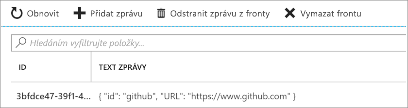

V našem posledním cvičení jsme implementovali scénář k vyhledání záložek v databázi Azure Cosmos DB. Nakonfigurovali jsme vstupní vazbu, aby četla data z naší kolekce záložek. Ale můžeme toho udělat více. Pojďme scénář rozvinout, aby zahrnoval i zápis. Podívejme se na následující vývojový diagram:


V tomto scénáři budeme přijímat požadavky na přidání záložek do naší kolekce. Požadavky předávají požadovaný klíč nebo ID spolu s adresou URL záložky. Jak je ve vývojovém diagramu vidět, budeme reagovat chybou, pokud daný klíč už na našem back-endu existuje.

Pokud klíč předaný v žádosti *není* nalezen, přidáme do databáze novou záložku. Tady bychom se mohli zastavit, ale pojďme ještě o kus dál.

Vidíte další krok ve vývojovém diagramu? Zatím jsme s přijatými daty nic moc nedělali, pokud jde o zpracování. Co nám přijde, prostě zapíšeme do databáze. Nicméně ve skutečném řešení bychom pravděpodobně data nějakým způsobem zpracovávali. Můžeme se rozhodnout provádět veškeré zpracování ve stejné funkci, ale v tomto cvičení vám ukážeme způsob, kdy se další zpracování přesměruje do jiné komponenty nebo součásti obchodní logiky.

Co může být dobrým příkladem tohoto přesměrování pracovní zátěže v našem scénáři se záložkami? Co kdybychom odeslali novou záložku do služby generování kódu QR? Tato služba by pak vygenerovala kód QR pro danou adresu URL, uložila obrázek do úložiště objektů blob a přidala adresu obrázku QR zpět do položky v naší kolekci záložek. Volání služby pro generování obrázku QR je časově náročné. Proto místo toho, abychom čekali na výsledek, to přehodíme celé na další funkci, která se o to postará asynchronně.

Stejně jako Azure Functions podporuje vstupní vazby pro různé zdroje integrace, obsahuje také sadu šablon výstupních vazeb, abyste mohli snadno zapisovat data do zdrojů dat. Výstupní vazby jsou konfigurovány také v souboru *function.json*.  Jak uvidíte v tomto cvičení, můžeme nakonfigurovat naši funkci pro práci s více zdroji dat a službami.

> [!IMPORTANT]
> Toto cvičení navazuje na to předchozí. Používá stejnou databázi Azure Cosmos DB a vstupní vazby. Pokud jste ještě tuto jednotce nedělali, doporučujeme vám udělat si ji před tím, než budete v této pokračovat.

## <a name="create-an-http-triggered-function"></a>Vytvoření funkce aktivované protokolem HTTP

1. Zkontrolujte, že jste přihlášeni k portálu [Azure Portal](https://portal.azure.com/learn.docs.microsoft.com?azure-portal=true) pomocí stejného účtu, kterým jste aktivovali izolovaný prostor (sandbox).

2. Na portálu přejděte do aplikace funkcí, kterou jste vytvořili v tomto modulu.

3. Klikněte na tlačítko Přidat (**+**) vedle **Funkce**. Tato akce spustí proces vytvoření funkce. 
4. Stránka zobrazuje aktuální sadu podporovaných aktivačních událostí. Vyberte **Aktivační událost HTTP**.

5. Vyplňte podokno **Nová funkce**, které je zobrazeno napravo, pomocí následujících hodnot:

    |Pole  |Hodnota  |
    |---------|---------|
    |Název     |   [!INCLUDE [func-name-add](./func-name-add.md)]     |
    | Úroveň autorizace | **Funkce** |

6. Funkci vytvoříte kliknutím na **Vytvořit**. Tato funkce otevře soubor **index.js** v editoru kódu a zobrazí výchozí implementaci funkce aktivované protokolem HTTP.

## <a name="add-an-azure-cosmos-db-input-binding"></a>Přidání vstupní vazby Azure Cosmos DB

Zopakujme si, co jsme udělali v předchozím modulu pro přidání vstupní vazby Azure Cosmos DB.

1. Ujistěte se, že je naše nová funkce [!INCLUDE [func-name-add](./func-name-add.md)] vybrána v seznamu funkcí. 
1. V levém podokně vyberte **Integrace**, abyste otevřeli kartu integrace.
   
1. Ve sloupci **Vstupy** vyberte **Nový vstup**, abyste zobrazili seznam všech možných typů vstupních vazeb.

1. V seznamu vyberte **Azure Cosmos DB** a potom **Vybrat**.
1. Pokud se zobrazí zpráva s výzvou k instalaci rozšíření Microsoft.Azure.WebJobs.Extensions.CosmosDB, vyberte **nainstalovat** a počkejte na dokončení. 
 1. V poli **Připojení účtu Azure Cosmos DB** vyberte **nové**.
   Tato akce otevře dialogové okno **Připojení**. Vyberte své předplatné a účet databáze a pak zvolte **Vybrat**. 

1. Nové připojení k databázi je nakonfigurováno a zobrazuje se v poli **Připojení účtu Azure Cosmos DB**. Pokud vás zajímá, co se ve skutečnosti za tímto abstraktním názvem skrývá, klikněte na *zobrazit hodnotu* a zobrazí se samotný připojovací řetězec.

Chcete vyhledat záložku s konkrétním ID, pojďme tedy propojit obdržené ID s naší vazbou.

1. Do pole **ID dokumentu (nepovinné)** zadejte `{id}`. Této syntaxi říkáme *vazbový výraz*. Funkce je aktivována požadavkem HTTP, který používá řetězec dotazu k určení ID, které se má vyhledat. Protože ID jsou v naší kolekci jedinečná, vazba vrátí buď 0 dokumentů (nenalezeno), nebo 1 dokument (nalezeno).

1. Pečlivě vyplňte zbývající pole na této stránce s použitím hodnot v následující tabulce. Kdykoli můžete kliknout na ikonu informací napravo od názvů jednotlivých polí, abyste zobrazili další informace o účelu jednotlivých polí.

    |Nastavení  |Hodnota  |Popis  |
    |---------|---------|---------|
    |Název parametru dokumentu     |  **bookmark**       |  Název používaný k identifikaci této vazby v kódu.      |
    |Název databáze     |  [!INCLUDE [cosmos-db-name](./cosmos-db-name.md)]       | Databáze, se kterou se má pracovat. Tato hodnota je název databáze, který jsme nastavili dříve v této lekci.        |
    |Název kolekce     |  [!INCLUDE [cosmos-db-name](./cosmos-coll-name.md)]        | Kolekce, ze které budeme číst data. Toto nastavení bylo definováno dříve v této lekci. |
    |Dotaz SQL (nepovinný)    |   ponechte prázdné       |   Načítáme vždy současně jenom jeden dokument na základě zadaného ID. Proto je v tomto případě filtrování na základě pole ID dokumentu účelnější než použít dotaz SQL. Mohli bychom sestavit dotaz SQL, který vrací jednu položku (`SELECT * from b where b.ID = {id}`). Tento dotaz by sice vrátil vždy jeden dokument, ale vrátil by ho v kolekci dokumentů. Náš kód by musel dále pracovat s kolekcí, což je komplikace, která přitom není nutná. Přístup založený na dotazu SQL použijte, když budete chtít načíst více dokumentů.   |
    |Klíč oddílu (volitelné)     |   ponechte prázdné      |  Tady můžeme přijmout výchozí hodnotu.       |

9. Vyberte tlačítko **Uložit** a uložte tak všechny změny konfigurace této vazby.

Teď máme vstupní vazbu Azure Cosmos DB. Teď je vhodné přidat výstupní vazbu, abychom do naší kolekce mohli zapisovat nové položky.  

## <a name="add-an-azure-cosmos-db-output-binding"></a>Přidání výstupní vazby Azure Cosmos DB

1. Ujistěte se, že je naše funkce [!INCLUDE [func-name-add](./func-name-add.md)] stále vybrána v seznamu funkcí. 
1. V levém podokně vyberte **Integrace**, abyste otevřeli kartu integrace.
   
1. Ve sloupci **Výstupy** vyberte **Nový výstup**, abyste zobrazili seznam všech možných typů výstupních vazeb.

1. V seznamu vyberte **Azure Cosmos DB** a pak zvolte **Vybrat**.

1. V poli **Připojení účtu Azure Cosmos DB** by mělo být předem vyplněné připojení, které jste vytvořili při přidávání vstupní vazby Cosmos DB.  

1. Pečlivě vyplňte zbývající pole na této stránce s použitím hodnot v následující tabulce. Kdykoli můžete kliknout na ikonu informací napravo od názvů jednotlivých polí, abyste zobrazili další informace o účelu jednotlivých polí.

    |Nastavení  |Hodnota  |Popis  |
    |---------|---------|---------|
    |Název parametru dokumentu     |  **newbookmark**       |  Název používaný k identifikaci této vazby v kódu. Tento parametr se používá k zápisu nové položky záložky.     |
    |Název databáze     |  [!INCLUDE [cosmos-db-name](./cosmos-db-name.md)]       | Databáze, se kterou se má pracovat. Tato hodnota je název databáze, který jsme nastavili dříve v této lekci.        |
    |Název kolekce     |  [!INCLUDE [cosmos-db-name](./cosmos-coll-name.md)]        | Kolekce, ze které budeme číst data. Toto nastavení bylo definováno dříve v této lekci. |
    |Klíč oddílu (volitelné)     |   ponechte prázdné      |  Tady můžeme přijmout výchozí hodnotu.       |
     |Propustnost kolekce (volitelné)     |   ponechte prázdné      |  Tady můžeme přijmout výchozí hodnotu.       |

9. Vyberte tlačítko **Uložit** a uložte tak všechny změny konfigurace této vazby.

Teď máme jednu vazbu pro čtení z naší kolekce a jednu pro zápis do této kolekce. 

## <a name="add-an-azure-queue-storage-output-binding"></a>Přidání výstupní vazby Azure Queue Storage

Azure Queue Storage je služba pro ukládání zpráv, ke které můžete přistupovat odkudkoli na světě. Velikost jedné zprávy může být až 64 kB a fronta můžete obsahovat miliony zpráv&mdash; až do dosažení celkové kapacity účtu úložiště, ve kterém je definována. Následující diagram znázorňuje obecně, jak se požívá fronta v tomto scénáři:


Tady můžete vidět, jak vaše nová funkce [!INCLUDE [func-name-add](./func-name-add.md)] přidává zprávy do fronty. Jiná funkce, &mdash;například fiktivní funkce nazvaná *gen-qr-code*&mdash;, bude z téže fronty vyjímat zprávy a zpracovávat požadavek.  Jelikož zapisujeme (nebo *nabízíme (push)*) zprávy do fronty z [!INCLUDE [func-name-add](./func-name-add.md)], přidáme do vašeho řešení novou výstupní vazbu. Pojďme tentokrát vytvořit tuto vazbu přes portál uživatelského rozhraní.

1. V levé nabídce funkcí opět vyberte **Integrace**, abyste otevřeli kartu integrace.

1. Vyberte **Nový výstup** ve sloupci **Výstupy**.
    Zobrazí se seznam všech možných typů výstupních vazeb.

1. V seznamu vyberte **Azure Queue Storage** a pak vyberte **Vybrat**.
    Tato akce otevře stránku konfigurace výstupu Azure Queue Storage.

   V dalším kroku nastavíme připojení účtu úložiště. To je, kde bude naše fronta hostována.
1. Pokud se zobrazí zpráva s výzvou k instalaci rozšíření Microsoft.Azure.WebJobs.Extensions.Storage, vyberte **nainstalovat** a počkejte na dokončení. 

4. Napravo od pole **Připojení účtu úložiště** vyberte **nové**.
   Otevře se podokno výběru **Účet úložiště**.

5. Když jsme začali s tímto modulem a vytvořili jste aplikace funkcí, současně se také vytvořil účet úložiště. Je uveden v tomto podokně, tak jej vyberte. Pole **Připojení k účtu úložiště** se vyplní názvem připojení. Pokud chcete zobrazit hodnotu připojovacího řetězce, vyberte **zobrazit hodnotu**.

6. Ačkoli bychom všechna ostatní pole na této stránce mohli ponechat na výchozích hodnotách, změňme následující, aby byly vlastnosti srozumitelnější:

    |Vlastnost  |Původní hodnota  |Nová hodnota  | Popis |
    |---------|---------|---------|---------|
    |Název fronty     |    outqueue     |  **bookmarks-post-process**      | Název fronty, kde přidáváme záložky, aby pak byly dále zpracovány další funkcí. |
    | Název parametru zprávy    |  outputQueueItem       |   **newmessage**      | Vlastnost vazby, kterou použijeme v kódu. |

7. Nezapomeňte vybrat **Uložit**, abyste uložili provedené změny.

## <a name="update-function-implementation"></a>Aktualizace implementace funkce

Teď máme všechny naše vazby pro funkci [!INCLUDE [func-name-add](./func-name-add.md)] nastavené. Je načase je ve funkci použít.

1.  Vyberte funkci [!INCLUDE [func-name-add](./func-name-add.md)]. Otevře se soubor **index.js** v editoru kódu.

2. Nahraďte veškerý kód v souboru *index.js* kódem z následujícího fragmentu kódu a pak klikněte na **Uložit**:

   [!code-javascript[](../code/add-bookmark.js)]

Pojďme si podrobně rozebrat, co tento kód dělá:

* Protože tato funkce mění naše data, očekáváme, že požadavek HTTP bude POST a data záložky budou součástí textu požadavku.
* Naše vstupní vazba Azure Cosmos DB se pokusí načíst dokument nebo záložku pomocí `id`, které jsme obdrželi. Pokud najde odpovídající položku, nastaví objekt `bookmark`. Podmínka `if(bookmark)` kontroluje, jestli byla položka nalezena.
* Přidání do databáze je tak jednoduché, jako nastavení parametru vazby `context.bindings.newbookmark` na novou položku záložky, kterou jsme vytvořili jako řetězec JSON.
* Odeslání zpráv do naší fronty je také jednoduché: jen se nastaví parametr `context.bindings.newmessage`.

> [!NOTE]
> Jediná věc, kterou jste provedli, bylo navázání fronty. Samotnou frontu jste nikdy explicitně nevytvořili. Tady na vlastní oči vidíte, co všechno vazby dokážou! Jak uvádí následující popisek, pokud fronta neexistuje, automaticky se pro vás vytvoří.


Tak to je vše. Teď se v další části podíváme na naše dílo v akci.

## <a name="try-it-out"></a>Vyzkoušet

Když teď máme několik výstupních vazeb, testování je o něco složitější. V předchozích cvičeních nám na otestování stačilo odeslat požadavek HTTP a řetězec dotazu, ale tentokrát budeme chtít provést operaci HTTP Post. Musíme to také zkontrolovat proto, abychom viděli, jestli se zprávy správně přidávají do fronty.

1. Na portálu Function Apps vyberte naši funkci [!INCLUDE [func-name-add](./func-name-add.md)], vyberte nabídku testování úplně vpravo a rozbalte ji.

2. V nabídce vyberte položku **testování** a zkontrolujte, jestli máte otevřené testovací podokno. Výsledek by měl vypadat jako na následujícím snímku obrazovky:

    

    > [!IMPORTANT]
    > Zkontrolujte, že je v rozevíracím seznamu metody HTTP vybrána možnost **POST**.

3. Nahraďte obsah textu požadavku následujícím kódem JSON:

    ```json
    {
        "id": "docs",
        "url": "https://docs.microsoft.com/azure"
    }
    ```

4. Dole v testovacím podokně vyberte **Spustit**.

5. Zkontrolujte, že okno **Výstup** zobrazí zprávu, že záložka již existuje, jak je znázorněno v následujícím diagramu:

    

6. Nahraďte text požadavku následující datovou částí:

    ```json
    {
        "id": "github",
        "url": "https://www.github.com"
    }
    ```
7. Dole v testovacím podokně vyberte **Spustit**.

8. Zkontrolujte, jestli pole *Výstup* zobrazí zprávu, že záložka byla přidána, jak je znázorněno v následujícím diagramu.

    

Blahopřejeme! Funkce [!INCLUDE [func-name-add](./func-name-add.md)] pracuje tak, jak má, ale jak je to s tou operací fronty, co jsme měli v kódu? Pojďme zjistit, jestli bylo něco zapsáno do fronty.

### <a name="verify-that-a-message-is-written-to-the-queue"></a>Kontrola zapsání zprávy do fronty

Fronty Azure Queue Storage jsou hostovány v účtu úložiště. V tomto cvičení jste už účet úložiště vybrali, když jste vytvořili výstupní vazbu.

1. V hlavním vyhledávacím poli na portálu Azure Portal zadejte **účty úložiště** a ve výsledcích hledání vyberte **Účty úložiště** v kategorii **Služby**.

      

2. V seznamu vrácených účtů úložiště vyberte účet, který jste použili k vytvoření výstupní vazby **newmessage**.
   Nastavení účtu úložiště se zobrazí v hlavním okně portálu.

3. V seznamu **Služby** vyberte položku **Fronty**.
   Zobrazí se seznam front hostovaných tímto účtem úložiště. Zkontrolujte, že existuje fronta **bookmarks-post-process**, jak ukazuje následující snímek obrazovky:

      

4. Vyberte frontu **bookmarks-post-process** a tím ji otevřete.
   V seznamu se zobrazí zprávy ve frontě. Pokud šlo všechno podle plánu, fronta obsahuje zprávu, kterou jste publikovali při přidávání záložky do databáze. Mělo by to vypadat následovně:

    

   V tomto příkladu můžete vidět, že zprávě bylo přiděleno jedinečné ID a pole **TEXT ZPRÁVY** zobrazuje vaši záložku ve formátu řetězce JSON.

5. Tuto funkci můžete dále otestovat tím, že změníte text požadavku v testovacím podokně na novou sadu id/url a funkci spustíte. Sledujte tuto frontu a uvidíte, jak budou přicházet další zprávy. Můžete se také podívat na databázi a zkontrolovat, že byly nové položky přidány.

V tomto cvičení jsme rozšířili vaše znalosti vazeb o výstupní vazby a zapsali jsme data do Azure Cosmos DB. Pak jsme šli o krok dále a přidali další výstupní vazbu na přidávání zpráv do fronty Azure. Tento příklad ukazuje, jak můžete využít vazby k utváření a přesunu dat z příchozích zdrojů do různých cílů. Nemuseli jsme sami psát žádný databázový kód ani spravovat připojovací řetězce. Místo toho jsme nakonfigurovali vazby deklarativně a nechali platformu postarat se o zajištění připojení, škálování funkce i škálování připojení.