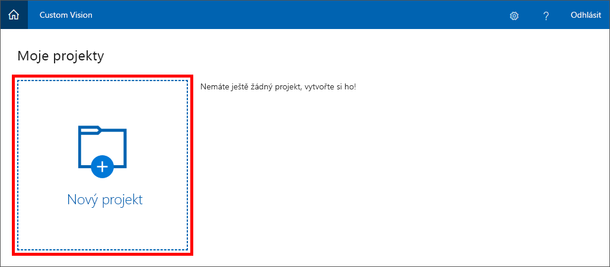
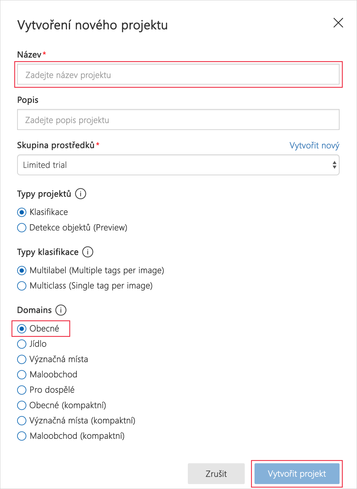

Prvním krokem vytvoření modelu klasifikace obrázků pomocí služby Custom Vision Service je vytvoření projektu. V této lekci vytvoříte projekt Custom Vision Service prostřednictvím portálu Custom Vision Service.

1. V prohlížeči otevřete [portál Custom Vision Service](https://www.customvision.ai/?azure-portal=true). Pak vyberte **Sign In** (Přihlásit se).

1. Pokud se zobrazí výzva k přihlášení, přihlaste se pomocí přihlašovacích údajů svého účtu Microsoft. Pokud se zobrazí výzva, abyste aplikaci povolili přístup k vašim informacím, klikněte na **Yes** (Ano) a pak označte, že souhlasíte s podmínkami služby.

1. Klikněte na **New Project** (Nový projekt) a vytvořte nový projekt.

    

1. V dialogovém okně **Create new project** (Vytvořit nový projekt) zadejte název projektu *Artworks*. Ověřte, že je v seznamu **Domains** (Domény) vybraná možnost **General** (Obecné). Pro **Typy projektů** a **Typy klasifikace** můžete nechat výchozí nastavení. Pro vytvoření našeho projektu vyberte možnost **Vytvořit projekt**.

    > Doména optimalizuje model pro určité typy obrázků. Pokud chcete například klasifikovat obrázky jídla podle typů jídel znázorněných na obrázcích nebo podle etnického původu pokrmu, může být užitečnější, když vyberete doménu Food (Jídlo). U scénářů, které nespadají do žádné z nabízených domén, nebo v případě, že nevíte, kterou doménu máte zvolit, vyberte doménu General.

   

Dalším krokem je nahrání obrázků do projektu a jejich označení, aby je bylo možné klasifikovat.