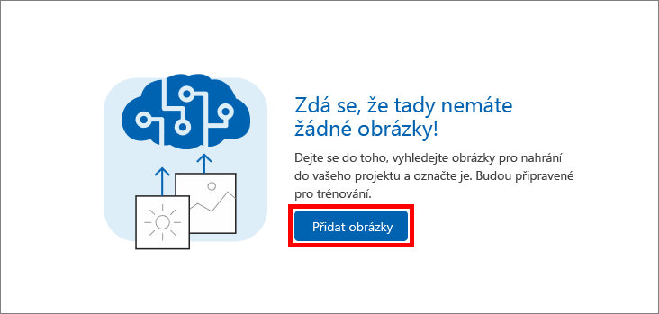

V této lekci přidáte do projektu Artworks slavné obrazy od Picassa, Pollocka a Rembrandta. Obrazy označíte značkami, aby se služba Custom Vision Service naučila jednotlivé umělce od sebe rozlišovat.

1. Ve vytvořeném projektu **Artworks** vyberte na bočním panelu znaménko plus (**+**), které je vpravo od nabídky **Značky**.

     

1. Zobrazí se dialogové okno pro **pojmenování značky**. Do názvu značky zadejte *obraz* a vyberte **Uložit**. Touto operací vytvoříte v seznamu značek značku *obraz*. Pojďme přidat další značky. 

1. Opakováním prvního a druhého kroku přidejte další značky s hodnotami *Picasso*, *Pollock* a *Rembrandt*. Hotový seznam značek by měl vypadat jako na následujícím obrázku.

    

    Vidíte, že počet obrazů v projektu označených těmito značkami je nula. Teď do projektu přidáme několik obrazů a přiřadíme jim značky.

1. Stáhněte si [cvs resources.zip](https://github.com/MicrosoftDocs/mslearn-classify-images-with-the-custom-vision-service/raw/master/cvs-resources.zip) obsahující prostředky image pro tento modul a rozbalte ho do místního počítače. 

1. Zpět na portálu vyberte **Add images** (Přidat obrázky) a přidejte obrazy do projektu.

    

1. Ve složce **cvs-resources**, kterou jste si stáhli místně v kroku 4, přejděte do složky „Artists\Picasso“.

1. Vyberte všechny soubory v „Artists\Picasso“ a pak vyberte možnost **Otevřít**.

    

1. Otevře se dialogové okno **Image upload** (Nahrání obrázku), ve kterém se zobrazí miniatury všech nahrávaných obrázků. Vyberte pole **My Tags** (Moje značky), které otevře rozevírací seznam značek, které můžete obrázkům přiřadit.

    

1. Vyberte značky *obraz* a *Picasso*, pak vyberte **Upload 7 files** (Nahrát 7 souborů) a dokončete nahrávání. 

1. Ověřte, že nahrané obrázky jsou v projektu Artworks a že seznam značek byl aktualizován a je v něm vidět, že jsme značkami *Picasso* a *obraz* označili sedm obrázků.

    

1. Ze sedmi Picassových obrazů dokáže služba Custom Vision Service obstojně identifikovat Picassovy obrazy. Pokud byste model začali trénovat už teď, poznal by jenom, jak vypadají Picassovy obrazy, ale nedokázal by poznat obrazy jiných umělců. Dalším krokem bude nahrání několika obrazů od jiného umělce. 

1. Vyberte **Add images** (Přidat obrázky) a vyberte v prostředcích k tomuto modulu všechny obrázky ve složce Artists\Rembrandt. Označte je značkami „obraz“ a „Rembrandt“ (nikoli „Picasso“) a nahrajte je do projektu volbou **Upload 6 files** (Nahrát 6 souborů).

    

1. Ověřte, že se v projektu vedle Picassových obrazů zobrazují i Rembrandtovy obrazy a že v seznamu značek přibyl „Rembrandt“.

    

1. Teď přidáte obrazy tajemného malíře Jacksona Pollocka, aby služba Custom Vision Service uměla rozpoznávat také jeho obrazy. Vyberte v prostředcích k tomuto modulu všechny obrázky ve složce Artists\Pollock, označte je značkami „obraz“ a „Pollock“ a nahrajte je do projektu.

Po nahrání takto označených obrázků bude dalším krokem trénování modelu pomocí těchto obrázků tak, aby uměl rozlišit obrazy Picassa, Rembrandta a Pollocka a také určit, jestli je obraz prací jednoho z těchto slavných malířů.