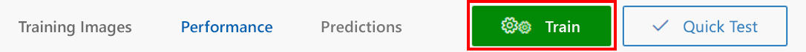
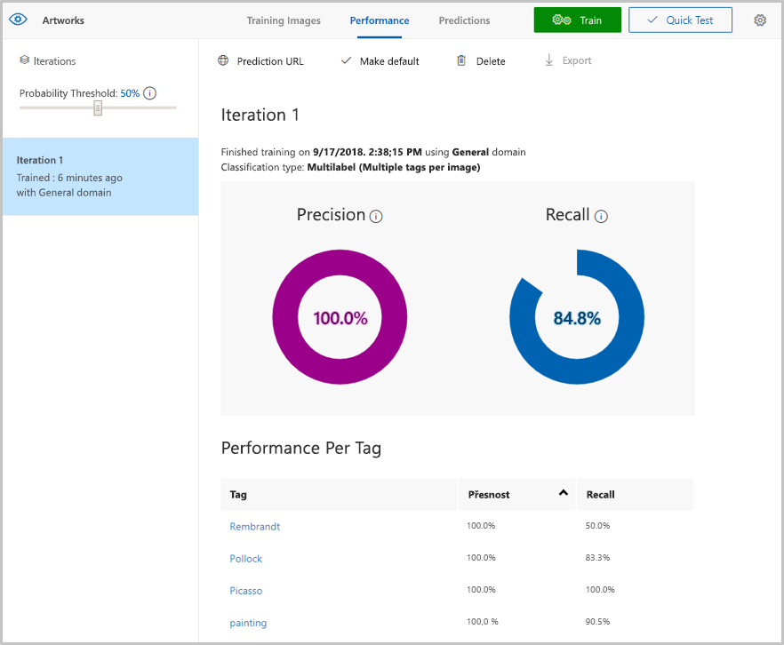

V této lekci budete model trénovat na obrázcích, které jste nahráli a označili v předchozím cvičení. Vytrénovaný model můžete zpřesnit nahráním dalších označených obrázků a následným opakovaným trénováním.

1. Model můžete trénovat kliknutím na tlačítko **Train** (Trénovat) v horní části stránky. Pokaždé, když model trénujete, se vytvoří nová iterace. Služba Custom Vision Service spravuje několik iterací, abyste mohli v průběhu času porovnávat průběh.

    

1. Počkejte, dokud se trénování nedokončí. (Mělo by to trvat jen pár sekund.) Potom zkontrolujte statistiky trénování předložené pro první iteraci. 

    Ve výsledcích se zobrazí dva ukazatele přesnosti modelu, a to **přesnost** a **úplnost**. Předpokládejme, že jsme modelu předložili tři obrazy od Picassa a tři od Van Gogha. Řekněme, že správně určil dvě ukázky Picassa jako obrazy Picassa, ale nesprávně určil dvě ukázky Van Gogha jako Picassovy obrazy. V tomto případě je **přesnost** 50 %, protože model správně identifikoval dva obrazy ze čtyř. Skóre **úplnosti** bude 67 %, protože model správně identifikoval dva ze tří Picassových obrazů.

    

V dalším cvičení otestujeme model portálovou funkcí Quick Test (Rychlý test), která umožňuje do modelu nahrát obrázky a následně se podívat, jak je model na základě znalostí získaných z cvičných obrázků klasifikuje.

> [!TIP]
> Kromě trénování modelu s pomocí uživatelského rozhraní portálu Custom Vision také můžete trénovat voláním metody [TrainProject](https://southcentralus.dev.cognitive.microsoft.com/docs/services/d9a10a4a5f8549599f1ecafc435119fa/operations/58d5835bc8cb231380095bed) [rozhraní API Custom Vision pro trénování](https://southcentralus.dev.cognitive.microsoft.com/docs/services/d9a10a4a5f8549599f1ecafc435119fa/operations/58d5835bc8cb231380095be3).