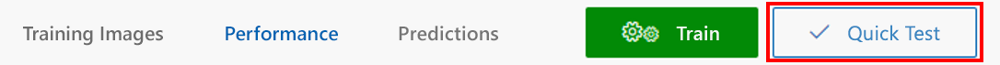
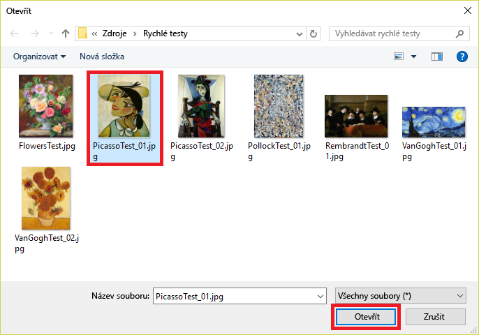
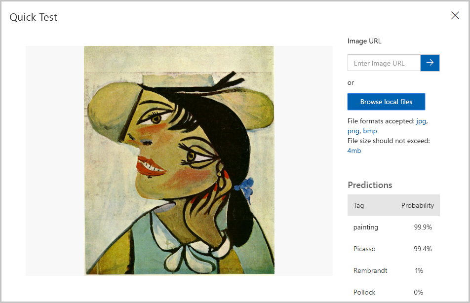
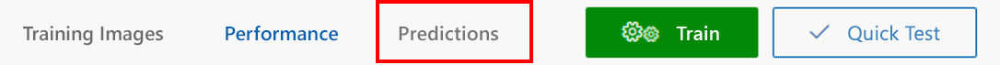
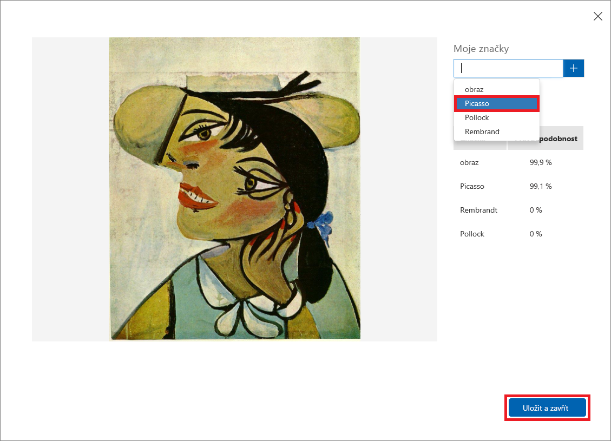

Když máme model natrénovaný, je čas ho otestovat. Nabídneme modelu nové obrázky a uvidíme, jak je oklasifikuje.

1. Nahoře na stránce klikněte na **Quick Test** (Rychlý test).

    

1. Klikněte na **Browse local files** (Procházet místní soubory) a potom přejděte do složky „Quick Tests“ (Rychlé testy) ve složce prostředků k tomuto modulu, kterou jste si stáhli dříve. Vyberte soubor **PicassoTest_01.jpg** a klikněte na možnost **Open** (Otevřít).

    

1. V dialogu Quick Test (Rychlý test) se podrobněji podívejte na výsledky testu. Jaká je pravděpodobnost, že jde o obraz Picassa? Jaká je pravděpodobnost, že jde o obraz Rembrandta nebo Pollocka?

    

1. Zavřete dialogové okno rychlého testu. Potom nahoře na stránce klikněte na **Predictions** (Predikce).

    

1. Klikněte na testovací obrázek, který jste nahráli, a podívejte se na jeho podrobnosti. Potom označte obrázek štítkem Picasso tak, že z rozevírací nabídky vyberete **Picasso** a kliknete na **Save and close** (Uložit a zavřít).

    > Když testovací obrázky tímto způsobem označíte, můžete pak model zpřesnit, aniž byste museli nahrávat další trénovací obrázky.

    

1. Proveďte další rychlý test. Tentokrát použijte soubor s názvem **FlowersTest.jpg**, který je ve složce „Quick Test“. Zkontrolujte, že tento obrázek má nízkou pravděpodobnost, že je od Picassa, Rembrandta nebo Pollocka.

Model je trénovaný a připravený k použití. Zdá se, že dokáže identifikovat obrazy určitých malířů. Pojďme zavolat prediktivní koncový bod přes HTTP a uvidíme, co se stane.