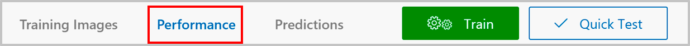
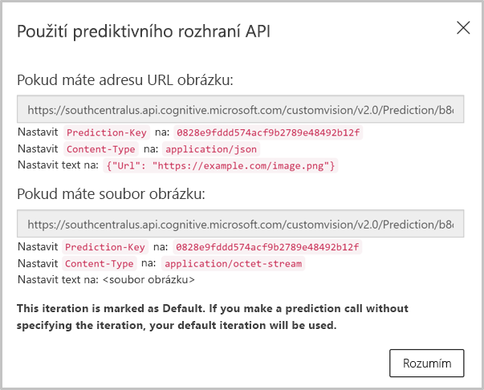
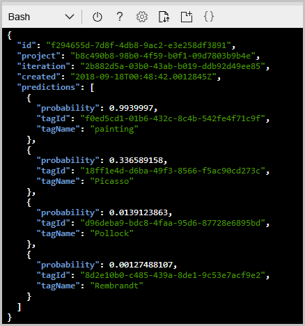

V posledním cvičení jsme náš trénovaný model testovali pomocí funkce **Quick Test** (Rychlý test) z portálu Custom Vision Service. Několika testovacími obrázky můžeme rychle zkontrolovat přesnost modelu. V dalším kroku budeme volat prediktivní koncový bod našeho modelu přes HTTP.

[!include[](../../../includes/azure-sandbox-activate.md)]

1. Vraťte se k projektu **Artworks**\* na portálu Custom Vision Service a vyberte kartu **Performance** (Výkon).

    

1. Vyberte **Make default** (Použít jako výchozí), abyste měli jistotu, že jako výchozí bude použita nejnovější iterace modelu.

1. Vyberte **Prediction URL** (Prediktivní URL). Zobrazí se dialogové okno s informacemi potřebnými k volání. 

    

    V dialogovém okně vidíme, že můžeme volat prediktivní koncový bod a předat mu adresu URL obrázku. Koncovému bodu také můžeme předat nezpracovaný obrázek v textu požadavku.

    Poznamenejte si tři údaje, které jsou v tomto dialogovém okně.
     - **Prediction-Key** (Prediktivní klíč): Tento klíč musí být nastavený jako záhlaví všech požadavků. Tím získáme přístup ke koncovému bodu.
    - **Request URL** (URL požadavku): V dialogovém okně se zobrazují dvě různé adresy URL. Pokud posíláme adresu URL obrázku, použijte první adresu URL, která končí na `/url`. Pokud chceme v textu požadavku poslat nezpracovaný obrázek, použijeme druhou adresu URL, která končí na `/image`.
    - **Content-Type** (Typ obsahu): Pokud posíláme nezpracovaný obrázek, nastavíme text požadavku na binární formu obrázku a typ obsahu na `application/octet-stream`. Pokud posíláme adresu URL obrazu, dáme ji jako kód JSON do textu a nastavíme typ obsahu na `application/json`.
    

3. Zkopírujte první adresu URL a hodnotu `Prediction-Key` z dialogového okna **How to use the Prediction API** (Jak používat prediktivní rozhraní API) a uložte je. 

> [!TIP]
> **cURL** je nástroj příkazového řádku, který se používá k odesílání nebo přijímání souborů. Je součástí systémů Linux, macOS a Windows 10 a dá se stáhnout také pro většinu ostatních operačních systémů. Nástroj cURL podporuje řadu protokolů, mimo jiné HTTP, HTTPS, FTP, FTPS, SFTP, LDAP, TELNET, SMTP nebo POP3. Další informace najdete na následujících odkazech:
>
>- <https://en.wikipedia.org/wiki/CURL>
>- <https://curl.haxx.se/docs/> 
> 
> Nástroj cURL už je nainstalovaný v Azure Cloud Shellu v Sandboxu. V tomto cvičení použijeme cURL k volání našeho koncového bodu přes HTTP.

2. V Azure Cloud Shellu spusťte následující příkaz. Hodnotu **[endpoint-URL]** nahraďte adresou URL, kterou jste si uložili v předchozím kroku. Hodnotu **[Prediction-Key]** nahraďte hodnotou klíče `Prediction-Key`, kterou jste si uložili v předchozím kroku. 

    ```azurecli
    curl [endpoint-URL] \
    -H "Prediction-Key: [Prediction-Key]" \
    -H "Content-Type: application/json" \
    -d "{'url' : 'https://raw.githubusercontent.com/MicrosoftDocs/mslearn-classify-images-with-the-custom-vision-service/master/test-images/VanGoghTest_02.jpg'}" \
    | jq '.'
    ```

    Až příkaz doběhne, zobrazí se podobná odpověď JSON jako na následujícím snímku obrazovky. Rozhraní API vrátí pravděpodobnost každé značky v modelu. Vidíte, že u hodnoty **tagName** `"painting"` se pravděpodobnost blíží 1, takže jde určitě o namalovaný obraz. Ale nejde o obraz žádného z malířů, na které jsme natrénovali náš model. 

     

3. Pokud chcete vyzkoušet další předpovědi, nahraďte adresu URL v textu požadavku výše adresou URL z následující tabulky. 

    |Obrázek  | URL  |
    |---------|---------|
    |     | `https://raw.githubusercontent.com/MicrosoftDocs/mslearn-classify-images-with-the-custom-vision-service/master/test-images/PicassoTest_02.jpg`        |
    |     |  `https://raw.githubusercontent.com/MicrosoftDocs/mslearn-classify-images-with-the-custom-vision-service/master/test-images/RembrandtTest_01.jpg`       |
    |  |   `https://raw.githubusercontent.com/MicrosoftDocs/mslearn-classify-images-with-the-custom-vision-service/master/test-images/PollockTest_01.jpg`     |
   

Náš prediktivní koncový bod funguje podle očekávání. Volání rozhraní API je stejně jednoduché jako poslání požadavku HTTP koncovému bodu s prediktivním klíčem a adresou URL obrázku.
