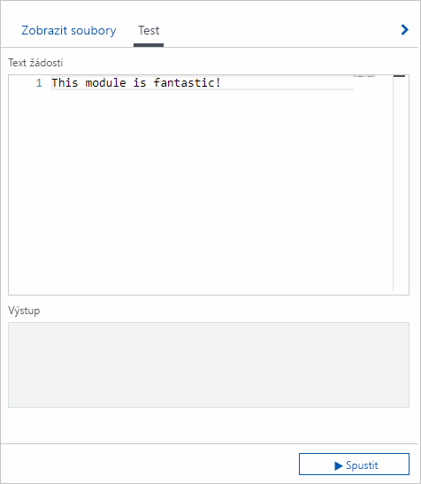
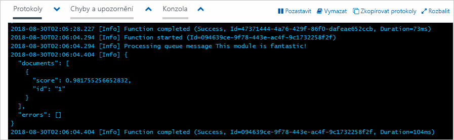
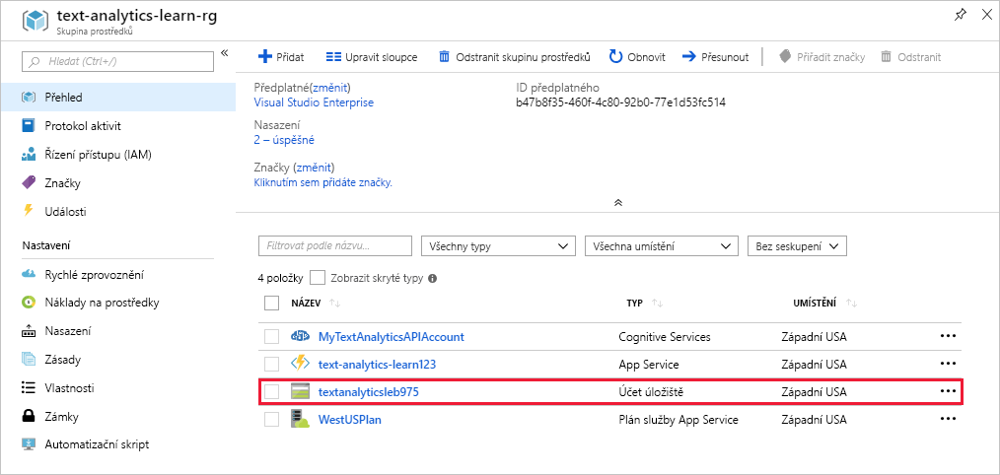
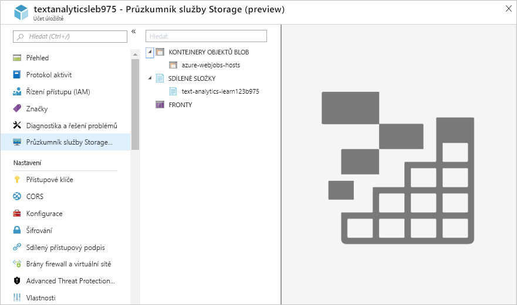
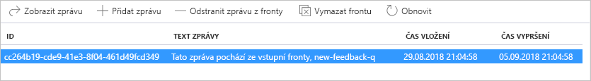
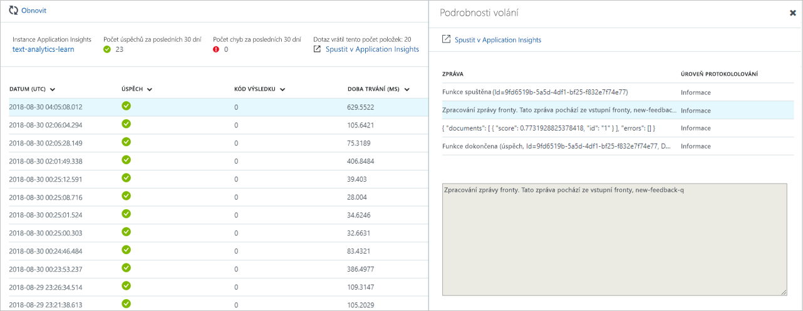

Aktualizujme implementaci naší funkce, která volá službu rozhraní API pro analýzu textu a vrací skóre mínění.

1. Na portálu v naší aplikaci funkcí vyberte naši funkci [!INCLUDE [func-name-discover](./func-name-discover.md)].

1. V pravé části obrazovky rozbalte nabídku **Zobrazit soubory**.

1. Na kartě **Zobrazit soubory** vyberte **index.js** a otevřete soubor s kódem v editoru.

1. Nahraďte celý obsah souboru **index.js** následujícím JavaScriptem a zvolte **Uložit**.

    [!code-javascript]

1. V kódu, který jste vložili, aktualizujte hodnotu `accessKey` přístupovým klíčem pro rozhraní API pro analýzu textu, který jste uložili dříve v tomto modulu. 

1. Aktualizujte hodnotu `uri` na oblast, ke které máte přístupový klíč.

Pojďme se podívat, co se v kódu děje:

- Pro každé volání služby pro analýzu textu je nutný přístupový klíč, který přidáme jako hlavičku `Ocp-Apim-Subscription-Key`. 
- Při každém volání se volá koncový bod specifický pro danou oblast, který je v našem kódu definován identifikátorem `uri`.
- Na konci souboru s kódem jsme definovali pole `documents`. Toto pole představuje datovou část, kterou pošleme službě Analýza textu.
- Pole `documents` má v tomto případě jenom jednu položku, a to zprávu z fronty, která aktivovala naši funkci. I když máme v poli jen jeden dokument, neznamená to, že řešení pracuje vždy jen s jednou zprávou. Modul runtime Azure Functions načítá a zpracovává zprávy v dávkách, kdy *současně* volá několik instancí naší funkce. V současnosti má dávka výchozí velikost 16 a maximální velikost 32.
- Hodnota `id` musí být v rámci pole jedinečná. Vlastnost `language` určuje jazyk textu dokumentu.
- Pak zavoláme naši metodu `get_sentiments`, která použije modul HTTPS k volání rozhraní API pro analýzu textu. Všimněte si, že klíč předplatného (přístupový klíč) předáváme v hlavičce každé žádosti.
- Když služba vrátí odpověď, zavoláme naši funkci `response_handler` a zapíšeme odpověď na konzolu pomocí `context.log`.

## Vyzkoušení

Než se podíváme na zařazení do front, pojďme otestovat spuštění funkce, kterou už máme.

1. V oblasti Function Apps na portálu vyberte naši funkci [!INCLUDE [func-name-discover](./func-name-discover.md)] a klikněte na nabídku pro **testování** úplně vpravo.

1. Vyberte položku nabídky pro **testování** a zkontrolujte, jestli máte otevřený testovací panel.

1. Do textu žádosti přidejte textový řetězec podle následujícího snímku obrazovky.

    

1.  Dole na testovacím panelu klikněte na **Spustit**.

1. Přesvědčte se, že v levém dolním rohu hlavní obrazovky je v editoru kódu rozbalená karta **Protokoly**.

1. Ověřte, že na kartě **Protokoly** jsou zobrazené informace z protokolu, které funkce dokončila. V okně se také zobrazí odpověď získaná voláním rozhraní API pro analýzu textu.

    

Blahopřejeme! Funkce [!INCLUDE [func-name-discover](./func-name-discover.md)] pracuje, jak jsme ji navrhli. V tomto příkladu jsme předali optimistickou zprávu, která získala skóre přes 0,98. Zkuste zprávu změnit, aby nebyla tak optimistická, a pak znovu spusťte test a sledujte odpověď.

## Přidání zprávy do fronty

Pojďme zopakovat test. Tentokrát nepoužijeme testovací okno na portálu, ale zprávu skutečně dáme do vstupní fronty a budeme sledovat, co se stane.

1. Na portálu v části **Skupiny prostředků** přejděte ke své skupině prostředků.

1. Vyberte <rgn>[název skupiny prostředků Sandboxu]</rgn> – skupina prostředků použitá v této lekci.

1. Otevře se panel **Skupina prostředků**. Najděte položku Účet úložiště a vyberte ji.

    

1. V hlavním okně Účet úložiště vyberte v nabídce vlevo **Průzkumník služby Storage (preview)**. Touto akcí otevřete v portálu Průzkumníka služby Azure Storage. 

    

    Jak vidíte, nemáme zatím v tomto účtu úložiště žádné fronty, takže pojďme nějakou přidat.

1. Možná si ještě pamatujete, že jsme v předchozí části této lekce pojmenovali frontu přidruženou k naší aktivační události **new-feedback-q**. V Průzkumníkovi služby Storage klikněte pravým tlačítkem na položku **Fronty** a vyberte *Vytvořit frontu*.

1. V dialogovém okně, které se otevře, zadejte **new-feedback-q** a klikněte na **OK**. Teď máme naši vstupní frontu.

1. V nabídce vlevo vyberte novou frontu. Zobrazí se průzkumník dat této fronty. Podle očekávání je fronta prázdná. Pojďme do fronty přidat zprávu příkazem **Přidat zprávu**, který je nahoře v okně.

1. V dialogovém okně **Přidat zprávu** zadejte do pole **Text zprávy** text „Tato zpráva přišla ze vstupní fronty new-feedback-q“ a dole v dialogovém okně klikněte na **OK**.

1. V průzkumníkovi dat si všimněte zprávy, která je podobná jako na následujícím snímku obrazovky.
    

1. Po několika sekundách klikněte na **Aktualizovat**, aby se zobrazení fronty aktualizovalo. Všimněte si, že fronta je zase **prázdná**. Nějaká funkce musela zprávu ve frontě přečíst.

1. Přejděte zpět k naší funkci na portálu a otevřete kartu **Sledovat**. V seznamu vyberte nejnovější zprávu. Všimněte si, že zprávu ve frontě zpracovala naše funkce, kterou jsme přidali do fronty new-feedback-q. Výsledky se můžou v tomto protokolu zobrazovat se zpožděním, takže možná budete muset pár minut počkat a pak kliknout na *Aktualizovat*.

    

    V tomto testu jsme zveřejnili zprávu ve frontě a pak jsme sledovali její zpracování naší funkcí.

V našem řešení jsme pokročili o kus dál. A naše funkce teď plní užitečný úkol. Přijímá text ze vstupní fronty a následně volá službu rozhraní API pro analýzu textu, aby získala skóre mínění. Také jsme se naučili, jak funkci otestovat na webu Azure Portal a v Průzkumníkovi služby Azure Storage. V dalším cvičení si ukážeme, jak jednoduše používat výstupní vazby k zápisu do front.