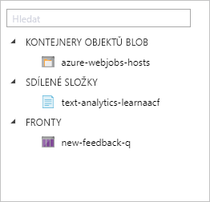
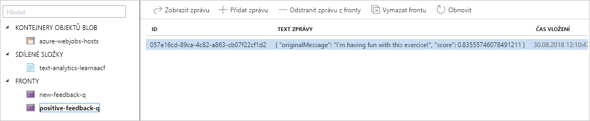
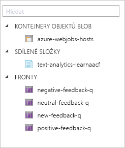

Podívejme se na naši architekturu řešení znovu.

Jak je vidět na pravé straně tohoto diagramu, chceme odeslat zprávy do třech front. Tato připojení nadefinujeme v naší funkci jako výstupní vazby. Tyto vazby bychom mohli vytvořit v uživatelském rozhraní pro **výstupní vazby**. Kvůli úspoře času ale rovnou upravíme konfigurační soubor.

## Přidání výstupní vazby function.json

1. Na portálu Aplikace funkcí vyberte naši funkci [!INCLUDE [func-name-discover](./func-name-discover.md)].

1. V pravé části obrazovky rozbalte nabídku **Zobrazit soubory**.

1. Na kartě **Zobrazit soubory** vyberte **function.json**. Konfigurační soubor se otevře v editoru.

1. Nahraďte celý obsah **function.json** pomocí následujícího formátu JSON a vyberte **Uložit**.

[!code-json]

Do konfigurace jsme přidali tři nové vazby.

- Všechny nové vazby jsou typu `queue`. Tyto vazby použijeme pro tři fronty, které budeme plnit zprávami s názory uživatelů, jakmile zjistíme charakter zpětné vazby.
- Každá vazba má definovaný směr `out`, protože do těchto front budeme odesílat zprávy.
- Každá vazba používá stejné připojení k našemu účtu úložiště.
- Každá vazba má jedinečné hodnoty `queueName` a `name`.

Odeslání zprávy do fronty je jednoduché. Použijte například tento příkaz: `context.bindings.negativeFeedbackQueueItem = "<message>"`.

## Aktualizace implementace funkce kvůli řazení názorů do front na základě skóre mínění

Úkolem naší funkce na třídění názorů je zatřídit názor do jednoho ze tří kontejnerů: kladný, neutrální nebo záporný. Zatím máme vstupní frontu, kód pro volání rozhraní API pro analýzu textu a definovali jsme naše výstupní fronty. V této části přidáme logiku, která přesune zprávy do těchto front podle jejich charakteru.

1. Přejděte k naší funkci [!INCLUDE [func-name-discover](./func-name-discover.md)] a v editoru kódu znovu otevřete `index.js`.

1. Nahraďte implementaci následujícím kódem.

[!code-javascript]

Do naší implementaci jsme přidali zvýrazněný kód. Tento kód parsuje odpověď kognitivní služby v rozhraní API pro analýzu textu. Na základě skóre mínění se zpráva přepošle do jedné z našich tří výstupních front. Kód, který zprávu publikuje, jenom nastaví správný parametr vazby.

## Vyzkoušejte si to.

K otestování aktualizované implementace se potřebujeme vrátit do Průzkumníku služby Azure Storage.

1. Na portálu v části **Skupiny prostředků** přejděte ke své skupině prostředků.

1. Jako skupinu prostředků použitou v této lekci vyberte <rgn>[název skupiny prostředků Sandboxu]</rgn>.

1. V otevřeném panelu **Skupina prostředků** najděte položku Účet úložiště a vyberte ji.
    

1. V hlavním okně Účet úložiště vyberte v nabídce vlevo **Průzkumník služby Storage (Preview)**. Touto akcí otevřete v portálu Průzkumník služby Microsoft Azure Storage.

    

    V kolekci **Fronty** je jedna fronta. Jde o vstupní frontu [!INCLUDE [input-q](./q-name-input.md)], kterou jsme definovali v předchozí testovací části modulu.        

1. V nabídce vlevo vyberte [!INCLUDE [input-q](./q-name-input.md)]. Zobrazí se průzkumník dat této fronty. Podle očekávání ve frontě nejsou žádná data. Pojďme do fronty přidat zprávu příkazem **Přidat zprávu**, který je nahoře v okně.

1. V dialogovém okně **Přidat zprávu** zadejte zprávu „Tohle cvičení mě baví!“ do pole **Text zprávy** a dole v okně klikněte na **OK**.

1. Zpráva se zobrazí v datovém okně fronty [!INCLUDE [input-q](./q-name-input.md)]. Po několika sekundách klikněte nahoře v zobrazení dat na **Aktualizovat**, aby se zobrazení fronty aktualizovalo. Všimněte si, že zpráva po chvíli zmizí. Kam se poděla?

1. V nabídce vlevo klikněte na kolekci **FRONTY**. Všimněte si, že se objevila *nová* fronta.
    

    Fronta [!INCLUDE [positive-q](./q-name-positive.md)] se vytvořila automaticky, když do ní byla zveřejněna první zpráva. Když v Azure Functions použijete výstupní vazby fronty, nemusíte ručně vytvářet výstupní frontu, abyste do ní mohli publikovat. Viděli jste, že příchozí zpráva byla funkcí zařazena do fronty [!INCLUDE [positive-q](./q-name-positive.md)]. Pojďme se podívat, v jaké frontě skončí další zprávy.    

1. Stejným postupem přidejte do fronty [!INCLUDE [input-q](./q-name-input.md)] následující zprávy.

    - „Nesnáším brokolici!“
    - „Microsoft je společnost“

1. Klikněte na **Aktualizovat**, až bude fronta [!INCLUDE [input-q](./q-name-input.md)] znovu prázdná. Tento postup může chvilku trvat a bude vyžadovat několik aktualizací.

1. Klikněte pravým tlačítkem na kolekci **FRONTY** a všimněte si dalších dvou zobrazených front. Tyto fronty se jmenují [!INCLUDE [neutral-q](./q-name-neutral.md)] a [!INCLUDE [negative-q](./q-name-negative.md)]. Může to trvat i několik sekund. Dál aktualizujte kolekci **FRONTY**, až se zobrazí nové fronty. Konečný seznam front by měl vypadat jako na následujícím obrázku.

    

1. Klikněte na každou frontu v seznamu a podívejte se, jestli jsou v ní zprávy. Pokud jste přidali navrhované zprávy, měla by se ve frontách [!INCLUDE [positive-q](./q-name-positive.md)], [!INCLUDE [neutral-q](./q-name-neutral.md)] a [!INCLUDE [negative-q](./q-name-negative.md)] zobrazit jedna zpráva.

Blahopřejeme! Máte funkční třídičku názorů. Po příchodu zpráv do vstupní fronty naše funkce použije službu rozhraní API pro analýzu textu k získání skóre mínění. Na základě tohoto skóre funkce přesměruje zprávy do příslušné fronty. Vypadá to, že funkce zpracovává vždy jen jednu položku ve frontě, ale modul runtime Azure Functions ve skutečnosti načítá dávky položek ve frontě a spouští další instance naší funkce, aby je zpracoval souběžně.