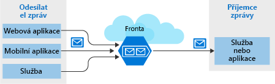
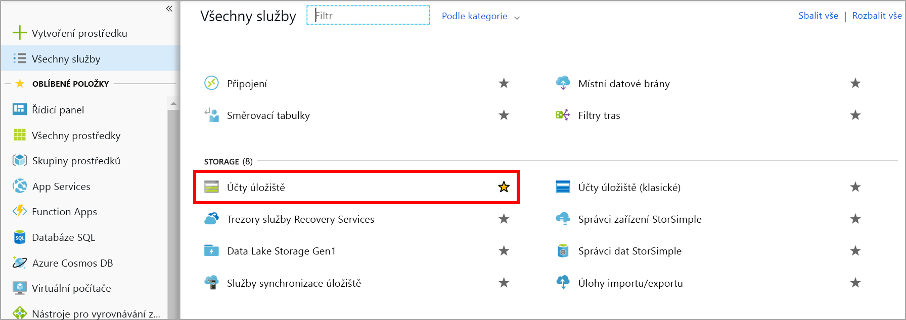
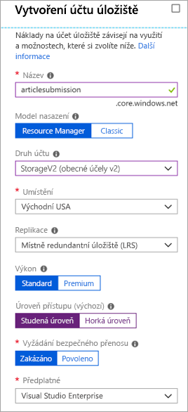

Přímá komunikace mezi komponentami distribuované aplikace může být problematická, protože může být při nízké šířce pásma sítě nebo při vysokém zatížení přerušena.

Setkali jsme se s tím u našeho vlastního systému: webový portál volá webovou službu, což funguje skvěle v případě, že služba reaguje včas. Vysoký provoz způsobuje problémy, takže byste měli využít frontu a odstranit tak přímé propojení mezi front-endovými aplikacemi a webovou službou střední vrstvy.

## <a name="what-is-azure-queue-storage"></a>Co je Azure Queue Storage?

Azure Queue Storage je služba Azure, která implementuje fronty založené na cloudu. Každá fronta udržuje seznam zpráv. Komponenty aplikace přistupují k frontě pomocí rozhraní REST API nebo pomocí klientské knihovny Azure. Obvykle budete mít jednu nebo více komponent _odesílatele_ a jednu nebo více komponent _příjemce_. Komponenty odesílatele přidají zprávy do fronty. Komponenty příjemce načtou zprávy ze začátku fronty za účelem zpracování. Následující obrázek ukazuje několik aplikací odesílatele, které přidávají zprávy do fronty Azure, a jednu aplikaci příjemce, která zprávy načítá.



Ceny závisí na velikosti fronty a počtu operací. Větší fronty zpráv stojí více než ty menší. Účtují se také poplatky za jednotlivé operace, jako je například přidání nebo odstranění zprávy. Podrobnosti o cenách najdete v tématu [Ceny za službu Azure Queue Storage](https://azure.microsoft.com/pricing/details/storage/queues/).

## <a name="why-use-queues"></a>Proč používat fronty?

Fronta zvyšuje odolnost dočasným ukládáním čekajících zpráv. V době malého nebo normálního zatížení zůstává velikost fronty malá, protože cílová komponenta odebírá zprávy z fronty rychleji, než jaká je rychlost, kterou se zprávy přidávají. V době vysokého zatížení se může velikost fronty zvětšit, ale zprávy se neztratí. Cílová komponenta dokáže v okamžiku, kdy se zatížení vrátí do normálu, zpoždění zpracování dohnat a frontu vyprázdnit.

Jedna fronta může mít velikost až **500 TB**, takže dokáže potenciálně pojmout _miliony_ zpráv. Cílová propustnost jedné fronty je 2 000 zpráv za sekundu. Fronty tak dokážou zvládat i opravdu velký nápor.

Fronty umožňují vaší aplikaci využívat škálování, a to automaticky a okamžitě při změně zatížení. Je proto velmi užitečné je používat pro důležitá obchodní data, jejichž ztráta by mohla firmu poškodit. Azure nabízí mnoho služeb, které se škálují automaticky. Například pro škálovací sady virtuálních počítačů Azure, cloudové služby, plány služby App Service a pro App Service Environment je dostupná funkce **automatického škálování**. Ta vám umožní definovat pravidla, pomocí kterých dokáže Azure identifikovat období s vysokým zatížením a automaticky přidat kapacitu bez zásahu správce. Automatické škálování reaguje na aktuální zatížení rychle, ale ne hned. Azure Queue Storage naopak na vysoké zatížení reaguje okamžitě, a to ukládáním zpráv do doby, než budou k dispozici prostředky pro zpracování.

## <a name="what-is-a-message"></a>Co je zpráva?

Zpráva ve frontě je bajtové pole až do velikosti 64 kB. Obsah zprávy není žádnou komponentou Azure nikdy nijak interpretován.

Pokud chcete vytvořit strukturovanou zprávu, můžete obsah zprávy naformátovat pomocí XML nebo JSON. Za vygenerování a interpretování vašeho vlastního formátu je zodpovědný váš kód. Mohli byste například vytvořit vlastní zprávu JSON, která bude vypadat nějak takto:

```json
{
    "Message": {
        "To": "news@contoso.com",
        "From": "writer@contoso.com",
        "Subject": "Support request",
        "Body": "Send me a photographer!"
    }
}
```

## <a name="creating-a-storage-account"></a>Vytváření účtu úložiště

Fronta musí být součástí účtu úložiště. Účet úložiště můžete vytvořit pomocí Azure CLI (nebo PowerShellu) nebo webu Azure Portal. Na portálu je to nejjednodušší, protože poskytuje průvodce a zobrazuje výzvy k zadání požadovaných informací. 

Následující snímek obrazovky ukazuje umístění kategorie Účty úložiště.



Při vytváření účtu můžete zadat několik možností. Pro většinu z nich můžete použít výchozí výběr. Tyto možnosti jsme probírali v předchozím modulu, ale u každé možnosti můžete najet myší na tip `(i)` a připomenout si, co dělá. Tady je příklad vyplnění okna portálu.

Následující snímek obrazovky ukazuje okno Vytvoření účtu úložiště a informace potřebné k vytvoření účtu úložiště.



### <a name="settings-for-queues"></a>Nastavení pro fronty
Při vytváření účtu úložiště, který bude obsahovat fronty, byste měli zvážit následující nastavení:

- Fronty jsou k dispozici pouze jako součást účtů úložiště Azure pro obecné účely (v1 nebo v2). Nemůžete je přidat do účtů úložiště objektů blob.
- Nastavení **Úroveň přístupu**, které je k dispozici pro účty úložiště v2, platí pouze pro úložiště objektů blob a na fronty nemá žádný vliv.
- Měli byste zvolit umístění, které je blízko buď ke zdrojové, nebo k cílové komponentě (nebo pokud možno k oběma).
- Data se vždy replikují na více serverů, aby se zajistila ochrana před selháním disků a dalšími problémy s hardwarem. Máte možnost volby strategie replikace: **Místně redundantní úložiště (LRS)** je finančně nenáročné, ale zranitelné v případě katastrofických scénářů, které mají dopad na celé datacentrum, zatímco **geograficky redundantní úložiště (GRS)** replikuje data do dalších datacenter Azure. Zvolte strategii replikace, která splňuje vaše požadavky na redundanci.
- Úroveň výkonu určuje, jak se zprávy ukládají: Na úrovni **Standard** se používají magnetické jednotky, zatímco na úrovni **Premium** disky SSD (solid-state drive). Pokud očekáváte, že budou špičky v zatížení pouze krátkodobé, zvolte úroveň Standard. Úroveň Premium doporučujeme zvažovat, pokud se občas stává, že fronta výrazněji naroste a musíte minimalizovat dobu, za kterou budou zprávy dostupné.
- Pokud mohou být přes frontu předávány zprávy s citlivými informacemi, vyžadujte zabezpečený přenos. Toto nastavení zajistí, že všechna připojení k frontě budou šifrována pomocí protokolu SSL (Secure Sockets Layer).