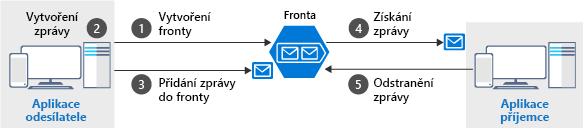

Fronty uchovávají zprávy – pakety dat ve formátu, který zná aplikace odesílatele i příjemce. Odesílatel vytvoří frontu a přidá zprávu. Příjemce zprávu načte a zpracuje a pak ji z fronty odstraní. Následující obrázek ukazuje obvyklý tok tohoto procesu.



Všimněte si, že získání (`get`) a odstranění (`delete`) jsou samostatné operace. Toto uspořádání umožňuje ošetřit potenciální chyby na straně příjemce a implementuje koncept, kterému se říká _doručení „aspoň jednou“_. Po tom, co příjemce dostane zprávu, zůstane zpráva ve frontě, ale je po dobu 30 sekund neviditelná. Pokud tak na straně příjemce dojde při zpracovávání k chybovému ukončení nebo výpadku napájení, nebude zpráva nikdy odstraněna z fronty. Po 30 sekundách se zpráva zase zobrazí ve frontě a může ji zpracovat a dokončit jiná instance příjemce.

## <a name="the-azure-storage-client-library-for-net"></a>Klientská knihovna Azure Storage pro .NET

**Klientská knihovna Azure Storage pro .NET** poskytuje typy představující jednotlivé objekty, se kterými potřebujete komunikovat:

- `CloudStorageAccount` představuje váš účet úložiště Azure.
- `CloudQueueClient` představuje službu Azure Queue Storage.
- `CloudQueue` představuje jednu z vašich instancí fronty.
- `CloudQueueMessage` představuje zprávu.

Tyto třídy budete používat k získání programového přístupu k vaší frontě. Knihovna obsahuje jak synchronní, tak asynchronní metody. Radši byste měli používat asynchronní verze, abyste zabránili blokování klientské aplikace.

> [!NOTE]
> Klientská knihovna Azure Storage pro .NET je k dispozici v balíčku NuGet **WindowsAzure.Storage**. Můžete ho nainstalovat prostřednictvím integrovaného vývojového prostředí (IDE), Azure CLI nebo pomocí rutiny PowerShellu `Install-Package WindowsAzure.Storage`.

## <a name="how-to-connect-to-a-queue"></a>Jak se připojit k frontě

Pokud se chcete připojit k frontě, je potřeba nejprve vytvořit objekt `CloudStorageAccount` s vaším připojovacím řetězcem. Výsledný objekt pak může vytvořit objekt `CloudQueueClient`, který pak zase může otevřít instanci objektu `CloudQueue`. Základní tok kódu je uvedený níže.

```csharp
CloudStorageAccount account = CloudStorageAccount.Parse(connectionString);

CloudQueueClient client = account.CreateCloudQueueClient();

CloudQueue queue = client.GetQueueReference("myqueue");
```

Vytvoření objektu `CloudQueue` nemusí nutně znamenat, že existuje _skutečná_ fronta úložiště. Pomocí tohoto objektu však můžete vytvořit, odstranit a vyhledat existující frontu. Jak je uvedeno výše, všechny metody podporují synchronní i asynchronní verze, ale my budete používat pouze asynchronní verze založené na objektu `Task`.

## <a name="how-to-create-a-queue"></a>Jak vytvořit frontu

Frontu vytvoříte běžným způsobem: Vytváření fronty by vždy měla zajišťovat aplikace odesílatele. Díky tomu bude vaše aplikace samostatnější a méně závislá na nastavování správcem. 

Pro zjednodušení vytváření poskytuje klientská knihovna metodu `CreateIfNotExistsAsync`, která v případě potřeby vytvoří frontu, nebo vrátí hodnotu `false`, pokud již fronta existuje. 

Níže vidíte typický příklad kódu.

```csharp
CloudQueue queue;
//...

await queue.CreateIfNotExistsAsync();
```

> [!NOTE]
> Abyste mohli používat toto rozhraní API, musíte mít k účtu úložiště oprávnění `Write` nebo `Create`. To bude platit vždy, když použijete model zabezpečení **Přístupový klíč**. U ostatních přístupů však můžete oprávnění k účtu uzamknout a povolit pouze operace čtení z fronty.

## <a name="how-to-send-a-message"></a>Jak odeslat zprávu

Pro odeslání zprávy vytvoříte instanci objektu `CloudQueueMessage`. Třída má několik přetížených konstruktorů, které načítají data do zprávy. Použijeme konstruktor, který dokáže zpracovat řetězec `string`. Po vytvoření zprávy pak zprávu pomocí objektu `CloudQueue` odešlete.

Tady je typický příklad:

```csharp
var message = new CloudQueueMessage("your message here");

CloudQueue queue;
//...

await queue.AddMessageAsync(message);
```

> [!NOTE]
> Přestože celková velikost fronty může být až 500 TB, jednotlivé zprávy ve frontě můžou mít maximální velikost 64 kB (48 kB při použití šifrování Base64). Pokud potřebujete větší datovou část, můžete zkombinovat fronty a objekty blob a předávat ve zprávě adresu URL ke skutečným datům (uloženým jako objekt blob). Tento přístup vám umožní zařazovat do fronty položky o velikosti až 200 GB.

## <a name="how-to-receive-and-delete-a-message"></a>Jak zprávu přijmout a odstranit

V rámci příjemce dostanete další zprávu, zpracujete ji a po úspěšném zpracování ji odstraníte. Tady je jednoduchý příklad:

```C#
CloudQueue queue;
//...

CloudQueueMessage message = await queue.GetMessageAsync();

if (message != null)
{
    // Process the message
    //...

    await queue.DeleteMessageAsync(message);
}
```

Pojďme tyto nové znalosti využít v naší aplikaci.