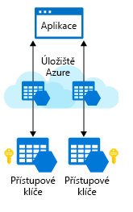

Do aplikace jste přidali požadované klientské knihovny a jste připravení se připojit ke svému účtu úložiště Azure.

Pro práci s daty v účtu úložiště bude vaše aplikace potřebovat dva údaje:

1. Přístupový klíč
1. Koncový bod rozhraní REST API

## <a name="security-access-keys"></a>Přístupové klíče zabezpečení

Každý účet úložiště má dva jedinečné _přístupové klíče_, které slouží k jeho zabezpečení. Pokud se vaše aplikace potřebuje připojit k více účtům úložiště, bude vyžadovat přístupový klíč ke každému z nich.



## <a name="rest-api-endpoint"></a>Koncový bod rozhraní REST API

Aplikace bude kromě přístupových klíčů pro ověření účtů úložiště potřebovat znát i koncové body služby úložiště, do kterých má odesílat požadavky REST. 

Koncový bod REST je kombinací _názvu_ vašeho účtu úložiště, datového typu a známé domény. Příklad:

| Datový typ | Příklad koncového bodu |
|-----------|------------------|
| Objekty blob     | `https://[name].blob.core.windows.net/` |
| Fronty    | `https://[name].queue.core.windows.net/` |
| Tabulka     | `https://[name].table.core.windows.net/` |
| Soubory     | `https://[name].file.core.windows.net/` |

Pokud máte na Azure navázanou vlastní doménu, můžete pro koncový bod vytvořit také adresu URL vlastní domény.

## <a name="connection-strings"></a>Připojovací řetězce

Nejjednodušší způsob, jak zpracovat přístupové klíče a adresy URL koncových bodů v rámci aplikací, je použít **připojovací řetězce k účtu úložiště**. Připojovací řetězec obsahuje všechny potřebné informace o připojení v jediném textovém řetězci.

Připojovací řetězce Azure Storage vypadají podobně jako v příkladu níže, ale mají název přístupového klíče a účtu konkrétního účtu úložiště:

```
DefaultEndpointsProtocol=https;AccountName={your-storage};
   AccountKey={your-access-key};
   EndpointSuffix=core.windows.net
```

## <a name="security"></a>Zabezpečení

Přístupové klíče jsou důležité k zajištění přístupu k účtu úložiště, a proto byste je neměli dávat žádnému systému ani osobě, kterým nechcete k účtu úložiště umožnit přístup. Přístupové klíče jsou obdobou uživatelského jména a hesla k vašemu počítači.

Obvykle se informace o připojení k účtu úložiště ukládají do proměnné prostředí, databáze nebo konfiguračního souboru.

> [!IMPORTANT]
> Je důležité si uvědomit, že ukládání těchto informací do konfiguračního souboru může být nebezpečné, pokud tento soubor zahrnete do správy zdrojového kódu a uložíte ho do veřejného úložiště. Tato běžná chyba znamená, že si v tomto veřejném úložišti může kdokoli procházet váš zdrojový kód a zobrazit si informace o připojení k účtu úložiště.

Každý účet úložiště má dva přístupové klíče. Je to součást osvědčeného postupu zabezpečení, aby bylo možné klíče pravidelně obměňovat (znovu generovat) a účet úložiště zůstal zabezpečený. Můžete to provést z webu Azure Portal nebo v nástroji příkazového řádku pro Azure CLI nebo PowerShell.

Obměnění klíče okamžitě zruší platnost původní hodnoty klíče a odvolá přístup komukoli, kdo klíč získal neoprávněně. Díky podpoře pro dva klíče můžete klíče obměňovat, aniž by to způsobilo výpadek v aplikacích, které je používají. Aplikace může používat alternativní přístupový klíč, zatímco se druhý klíč znovu generuje. Pokud máte více aplikací, které používají stejný účet úložiště, měly by všechny používat stejný klíč, abyste o podporu této techniky nepřišli. Tady je základní myšlenka:

1. Aktualizujte připojovací řetězce v kódu aplikace tak, aby odkazovaly na sekundární přístupový klíč účtu úložiště.
2. Pomocí webu Azure Portal nebo nástroje příkazového řádku znovu vygenerujte primární přístupový klíč pro váš účet úložiště.
3. Aktualizujte připojovací řetězce v kódu tak, aby odkazovaly na nový primární přístupový klíč.
4. Stejným způsobem pak znovu vygenerujte sekundární přístupový klíč.

> [!TIP]
> Důrazně doporučujeme pravidelně obměňovat přístupové klíče, abyste zajistili, že zůstanou privátní – stejně jako měníte svá hesla. Pokud klíč používáte v serverové aplikaci, můžete k jeho uložení použít službu **Azure Key Vault**. Služba Key Vault zahrnuje podporu přímé synchronizace klíčů do účtu úložiště a pravidelné automatické obměny klíčů. Použitím služby Key Vault získáte další vrstvu zabezpečení, takže vaše aplikace nebude nikdy muset pracovat přímo s přístupovým klíčem.

### <a name="shared-access-signatures-sas"></a>Sdílené přístupové podpisy (SAS)

Přístupové klíče představují nejjednodušší způsob ověření přístupu k účtu úložiště. Umožňují ale, podobně jako kořenové heslo v počítači, úplný přístup k jakékoliv položce v účtu úložiště.

Účty úložiště nabízí samostatný mechanismus ověřování, který se nazývá _sdílený přístupový podpis (SAS)_ a podporuje vypršení platnosti a omezení oprávnění tam, kde potřebujete udělit omezený přístup. Tento přístup byste měli použít v případě, že ostatním uživatelům umožňujete číst a zapisovat data do vašeho účtu úložiště. Na konci tohoto modulu najdete odkazy na naši dokumentaci věnovanou tomuto pokročilému tématu.
