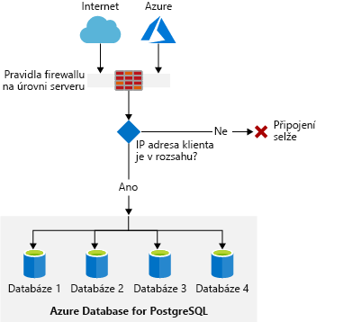
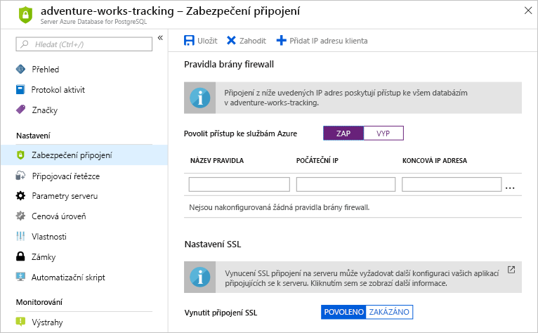

Předpokládejme, že používáte místní databázi PostgreSQL. Spravujete všechny aspekty zabezpečení a zamkli jste veškerý přístup k vašim serverům pomocí standardních pravidel brány firewall na úrovni serveru PostgreSQL. Teď chcete zajistit, abyste mohli stejná pravidla brány firewall na úrovni serveru nakonfigurovat v Azure.

## <a name="server-security-considerations-and-connection-methods"></a>Aspekty zabezpečení serveru a metody připojení

Pokud chcete omezit přístup k serveru a databázím ve službě Azure Database for PostgreSQL, máte řadu možností, jak to udělat. Přístup k síti je možné omezit na úrovni databáze, serveru nebo sítě. Můžete použít libovolnou z následujících možností:

- Uživatelské účty k omezení přístupu k databázi
- Virtuální sítě k omezení síťového přístupu
- Pravidla brány firewall k omezení přístupu k serveru

### <a name="authentication-and-authorization"></a>Ověřování a autorizace

Server Azure Database for PostgreSQL podporuje nativní ověřování PostgreSQL. Můžete se připojit a ověřit na serveru přihlašovacími údaji správce serveru. Vytvoříte také uživatele, kteří se připojí ke konkrétním databázím, a tím omezíte přístup.

### <a name="what-is-a-virtual-network"></a>Co je virtuální síť?

Virtuální síť je logicky izolovaná síť vytvořená v rámci sítě Azure. Virtuální síť můžete použít k řízení toho, které prostředky Azure se mohou připojovat k jiným prostředkům.

Představte si, že máte webovou aplikaci, která se připojuje k databázi. K izolování různých částí sítě budete používat podsítě. Podsíť je část sítě založená na rozsahu IP adres.

Abyste mohli tyto podsítě konfigurovat, vytvoříte virtuální síť a tuto síť pak rozdělíte do podsítí. Webová aplikace bude fungovat v jedné z podsítí a databáze v jiné. Každá podsíť bude mít vlastní pravidla pro odchozí i příchozí komunikaci s jinou sítí. Tato pravidla vám umožní omezit přístup z databáze do webové aplikace.

### <a name="what-is-a-firewall"></a>Co je brána firewall?

Brána firewall je služba, která uděluje přístup k serveru v závislosti na zdrojové IP adrese každé žádosti. Vy vytvoříte pravidla brány firewall určující rozsahy IP adres. Jenom klienti z těchto IP adres s uděleným přístupem budou moct získat přístup k serveru. Pravidla brány firewall obecně obsahují také konkrétní síťový protokol a informace o portu. Například server PostgreSQL ve výchozím nastavení naslouchá žádostem TCP na portu 5432.

### <a name="azure-database-for-postgresql-server-firewall"></a>Brána firewall serveru Azure Database for PostgreSQL

Brána firewall serveru Azure Database for PostgreSQL brání veškerému přístupu k vašemu databázovému serveru, dokud neurčíte, které počítače k tomu mají oprávnění. Konfigurace brány firewall umožňuje určit rozsah IP adres, které mají povoleno připojit se k serveru. Server vždy používá výchozí informace o připojení PostgreSQL.



### <a name="azure-database-for-postgresql-server-ssl-connections"></a>Připojení SSL serveru Azure Database for PostgreSQL

Azure Database for PostgreSQL upřednostňuje, aby se vaše klientské aplikace připojovaly ke službě PostgreSQL pomocí protokolu SSL (Secure Sockets Layer). Díky vynucování připojení SSL mezi databázovým serverem a klientskými aplikacemi se šifrují data mezi serverem a klientem, což pomáhá chránit před napadením útočníky, kteří se vydávají za prostředníky, a podobnými útoky. Povolení protokolu SSL vyžaduje výměnu klíčů a striktní ověřování mezi klientem a serverem, aby připojení fungovalo. Podrobnosti o použití protokolu SSL jsou nad rámec tohoto výukového modulu.

## <a name="configure-connection-security"></a>Konfigurace zabezpečení připojení

Podívejme se na rozhodnutí a kroky, které provedete při konfiguraci brány firewall serveru Azure Database for PostgreSQL. Uvidíte také, jak se připojit k serveru, který jste vytvořili dříve.

Pomocí stejného účtu, kterým jste aktivovali sandbox, se přihlaste k webu [portál Microsoft Azure](https://portal.azure.com/learn.docs.microsoft.com?azure-portal=true). Přejděte k prostředku serveru, pro který chcete vytvořit pravidlo brány firewall.

Potom vyberete možnost **Zabezpečení připojení**, aby se napravo otevřelo okno zabezpečení připojení.



Na této obrazovce máte několik možností. Můžete:

- Přidat IP adresu, která slouží k přístupu na portál jako vstup brány firewall, kliknutím tlačítko na **Přidat IP adresu klienta**.
- Povolit přístup ke službám Azure. Ve výchozím nastavení žádná služba Azure **nemá** přístup k serveru PostgreSQL.
- Přidat pravidla brány firewall tak, že zadáte rozsahy IP adres.
- Vynutit připojení SSL. Tato možnost nutí klienta, aby se připojil k serveru pomocí certifikátu SSL.

Nezapomeňte nikdy kliknout na ikonu **Uložit** nad poli pro zadání po provedení změn, aby se vám aktualizovaná konfigurace uložila.

### <a name="allow-access-to-azure-services"></a>Povolit přístup ke službám Azure

Pokud chcete použít Azure Cloud Shell k přístupu na server nebo k jeho konfiguraci, je nutné zapnout možnost **Povolit přístup ke službám Azure**. Tento krok přidá pravidlo brány firewall do konfigurace serveru, aby byl povolený přístup ze služby Cloud Shell. Toto pravidlo se ovšem nebude zobrazovat jako jedno z vlastních pravidel, která přidáte.

Budete také muset zakázat **Vynutit připojení SSL**. PowerShell se nemůže připojit k serveru, pokud se pro připojení klientů vyžaduje protokol SSL.

Obě tyto možnosti způsobí zobrazení chybové zprávy v příkazovém řádku, pokud nebudou nakonfigurované správně.

Například pokud přístup není povolený pro služby Azure a je povolené vynucení připojení SSL, pak se zobrazí chyba podobná této, když brána firewall blokuje přístup:

```output
psql: FATAL: no pg_hba.conf entry for host "123.45.67.89", user "adminuser", database "postgres", SSL on FATAL:  SSL connection is required. Please specify SSL options and retry.
```

### <a name="create-a-firewall-rule-using-the-portal"></a>Vytvoření pravidla brány firewall pomocí portálu

Řekněme, že chcete vytvořit pravidlo brány firewall, které zajišťuje přístup z libovolné IP adresy.

> [!WARNING]
> Vytvoření tohoto pravidla brány firewall povolí libovolné IP adrese na internetu, aby se zkusila připojit k serveru. Přestože klienti nebudou mít přístup k serveru bez uživatelského jména a hesla, povolujte toto pravidlo s rozmyslem. Je nutné, abyste porozuměli dopadům na zabezpečení.

Nové pravidlo brány firewall vytvoříte tak, že do polí s popisky zadáte následující data:

- Název pravidla: `AllowAll`
- Počáteční IP adresa: `0.0.0.0`
- Koncová IP adresa: `255.255.255.255`

Pokud budete chtít odebrat pravidlo brány firewall, kliknete na tři tečky na konci pravidla, které chcete odstranit. Kliknutím na tlačítko **Odstranit** odstraníte pravidlo.

Kliknutím na ikonu **Uložit** nad poli pro zadání potvrďte odstranění pravidla.

### <a name="create-a-firewall-rule-using-the-azure-cli"></a>Vytvoření pravidla brány firewall pomocí rozhraní příkazového řádku (CLI) Azure

Pomocí rozhraní příkazového řádku Azure můžete přidat pravidla brány firewall na server pomocí příkazu `az postgres server firewall-rule create`. Tady je příklad, kterým se vytvoří pravidlo výše.

```azurecli
az postgres server firewall-rule create \
  --resource-group <rgn>[sandbox resource group name]</rgn> \
  --server <server-name> \
  --name AllowAll \
  --start-ip-address 0.0.0.0 \
  --end-ip-address 255.255.255.255
```

Pravidla brány firewall odeberete ze serveru pomocí příkazu `az postgres server firewall-rule delete`. Tady je příklad:

```azurecli
az postgres server firewall-rule delete \
  --name AllowAll \
  --resource-group <rgn>[sandbox resource group name]</rgn> \
  --server-name <server-name>
```

## <a name="connecting-to-your-server"></a>Připojení k serveru

Stejně jako všechny moderní databáze i PostgreSQL vyžaduje k dosažení nejlepšího výkonu pravidelnou správu serverů. Pokud chcete připojit a spravovat server Azure Database for PostgreSQL, máte řadu možností, jak to udělat. K připojení k serveru použijeme `psql`.

### <a name="what-is-psql"></a>Co je psql?

Nástroj příkazového řádku nazývaný `psql` je interaktivní terminál distribuovaný v PostgreSQL pro práci se servery a databázemi PostgreSQL. `psql` funguje s Azure Database for PostgreSQL stejně jako s kteroukoliv jinou implementací PostgreSQL a je součástí Azure Cloud Shellu. Nástroj `psql` umožňuje spravovat databáze i spouštět strukturované dotazy na tyto databáze.

Použití `psql` vyžaduje úspěšné připojení k serveru PostgreSQL. Existuje několik dostupných parametrů příkazového řádku, které můžete při práci s `psql` použít.

- `--host` – Hostitel, ke kterému se chcete připojit.
- `--username` – Název nebo ID uživatele, se kterým se chcete připojit.
- `--dbname` – Název databáze, ke které se chcete připojit.

> [!TIP]
> Při správě přístupu k serveru a konfiguraci databází se obvykle připojíte k databázi správy `postgres`.

Tady je celý příkaz:

```bash
psql --host=<server-name>.postgres.database.azure.com \
  --username=<admin-user>@<server-name> \
  --dbname=<database>
```

Po připojení se zobrazí příkazový řádek a budete moct spouštět příkazy k serveru a databázím.

Právě jste se seznámili s postupem, jak můžete nakonfigurovat nastavení zabezpečení Azure Database for PostgreSQL. V další lekci nakonfigurujete nastavení zabezpečení Azure Database for PostgreSQL. Také se připojíte k serveru pomocí služby Azure Cloud Shell.
