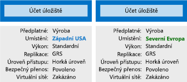

Organizace často mají více účtů úložiště, které jim umožňují implementovat různé sady požadavků. V příkladu výrobce čokolády existoval jeden účet úložiště pro privátní obchodní data a jeden pro soubory určené zákazníkům. V tomto článku se dozvíte o faktorech zásad řízených účtem úložiště, které vám pomohou s rozhodnutím, kolik účtů potřebujete.

## Co je Azure Storage?

Azure poskytuje mnoho způsobů, jak ukládat data. Můžete si vybrat z několika databází, jako je Azure SQL Server, Cosmos DB, a Azure Table Storage. Azure nabízí několik způsobů ukládání a odesílání zpráv, například fronty Azure a centra událostí. Díky službám, jako jsou soubory a objekty blob Azure, můžete dokonce ukládat volné soubory.

Azure vybralo čtyři tyto datové služby a umístilo je do jedné služby s názvem _Azure Storage_. Těmi čtyřmi službami jsou: Objekty blob, Soubory, Fronty a Tabulky Azure. Následující obrázek znázorňuje prvky služby Azure Storage.

Tyto čtyři služby získaly zvláštní zacházení, protože jde o primitivní cloudové služby úložiště a často se používají společně ve stejné aplikaci.

## Co je účet úložiště?

_Účet úložiště_ je kontejner, který seskupuje sadu služeb Azure Storage dohromady. V účtu úložiště mohou být pouze datové služby z Azure Storage (Objekty blob, Soubory, Fronty a Tabulky Azure). Následující obrázek znázorňuje účet úložiště obsahující několik datových služeb.

Kombinování datových služeb do účtu úložiště vám umožní je spravovat jako skupinu. Nastavení, která zadáte při vytváření tohoto účtu nebo kdykoli po vytvoření, se použijí na celý účet. Odstranění účtu úložiště odstraní všechna data, která jsou v něm uložená.

Účet úložiště je prostředek Azure, který je součástí skupiny prostředků. Následující obrázek znázorňuje předplatné Azure obsahující několik skupin prostředků, kdy každá skupina obsahuje jeden nebo více účtů úložiště.

Další datové služby Azure, jako je Azure SQL nebo Cosmos DB, se spravují jako nezávislé prostředky Azure a nelze je do účtu úložiště zahrnout. Následující obrázek znázorňuje typické uspořádání: Objekty blob, soubory, fronty a tabulky jsou v účtech úložiště, zatímco jiné služby nikoli.

## Nastavení účtu úložiště

Účet úložiště definuje zásadu, která bude platit pro všechny služby úložiště v účtu. Můžete například určit, že všechny obsažené služby budou uložené v datovém centru Západní USA, budou přístupné pouze prostřednictvím protokolu HTTPS a fakturovat se bude předplatné prodejního oddělení.

Mezi nastavení ovládaná účtem úložiště patří:

- **Předplatné**: Předplatné Azure, kterému se budou fakturovat služby v účtu

- **Umístění**: Datové centrum, ve kterém budou služby účtu uložené

- **Výkon**: Určuje datové služby, které můžete v účtu úložiště mít, a typ hardwarových disků použitých k uložení dat. **Standard** vám umožňuje mít libovolnou datovou službu (objekt blob, soubor, frontu, tabulku) a používá magnetické diskové jednotky. **Premium** vás omezuje na jeden konkrétní typ objektu blob s názvem _objekt blob stránky_ a k ukládání používá jednotky SSD (solid-state drives).

- **Replikace**: Určuje strategii používanou k vytváření kopií dat kvůli ochraně před selháním hardwaru nebo přírodní katastrofě. Azure bude přinejmenším automaticky uchovávat kopii vašich dat v datovém centru přidruženém k účtu úložiště. Tomuto se říká místně redundantní úložiště (LRS), které chrání data před selháním hardwaru, ale nechrání je před událostí, která by ochromila celé datové centrum. Můžete upgradovat na jednu z dalších možností, jako je geograficky redundantní úložiště (GRS), abyste měli data replikovaná i v jiných datových centrech po celém světě.

- **Úroveň přístupu:**: Určuje, jak rychlý budete mít u tohoto účtu úložiště přístup k objektům blob. Horká úroveň přístupu vám poskytne rychlejší, ale zároveň dražší přístup než studená úroveň přístupu. Vztahuje se pouze na objekty blob a slouží jako výchozí hodnota pro nové objekty blob.

- **Vyžadovat zabezpečený přenos**: Funkce zabezpečení, která určuje podporované protokoly přístupu. Zapnutá vyžaduje protokol HTTPS, zatímco vypnutá umožňuje protokol HTTP.

- **Virtuální sítě**: Funkce zabezpečení, která povoluje příchozí žádosti o přístup jenom z vybraných virtuálních sítí

## Kolik účtů úložiště potřebujete?

Účet úložiště představuje kolekci nastavení, jako je umístění, strategie replikace a vlastník předplatného. Pro každou skupinu nastavení, kterou chcete na svá data použít, potřebujete jeden účet úložiště. Následující obrázek znázorňuje dva účty úložiště, které se liší jedním nastavením. Tento jeden rozdíl stačí k tomu, abyste potřebovali samostatné účty úložiště.

Počet potřebných účtů úložiště se obvykle odvíjí od rozmanitosti dat, vnímavosti vůči nákladům a toleranci režií spojených se správou.

### Rozmanitost dat

Organizace často generují data, která se liší místem využití, citlivostí, fakturační skupinou atd. Rozmanitost u kterékoli kategorie může vést k několika účtům úložiště. Zvažte následující dva příklady:

1. Máte data, která jsou specifická pro zemi nebo oblasti? Pokud ano, budete je chtít kvůli výkonu a dodržování předpisů umístit do datacentra dané země. Pro každé umístění budete potřebovat jeden účet úložiště.

1. Máte nějaká data určená jen pro vaši potřebu a některá pro veřejné použití? Pokud ano, můžete virtuální sítě povolit u vlastních dat a nepovolit u veřejných dat. To bude také vyžadovat samostatné účty úložiště.

Obecně platí, čím větší rozmanitost, tím více účtů úložiště.

### Vnímavost vůči nákladům

Účet úložiště sám o sobě nic nestojí, ale jeho nastavení má vliv na cenu služeb v daném účtu. Geograficky redundantní úložiště stojí víc než místně redundantní úložiště. Výkon úrovně Premium a horká úroveň přístupu zvyšují náklady na objekty blob.

Při použití více účtů úložiště ale můžete náklady i snížit. Například můžete svá data rozdělit do důležitých a nedůležitých kategorií. Svá důležitá data můžete umístit do účtu úložiště s geograficky redundantním úložištěm a nedůležitá data do jiného účtu úložiště s místně redundantním úložištěm.

### Tolerance režií spojených se správou

Každý účet úložiště vyžaduje čas a pozornost správce, který ho musí vytvořit a spravovat. Zvyšuje se tím i komplexnost pro každého, kdo přidává data do cloudového úložiště, protože každý s touto rolí musí porozumět účelu každého účtu úložiště, aby nová data přidal do správného účtu.

Účty úložiště jsou výkonným nástrojem, který vám pomůže získat potřebný výkon a zabezpečení a současně minimalizovat náklady. Obvyklou strategií je začít analýzou dat a vytvořit oddíly, které sdílí stejné vlastnosti, jako je umístění, fakturace a strategie replikace, a potom vytvořit pro každý oddíl jeden účet úložiště.