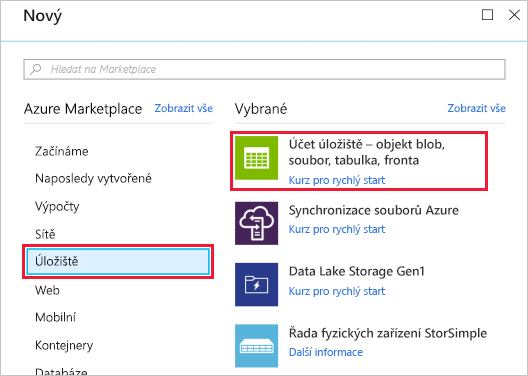
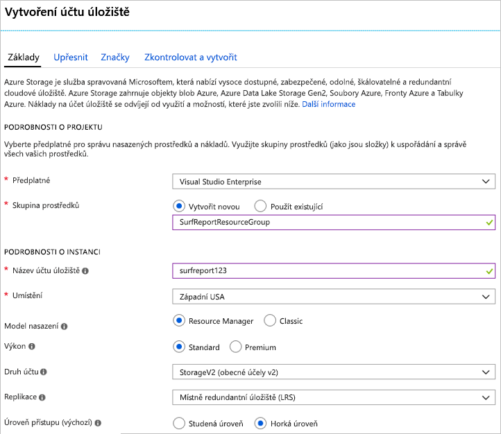
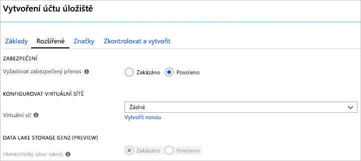

V této lekci vytvoříte pomocí webu Azure Portal účet úložiště, který bude vhodný pro fiktivní webovou aplikaci se zprávami o surfování v jižní Kalifornii.

Web se zprávami o surfování umožní uživatelům nahrávat fotky a videa s podmínkami, které panují na místní pláži. Čtenářům obsah pomůže s rozhodnutím, která pláž má nejlepší podmínky k surfování. Seznam cílů návrhu a funkcí je následující:

- Videoobsah se musí načítat rychle.
- Web musí umět zvládnout zpracovat neočekávaný nárůst v objemu nahrávání.
- Zastaralý obsah se musí odebrat, aby na webu byly podmínky k surfování vždy aktuální.

Pro splnění těchto požadavků se rozhodnete nahraný obsah ukládat ve vyrovnávací paměti v Azure Queue ke zpracování a následně ho přenést do Azure Blob k trvalému uložení. Potřebujete účet úložiště, ve kterém můžete používat fronty i objekty blob a zároveň si zachovat přístup k obsahu s nízkou latencí.

[!include]

## Vytvoření účtu úložiště pomocí webu Azure Portal

1. Pomocí stejného účtu, kterým jste aktivovali sandbox, se přihlaste k webu [Azure Portal](https://portal.azure.com/learn.docs.microsoft.com?azure-portal=true).

1. V levém horním rohu webu Azure Portal vyberte **Vytvořit prostředek**.

1. V zobrazeném podokně výběru vyberte **Úložiště**.

1. Napravo v tomto podokně vyberte **Účet úložiště – objekt blob, soubor, tabulka, fronta**.

    

### Konfigurace základních možností

[!include]

V části **PODROBNOSTI O PROJEKTU**:

1. Vyberte příslušné **předplatné**.

1. Z rozevíracího seznamu vyberte existující skupinu prostředků **<rgn>[název skupiny prostředků sandboxu]</rgn>**.

    > [!NOTE]
    > Tuto skupinu prostředků poskytl Microsoft zdarma jako součást výuky. Při vytváření účtu pro reálnou aplikaci bude chtít v předplatném vytvořit novou skupinu prostředků, která bude obsahovat všechny prostředky aplikace.

V části **PODROBNOSTI O INSTANCI**:

1. Zadejte **název účtu úložiště**. Název bude sloužit pro vygenerování veřejné adresy URL používané pro přístup k datům v účtu. Název musí být jedinečný v rámci všech existujících názvů účtů úložiště v Azure. Název musí být dlouhý 3 až 24 znaků a může obsahovat pouze malá písmena a číslice.

1. Ze seznamu výše vyberte **umístění** blízko vás.

1. Jako **model nasazení** ponechejte _Resource Manager_. Jedná se o upřednostňovaný model pro nasazení všech prostředků v Azure, který z důvodu snazší správy umožňuje seskupit všechny související prostředky do _skupiny prostředků_.

1. U možnosti **Výkon** vyberte _Standard_. Toto nastavení zvolí typ diskového úložiště, které bude obsahovat data v účtu úložiště. Při použití nastavení Standard se používají tradiční pevné disky, nastavení Premium používá z důvodu rychlejšího přístupu disky SSD (solid-state drive). Nezapomeňte ale, že úroveň Premium podporuje jenom _objekty blob stránky_. Pro videa budete potřebovat _objekty blob bloku_ a pro vyrovnávací paměť frontu. Tyto služby jsou k dispozici pouze u možnosti _Standard_.

1. Jako **druh účtu** vyberte _StorageV2 (obecné účely v2)_. Tento druh účtu poskytuje přístup k nejnovějším funkcím a cenám. Konkrétně účty služby Blob Storage mají u tohoto typu účtu k dispozici více možností. Potřebujete kombinaci objektů blob a fronty, takže možnost _Blob Storage_ by nefungovala. U této aplikace byste žádné výhody zvolením účtu _Storage (obecné účely v1)_ nezískali, protože byste pouze omezili funkce, ke kterým máte přístup, a náklady na očekávané zatížení byste pravděpodobně nesnížili.

1. Pro možnost **Replikace** vyberte _Místně redundantní úložiště (LRS)_. Z důvodu zajištění vysoké dostupnosti se data v účtech služby Azure Storage vždy replikují. Tato možnost vám umožňuje zvolit, jak daleko se má replikace provést, aby odpovídala vašim požadavkům na stálost. V našem případě obrázky a videa rychle zastarají a odeberou se z webu. V důsledku toho nemá cenu platit za globální redundanci. Pokud dojde ke katastrofické události a přijdete o data, můžete web restartovat a získat od uživatelů aktuální obsah.

1. **Vrstvu přístupu** nastavte na _Horká_. Toto nastavení se používá pouze pro Blob Storage. **Horká vrstva přístupu** je ideální pro data, která se používají často, a **Studená vrstva přístupu** je lepší pro méně často využívaná data. Všimněte si, že tímto se nastaví pouze _výchozí_ hodnota. Při vytváření objektu blob můžete pro data nastavit jinou hodnotu. V našem případě chceme, aby se videa načítala rychle, takže pro své objekty blob použijeme výkonnou možnost.

Následující snímek obrazovky ukazuje dokončené nastavení karty **Základy**. Všimněte si, že skupina prostředků, předplatné a název mají rozdílné hodnoty.

### Konfigurace rozšířených možností

1. Kliknutím na tlačítko **Další: Upřesnit >** se přesuňte na kartu **Upřesnit** nebo vyberte kartu **Upřesnit** nahoře na obrazovce.

1. **Vyžadovat zabezpečený přenos** nastavte na _Povoleno_. Nastavení **Vyžadovat zabezpečený přenos** řídí to, zda lze pro rozhraní API REST používat protokol **HTTP** pro přístup k datům v účtu úložiště. Nastavením této možnosti na _Povoleno_ vynutíte u všech klientů používání protokolu SSL (**HTTPS**). Ve většině případů budete chtít tuto možnost nastavit na _Povoleno_, protože použití protokolu HTTPS přes síť se považuje za osvědčený postup.

    > [!WARNING]
    > Povolení této možnosti vynutí některá další omezení. Nezašifrovaná připojení služby Soubory Azure se nezdaří, což platí i pro scénáře využívající SMB 2.1 nebo 3.0 na Linuxu. Vzhledem k tomu, že Azure Storage nepodporuje SSL u vlastních názvů domén, nelze tuto možnost používat s vlastním názvem domény.

1. Možnost **Virtuální sítě** nastavte na _Žádné_. Tato možnost vám umožní izolovat účet úložišti ve virtuální síti Azure. Chceme používat veřejný internetový přístup. Náš obsah je veřejný a musíte k němu povolit přístup z veřejných klientů.

1. Možnost **Data Lake Storage Gen2** ponechejte nastavenou na _Zakázáno_. Tato možnost je určena pro aplikace s velkými objemy dat, které nás v tomto modulu nezajímají.

Následující snímek obrazovky ukazuje dokončené nastavení karty **Upřesnit**.

### Vytvoření

1. Pokud chcete, můžete prozkoumat nastavení **Značky**. Toto nastavení vám umožňuje přidružit k účtu páry klíč-hodnota za účelem kategorizace a představuje funkci dostupnou pro jakýkoli prostředek Azure.

1. Klikněte na **Zkontrolovat a vytvořit** a zkontrolujte nastavení. Provede se rychlé ověření možností, aby se zajistilo, že jsou vybrána všechna povinná pole. Případné problémy zobrazí se zde. Po kontrole nastavení klikněte na **Vytvořit** a zřiďte účet úložiště.

Nasazení účtu může několik minut trvat. Zatímco Azure nasazuje účet, podívejme se podrobněji na rozhraní API, která budeme s tímto účtem používat.

### Ověření

1. V levém bočním panelu vyberte odkaz **Účty úložiště**.

1. Vyhledejte nový účet úložiště v seznamu a ověřte, že se úspěšně vytvořil.

<!-- Cleanup sandbox -->
[!include]

Když pracujete ve vlastním předplatném, můžete následujícím postupem na webu Azure Portal odstranit skupinu prostředků a všechny přidružené prostředky.

1. V levém bočním panelu vyberte odkaz **Skupiny prostředků**.

1. V seznamu vyhledejte skupinu prostředků, kterou jste vytvořili.

1. Pravým tlačítkem myši klikněte na položku skupiny prostředků a z místní nabídky vyberte **Odstranit skupinu prostředků**. Můžete také kliknout na výpustku (...) napravo od položky, čímž zobrazíte stejnou místní nabídku.

1. Do pole pro potvrzení zadejte název skupiny prostředků.

1. Klikněte na tlačítko **Odstranit**. To může trvat několik minut.

Vytvořili jste účet úložiště s nastavením podle firemních požadavků. Například jste vybrali datové centrum v oblasti Západní USA, protože vaši zákazníci budou primárně z jižní Kalifornie. Takto vypadá typický postup: nejprve analyzujte data a cíle a potom možnosti účtu úložiště nakonfigurujte tak, aby jim odpovídaly.