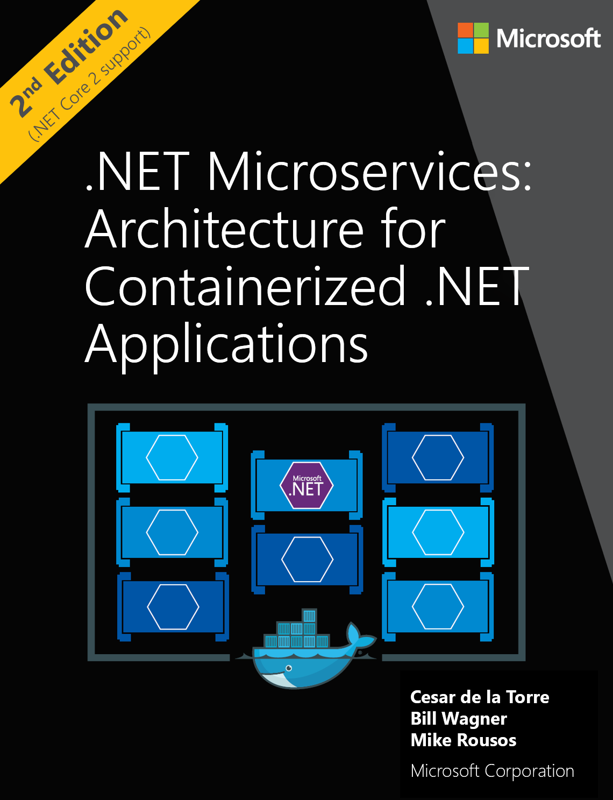

Předpokládejme, že nyní chcete číst text z uložených obrázků, které kontaktní pracovníci distributorů publikují na váš server. Zejména chcete naskenovat produkty a zajímají vás nálepky z propagačních akcí obsahující prodejní ceny. Je čas vyzkoušet funkci optického rozpoznávání znaků (OCR) rozhraní API pro počítačové zpracování obrazu. 

## <a name="calling-the-computer-vision-api-to-extract-printed-text"></a>Volání rozhraní API pro počítačové zpracování obrazu k extrakci tištěného textu

Operace `ocr` detekuje text v obrázku a extrahuje rozpoznané znaky do znakového proudu, který je strojově využitelný. Adresa URL požadavku má následující formát:

`https://<region>.api.cognitive.microsoft.com/vision/v2.0/ocr?language=<...>&detectOrientation=<...>`

Všechna volání se musí jako obvykle provádět do oblasti, kde byl účet vytvořen. Volání přijímá dva volitelné parametry:

- **language**: Kód jazyka textu, který má být z obrázku zjištěn. Výchozí hodnota je `unk` (tzn. neznámá). To umožňuje službě automaticky rozpoznat jazyk textu na obrázku.
- **detectOrientation**: V případě hodnoty true se služba pokusí zjistit orientaci obrázku a před dalším zpracováním ho opravit (pokud je například obrázek vzhůru nohama). 

[!INCLUDE [get-key-note](./get-key.md)]

## <a name="extract-printed-text-from-an-image-using-ocr"></a>Extrahování tištěného textu z obrázku pomocí technologie OCR

Obrázkem, který budeme používat pro optické rozpoznávání znaků (OCR), je přebal knihy *.NET Microservices: Architecture for Containerized .NET Applications* (Mikroslužby .NET: Architektura kontejnerizovaných aplikací .NET).



1. V Cloud Shellu proveďte následující příkaz. Nahraďte v příkazu část `<region>` oblastí vašeho účtu služby Cognitive Services.

```azurecli
curl "https://<region>.api.cognitive.microsoft.com/vision/v2.0/ocr" \
-H "Ocp-Apim-Subscription-Key: $key" \
-H "Content-Type: application/json"  \
-d "{'url' : 'https://raw.githubusercontent.com/MicrosoftDocs/mslearn-process-images-with-the-computer-vision-service/master/images/ebook.png'}" \
 | jq '.'
```

Následující kód JSON je příkladem odpovědi, kterou nám toto volání vrátí. Aby se fragment kódu lépe vešel na stránku, některé řádky kódu JSON byly odebrány.

```json
{
  "language": "en",
  "orientation": "Up",
  "textAngle": 0,
  "regions" : [
        /*... snipped*/
        {
          "boundingBox": "766,1419,302,33",
          "words": [
            {
              "boundingBox": "766,1419,126,25",
              "text": "Microsoft"
            },
            {
              "boundingBox": "903,1420,165,32",
              "text": "Corporation"
            }
          ]
        }]
}
```

Teď se na tuto odpověď podívejme podrobněji. 

- Služba identifikovala text jako angličtinu. Hodnota pole `language` obsahuje kód jazyka BCP-47 textu zjištěného v obrázku. V tomto příkladu je to **en**, tzn. angličtina. 
- Byla zjištěna orientace (`orientation`) nahoru (**up**). Tato hodnota vlastnosti představuje směr, ve kterém je horní část rozpoznaného textu po otočení obrázku kolem jeho středu podle zjištěného úhlu textu. 
- `textAngle` je úhel, podle kterého se text musí otočit, aby byl vodorovně nebo svisle. V tomto příkladu byl zcela vodorovně, takže je vrácena hodnota **0**.  
- Vlastnost `regions` obsahuje seznam hodnot používaných k zobrazení toho, kde text je, jaká je jeho pozice na obrázku a jaké slovo se v dané části obrázku našlo. 
- Čtyři celá čísla hodnoty `boundingBox` jsou: 
    - Souřadnice x levého okraje 
    - Souřadnice y horního okraje
    - Šířka ohraničujícího rámečku
    - Výška ohraničujícího rámečku 
   
    Tyto hodnoty můžete použít k vykreslení polí kolem každé části textu zjištěného v obrázku.

Jak je vidět v tomto cvičení, služba `ocr` poskytuje podrobné informace o tištěném textu v obrázku. 

Další informace o operaci `ocr` najdete v referenční dokumentaci k technologii [OCR](https://westus.dev.cognitive.microsoft.com/docs/services/5adf991815e1060e6355ad44/operations/56f91f2e778daf14a499e1fc).