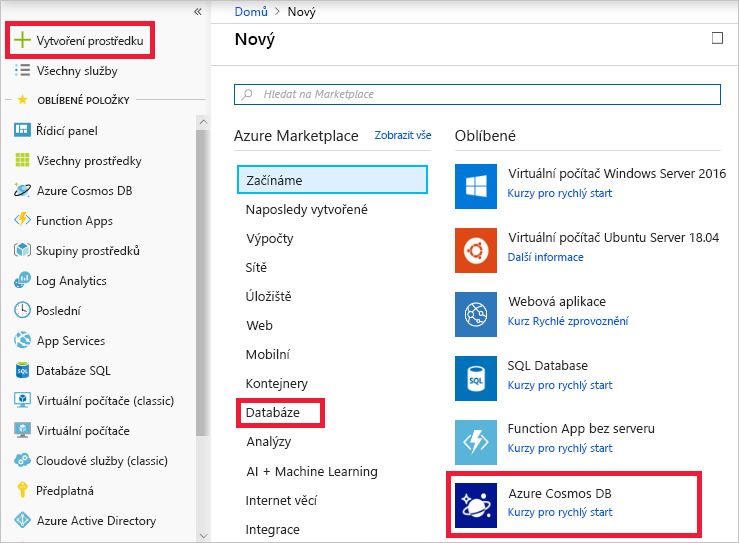
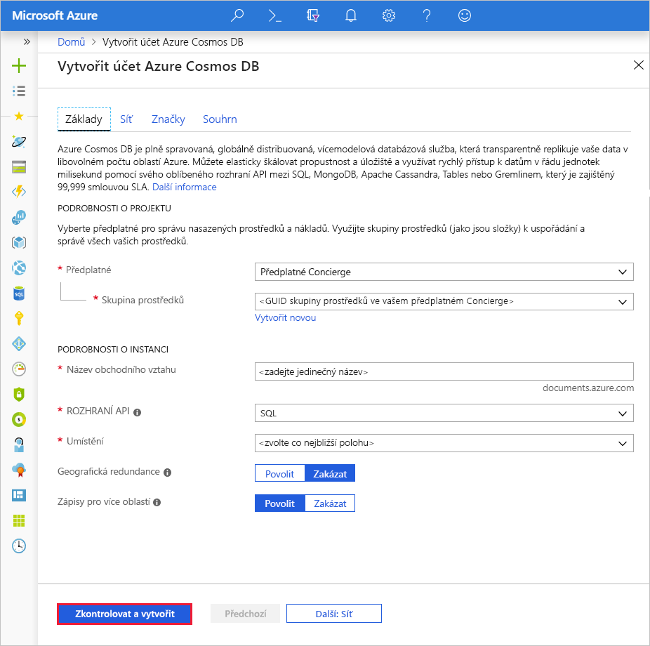
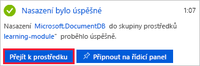
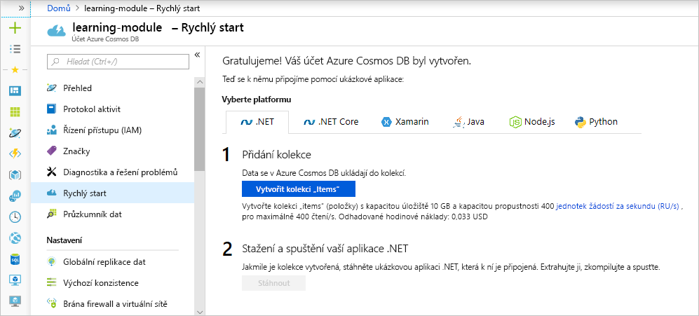

Vaše společnost si pro splnění požadavků rostoucího počtu zákazníků a produktů zvolila službu Azure Cosmos DB. Vy jste dostali za úkol vytvoření databáze.

Prvním krokem je vytvoření účtu služby Azure Cosmos DB.

## Co je účet služby Azure Cosmos DB?

Účet služby Azure Cosmos DB je prostředek Azure, který funguje jako organizační entita pro vaše databáze. Propojuje vaše využití s vaším předplatným Azure pro účely fakturace.

Ke každému účtu služby Azure Cosmos DB je přidružený jeden z několika datových modelů podporovaných službou Azure Cosmos DB. Zároveň můžete vytvořit tolik účtů, kolik potřebujete.

Upřednostňovaným datovým modelem při vytváření nové aplikace je rozhraní SQL API. Pokud pracujete s grafy nebo tabulkami nebo migrujete data MongoDB nebo Cassandra do Azure, vytvořte další účty a vyberte odpovídající datové modely.

Při vytváření účtu zvolte smysluplné ID, protože slouží k identifikaci vašeho účtu. Dále vytvořte účet v oblasti Azure co nejblíže vašim uživatelům, abyste minimalizovali latenci mezi datacentrem a uživateli.

Volitelně můžete při vytváření účtu nastavit virtuální sítě a geografickou redundanci. Můžete to však provést i později. V tomto modulu tato nastavení nepovolíme.

[!include]

## Vytvoření účtu služby Azure Cosmos DB na portálu

1. Pomocí stejného účtu, kterým jste aktivovali sandbox, se přihlaste k portálu [Azure Portal pro Sandbox](https://portal.azure.com/learn.docs.microsoft.com?azure-portal=true).

    > [!IMPORTANT]
    > Přihlaste se na web Azure Portal pomocí odkazu uvedeného výše, abyste měli jistotu, že jste připojení k sandboxu, který poskytuje přístup k předplatnému Concierge.

1. Klikněte na **Vytvořit prostředek** > **Databáze** > **Azure Cosmos DB**.

   

1. Na stránce **Vytvořit účet Azure Cosmos DB** zadejte nastavení nového účtu služby Azure Cosmos DB, včetně umístění.

    [!INCLUDE]

    Nastavení|Hodnota|Popis
    ---|---|---
    Předplatné|*Předplatné Concierge*|Vyberte předplatné Concierge. Pokud se předplatné Concierge nezobrazuje, máte pro své předplatné povoleno několik tenantů a je nutné tenanty změnit. Pokud to chcete udělat, přihlaste se znovu pomocí následujícího odkazu na portál: [Azure Portal pro Sandbox](https://portal.azure.com/learn.docs.microsoft.com?azure-portal=true).
    Skupina prostředků|Použít existující  **<rgn>[název skupiny prostředků sandboxu]</rgn>**|Tady vytvoříte novou skupinu prostředků, nebo vyberete existující skupinu v rámci svého předplatného.
    Název účtu|*Zadejte jedinečný název*|Zadejte jedinečný název, který identifikuje tento účet služby Azure Cosmos DB. Jelikož je řetězec *documents.azure.com* připojený k ID, které poskytnete k vytvoření identifikátoru URI, použijte jedinečné, ale snadno rozpoznatelné ID.  Toto ID může obsahovat pouze malá písmena, číslice a znak spojovníku (-) a musí se skládat ze 3 až 31 znaků.
    Rozhraní API|SQL|Rozhraní API určuje typ účtu, který se má vytvořit. Azure Cosmos DB poskytuje pro splnění požadavků vaší aplikace pět rozhraní API: SQL (databáze dokumentů), Gremlin (databáze grafu), MongoDB (databáze dokumentů), Azure Table a Cassandra, z nichž každé v současné době vyžaduje samostatný účet.   Vyberte **SQL**, protože v tomto modulu vytváříte databázi dokumentů, která umožňuje dotazování pomocí syntaxe SQL a přístup pomocí rozhraní SQL API.|
    Umístění|*Ze seznamu výše vyberte oblast, která je k vám nejblíže.*|Vyberte umístění, kde má být databáze umístěná.
    Geografická redundance| Zakázat | Toto nastavení vytvoří replikovanou verzi vaší databáze ve druhé (spárované) oblasti. Prozatím ponechte toto nastavení jako zakázané, protože databázi můžete replikovat později.
    Zápisy pro více oblastí | Povolit | Toto nastavení umožňuje zapisovat do několika oblastí najednou.

1. Klikněte na **Zkontrolovat a vytvořit**.

    

1. Jakmile se nastavení ověří, klikněte na **Vytvořit**, aby se účet vytvořil.

1. Vytvoření účtu trvá několik minut. Počkejte, až se na portálu zobrazí oznámení o úspěšném nasazení, a klikněte na toto oznámení.

    

1. V okně oznámení klikněte na **Přejít k prostředku**.

    

    Na portálu se zobrazí zpráva **Blahopřejeme! Váš účet služby Azure Cosmos DB byl vytvořen**.

    

## Shrnutí

Vytvořili jste účet služby Azure Cosmos DB, což je první krok k vytvoření databáze Azure Cosmos DB. Vybrali jste odpovídající nastavení pro vaše datové typy a nastavili jste umístění účtu tak, aby se minimalizovala latence pro vaše uživatele.
