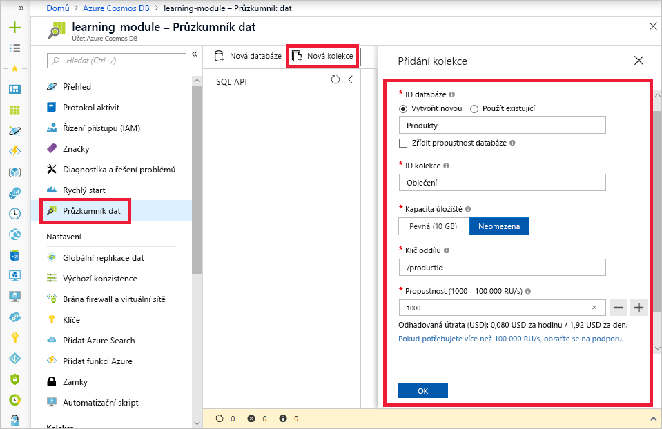
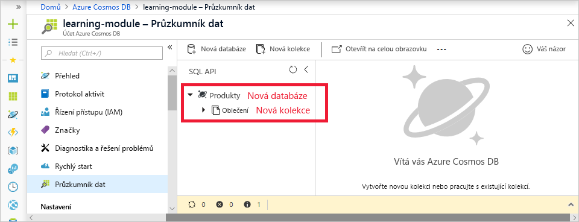

Teď víte, jak se pomocí lekci žádostí určuje propustnost databáze a jak klíč oddílu vytváří strategii horizontálního škálování pro databázi, takže jste připravení k vytvoření databáze a kolekce. Při vytváření kolekce je potřeba nastavit propustnost a klíč oddílu, proto doporučujeme se s těmito koncepty před vytvořením databáze seznámit.

## Vytvoření databáze a kolekce

1. Na portálu Azure Portal vyberte v prostředku Cosmos DB možnost **Průzkumník dat** a potom na panelu nástrojů klikněte na tlačítko **Nová kolekce**.
    
    Oblast **Přidat kolekci** se nachází zcela vpravo. K jejímu zobrazení bude možná potřeba posunout se doprava.

    

1. Na stránce **Přidat kolekci** zadejte nastavení pro novou kolekci.

    Nastavení | Navrhovaná hodnota | Popis
    --------|-----------------|-------------
    ID databáze      | Products         | Jako název nové databáze zadejte *Products* (Produkty). Názvy databází musí mít délku 1 až 255 znaků a nesmí obsahovat znaky /, \\, #, ? ani koncové mezery.
    ID kolekce    | Clothing  | Jako název nové kolekce zadejte *Clothing* (Oděvy). Pro ID kolekcí platí stejné požadavky týkající se použitých znaků jako pro názvy databází.
    Kapacita úložiště | Neomezená     | Použijte výchozí hodnotu **Neomezená**. Tato hodnota určuje kapacitu úložiště databáze a umožňuje horizontálně navýšit kapacitu databáze podle potřeby.
    Klíč oddílu    | productId        | Ve scénáři online obchodu je vhodným klíčem oddílu productId, protože se většina dotazů týká ID produktu.
    Propustnost       |1000 RU        | Změňte propustnost na 1000 jednotek žádostí za sekundu (RU/s). 1000 je minimální hodnota RU/s, kterou lze nastavit pro povolení automatického škálování.
    
    Prozatím nezaškrtávejte možnost pro **zřízení propustnosti databáze** a nepřidávejte do kolekce žádné jedinečné klíče.
    
1. Klikněte na **OK**. Průzkumník dat zobrazí novou databázi a kolekci.

    

## Shrnutí

V této lekci jste použili svou znalost klíčů oddílů a jednotek žádostí k vytvoření databáze a kolekce s nastavením propustnosti a škálování, které je vhodné pro vaše obchodní potřeby.