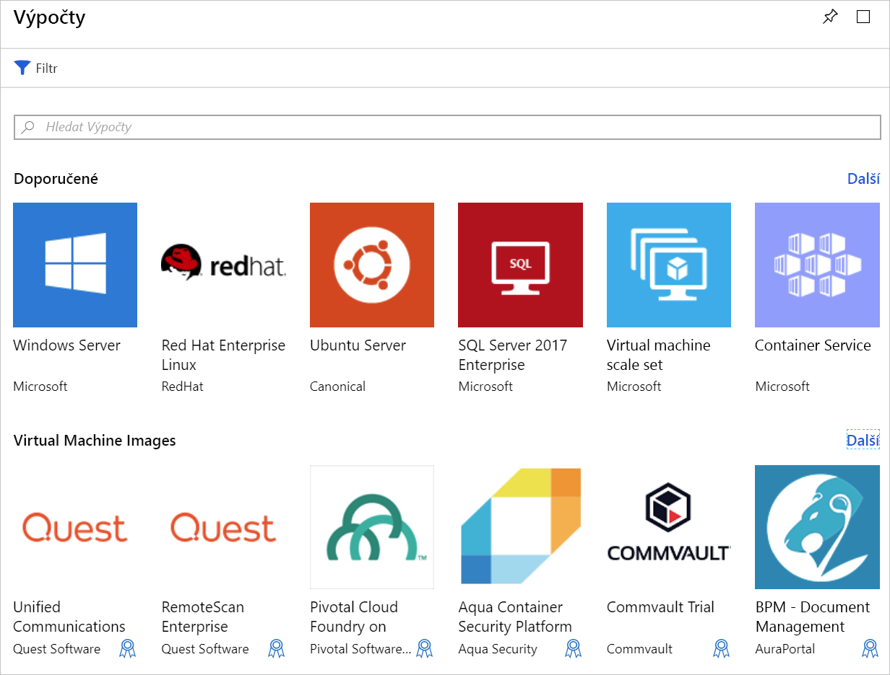

Máme stávající web, který běží na místním serveru s Ubuntu Linuxem. Naším cílem je vytvořit virtuální počítač Azure využívající nejnovější image Ubuntu a následně migrovat tento web do cloudu. V této lekci poznáte možnosti, které musíte vyhodnotit při vytváření virtuálního počítače v Azure.

## Úvod do virtuálních počítačů Azure

Virtuální počítače Azure jsou škálovatelné cloudové výpočetní prostředky dostupné na vyžádání. Obsahují virtuální procesory, paměť, úložiště a síťové prostředky. Virtuální počítače můžete libovolně spouštět, zastavovat a spravovat z webu Azure Portal nebo příkazy prostředí Azure CLI. K přímému připojení k běžícímu virtuálnímu počítači a spouštění příkazů jako byste byli na místním počítači můžete také použít vzdálené prostředí SSH (Secure Shell).

### Provozování Linuxu v Azure

Vytvoření linuxových virtuálních počítačů je v Azure jednoduché. Microsoft spolupracuje s předními dodavateli Linuxu na zajištění distribucí, které jsou optimalizované pro platformu Azure. Virtuální počítače můžete vytvářet z předem sestavených imagí různých oblíbených distribucí Linuxu, jako je SUSE, Red Hat a Ubuntu, nebo si můžete vytvořit vlastní distribuci Linuxu pro provoz v cloudu.

## Vytvoření virtuálního počítače Azure

Virtuální počítače můžete v Azure definovat a nasazovat několika způsoby. Můžete použít Azure Portal, skript (pomocí Azure CLI nebo Azure Powershellu) nebo šablonu Azure Resource Manageru. Ve všech případech budete muset zadat některé informace, které si přiblížíme za chvíli.

Azure Marketplace také nabízí předem nakonfigurované image s nainstalovaným operačním systémem a oblíbenými softwarovými nástroji pro konkrétní scénáře.

## Prostředky používané v linuxovém virtuálním počítači

Při vytváření virtuálního počítače s Linuxem v Azure vytváříte také prostředky k jeho hostování. V součinnosti umožňují tyto prostředky virtualizovat počítač a provozovat operační systém Linux. Buď musí existovat (a být vybrány při vytváření virtuálního počítače), nebo budou vytvořeny s virtuálním počítačem:

- Virtuální počítač, který poskytuje prostředky procesoru a paměti
- Účet služby Azure Storage pro uložení virtuálních pevných disků
- Virtuální disky pro uložení operačního systému, aplikací a dat
- Virtuální síť (VNet) pro připojení virtuálního počítače k jiným službám Azure nebo k vašemu místnímu hardwaru
- Síťové rozhraní pro komunikaci s virtuální sítí
- Veřejná IP adresa, abyste mohli k virtuálnímu počítači přistupovat

Stejně jako u ostatních služeb Azure budete potřebovat **skupinu prostředků**, která bude obsahovat virtuální počítač (a volitelně seskupovat tyto prostředky pro správu). Při vytváření nového virtuálního počítače můžete použít existující skupinu prostředků, nebo vytvořit novou.

## Volba image virtuálního počítače

Při vytváření virtuálního počítače je výběr image jedním z prvních a nejdůležitějších rozhodnutí, které je potřeba učinit. Image představuje šablonu sloužící k vytvoření virtuálního počítače. Tyto šablony obsahují operační systém a často také další software, jako jsou nástroje pro vývoj nebo prostředí pro hostování webů.

Součástí image může být cokoliv, co se dá nainstalovat na počítač. Virtuální počítač můžete vytvořit z image, která je předem nakonfigurovaná přesně pro to, co potřebujete, jako je hostování webové aplikace na HTTP serveru Apache.

> [!TIP]
> Můžete také vytvořit a nahrát vlastní image disků.

## Určení velikosti virtuálního počítače

Stejně jako fyzický počítač má určitý objem paměti a výkon procesoru, má to samé i virtuální počítač. Azure nabízí celou řadu virtuálních počítačů různých velikostí a s různými cenami. Velikost, kterou zvolíte, určuje výpočetní výkon, paměť a maximální kapacitu úložiště virtuálního počítače.

> [!WARNING]
> Každé předplatné má omezení kvóty, která mohou ovlivnit vytvoření virtuálního počítače. Pokud narazíte na tato omezení kvót, můžete [otevřít online žádost o zákaznickou podporu](https://docs.microsoft.com/azure/azure-supportability/resource-manager-core-quotas-request).

Velikosti virtuálních počítačů jsou seskupené do kategorií. První série B je pro základní testování a poslední série H pro náročné výpočetní úlohy. Velikost virtuálního počítače byste měli vybrat podle předpokládaného zatížení. Velikost virtuálního počítače je možné změnit po jeho vytvoření, ale virtuální počítač je nutné nejprve zastavit. Proto je nejvhodnější nastavit jeho velikost odpovídajícím způsobem od samého začátku, pokud je to možné.

#### Zde jsou určitá pravidla, která vycházejí ze situace, kterou zamýšlíte.

| Vykonávaná činnost | Možné velikosti
|-------|------------------|
| **Obecné výpočetní / webové použití**: Testování a vývoj, malé až střední databáze nebo webové servery s nízkým až středním provozem. | B, Dsv3, Dv3, DSv2, Dv2 |
| **Úlohy náročné na výpočetní výkon**: Webové servery se středním provozem, síťová zařízení, dávkové procesy a aplikační servery. | Fsv2, Fs, F |
| **Velké využití paměti**: Servery relační databáze, střední až velké mezipaměti a analýza v paměti. | Esv3, Ev3, M, GS, G, DSv2, Dv2 |
| **Ukládání a zpracování dat**: Databáze s velkými objemy dat, databáze SQL a NoSQL, které vyžadují vysokou propustnost disku a vstupně-výstupních operací. | Ls |
| **Vykreslování náročné grafiky** nebo úpravy videa, stejně jako trénování modelů a odvozování (ND) s hloubkovým učením. | NV, NC, NCv2, NCv3, ND |
| **Vysokovýkonné výpočetní prostředí (HPC)**: Prováděné úlohy vyžadují virtuální počítače s nejrychlejším a nejvýkonnějším procesorem s volitelnou vysokou propustností síťového rozhraní. | H |

## Volba možnosti úložiště

Následující skupina rozhodnutí se týká úložiště. Nejprve zvolte technologii disku. Dostupné možnosti zahrnují tradiční jednotku pevného disku (HDD) nebo modernější jednotku SSD (solid-state drive). Stejně jako u kupovaného hardwaru, je SSD úložiště nákladnější, ale poskytuje vyšší výkon.

> [!TIP]
> K dispozici jsou dvě úrovně úložišť SSD: Standard a Premium. Pokud nemáte náročné úlohy, ale chcete vyšší výkon, zvolte disky SSD úrovně Standard. Pokud máte úlohy náročné na vstupně-výstupní operace nebo klíčové systémy, které potřebují zpracovávat data velmi rychle, zvolte disky SSD úrovně Premium.

### Mapování úložiště na disky

Azure používá k reprezentaci fyzických disků pro virtuální počítač virtuální pevné disky (VHD). Disky VHD napodobují logický formát a data diskové jednotky, ale jsou uložené jako objekty blob stránek v účtu služby Azure Storage. Typ úložiště (SSD nebo HDD) můžete určit také odděleně pro jednotlivé disky. Můžete tak řídit výkon jednotlivých disků na základě vstupně-výstupních operací, ke kterým plánujete disky používat.

Pro virtuální počítač s Linuxem budou automaticky vytvořeny dva virtuální pevné disky (VHD):

1. **Disk s operačním systémem**: Primární jednotka s maximální kapacitou 2048 GB. Bude mít výchozí označení `/dev/sda`.

1. **Dočasný disk**: Poskytuje dočasné úložiště pro operační systém nebo jiné aplikace. Na virtuálních počítačích s Linuxem je to disk `/dev/sdb`, který je naformátovaný a připojený k `/mnt` pomocí agenta Azure Linux. Velikost vychází z velikosti virtuálního počítače. Disk se používá k uložení stránkovacího souboru.

> [!WARNING]
> Dočasný disk není trvalý. Proto na tento disk zapisujte jenom taková data, která nejsou pro systém kriticky důležitá.

#### A co data?

Data můžou být uložena na primárním disku s operačním systémem, ale lepším řešením je vytvoření vyhrazených _datových disků_. Můžete vytvářet další disky a připojovat je k virtuálnímu počítači. Na každém disku může být až 4095 GB dat, přičemž maximální velikost úložiště odpovídá vybrané velikosti virtuálního počítače.

> [!NOTE]
> Zajímavou funkcí je vytvoření image virtuálního pevného disku ze skutečného disku. Díky tomu můžete snadno migrovat _existující_ informace z místního počítače do cloudu.

### Nespravované a spravované disky

Poslední volbou úložiště je, zda použít **nespravované** nebo **spravované** disky.

S nespravovanými disky jste zodpovědní za účty úložiště, které se používají k uložení virtuálních pevných disků odpovídajících diskům virtuálních počítačů. Poplatky za účet úložiště se platí podle používaného místa. Jeden účet úložiště má pevný rychlostní limit 20 000 vstupně-výstupních operací za sekundu. To znamená, že při plném výkonu dokáže podporovat 40 standardních virtuálních pevných disků. Pokud potřebujete horizontálně navýšit kapacitu, potřebujete více účtů úložiště, což může být složité.

Spravované disky představují novější, doporučovaný model diskového úložiště. Elegantně řeší tyto komplikace tím, že problémy se správou účtů úložiště nechají na Azure. Vy určíte typ disku (Premium nebo Standard) a jeho velikost a Azure se postará o vytvoření a správu disku _i_ úložiště, které používá. Nemusíte se starat o omezení účtu úložiště, což usnadňuje horizontální navýšení kapacity. Spravované disky nabízejí i další výhody:

- **Větší spolehlivost**: Azure zajistí, aby virtuální pevné disky používané pro vysoce spolehlivé virtuální počítače byly umístěny v různých částech Azure Storage kvůli zajištění podobné míry odolnosti.
- **Lepší zabezpečení**: Spravované disky jsou skutečnými spravovanými prostředky ve skupině prostředků. To znamená, že je možné použít řízení přístupu na základě rolí a omezit tak, kdo může pracovat s daty na virtuálním pevném disku.
- **Podpora snímků**: K vytvoření kopie virtuálního pevného disku, která je jen pro čtení, můžete použít snímky. Je při tom potřeba vypnout nadřízený virtuální počítač, ale vytvoření snímku trvá jen pár sekund. Po skončení můžete virtuální počítač zapnout a pomocí tohoto snímku vytvořit duplicitní virtuální počítač kvůli vyřešení produkčních problémů nebo vrácení virtuálního počítače do okamžiku pořízení snímku.
- **Podpora zálohování**: Spravované disky můžete službou Azure Backup automaticky zálohovat do různých oblastí, abyste je v případě havárie mohli obnovit. Zálohování nemá vliv na službu virtuálního počítače.

## Síťová komunikace

Virtuální počítače komunikují s externími prostředky prostřednictvím virtuální sítě (VNet). Virtuální síť představuje privátní síť v jedné oblasti, ve které prostředky komunikují. Virtuální síť je stejná jako sítě, které spravujete v místním prostředí. Můžete je rozdělit pomocí podsítí a izolovat tak prostředky, připojit je k jiným sítím (včetně místních sítí) a použít pravidla provozu, která řídí příchozí a odchozí připojení.

### Plánování sítě

Když vytváříte nový virtuální počítač, můžete vytvořit novou virtuální síť nebo použít existující virtuální síť ve své oblasti.

Můžete nechat Azure vytvořit síť společně s virtuálním počítačem, což je jednoduché, ale ve většině situací to nejspíše nebude ideální. Lepší je _předem_ naplánovat požadavky na síť pro všechny komponenty vaší architektury a vytvořit strukturu virtuální sítě samostatně. Poté vytvořte virtuální počítače a umístěte je do připravených virtuálních sítí. V tomto modulu se blíže seznámíme s virtuálními sítěmi později.

Než vytvoříme virtuální počítač, musíme se rozhodnout, jak bychom jej chtěli spravovat. Pojďme se podívat, jaké máme možnosti.