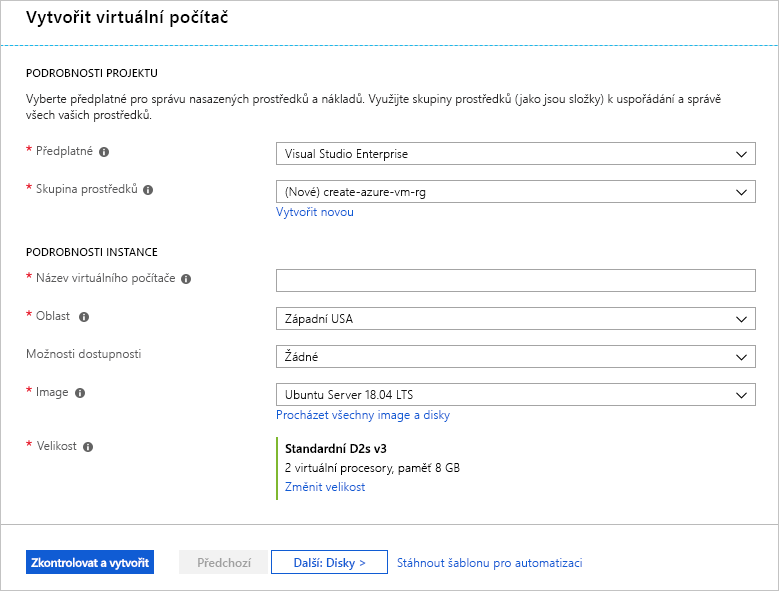
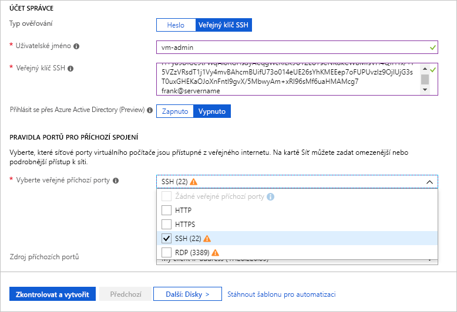
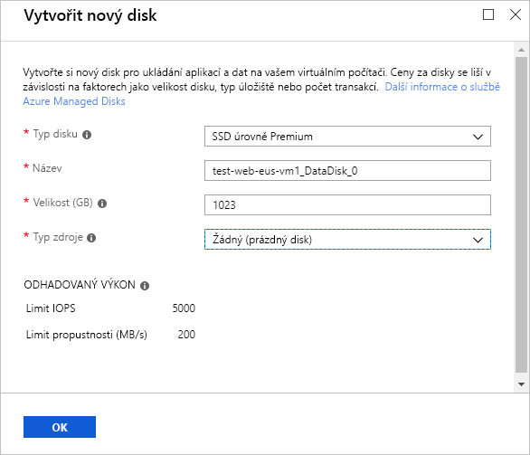
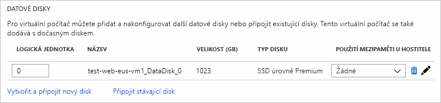

Připomínáme, že naším cílem je přesunout stávající server s Linuxem, na kterém běží Apache, do Azure. Začneme vytvořením serveru s Ubuntu Linuxem.

## Vytvoření nového virtuálního počítače s Linuxem

Virtuální počítače s Linuxem můžeme vytvořit prostřednictvím webu Azure Portal, rozhraní Azure CLI nebo Azure PowerShellu. Když s Azure začínáte, je nejjednodušší použít portál, protože vás provede požadovanými informacemi a během vytváření poskytuje rady a užitečné zprávy:

1. Pomocí stejného účtu, kterým jste aktivovali sandbox, se přihlaste k portálu [Azure Portal](https://portal.azure.com/learn.docs.microsoft.com?azure-portal=true).

1. Klikněte na **Vytvořit prostředek** v levém horním rohu webu Azure Portal.

1. Do vyhledávacího pole zadejte **Ubuntu Server**. Zobrazí se různé verze, které jsou k dispozici. Ze zobrazeného seznamu vyberte **Ubuntu Server 18.04 LTS**.

1. Kliknutím na tlačítko **Vytvořit** spusťte konfiguraci virtuálního počítače.

## Konfigurace nastavení virtuálního počítače

Prostředí pro vytváření virtuálních počítačů v rámci portálu má podobu průvodce, který vás provede všemi oblastmi konfigurace virtuálního počítače. Kliknutím na tlačítko **Další** se dostanete k dalšímu konfigurovatelnému oddílu. Pomocí karet podél horního okraje, které identifikují jednotlivé části, se ale můžete mezi oddíly pohybovat podle libosti.

Po vyplnění všech povinných možností (označených červenou hvězdičkou) můžete přeskočit zbývající část průvodce a spustit vytvoření virtuálního počítače tlačítkem **Zkontrolovat a vytvořit** dole.

Začneme oddílem **Základy**. Tyto pokyny platí pro portál Sandbox. Pokud používáte jiný účet portálu Microsoft Azure, možná bude potřeba přizpůsobit některé podrobnosti.

### Konfigurace základního nastavení virtuálního počítače

1. Jako **Předplatné** by pro vás ve výchozím nastavení mělo být vybrané předplatné sandboxu.

1. Jako **skupina prostředků** by pro vás ve výchozím nastavení měla být vybraná skupina prostředků s názvem **<rgn>[název skupiny prostředků sandboxu]</rgn>**.

1. V oddílu **PODROBNOSTI INSTANCE** zadejte název virtuálního počítače s webovým serverem, například **test-web-eus-vm1**. Určete prostředí (**test**), roli (**web**), umístění (**Východní USA**), službu (**vm**) a číslo instance (**1**).
    - Osvědčilo se používat standardizované názvy prostředků, abyste dokázali rychle rozpoznat jejich účel. Názvy virtuálních počítačů s Linuxem musí mít 1 až 64 znaků a musí se skládat z číslic, písmen a pomlček.

    > [!NOTE]
    > Při změně nastavení a přechodu mezi textovými poli ověřuje Azure automaticky hodnotu všech polí, a pokud je správná, zeleně ji zaškrtne. Pokud potřebujete další informace o zjištěných problémech, najeďte myší na ukazatel chyby.

1. Vyberte umístění.

    <!-- Resource selection -->  
    [!include]

1. V poli **Možnosti dostupnosti** nechte nastavenou možnost **Nevyžaduje se žádná redundance infrastruktury**. Tuto možnost můžete použít k zajištění vysoké dostupnosti virtuálního počítače. Když z několika virtuálních počítačů vytvoříte sadu, můžete ji použít při plánované nebo neplánované údržbě nebo výpadcích. V tomto cvičení tuto službu nebudeme potřebovat.

1. Ověřte, že je image nastavená na **Ubuntu Server 18.04 LTS**. Otevřením rozevíracího seznamu zobrazíte všechny dostupné možnosti.

1. Pole **Velikost** nemůžete přímo upravovat. Výchozí velikost je **DS2_v3**, což je jedna z možností pro obecné výpočetní účely. Výborně se hodí pro veřejný webový server, ale v této ukázce klikněte na odkaz **Změnit velikost** a prohlédněte si další velikosti virtuálního počítače. V dialogu, který se otevře, můžete filtrovat podle **počtu procesorů**, **názvu** a **typu disku**. Vyberte možnost **DS2_v3**, která nabízí dva virtuální procesory s 8 GB paměti RAM.

1. V oddílu **PŘÍSTUP SPRÁVCE** vyberte jako **Typ ověřování** možnost **Veřejný klíč SSH**.

1. Zadejte **uživatelské jméno**, které budete používat k přihlášení přes SSH. Zvolte si nějaké snadno zapamatovatelné jméno nebo si ho poznamenejte.

1. Zkopírujte klíč SSH ze souboru veřejného klíče, který jste vytvořili v předchozí lekci, a vložte ho do pole **Veřejný klíč SSH**.

    > [!IMPORTANT]
    > Při kopírování veřejného klíče na web Azure Portal dejte pozor, abyste do něj nepřidali znak mezery nebo odřádkování.

1. V oddílu **PRAVIDLA PORTŮ PRO PŘÍCHOZÍ SPOJENÍ** napřed vyberte **Povolit vybrané porty**. Protože se jedná o virtuální počítač s Linuxem, chceme mít možnost vzdáleného přístupu k virtuálnímu počítači přes SSH. Posouvejte seznam **Vyberte příchozí porty**, dokud nenajdete položku **SSH (22)**, a pak ji povolte.

    

## Konfigurace disků virtuálního počítače

1. Kliknutím na **Další: Disky > ** přejděte do oddílu **Disky**.

1. Jako **Typ disku s operačním systémem** zvolte **SSD úrovně Premium**.

### Vytvoření datového disku

Připomínáme, že získáme disk s operačním systémem (/dev/sda) a dočasný disk (/dev/sdb). Přidáme také datový disk:

1. Klikněte na odkaz **Vytvořit a připojit nový disk** v oddílu **DATOVÉ DISKY**.

    

1. Ve všech polích můžete nechat výchozí hodnoty: Disk **SSD úrovně Premium**, automaticky vygenerovaný název, velikost **1023** GB a jako **Typ zdroje** použijte **Žádný (prázdný disk)**. Všimněte si, že jako typ zdroje můžete k vytvoření virtuálního pevného disku použít snímek nebo Azure Blob Storage.

1. Kliknutím na **OK** vytvořte disk a vraťte se zpět do oddílu **DATOVÉ DISKY**.

1. Na prvním řádku by teď měl být nový disk.

    

## Konfigurace sítě

1. Kliknutím na **Další: Sítě >** přejděte do oddílu **Sítě**.

1. V produkčním prostředí budete mít jiné komponenty, a proto pravděpodobně použijete _stávající_ virtuální síť. Virtuální počítač tak může v rámci řešení komunikovat s jinými cloudovými službami. Pokud v této lokalitě ještě není definovaná virtuální síť, můžete ji zde vytvořit a nakonfigurovat:
    - **Adresní prostor**: Celkový prostor protokolu IPv4 dostupný pro tuto síť.
    - **Rozsah podsítě**: První podsíť pro rozdělení adresního prostoru – musí se vejít do definovaného adresního prostoru. Po vytvoření virtuální sítě můžete přidat další podsítě.

> [!NOTE]
> Azure pro virtuální počítač standardně vytvoří virtuální síť, síťové rozhraní a veřejnou IP adresu. U vytvořeného virtuálního počítače nejdou možnosti sítě jednoduše změnit, a proto přiřazení sítí ke službám vytvářeným v Azure vždy překontrolujte. V tomto cvičení by měly fungovat výchozí hodnoty.

## Dokončení konfigurace virtuálního počítače a vytvoření image

Zbývající možnosti mají rozumné výchozí nastavení a není potřeba je měnit. Pokud chcete, můžete prozkoumat ostatní karty. Vedle jednotlivých možností je ikona `(i)`, která vám ukáže tipy nápovědy s vysvětlením dané možnosti. Je to skvělý způsob, jak získat informace o různých možnostech, které se používají při konfiguraci virtuálního počítače:

1. Klikněte na tlačítko **Zkontrolovat a vytvořit** v dolní části panelu.

1. Systém ověří zadané možnosti a zobrazí informace o vytvářeném virtuálním počítači.

1. Kliknutím na **Vytvořit** virtuální počítač vytvořte a nasaďte. Řídicí panel Azure zobrazí nasazovaný virtuální počítač. To může trvat několik minut.

Během nasazování se můžete podívat, co s tímto virtuálním počítačem můžete dělat.
