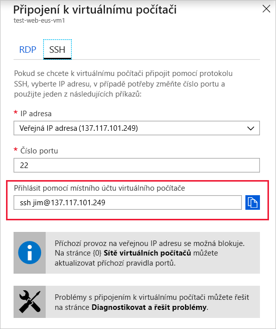

Pojďme se připojit k virtuálnímu počítači s Linuxem přes SSH a nakonfigurovat Apache, abychom měli funkční webový server.

### <a name="get-the-public-ip-address-of-the-vm"></a>Získání veřejné IP adresy virtuálního počítače

1. Na webu [Azure Portal](https://portal.azure.com/learn.docs.microsoft.com?azure-portal=true) se ujistěte, že je otevřený panel **Přehled** s vytvořeným virtuálním počítačem. Pokud potřebujete virtuální počítač otevřít, najdete ho v části **Všechny prostředky**. Možnosti panelu Přehled:

    - Můžete se podívat, jestli je virtuální počítač spuštěný.
    - Můžete virtuální počítač zastavit nebo ho restartovat.
    - Můžete získat veřejnou IP adresu virtuálního počítače.
    - Můžete se podívat na činnost procesoru, disku a sítě.

1. Nahoře v podokně klikněte na tlačítko **Připojit**.

1. Na panelu **Připojit k virtuálnímu počítači** si všimněte nastavení **IP adresa** a **Číslo portu**. Na kartě **SSH** také najdete příkaz, který se používá k připojení k virtuálnímu počítači a spouští se místně. Zkopírujte si příkaz do schránky.

    

## <a name="connect-with-ssh"></a>Připojení přes SSH

1. Příkaz ze schránky vložte do Azure Cloud Shellu. Měl by vypadat podobně, jako na následujícím příkladu, ale bude mít jinou IP adresu (a asi i jiné uživatelské jméno, pokud jste nepoužili **jim**):

    ```bash
    ssh jim@137.117.101.249
    ```

    Při prvním připojení nás SSH vyzve k ověření neznámého hostitele. SSH vám říká, že jste se k tomuto serveru ještě nepřipojovali. Pokud je to pravda, je to v pořádku a odpovědí **Ano** uložte otisk serveru do souboru známých hostitelů:

    ```output
    The authenticity of host '137.117.101.249 (137.117.101.249)' can't be established.
    ECDSA key fingerprint is SHA256:w1h08h4ie1iMq7ibIVSQM/PhcXFV7O7EEhjEqhPYMWY.
    Are you sure you want to continue connecting (yes/no)? yes
    Warning: Permanently added '137.117.101.249' (ECDSA) to the list of known hosts.
    ```

1. Tento příkaz otevře připojení SSH a přenese vás do linuxového prostředí příkazového řádku.

1. Zkuste spustit několik linuxových příkazů.
    - `ls -la /` – zobrazení kořenového adresáře disku
    - `ps -l` – zobrazení všech spuštěných procesů
    - `dmesg` – zobrazení seznamu všech zpráv jádra
    - `lsblk` – zobrazení seznamu všech blokových zařízení (tady vidíte svoje disky)

    Zajímavější je podívat se, jaké disky v seznamu _chybí_. Všimněte si, že náš disk **Data** (`sdc`) v seznamu je, ale není připojený k systému souborů. Služba Azure přidala virtuální pevný disk, ale neinicializovala ho.

## <a name="initialize-data-disks"></a>Inicializace datových disků

Všechny další jednotky, které vytvoříte úplně od začátku, je potřeba inicializovat a naformátovat. Postup inicializace je stejný jako u fyzického disku:

1. Napřed disk identifikujte. To už jsme udělali. Můžete také použít příkaz `dmesg | grep SCSI`, který zobrazí seznam všech zpráv jádra o zařízeních SCSI.

1. Když víte, jakou jednotku (`sdc`) potřebujete inicializovat, můžete k tomu použít příkaz `fdisk`. Příkaz budete muset spustit příkazem `sudo` a zadat disk, na kterém chcete vytvořit oddíl. Chceme vytvořit nový primární oddíl pomocí následujícího příkazu:

    ```bash
    (echo n; echo p; echo 1; echo ; echo ; echo w) | sudo fdisk /dev/sdc
    ```

1. Teď potřebujeme do oddílu zapsat systém souborů příkazem `mkfs`.

    ```bash
    sudo mkfs -t ext4 /dev/sdc1
    ```

1. Nakonec musíme připojit jednotku do systému souborů. Předpokládejme, že máme složku `data`. Pojďme vytvořit složku bodu připojení a připojit jednotku.

    ```bash
    sudo mkdir /data & sudo mount /dev/sdc1 /data
    ```

    > [!TIP]
    > Inicializovali jsme disk a připojili jsme ho. Pokud vás zajímají další podrobnosti o tomto procesu, projděte si modul **Přidání a úprava velikosti disků ve službě Azure Virtual Machines**. Této úloze se tam věnujeme podrobněji.

## <a name="install-software-onto-the-vm"></a>Instalace softwaru na virtuální počítač

Vidíte, že SSH umožňuje pracovat s linuxovým virtuálním počítačem úplně stejně jako s místním počítačem. Virtuální počítač můžete spravovat stejně jako jakýkoli jiný linuxový počítač. Můžete instalovat software, konfigurovat role, upravovat funkce a provádět další běžné úlohy. Na chvíli se zastavíme u instalace softwaru.

Pokud jste k virtuálnímu počítači připojení přes SSH, můžete software nainstalovat z internetu. Počítače Azure jsou automaticky připojené k internetu. Oblíbené softwarové balíčky můžete instalovat standardními příkazy přímo ze standardních úložišť. Tento způsob použijeme k instalaci Apache.

### <a name="install-the-apache-web-server"></a>Instalace webového serveru Apache

Apache je dostupný ve výchozích softwarových úložištích Ubuntu, takže k jeho instalaci použijeme standardní nástroje pro správu balíčků:

1. Nejprve aktualizujte místní index balíčků, aby odpovídal posledním upstreamovým změnám:

    ```bash
    sudo apt-get update
    ```

1. Potom nainstalujte Apache:

    ```bash
    sudo apt-get install apache2 -y
    ```

1. Měl by se spustit automaticky. Jeho stav zkontrolujete příkazem `systemctl`:

    ```bash
    sudo systemctl status apache2 --no-pager
    ```

    Příkaz `systemctl` vrátí podobné údaje jako v následujícímu příkladu:

    ```output
    apache2.service - The Apache HTTP Server
       Loaded: loaded (/lib/systemd/system/apache2.service; enabled; vendor preset: enabled)
      Drop-In: /lib/systemd/system/apache2.service.d
               └─apache2-systemd.conf
       Active: active (running) since Mon 2018-09-03 21:00:03 UTC; 1min 34s ago
     Main PID: 11156 (apache2)
        Tasks: 55 (limit: 4915)
       CGroup: /system.slice/apache2.service
               ├─11156 /usr/sbin/apache2 -k start
               ├─11158 /usr/sbin/apache2 -k start
               └─11159 /usr/sbin/apache2 -k start

    test-web-eus-vm1 systemd[1]: Starting The Apache HTTP Server...
    test-web-eus-vm1 apachectl[11129]: AH00558: apache2: Could not reliably determine the server's fully qua
    test-web-eus-vm1 systemd[1]: Started The Apache HTTP Server.
    ```
    > [!NOTE]
    > Spuštění příkazů, jako je tento, je jednoduché, ale je potřeba je spouštět ručně. Pokud stále instalujete software, můžete použít skriptování a celý postup automatizovat.

1. Nakonec můžeme zkusit načíst výchozí stránku pomocí veřejné IP adresy. Nicméně i v případě, že webový server běží na virtuálním počítači, nezískáte platné připojení nebo odpověď. Víte proč?

Abychom mohli komunikovat s webovým serverem, potřebujeme udělat ještě jeden krok. Naše virtuální síť blokuje příchozí požadavek. To můžeme změnit v konfiguraci. Pojďme se podívat, jak povolit příchozí požadavek.