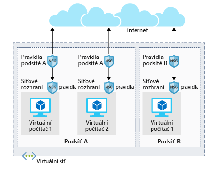

Úpravy konfigurace serveru se běžně provádějí u vybavení v místním prostředí. V tomto smyslu můžete virtuální počítače Azure chápat jako rozšíření tohoto prostředí. Prostřednictvím nástrojů, jako jsou Azure Portal, Azure CLI nebo Azure PowerShell, můžete měnit konfiguraci, spravovat sítě, otevřít nebo blokovat provoz a další.

Máme spuštěný server a nainstalovaný Apache, který poskytuje stránky. Náš bezpečnostní tým vyžaduje, abychom zamkli všechny naše servery, a s tímto virtuálním počítačem jsme zatím nic nedělali. Protože jsme nic neudělali, virtuální počítač nechal Apache naslouchat na portu 80. Pojďme prozkoumat konfiguraci sítě Azure. Dozvíte se, jak použít integrovanou podporu zabezpečení k posílení bezpečnosti našeho serveru.

## Otevření portů virtuálních počítačů Azure

Ve výchozím nastavení jsou nové virtuální počítače uzamčeny. 

Aplikace mohou vytvářet odchozí požadavky, ale příchozí provoz je povolený jen z virtuální sítě (například další prostředky ze stejné místní sítě) a z nástroje Azure Load Balancer (kontrolní testy).

Pokud chcete změnit konfiguraci kvůli podpoře různých síťových protokolů, jsou potřeba dva kroky. Při vytváření nového virtuálního počítače můžete otevřít několik běžných portů (RDP, HTTP, HTTPS a SSH). Další potřebné změny brány firewall ale musíte udělat ručně.

Tento postup se skládá ze dvou kroků:

1. Vytvoření skupiny zabezpečení sítě
2. Vytvoření příchozího pravidla, které povolí provoz na potřebných portech

### Co je skupina zabezpečení sítě?

Virtuální sítě (VNet) tvoří základ síťového modelu Azure a nabízejí izolaci a ochranu. Primárním nástrojem, který slouží k prosazování a řízení pravidel síťového provozu na úrovni sítě, jsou skupiny zabezpečení sítě (NSG). Skupiny zabezpečení sítě představují volitelnou vrstvu zabezpečení. Tato vrstva funguje jako softwarová brána firewall, která ve virtuální síti filtruje příchozí a odchozí provoz. 

Skupiny zabezpečení můžete přidružit k síťovému rozhraní (pravidla pro jednotlivé hostitele), podsíti ve virtuální síti (pokud je chcete použít pro více prostředků) nebo k oběma úrovním. 

#### Pravidla skupin zabezpečení

Skupiny zabezpečení sítě používají _pravidla_, která povolí nebo zakážou provoz v síti. Každé pravidlo určuje zdrojovou a cílovou adresu (nebo rozsah), protokol, port (nebo rozsah), směr (příchozí nebo odchozí), číselnou prioritu a údaj, zda se má provoz, který tomuto pravidlu odpovídá, povolit nebo zakázat.

Každá skupina zabezpečení má sadu výchozích pravidel zabezpečení, která používají výchozí síťová pravidla popsaná výše. Výchozí pravidla nemůžete změnit, ale _můžete_ je přepsat.

#### Jak Azure používá síťová pravidla

Azure při příchozím provozu zpracuje skupinu zabezpečení přidruženou k podsíti a následně skupinu zabezpečení použitou u síťového rozhraní. U odchozího provozu probíhá zpracování v opačném pořadí (napřed síťové rozhraní a potom podsíť).

> [!WARNING]  
> Nezapomeňte, že skupiny zabezpečení jsou na obou úrovních volitelné. Pokud není použita žádná skupina zabezpečení, Azure **povolí veškerý provoz**. Pokud má virtuální počítač veřejnou IP adresu, může to být velké riziko, zejména když operační systém nemá integrovanou bránu firewall.

Pravidla se vyhodnocují v _pořadí podle priority_ počínaje pravidlem s **nejnižší prioritou**. Pravidla odmítnutí vyhodnocování vždy **zastaví**. Pokud například pravidlo síťového rozhraní zablokuje odchozí požadavek, nebudou se kontrolovat pravidla použitá u podsítě. Aby provoz prošel skupinou zabezpečení, musí projít _všemi_ použitými skupinami.

Posledním pravidlem je vždy pravidlo **Zamítnout vše**. Jde o výchozí pravidlo přidané do každé skupiny zabezpečení pro příchozí a odchozí provoz s prioritou 65500. To znamená, že aby provoz prošel skupinou zabezpečení, _musíte mít pravidlo povolení_, jinak ho poslední výchozí pravidlo zablokuje.

> [!NOTE]  
> SMTP (port 25) je zvláštní případ. V závislosti na úrovni předplatného a datu vytvoření účtu může být odchozí provoz SMTP zablokovaný. Můžete požádat, aby toto omezení bylo v odůvodněných případech odebráno.

Protože jsme pro tento virtuální počítač zatím skupinu zabezpečení nevytvořili, pojďme to udělat a použít ji.

## Vytváření skupin zabezpečení sítě

Jako skoro všechno v Azure i skupiny zabezpečení jsou spravované prostředky. Můžete je vytvořit na webu Azure Portal nebo skriptovacími nástroji příkazového řádku. Problematické je definování těchto pravidel. Pojďme se podívat na definici nového pravidla, které povolí přístup HTTP, a zablokuje všechno ostatní.