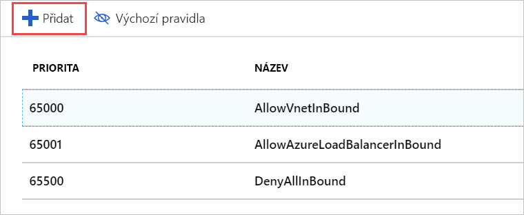
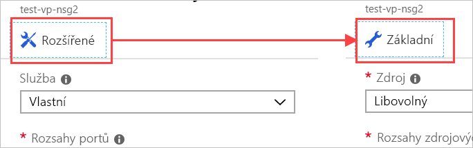
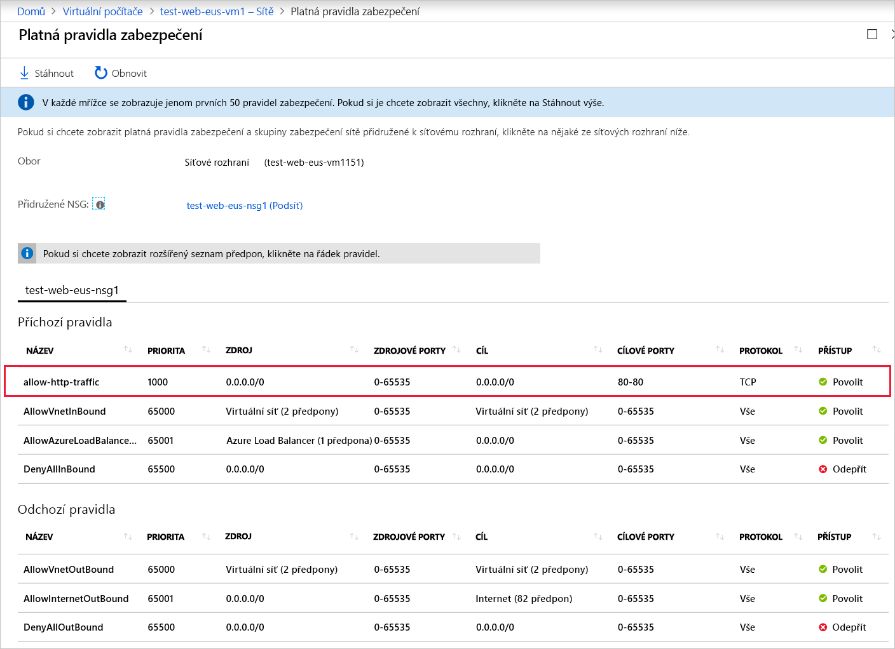

Teď v naší síti použijeme skupinu zabezpečení sítě, abychom na serveru povolili jenom provoz HTTP.

## Vytvoření skupiny zabezpečení sítě

Služba Azure za nás měla vytvořit skupinu zabezpečení, protože jsme uvedli, že chceme k přístupu použít protokol SSH. Pojďme ale vytvořit novou skupinu zabezpečení, abyste si prošli celý postup. To je zvlášť důležité, pokud se rozhodnete vytvořit virtuální síť _před_ virtuálními počítači. Jak už jsme zmínili dřív, skupiny zabezpečení jsou _volitelné_ a nemusí se nutně vytvořit společně se sítí.

1. Na webu [Azure Portal](https://portal.azure.com/learn.docs.microsoft.com?azure-portal=true) klikněte na tlačítko **Vytvořit prostředek** v levém rohu bočního panelu a začněte vytvářet nový prostředek.

1. Do pole filtru zadejte **Skupina zabezpečení sítě** a v seznamu vyberte odpovídající položku.

1. Ověřte, že je vybraný model nasazení **Resource Manager**, a klikněte na **Vytvořit**.

1. Zadejte **Název** skupiny zabezpečení. Připomínáme, že při vytváření názvů je vhodné používat určité zásady. Použijeme **test-web-eus-nsg1** pro **Testovací skupinu zabezpečení sítě webu 1 na východě USA**. Pravděpodobně budete chtít změnit část názvu týkající se umístění podle toho, kde se skupina zabezpečení nachází.

1. Vyberte správné **Předplatné** a použijte stávající **skupinu prostředků**.

1. Nakonec ji dejte do stejného **Umístění** jako virtuální počítač / virtuální síť. Je to důležité; pokud se tento prostředek nachází v jiném umístění, nebude ho možné použít.

1. Vytvořte skupinu kliknutím na **Vytvořit**.

## Přidání nového příchozího pravidla do skupiny zabezpečení sítě

Nasazení by mělo proběhnout rychle. Po dokončení můžeme do skupiny zabezpečení přidat nová pravidla:

1. Na webu Azure Portal vyhledejte prostředek nové skupiny zabezpečení a vyberte ho.

1. Na stránce přehledu zjistíte, že jsou v něm vytvořená výchozí pravidla, která zamknou síť.

    Na příchozí straně:

    - Veškerý příchozí provoz z jedné virtuální sítě do jiné je povolený. To znamená, že prostředky ve virtuální síti spolu můžou navzájem komunikovat.
    - **Test** Azure Load Balanceru vyžaduje, aby byl virtuální počítač aktivní.
    - Veškerý ostatní příchozí provoz je zamítnutý.

    Na odchozí straně:
    - Veškerý provoz v rámci virtuální sítě je povolený.
    - Veškerý odchozí provoz do internetu je povolený.
    - Veškerý další odchozí provoz je zakázaný.

    > [!NOTE]
    > Tato výchozí pravidla mají nastavenou vysokou prioritu, což znamená, že se vyhodnocují _jako poslední_. Nelze je změnit ani odstranit, ale můžete je _přepsat_ vytvořením konkrétnějších pravidel, která odpovídají vašemu provozu a mají nižší prioritu.

1. Na panelu **Nastavení** skupiny zabezpečení klikněte na oddíl **Příchozí pravidla zabezpečení**.

1. Pokud chcete přidat nové pravidlo zabezpečení, klikněte na **+ Přidat**.

    

    Existují dva způsoby, jak zadat potřebné informace o pravidlu zabezpečení: základní a rozšířený. Můžete mezi nimi přepínat kliknutím na tlačítko nahoře na panelu pro **přidání**.

    

    Rozšířený režim umožňuje pravidlo zcela přizpůsobit. Pokud je ale potřeba nakonfigurovat známý protokol, pracuje se v základním režimu o něco snadněji.

1. Přepněte do základního režimu.

1. Přidejte informace o pravidlu HTTP:

    - Pole **Služba** nastavte na HTTP. Tím se nastaví rozsah portů.
    - Pole **Priorita** nastavte na **1000**. Číslo musí být nižší než má výchozí pravidlo **Odepřít**. Rozsah může začínat libovolnou hodnotou, doporučuje se ale nechat si místo pro případ, že byste později potřebovali vytvořit výjimku.
    - Pojmenujte pravidlo. My použijeme název **allow-http-traffic**.
    - Zadejte popis pravidla.

1. Přepněte zpět do **rozšířeného** režimu. Všimněte si, že naše nastavení tam pořád je. Na tomto panelu můžeme provést podrobnější nastavení. Pravděpodobně budeme chtít omezit **zdroj** na určitou IP adresu nebo jejich rozsah vyhrazený pro kamery. Pokud znáte aktuální IP adresu místního počítače, můžete ji vyzkoušet. Jinak nechte nastavení na hodnotě **Jakýkoliv**, abyste mohli pravidlo otestovat.

1. Kliknutím na **Přidat** vytvořte pravidlo. Tím se aktualizuje seznam příchozích pravidel. Všimněte si, že jsou seřazená podle priority a v tomto pořadí se také budou vyhodnocovat.

## Použití skupiny zabezpečení

Skupinu zabezpečení můžeme použít pro síťové rozhraní, pokud chceme chránit jeden virtuální počítač, nebo pro podsíť, kde se použije u všech prostředků v této podsíti. Druhý přístup je častější a použijeme ho i my. K tomuto prostředku se v Azure můžeme dostat buď přes prostředek virtuální sítě, nebo nepřímo přes virtuální počítač, který tuto virtuální síť používá.

1. Přepněte na panel **Přehled** příslušného virtuálního počítače. Virtuální počítač najdete v části **Všechny prostředky**.

1. V oddílu **Nastavení** vyberte položku **Sítě**.

1. Ve vlastnostech sítí najdete informace o sítích použitých pro virtuální počítač, včetně položky **Virtuální síť/podsíť**. Kliknutím na tento odkaz přejděte k prostředku. Kliknutím otevřete virtuální síť. Tento odkaz je _také_ na panelu **Přehled** virtuálního počítače. Oběma postupy otevřete panel **Přehled** virtuální sítě.

1. V části **Nastavení** vyberte položku **Podsítě**.

1. Měli bychom mít definovanou jednu podsíť (výchozí) vytvořenou dříve při vytváření virtuálního počítače a sítě. Po kliknutí na položku v seznamu se zobrazí podrobné informace.

1. Klikněte na položku **Skupina zabezpečení sítě**.

1. Vyberte novou skupinu zabezpečení **test-web-eus-nsg1**. Měla by tady být i další skupina vytvořená s virtuálním počítačem.

1. Kliknutím na **Uložit** uložte změnu. Bude chvíli trvat, než se v síti projeví.

## Aktualizace skupiny zabezpečení sítě v síťovém rozhraní

Port 80 je sice pro skupinu zabezpečení sítě použitou pro podsíť otevřený, ale bude blokovaný, protože není aktuálně povolený pro skupinu zabezpečení sítě použitou pro síťové rozhraní. Pojďme to opravit a pak bychom měli být schopni se připojit.

1. Přepněte zpět na panel **Přehled** virtuálního počítače. Virtuální počítač najdete v části **Všechny prostředky**.

1. V oddílu **Nastavení** vyberte položku **Sítě**.

1. V části **Pravidla portů pro příchozí spojení** byste měli vidět pravidla skupiny zabezpečení sítě pro podsíť a hned pod nimi pak pravidla skupiny zabezpečení sítě pro síťové rozhraní. V pravidlech skupiny zabezpečení sítě pro síťové rozhraní vyberte **Přidat pravidlo portu pro příchozí spojení**.

1. Přepněte do základního režimu.

1. Přidejte informace o pravidlu HTTP:

    - Pole **Služba** nastavte na HTTP. Tím se nastaví rozsah portů.
    - **Prioritu** nastavte na **310**.
    - Pojmenujte pravidlo. My použijeme název **allow-http-traffic**.
    - Zadejte popis pravidla.

1. Kliknutím na **Přidat** vytvořte pravidlo.

## Ověření pravidel

Teď tuto změnu ověříme:

1. Přepněte zpět na panel **Přehled** virtuálního počítače. Virtuální počítač najdete v části **Všechny prostředky**.

1. V oddílu **Nastavení** vyberte položku **Sítě**.

1. V podrobnostech síťového rozhraní je odkaz **Platná pravidla zabezpečení**, který vám rychle ukáže, jak se budou pravidla vyhodnocovat. Kliknutím na odkaz otevřete analýzu a zkontrolujte, že se nová pravidla zobrazují.

    

1. Nejlepší způsob, jak ověřit, že všechno funguje, je odeslat na server požadavek HTTP. Teď by měl fungovat.

    

## Ještě jedna věc

Při nastavování pravidel zabezpečení musíte být pozorní, abyste je nastavili správně. Při použití nové skupiny zabezpečení jsme udělali chybu, kvůli které jsme ztratili přístup přes SSH. Opravíte to tak, že skupině zabezpečení použité pro podsíť přidáte další pravidlo, které povoluje přístup přes SSH. Ujistěte se, že příchozí adresy TCP/IP pro toto pravidlo jsou omezeny na vaše vlastní.

> [!WARNING]
> Vždy se ujistěte, že porty používané pro správu jsou zamčené. Ještě lepší je vytvořit síť VPN, která virtuální síť propojí s vaší soukromou sítí a povolí jenom požadavky protokolu RDP nebo SSH z daného rozsahu adres. Můžete také změnit port používaný protokolem SSH na jinou hodnotu, než je výchozí. Mějte na paměti, že změna portů k zastavení útoků nestačí. Bude jenom trochu obtížnější je objevit.