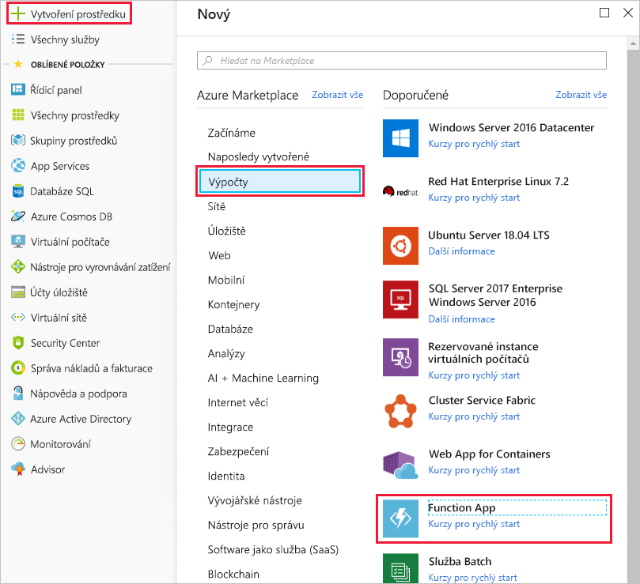

Nyní jste připravení spustit implementaci služby teploty. V předchozí lekci jste určili, že by vašim potřebám nejlépe vyhovovalo řešení bez serveru. Začněme vytvořením aplikace funkcí, ve které bude funkce Azure uložena.

[!include]

## Co je aplikace funkcí?

Funkce jsou hostované v kontextu provádění nazývaném **aplikace funkcí**. Aplikace funkcí definujete, aby byly vaše funkce a výpočetní prostředky v Azure logicky seskupené a strukturované. V našem příkladu s výtahem byste například vytvořili aplikaci funkcí, která by hostovala službu teploty hnacího ústrojí eskalátoru. Před vytvořením aplikace funkcí musíte učinit několik rozhodnutí – vybrat plán služby a kompatibilní účet úložiště.

### Výběr plánu služby

Aplikace funkcí můžou používat jeden ze dvou typů plánů služby. Prvním plánem služby je **plán Consumption**. Tento plán vyberte, pokud používáte platformu aplikací Azure bez serveru. Plán služby Consumption zajišťuje automatické škálování a účtuje vám pouze za běžící funkce. Plán Consumption má konfigurovatelný časový limit k provedení funkce. Ve výchozím nastavení je to 5 minut, ale můžete ho nakonfigurovat až na 10 minut.

Druhý plán se nazývá **plán služby Azure App Service**. Tento plán umožňuje vyhnout se časovým limitům díky tomu, že vaše funkce budou nepřetržitě spuštěné na virtuálním počítači, který nadefinujete. Pokud používáte plán služby App Service, zodpovídáte za správu prostředků aplikace, na kterých funkce běží. Technicky vzato tedy nejde o plán bez serveru. Může však jít o lepší volbu, pokud se vaše funkce používají nepřetržitě nebo vyžadují větší výpočetní výkon nebo delší čas provedení, než nabízí plán Consumption.

### Požadavky na účet úložiště

Když vytvoříte aplikaci funkcí, je potřeba propojit ji s účtem úložiště. Můžete vybrat existující účet nebo vytvořit nový. Aplikace funkcí tento účet úložiště používá k interním operacím, jako je protokolování provádění funkcí nebo správa aktivačních událostí provádění. U plánu služby Consumption slouží také jako úložiště kódu funkcí a konfiguračních souborů.

## Vytvoření aplikace funkcí

Ted společně vytvoříme na webu Azure Portal aplikaci funkcí.

1. Pomocí stejného účtu, kterým jste aktivovali sandbox, se přihlaste k webu [Azure Portal](https://portal.azure.com/learn.docs.microsoft.com?azure-portal=true).

1. V levém horním rohu webu Azure Portal vyberte tlačítko **Vytvořit prostředek** a pak vyberte **Začínáme > Serverless Function App**. Otevře se okno *Vytvořit* pro aplikaci funkcí. Alternativně můžete použít možnost **Výpočty > Function App**, která otevře totéž okno.

  

1. Zvolte globálně jedinečný název aplikace. Ten bude sloužit jako základní adresa URL vaší služby. Můžete ji například nazvat **escalator-functions-xxxxxxx**, kde písmena x nahradíte svými iniciálami a rokem narození. Pokud to není globálně jedinečný název, můžete zkusit nějakou jinou kombinaci. Platné znaky jsou a až z, 0 až 9 a -.

1. Vyberte předplatné Azure, ve kterém chcete aplikaci funkcí hostovat.

1. Vyberte existující skupinu prostředků **<rgn>[název skupiny prostředků sandboxu]</rgn>**.

1. Jako operační systém vyberte **Windows**.

1. V části **Plán Hosting** vyberte **Plán Consumption**, který představuje možnost hostování bez serveru.

1. Z níže uvedeného seznamu vyberte zeměpisné místo, které je k vám nejblíže. V produkčním systému byste vybrali místo blízko vašim zákazníkům nebo uživatelům funkce.

    [!include]

1. Pro **Zásobník modulu Runtime** vyberte v rozevíracím seznamu JavaScript, což je jazyk, ve kterém v tomto cvičení implementujeme příklady funkcí.

1. Vytvořte nový účet úložiště. Azure ho pojmenuje podle názvu aplikace. Pokud chcete, můžete název změnit, ale musí zůstat jedinečný.

1. Zkontrolujte, že je služba Azure Application Insights nastavená na **Zapnuto**, a vyberte oblast, která je k vám (nebo k vašim zákazníkům) nejblíže.

1. Vyberte **Vytvořit**. Nasazení bude trvat několik minut. Až se dokončí, přijde vám oznámení.

## Ověření aplikace funkcí Azure

1. V nabídce webu Azure Portal vlevo vyberte **Skupiny prostředků**. V seznamu dostupných skupin byste měli vidět skupinu prostředků s názvem **<rgn>[název skupiny prostředků sandboxu]</rgn>**.

    ![Snímek obrazovky webu Azure Portal znázorňující okno Skupiny prostředků s položkou nabídky Skupiny prostředků a zvýrazněnou položkou seznamu <rgn>[název skupiny prostředků sandboxu]</rgn>](../media/3-resource-group.png)

1. Vyberte skupinu prostředků **<rgn>[název skupiny prostředků sandboxu]</rgn>**. Měl by se zobrazit seznam prostředků zhruba jako ten následující.

    ![Snímek obrazovky webu Azure Portal znázorňující všechny prostředky ve skupině <rgn>[název skupiny prostředků sandboxu]</rgn> včetně položek pro plán služby App Service, účtu úložiště, prostředku služby Application Insights a služby App Service](../media/3-resource-list.png)

Položka s ikonou Funkce a bleskem uvedená jako služba App Service je vaší novou aplikací funkcí. Když na ni kliknete, otevřou se podrobnosti o nové funkci – má přiřazenou veřejnou adresu URL. Pokud ji otevřete v prohlížeči, měla by se zobrazit výchozí webová stránka, která označuje, že aplikace funkcí je spuštěná.
