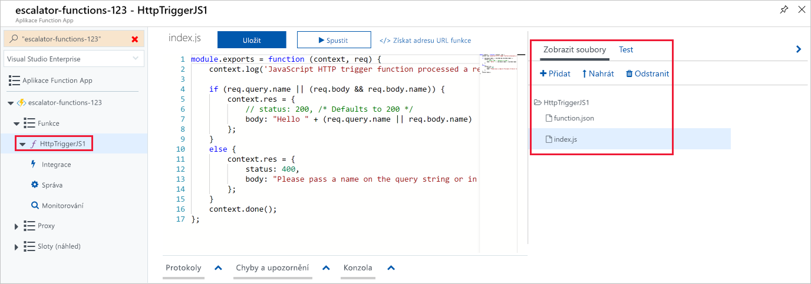
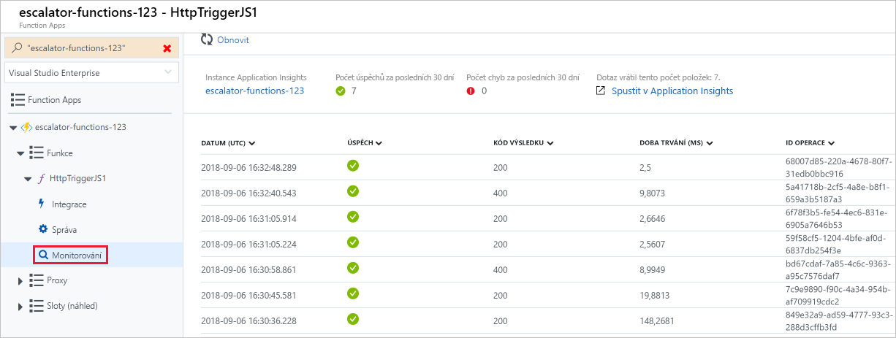

Vytvořili jsme aplikaci funkcí a teď si ukážeme, jak sestavit, nakonfigurovat a spustit funkci.

### <a name="triggers"></a>Aktivační události

Funkce jsou řízené událostmi, což znamená, že se spouštějí v reakci na událost.

Typ události, která spouští funkci, se označuje jako **aktivační událost**. Funkci je třeba konfigurovat s právě jednou aktivační událostí.

Azure podporuje aktivační události pro následující služby.

| Služba                 | Popis aktivační události  |
|-------------------------|---------|
| Blob Storage            | Funkce se spustí při zjištění nového nebo aktualizovaného objektu blob.       |
| Databáze Cosmos               | Funkce se spustí při zjištění vkládání nebo aktualizací.      |
| Event Grid              | Funkce se spustí při přijetí události ze služby Event Grid.       |
| HTTP                    | Funkce se spustí při požadavku HTTP.      |
| Události Microsoft Graphu  | Funkce se spustí v reakci na příchozí webhook ze služby Microsoft Graph. Každá instance této aktivační události může reagovat na jeden typ prostředku služby Microsoft Graph.       |
| Queue Storage           | Funkce se spustí při přijetí nové položky do fronty. Jako vstup funkce se poskytuje zpráva fronty.      |
| Service Bus             | Funkce se spustí v reakci na zprávy z fronty služby Service Bus.       |
| Časovač                   | Funkce se spustí podle plánu.       |

### <a name="bindings"></a>Vazby

Vazby představují deklarativní způsob, jak k funkci připojit data a služby. Vazby zvládají komunikovat s různými službami, takže ve své funkci nemusíte psát kód pro připojení ke zdrojům dat a spravovat tato připojení. Platforma se o to v kódu vazby postará za vás. Každá vazba má svůj směr – kód načítá data ze *vstupních* vazeb a zapisuje je do *výstupních* vazeb. Každá funkce může ke správě vstupních a výstupních dat, která zpracovává, používat více vazeb (nebo žádnou).

Trigger je speciální typ vstupní vazby, který disponuje zvláštní možností spustit funkci.

Azure nabízí [velký počet vazeb](https://docs.microsoft.com/azure/azure-functions/functions-triggers-bindings#supported-bindings) pro připojení k různým službám úložiště a zasílání zpráv.

### <a name="a-sample-binding-definition"></a>Ukázková definice vazby

V následujícím příkladu nakonfigurujeme funkci se vstupní vazbou (aktivační procedurou) a výstupní vazbou. Řekněme, že chceme načíst data z úložiště objektů Blob, zpracovat je v naší funkci a poté zapsat zprávu do fronty. K tomu můžeme nakonfigurovat _vstupní vazbu_ typu *blob* a _výstupní vazbu_ typu *fronta*.

Vazby se definují na webu Azure Portal a ukládají se jako soubory JSON, které se dají také přímo upravovat. Následující soubor JSON představuje ukázkovou definici triggeru a vazby pro funkci.

```json
{
  "bindings": [
    {
      "name": "order",
      "type": "queueTrigger",
      "direction": "in",
      "queueName": "myqueue-items",
      "connection": "MY_STORAGE_ACCT_APP_SETTING"
    },
    {
      "name": "$return",
      "type": "table",
      "direction": "out",
      "tableName": "outTable",
      "connection": "MY_TABLE_STORAGE_ACCT_APP_SETTING"
    }
  ]
}
```

Tato ukázka znázorňuje funkci aktivovanou při přidání zprávy do fronty s názvem **myqueue-items**. Hodnota vrácená funkcí se odešle do tabulky **outTable** v Azure Table Storage. Tento příklad je velmi jednoduchý. Mohli bychom také pomocí vazby SendGrid změnit výstup na e-mail nebo vložit událost do služby Service Bus a předat tak upozornění do některé jiné součásti architektury nebo dokonce vytvořit několik výstupních vazeb, které budou předávat data do různých služeb.

## <a name="creating-a-function-in-the-azure-portal"></a>Vytvoření funkce na webu Azure Portal

Azure poskytuje několik předpřipravených šablon funkcí určených pro běžné scénáře.

### <a name="quickstart-templates"></a>Šablony Rychlý start

Při přidávání první funkce se vám zobrazí obrazovka rychlého startu. Na této obrazovce můžete zvolit typ triggeru (HTTP, časovač nebo data) a programovací jazyk (C#, JavaScript, F# nebo Java). Na základě vašeho výběru pak Azure vygeneruje kód funkce a konfiguraci včetně vzorového kódu pro zobrazení přijatých vstupních dat v protokolu.

### <a name="custom-function-templates"></a>Vlastní šablony funkcí

Výběr šablon Rychlý start poskytuje snadný přístup k nejběžnějším scénářům. Azure však poskytuje více než 30 dalších šablon, se kterými můžete začít. Jsou na výběr na obrazovce se seznamem šablon, kterou můžete otevřít při vytváření následných funkcí, nebo prostřednictvím možnosti **Vlastní funkce** na obrazovce rychlého startu.

- Trigger HTTP s jazykem C#, F# nebo JavaScript
- Aktivační událost typu Časovač s jazykem C#, F# nebo JavaScript
- Aktivační událost typu Fronta s jazykem C#, F# nebo JavaScript
- Aktivační událost fronty Service Bus s jazykem C#, F# nebo JavaScript
- Trigger služby Cosmos DB s jazykem C# nebo JavaScript
- Aktivační událost služby IoT Hub (centra událostí) s jazykem C#, F# nebo JavaScript
- …a mnoho dalších

## <a name="navigating-to-your-function-and-files"></a>Přechod na funkci a soubory

Když vytvoříte funkci ze šablony, vytvoří se několik souborů. Pokud jste se třeba rozhodli použít rychlý start pro webhook a rozhraní API s JavaScriptem, vygeneruje se konfigurační soubor **function.json** a soubor zdrojového kódu **index.js**. Funkce, které vytvoříte v aplikaci funkcí, se zobrazí na portálu aplikace funkcí v položce nabídky **Funkce**.

Když svou funkci vyberete v aplikaci funkcí, otevře se editor kódu a zobrazí kód funkce, jak je vidět na následujícím snímku obrazovky.



Jak vidíte na předchozím snímku obrazovky, vpravo je kontextová nabídka, která obsahuje kartu pro **zobrazení souborů**. Na této kartě se zobrazí struktura souborů tvořících vaši funkci.

## <a name="testing-your-azure-function"></a>Testování funkce Azure

Až funkci vytvoříte, je dobré ji otestovat. Můžete to pojmout různě: buď funkci spustíte ručně, nebo ji otestujete přímo na webu Azure Portal.

### <a name="manual-execution"></a>Ruční spuštění

Funkci můžete spustit ruční aktivací nakonfigurovaného triggeru. Pokud například používáte trigger HTTP, můžete pomocí nástroje jako Postman nebo cURL inicializovat požadavek HTTP na adresu URL koncového bodu funkce. Ta je dostupná v definici triggeru HTTP (**Získat adresu URL funkce**).

### <a name="testing-in-the-azure-portal"></a>Testování na webu Azure Portal

Pohodlný způsob testování funkcí je dostupný také na webu Azure Portal. Na pravé straně okna kódu najdete kontextovou nabídku navigace s kartami. Tato nabídka obsahuje položku **Test**. Když nabídku rozbalíte a vyberete tuto kartu, můžete spustit svoji funkci a zobrazit výsledek. Když v tomto testovacím okně kliknete na **Spustit**, výsledky se společně se stavovým kódem zobrazí ve výstupním okně.

## <a name="monitoring-dashboard"></a>Řídicí panel sledování

Možnost monitorovat funkce je během vývoje i v produkčním prostředí velmi důležitá. Web Azure Portal obsahuje řídicí panel sledování, který je dostupný po zapnutí integrace Application Insights. Když v navigační nabídce aplikace funkcí rozbalíte uzel funkce, zobrazí se položka nabídky **Sledovat**. Tento monitorovací řídicí panel umožňuje rychlý přístup k historii provádění funkcí a zobrazuje časové razítko, kód výsledku, dobu trvání a ID operace naplněné ze služby Application Insights.



## <a name="streaming-log-window"></a>Okno protokolu streamování

Do své funkce můžete přidat také výpisy protokolů, které vám pomůžou s laděním na webu Azure Portal. Volané metody pro každý jazyk se předávají do objektu „protokolování“, který můžete použít k zaznamenávání informací do okna protokolu dostupného v kontextové nabídce s kartami v dolní části okna kódu.

Následující fragment kódu JavaScriptu ukazuje, jak zaprotokolovat zprávu pomocí metody `context.log` (obslužné rutině se předá objekt `context`).

```javascript
  context.log('Enter your logging statement here');
```

V jazyce C# bychom totéž mohli provést pomocí metody `log.Info`. V takovém případě se metodě jazyka C#, která funkci zpracovává, předá objekt `log`.

```csharp
  log.Info("Enter your logging statement here");
```

### <a name="errors-and-warnings-window"></a>Okno chyb a varování

Kartu s oknem chyb a varování najdete ve stejné kontextové nabídce jako okno protokolu. V tomto okně se zobrazují chyby kompilace a varování týkající se kódu.
