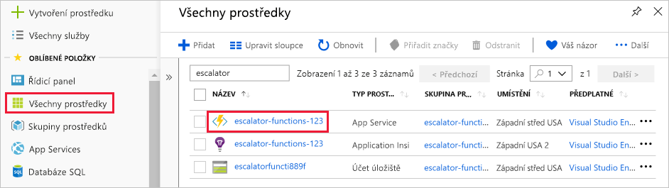
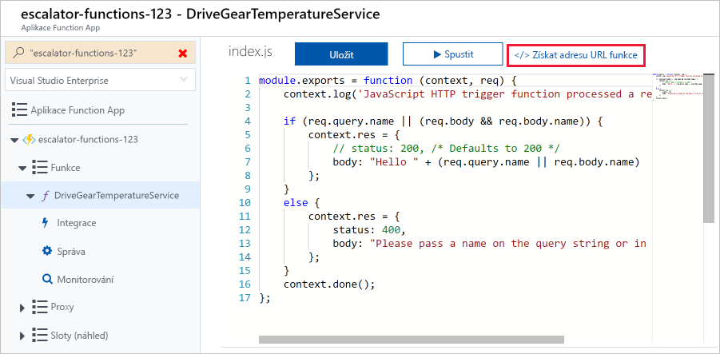
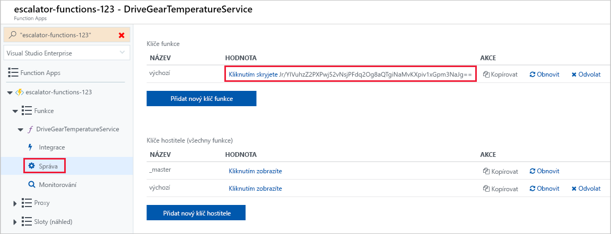
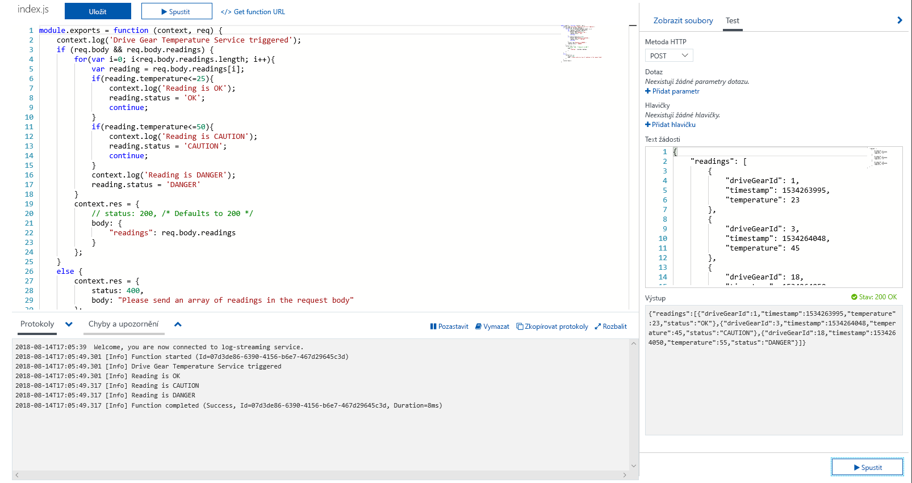
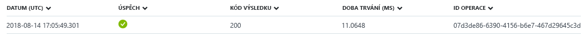

Teď rozvineme náš příklad s ozubeným převodem a přidáme logiku pro službu teploty. Konkrétně budeme přijímat data z požadavku HTTP.

## <a name="function-requirements"></a>Požadavky na funkci

Nejprve potřebujeme definovat několik požadavků na naši logiku:

- Teploty v rozmezí 0 až 25 ať se označí jako **OK**.
- Teploty v rozmezí 26 až 50 ať se označí výstrahou **POZOR**.
- Teploty nad 50 ať se označí výstrahou **NEBEZPEČÍ**.

## <a name="add-a-function-to-our-function-app"></a>Přidání funkce do aplikace funkcí

Jak jsme probírali v předchozí lekci, Azure poskytuje šablony, které vám pomůžou začít sestavovat funkce. V této lekci použijeme šablonu `HttpTrigger` k implementaci služby teploty.

1. Přihlaste se k webu [Azure Portal](https://portal.azure.com/learn.docs.microsoft.com?azure-portal=true).

1. Vyberte skupinu prostředků z prvního cvičení. V levé nabídce vyberte **Všechny prostředky** a potom vyberte **<rgn>[název skupiny prostředků sandboxu]</rgn>**.

1. Zobrazí se prostředky z dané skupiny. Vyberte položku **escalator-functions-xxxxxxx** (označenou ikonou blesku) a klikněte na název aplikace funkcí, kterou jste vytvořili v předchozím cvičení.

    

1. Klikněte na tlačítko Přidat (**+**) vedle **Funkce**. Tato akce spustí proces vytváření funkce.

1. Na stránce **Azure Functions pro JavaScript – Začínáme** vyberte **Na portálu** a potom **Pokračovat**.

1. V kroku **Vytvořit funkci** vyberte **Další šablony...** a pak vyberte **Dokončit a zobrazit šablony**.

1. V seznamu všech šablon dostupných pro tuto aplikaci funkcí vyberte **Trigger HTTP** .

1. V zobrazeném dialogovém okně **Nová funkce** zadejte do pole názvu text **DriveGearTemperatureService**. Jako Úroveň autorizace ponechte Funkce a kliknutím na tlačítko **Vytvořit** funkci vytvořte.

1. Když se vytváření funkce dokončí, otevře se editor kódu s obsahem souboru kódu *index.js*. Výchozí kód vygenerovaný šablonou je uvedený v následujícím fragmentu kódu.

    ```javascript
    module.exports = function (context, req) {
        context.log('JavaScript HTTP trigger function processed a request.');
    
        if (req.query.name || (req.body && req.body.name)) {
            context.res = {
                // status: 200, /* Defaults to 200 */
                body: "Hello " + (req.query.name || req.body.name)
            };
        }
        else {
            context.res = {
                status: 400,
                body: "Please pass a name on the query string or in the request body"
            };
        }
        context.done();
    };
    ```

    Funkce očekává, že jí bude předán název: buď prostřednictvím řetězce dotazu požadavku HTTP, nebo jako součást textu požadavku. Bude na něj reagovat vrácením zprávy **Hello, {název}**, takže zobrazí název, který jí byl odeslán v požadavku.

    Na pravé straně zobrazení zdroje najdete dvě karty. Karta **Zobrazit soubory** zobrazuje kód a konfigurační soubor funkce.  Výběrem možnosti **function.json** můžete zobrazit konfiguraci funkce, která by měla vypadat přibližně takto:

    ```javascript
    {
        "disabled": false,
        "bindings": [
        {
            "authLevel": "function",
            "type": "httpTrigger",
            "direction": "in",
            "name": "req"
        },
        {
            "type": "http",
            "direction": "out",
            "name": "res"
        }
        ]
    }
    ```

    Tato konfigurace deklaruje, že se funkce spustí, když obdrží požadavek HTTP. Výstupní vazba deklaruje, že se odpověď odešle jako odpověď HTTP.    

## <a name="test-the-function"></a>Testování funkce

> [!TIP]
> **cURL** je nástroj příkazového řádku, který se používá k odesílání nebo přijímání souborů. Je součástí systémů Linux, macOS a Windows 10 a dá se stáhnout také pro většinu ostatních operačních systémů. Nástroj cURL podporuje řadu protokolů, mimo jiné HTTP, HTTPS, FTP, FTPS, SFTP, LDAP, TELNET, SMTP nebo POP3. Další informace najdete na následujících odkazech:
>
>- <https://en.wikipedia.org/wiki/CURL>
>- <https://curl.haxx.se/docs/>

Pokud chcete funkci otestovat, můžete na její adresu URL odeslat požadavek HTTP pomocí nástroje cURL na příkazovém řádku. Ke zjištění adresy URL koncového bodu funkce je nutné se vrátit do kódu funkce a vybrat odkaz **Získat adresu URL funkce**, jak je vidět na následujícím snímku obrazovky. Dočasně tento odkaz uložte.



### <a name="securing-http-triggers"></a>Zabezpečení triggerů HTTP

Aktivační události HTTP umožňují pomocí klíčů rozhraní API blokovat neznámé volající tím, že požadují přítomnost klíče v každé žádosti. Při vytvoření funkce určíte _úroveň autorizace_. Standardně je nastavená na Funkce, což vyžaduje klíč rozhraní API specifický pro danou funkci, může ale být nastavená také na Správce, kdy se použije globální „hlavní“ klíč, nebo na Anonymní, což značí, že se nevyžaduje žádný klíč. Úroveň autorizace můžete změnit i po vytvoření funkce v jejích vlastnostech.

Protože jsme při vytváření této funkce zvolili možnost Funkce, budeme muset při odeslání požadavku HTTP poskytnout klíč. Můžete ho odeslat jako parametr řetězce dotazu s názvem `code`, nebo jako hlavičku HTTP (upřednostňováno) s názvem `x-functions-key`.

Funkce a hlavní klíče jsou umístěné v části **Správa** dostupné po rozbalení funkce. Ve výchozím nastavení jsou skryté a musíte je zobrazit.

1. Rozbalte funkci a vyberte část **Spravovat**, vyhledejte výchozí klíč funkce a zkopírujte ho do schránky.

    

1. Dále z příkazového řádku, kam jste nainstalovali nástroj **cURL**, naformátujte pomocí adresy URL funkce a klíče funkce příkaz cURL.

    - Použijte požadavek `POST`.
    - Přidejte hodnotu hlavičky `Content-Type` typu `application/json`.
    - Nezapomeňte adresu URL níže nahradit vlastní.
    - Předejte klíč funkce jako hodnotu hlavičky `x-functions-key`.

    ```bash
    curl --header "Content-Type: application/json" --header "x-functions-key: <your-function-key>" --request POST --data "{\"name\": \"Azure Function\"}" https://<your-url-here>/api/DriveGearTemperatureService
    ```

Funkce odpoví textem `"Hello Azure Function"`.

> [!CAUTION]
> Pokud používáte Windows, spusťte `cURL` z příkazového řádku. Prostředí PowerShell má příkaz *curl*, ale jde o alias pro Invoke-WebRequest, který není stejný jako `cURL`.

> [!NOTE]
> Testování můžete provést také z individuální sekce funkce pomocí karty **Test**, která se nachází vedle vybrané funkce. V tomto případě ale nebudete moct ověřit funkčnost systému klíče funkce, protože se to zde nevyžaduje. V rozhraní Test přidejte odpovídající hodnoty hlavičky a parametru a kliknutím na tlačítko **Spustit** si zobrazte výstup testu.

## <a name="add-business-logic-to-the-function"></a>Přidání obchodní logiky do funkce

Teď do funkce přidáme logiku, která zkontroluje přijímané hodnoty teploty a nastaví pro ně odpovídající stav.

Naše funkce očekává pole hodnot odečtů teploty. Následující fragment kódu JSON je příkladem textu požadavku, který do funkce odešleme. Každá položka `reading` obsahuje ID, časové razítko a teplotu.

```json
{
    "readings": [
        {
            "driveGearId": 1,
            "timestamp": 1534263995,
            "temperature": 23
        },
        {
            "driveGearId": 3,
            "timestamp": 1534264048,
            "temperature": 45
        },
        {
            "driveGearId": 18,
            "timestamp": 1534264050,
            "temperature": 55
        }
    ]
}
```

Teď nahradíme výchozí kód v naší funkci následujícím kódem, který implementuje požadovanou obchodní logiku.

1. Otevřete soubor **index.js** a nahraďte ho následujícím kódem.

```javascript
module.exports = function (context, req) {
    context.log('Drive Gear Temperature Service triggered');
    if (req.body && req.body.readings) {
        req.body.readings.forEach(function(reading) {

            if(reading.temperature<=25) {
                reading.status = 'OK';
            } else if (reading.temperature<=50) {
                reading.status = 'CAUTION';
            } else {
                reading.status = 'DANGER'
            }
            context.log('Reading is ' + reading.status);
        });

        context.res = {
            // status: 200, /* Defaults to 200 */
            body: {
                "readings": req.body.readings
            }
        };
    }
    else {
        context.res = {
            status: 400,
            body: "Please send an array of readings in the request body"
        };
    }
    context.done();
};
```

Námi přidaná logika je jednoduchá. Provedeme iteraci pole hodnot a zkontrolujeme pole teploty. Podle hodnoty tohoto pole nastavíme stav na **OK**, **POZOR** nebo **NEBEZPEČÍ**. Potom odešleme zpět pole odečtů, ve kterém bude ke každé položce přidáno pole stavu.

Všimněte si příkazů `log`. Při spuštění funkce přidají tyto příkazy do okna protokolu zprávy.

## <a name="test-our-business-logic"></a>Testování obchodní logiky

V tomto případě otestujeme funkci v podokně **Test** na portálu.

1. Okno **Test** otevřete v kontextové nabídce vpravo.

1. Do pole textu požadavku vložte ukázkový požadavek.

    ```json
    {
        "readings": [
            {
                "driveGearId": 1,
                "timestamp": 1534263995,
                "temperature": 23
            },
            {
                "driveGearId": 3,
                "timestamp": 1534264048,
                "temperature": 45
            },
            {
                "driveGearId": 18,
                "timestamp": 1534264050,
                "temperature": 55
            }
        ]
    }
    ```

1. Vyberte **Spustit** a v podokně výstupu se podívejte na odpověď. Pokud chcete zobrazit zprávy protokolu, otevřete kartu **Protokoly** v informačním rámečku v dolní části stránky. Následující snímek obrazovky ukazuje příklad odpovědi v podokně výstupu a zprávy v podokně **Protokoly**.

    

    V podokně výstupu můžete vidět, že se ke každému z odečtů správně přidalo pole stavu.

    Na řídicím panelu **Sledovat** uvidíte, že se požadavek zaznamenal do protokolu služby Application Insights.

    
