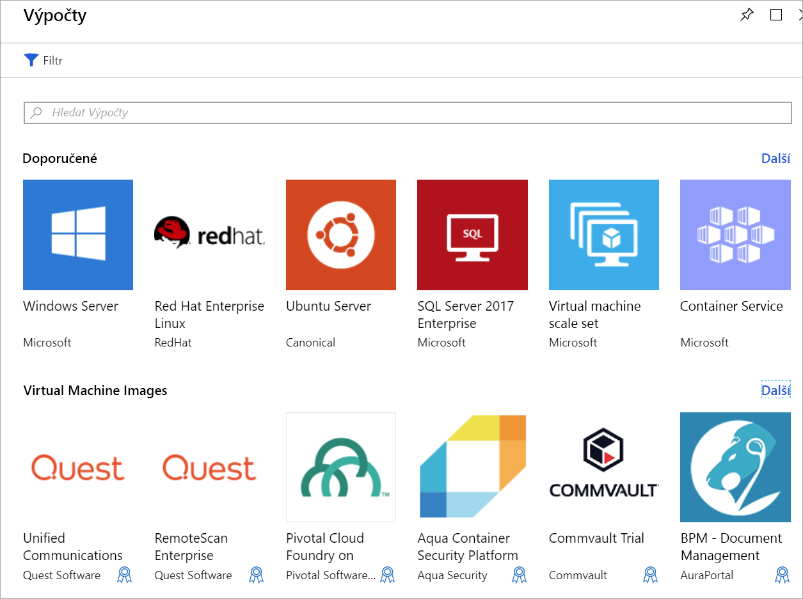

Vaše společnost se rozhodla spravovat videodata z dopravních kamer v Azure s využitím virtuálních počítačů. Aby bylo možné spouštět několik kodeků, musíme nejdřív vytvořit virtuální počítače. Musíme se také k virtuálním počítačům připojit a interagovat s nimi. V této lekci se naučíte, jak vytvořit virtuální počítač pomocí webu Azure Portal. Tento virtuální počítač nakonfigurujeme pro vzdálený přístup, vybereme image virtuálního počítače a zvolíme vhodnou možnost úložiště.

## Úvod do virtuálních počítačů s Windows v Azure

Virtuální počítače Azure jsou škálovatelné cloudové výpočetní prostředky na vyžádání. Podobají se virtuálním počítačům hostovaným ve Windows Hyper-V. Obsahují virtuální procesor, paměť, úložiště a síťové prostředky. Virtuální počítače můžete podle libosti spouštět a zastavovat stejně jako při použití Hyper-V a k jejich správě můžete využít Azure Portal nebo Azure CLI. Můžete se také pomocí klienta RDP (Remote Desktop Protocol) připojit přímo k desktopovému uživatelskému rozhraní Windows a používat virtuální počítač stejně, jako kdybyste byli přihlášení k místnímu počítači s Windows.

## Vytvoření virtuálního počítače Azure

Virtuální počítače můžete v Azure definovat a nasazovat několika způsoby. Můžete použít Azure Portal, skript (pomocí Azure CLI nebo Azure PowerShellu) nebo šablonu Azure Resource Manageru. Ve všech případech budete muset zadat některé informace, které si přiblížíme za chvíli.

Azure Marketplace také poskytuje předkonfigurované image, které zahrnují operační systém i oblíbené softwarové nástroje, které jsou nainstalované pro konkrétní scénáře.

## Prostředky používané na virtuálním počítači s Windows

Při vytváření virtuálního počítače s Windows v Azure vytváříte také prostředky pro jeho hostování. Tyto prostředky společně virtualizují počítač a spustí operační systém Windows. Buď musí existovat (a být vybrány při vytváření virtuálního počítače), nebo budou vytvořeny s virtuálním počítačem.

- Virtuální počítač, který nabízí prostředky procesoru a paměti
- Účet služby Azure Storage pro virtuální pevné disky
- Virtuální disky pro uložení operačního systému, aplikací a dat
- Virtuální síť (VNet) pro připojení virtuálního počítače k jiným službám Azure nebo k vašemu vlastnímu místnímu hardwaru
- Síťové rozhraní ke komunikaci s virtuální sítí
- Veřejná IP adresa, abyste mohli přistupovat k virtuálnímu počítači. Tato položka je nepovinná.

Stejně jako u ostatních služeb Azure budete potřebovat, aby **skupina prostředků** obsahovala virtuální počítač (a volitelně seskupovala tyto prostředky pro správu). Při vytváření nového virtuálního počítače můžete použít existující skupinu prostředků, nebo vytvořit novou.

## Volba image virtuálního počítače

Při vytváření virtuálního počítače je výběr image jedním z prvních a nejdůležitějších rozhodnutí, které je potřeba učinit. Image představuje šablonu sloužící k vytvoření virtuálního počítače. Tyto šablony obsahují operační systém a často také další software, jako jsou nástroje pro vývoj nebo prostředí pro hostování webů.

Všechny podporované aplikace mohou být součástí image virtuálního počítače. Můžete vytvořit virtuální počítač z image, která je předem nakonfigurovaná tak, aby odpovídala přesně vašim požadavkům, jako je třeba hostování aplikací využívajících ASP.Net Core.

> [!TIP]
> Můžete také vytvářet a nahrávat vlastní image. Více informací naleznete v dokumentaci.

## Určení velikosti virtuálního počítače
Stejně jako fyzický počítač má určitý objem paměti a výkon procesoru, má to samé i virtuální počítač. Azure nabízí celou řadu virtuálních počítačů různých velikostí a s různými cenami. Velikost, kterou zvolíte, určuje výpočetní výkon, paměť a maximální kapacitu úložiště.

> [!WARNING]
> Každé předplatné má omezení kvót, která mohou ovlivnit vytvoření virtuálního počítače. Ve výchozím nastavení nemůžete mít v rámci oblasti více než 20 virtuálních _jader_ ve všech virtuálních počítačích. Můžete virtuální počítače rozdělit napříč oblastmi, nebo podat [online žádost](https://docs.microsoft.com/azure/azure-supportability/resource-manager-core-quotas-request) o zvýšení limitu omezení.

Velikosti virtuálních počítačů jsou seskupené do kategorií, počínaje sérií B pro základní testování a až k sérii H pro rozsáhlé výpočetní úlohy. Velikost virtuálního počítače byste měli zvolit na základě příslušného předpokládaného zatížení. Velikost virtuálního počítače je možné změnit i po jeho vytvoření, ale bude potřeba jej nejdříve zastavit, takže je vhodné velikost určit odpovídajícím způsobem od samého začátku, pokud je to možné.

#### Tady jsou některé pokyny na základě scénáře, na který cílíte.

| Vykonávaná činnost | Vezměte v úvahu tyto velikosti
|-------|------------------|
| **Obecné výpočetní / webové použití** Webové servery pro testování a vývoj, malé až střední databáze nebo webové servery s nízkým až středním provozem. | B, Dsv3, Dv3, DSv2, Dv2 |
| **Úlohy náročné na výpočetní výkon** Webové servery se středním provozem, síťová zařízení, dávkové procesy a aplikační servery. | Fsv2, Fs, F |
| **Velké využití paměti** Servery relační databáze, střední až velké mezipaměti a analýza v paměti. | Esv3, Ev3, M, GS, G, DSv2, Dv2 |
| **Ukládání a zpracování dat** Databáze s velkými objemy dat, databáze SQL a NoSQL, které vyžadují vysokou propustnost disku a vstupně-výstupních operací. | Ls |
| **Vykreslování náročné grafiky** nebo úpravy videa, stejně jako trénování modelů a odvozování (ND) s hloubkovým učením. | NV, NC, NCv2, NCv3, ND |
| **Vysokovýkonné výpočetní prostředí (HPC)** V případě, že potřebujete virtuální počítače s nejrychlejším a nejvýkonnějším procesorem s volitelnou vysokou propustností síťového rozhraní. | H |

## Volba možnosti úložiště

Následující skupina rozhodnutí se týká úložiště. Nejprve zvolte technologii disku. Dostupné možnosti zahrnují tradiční jednotku pevného disku (HDD) nebo modernější jednotku SSD (solid-state drive). Stejně jako u kupovaného hardwaru, je SSD úložiště nákladnější, ale poskytuje vyšší výkon.

> [!TIP]
> K dispozici jsou dvě úrovně úložišť SSD: Standard a Premium. Pokud nemáte náročné úlohy, ale chcete vyšší výkon, zvolte disky SSD úrovně Standard. Pokud máte úlohy náročné na vstupně-výstupní operace nebo klíčové systémy, které potřebují zpracovávat data velmi rychle, zvolte disky SSD úrovně Premium.

### Mapování úložiště na disky

Azure používá k reprezentaci fyzických disků pro virtuální počítač virtuální pevné disky (VHD). Virtuální pevné disky replikují logický formát a data na disku, ale jsou uloženy jako objekty blob stránky v účtu služby Azure Storage. Typ úložiště (SSD nebo HDD) můžete určit také odděleně pro jednotlivé disky. To umožňuje řídit výkon jednotlivých disků, pravděpodobně na základě vstupně-výstupních operací, které máte v plánu na něm provádět.

Ve výchozím nastavení budou na virtuálním počítači s Windows vytvořeny dva virtuální pevné disky:

1. **Disk operačního systému**. Toto je primární jednotka (C:) a má maximální kapacitu 2 048 GB.

1. **Dočasný disk**. Ten poskytuje dočasné úložiště pro operační systém nebo další aplikace. Ve výchozím nastavení je nakonfigurovaný jako jednotka D: a jeho velikost je určena na základě velikosti virtuálního počítače, díky čemuž se jedná o ideální místo pro stránkovací soubor Windows.

> [!WARNING]
> Dočasný disk není trvalý. Na tento disk byste měli zapisovat pouze ta data, které jste ochotni kdykoli ztratit.

#### A co data?

Data můžete ukládat na jednotce C: spolu s operačním systémem, ale lepším řešením je vytvoření vyhrazených _datových disků_. Můžete vytvářet další disky a připojovat je k virtuálnímu počítači. Na každém disku může být až 4095 GB dat, přičemž maximální velikost úložiště odpovídá vybrané velikosti virtuálního počítače.

> [!NOTE]
> Zajímavou funkcí je vytvoření image virtuálního pevného disku ze skutečného disku. Díky tomu můžete snadno migrovat _existující_ informace z místního počítače do cloudu.

### Nespravované vs. spravované disky

Poslední volbou, která se týká úložiště, je otázka použití **nespravovaných** nebo **spravovaných** disků.

S nespravovanými disky jste zodpovědní za účty úložiště, které se používají k uložení virtuálních pevných disků odpovídajících diskům virtuálních počítačů. Poplatky za účet úložiště se platí podle používaného místa. Jeden účet úložiště má pevný rychlostní limit 20 000 vstupně-výstupních operací za sekundu. To znamená, že při plném výkonu dokáže podporovat 40 standardních virtuálních pevných disků. Pokud potřebujete horizontálně navýšit kapacitu, potřebujete více účtů úložiště, což může být složité.

Spravované disky představují novější, doporučovaný model diskového úložiště. Elegantně řeší tyto komplikace tím, že problémy se správou účtů úložiště nechají na Azure. Po zadání typu (Premium nebo Standard) a velikosti disku Azure vytvoří a bude spravovat disk _a zároveň_ úložiště, které používá. Nemusíte se obávat o omezení účtu úložiště, což usnadňuje navýšení jejich kapacity. Spravované disky nabízejí i další výhody:

- **Větší spolehlivost:** Azure zajistí, aby virtuální pevné disky používané pro vysoce spolehlivé virtuální počítače byly umístěny v různých částech úložiště Azure kvůli zajištění podobné míry odolnosti.
- **Lepší zabezpečení:** spravované disky jsou skutečně spravovanými prostředky ve skupině prostředků. To znamená, že je možné použít řízení přístupu na základě rolí a omezit tak, kdo může pracovat s daty na virtuálním pevném disku.
- **Podpora snímků:** snímky slouží k vytvoření kopie virtuálního pevného disku jen pro čtení. Je při tom potřeba vypnout nadřízený virtuální počítač, ale vytvoření snímku trvá jen pár sekund. Jakmile je snímek vytvořený, můžete virtuální počítač zase zapnout. Snímek můžete použít k vytvoření duplicitního virtuálního počítače kvůli řešení potíží s produkčním systémem nebo můžete vrátit virtuální počítač do okamžiku pořízení snímku.
- **Podpora zálohování:** Spravované disky můžete službou Azure Backup automaticky zálohovat do různých oblastí, abyste je v případě havárie mohli obnovit. Zálohování nemá vliv na službu virtuálního počítače.

## Síťová komunikace

Virtuální počítače komunikují s externími prostředky prostřednictvím virtuální sítě (VNet). Virtuální síť představuje privátní síť v jedné oblasti, ve které prostředky komunikují. Virtuální síť je stejná jako sítě, které spravujete v místním prostředí. Můžete je rozdělit pomocí podsítí a izolovat tak prostředky, připojit je k jiným sítím (včetně místních sítí) a použít pravidla provozu, která řídí příchozí a odchozí připojení.

### Plánování sítě

Když vytváříte nový virtuální počítač, budete mít možnost vytvořit novou virtuální síť nebo použít existující virtuální síť ve vaší oblasti.

Můžete jednoduše nechat Azure vytvořit síť spolu s virtuálním počítačem, ale ve většině scénářů to pravděpodobně není ideální. Je lepší _předem_ naplánovat síťové požadavky všech součástí architektury a zvlášť vytvořit potřebnou strukturu virtuální sítě. Poté vytvořte virtuální počítače a umístěte je do připravených virtuálních sítí.

V tomto modulu se blíže seznámíme s virtuálními sítěmi o něco později. Tyto znalosti využijeme při tvorbě virtuálního počítače v Azure.