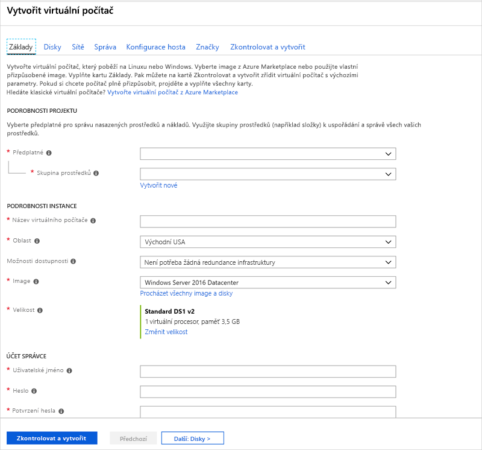
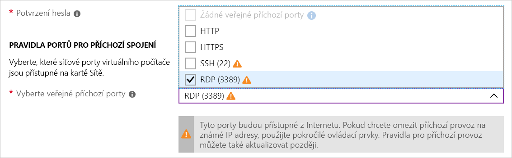
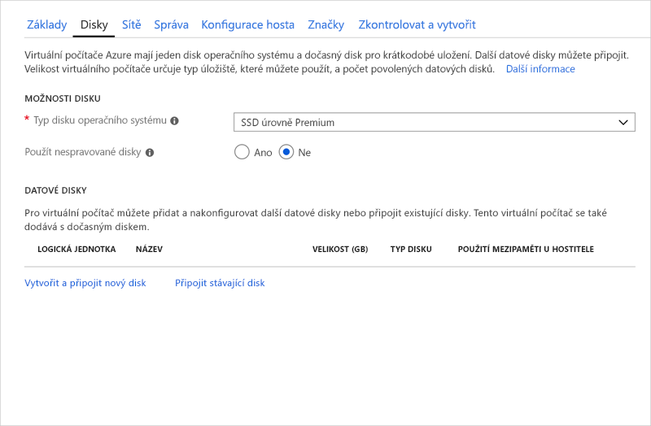
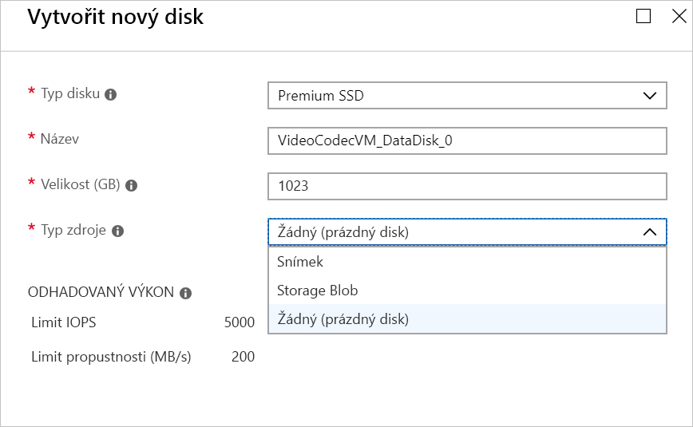
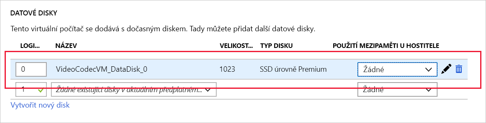

Vzpomeňte si, že naše firma zpracovává video obsah na virtuálních počítačích s Windows. Od nového města jsme získali zakázku na zpracování obrazu dopravních kamer, jde ale o model, s jakým jsme ještě nepracovali. Abychom mohli začít se zpracováním a analýzou jejich obrazu, potřebujeme vytvořit nový virtuální počítač s Windows a nainstalovat některé proprietární kodeky.

<!-- Activate the sandbox -->
[!include]

## Vytvoření nového virtuálního počítače s Windows

Virtuální počítače s Windows můžeme vytvořit pomocí portálu Azure Portal, rozhraní příkazového řádku Azure nebo Azure PowerShellu. Nejjednodušší je použít portál, protože vás provede požadovanými informacemi a během vytváření virtuálního počítače poskytuje rady a užitečné zprávy.

1. Pomocí stejného účtu, kterým jste aktivovali sandbox, se přihlaste k webu [Azure Portal](https://portal.azure.com/learn.docs.microsoft.com?azure-portal=true).

1. Klikněte na **Vytvořit prostředek** v levém horním rohu webu Azure Portal.

1. Do panelu vyhledávání zadejte **Windows Server 2016 Datacenter** a v zobrazeném seznamu klikněte na odkaz se stejným názvem.

1. Kliknutím na tlačítko **Vytvořit** spusťte konfiguraci virtuálního počítače.

## Konfigurace nastavení virtuálního počítače

Prostředí pro vytváření virtuálních počítačů v rámci portálu má podobu průvodce, který vás provede všemi oblastmi konfigurace virtuálního počítače. Kliknutím na tlačítko Další se dostanete k dalšímu konfigurovatelnému oddílu. Pomocí karet podél horního okraje, které identifikují jednotlivé oddíly, se ale můžete pohybovat podle libosti.

Po vyplnění všech povinných možností (označených červenou hvězdičkou) můžete přeskočit zbývající část průvodce a spustit vytvoření virtuálního počítače tlačítkem **Zkontrolovat a vytvořit** dole.

Začneme oddílem **Základy**.

### Konfigurace základního nastavení virtuálního počítače

> [!NOTE]
> Při změnách nastavení a přechodu mezi poli pro volný text ověří Azure automaticky hodnotu všech polí a vedle těch správných umístí zelenou značku zaškrtnutí. Další informace o zjištěných problémech získáte najetím myší na ukazatele chyb.

1. Vyberte **Předplatné**, kterému se mají fakturovat hodiny virtuálního počítače.

1. Zvolte možnost „**<rgn>[název skupiny prostředků sandboxu]</rgn>**“ pro **Skupiny prostředků**.

1. V oddílu **PODROBNOSTI INSTANCE** zadejte název virtuálního počítače, například **test-vp-vm2** (pro testovací zpracování obrazu virtuálního počítače 2 ).
    - Osvědčeným postupem je používat standardizované názvy prostředků, abyste snadno poznali jejich účel. Názvy virtuálních počítačů Windows jsou mírně omezené - musí mít délku 1 až 15 znaků, nesmí obsahovat znaky nepocházející ze sady ASCII ani speciální znaky a musí být v aktuální skupině prostředků jedinečné.

1. Z následujících umístění vyberte vám nejbližší oblast.

   [!include]

1. **Možnosti dostupnosti** ponechte nastavené na Žádné. Tato možnost zajišťuje vysokou dostupnost virtuálního počítače seskupováním více virtuálních počítačů do skupiny kvůli zvládání plánované nebo neplánované údržby či výpadků.

1. Zajistěte, aby byla image nastavená na Windows Server 2016 Datacenter. Otevřením rozevíracího seznamu zobrazíte všechny dostupné možnosti.

1. Pole **Velikost** nelze přímo upravovat a má výchozí velikost DS1. Klikněte na odkaz **Změnit velikost** a prozkoumejte další velikosti virtuálních počítačů. Výsledný dialog umožňuje filtrovat na základě počtu procesorů, názvu a typu disku. Až skončíte, vyberte „Standard DS1 v2“ (výchozí nastavení). Virtuální počítač tak bude mít 1 procesor a 3,5 GB paměti.

    > [!TIP]
    > Přesunutím tohoto zobrazení doleva se můžete vrátit k nastavení virtuálního počítače, které se otevřelo v novém okně napravo, a přesunutím okna ho zobrazit.

1. V oddílu **ÚČET SPRÁVCE** nastavte pole **Uživatelské jméno** na uživatelské jméno, které budete používat pro přihlášení k tomuto virtuálnímu počítači.

1. Do pole **Heslo** zadejte heslo, které má minimálně 12 znaků. Musí obsahovat tři z následujících znaků: jedno malé písmeno, jedno velké písmeno, jednu číslici a jeden speciální znak jiný než „\\“ nebo „-“. Použijte heslo, které si zapamatujete, nebo si ho poznačte, protože ho budete potřebovat později.

1. Potvrďte **heslo**.

1. V oddílu **PRAVIDLA PORTŮ PRO PŘÍCHOZÍ SPOJENÍ** otevřete seznam a zvolte _Povolit vybrané porty_. Protože se jedná o virtuální počítač s Windows, chceme mít možnost přístupu na plochu přes RDP. Procházejte seznam, dokud nenajdete položku RDP (3389), a vyberte ji. Jak udává poznámka v uživatelském rozhraní, síťové porty lze upravit také po vytvoření virtuálního počítače.

    

## Konfigurace disků pro virtuální počítač

1. Kliknutím na **Další** přejděte do oddílu Disky.

    

1. Jako **Typ disku s operačním systémem** zvolte SSD úrovně Premium.

1. Použijte spravované disky, abychom nemuseli pracovat s účty úložiště. Pokud chcete, můžete přepnutím přepínače v grafickém uživatelském rozhraní zobrazit rozdíly v informacích, které Azure potřebuje.

### Vytvoření datového disku

Vzpomeňte si, že získáme disk s operačním systémem (C:) a dočasný disk (D:). Přidáme také datový disk.

1. Klikněte na odkaz **Vytvořit a připojit nový disk** v oddílu **DATOVÉ DISKY**.

    

1. Můžete ponechat všechny výchozí hodnoty: SSD úrovně Premium, 1023 GB a Žádný (prázdný disk); všimněte si ale, že zde můžeme k vytvoření virtuálního pevného disku použít snímek nebo Storage Blob.

1. Kliknutím na **OK** vytvořte disk a vraťte se zpět do oddílu **DATOVÉ DISKY**.

1. Na prvním řádku by teď měl být nový disk.

    

## Konfigurace sítě

1. Kliknutím na **Další** přejděte do oddílu Sítě.

1. V produkčním systému, kde už máme jiné komponenty, bychom chtěli využít _existující_ virtuální síť. Virtuální počítač pak může komunikovat s jinými cloudovými službami v našem řešení. Pokud v této lokalitě ještě není virtuální síť nadefinovaná, můžeme ji zde vytvořit a nakonfigurovat:
    - **Adresní prostor:** Celkový prostor protokolu IPv4 dostupný pro tuto síť.
    - **Rozsah podsítě:** První podsíť pro rozdělení adresního prostoru – musí se vejít do definovaného adresního prostoru. Po vytvoření virtuální sítě můžete přidat další podsítě.

1. Změníme výchozí rozsahy tak, aby se používal adresní prostor IP adres `172.xxx`. Klikněte na **Vytvořit nový** pod virtuální sítí.
    - Pole **Adresní prostor** změňte na `172.16.0.0/16`. Tím udělíte plný rozsah adres.
    - Pole **Rozsah podsítě** změňte na `172.16.1.0/24`. Tím tomuto prostoru udělíte 256 IP adres.

1. Klikněte na **OK**.

> [!NOTE]
> Azure pro virtuální počítač standardně vytvoří virtuální síť, síťové rozhraní a veřejnou IP adresu. Po vytvoření virtuálního počítače není jednoduché možnosti sítě změnit, proto přiřazení sítí, které v Azure vytváříte, vždy překontrolujte.

## Dokončení konfigurace virtuálního počítače a vytvoření image

Zbývající možnosti mají rozumné výchozí nastavení a není potřeba je měnit. Pokud chcete, můžete prozkoumat ostatní karty. Vedle jednotlivých možností je ikona `(i)`, která vám ukáže bublinovou nápovědu s vysvětlením dané možnosti. Je to skvělý způsob, jak získat informace o různých možnostech, které se používají při konfiguraci virtuálního počítače.

1. Klikněte na tlačítko **Zkontrolovat a vytvořit** v dolní části panelu.

1. Systém ověří zadané možnosti a zobrazí informace o vytvářeném virtuálním počítači.

1. Kliknutím na **Vytvořit** virtuální počítač vytvořte a nasaďte. Řídicí panel Azure zobrazí nasazovaný virtuální počítač. To může trvat několik minut.

Během nasazování zjistíme, co s tímto virtuálním počítačem můžeme dělat.