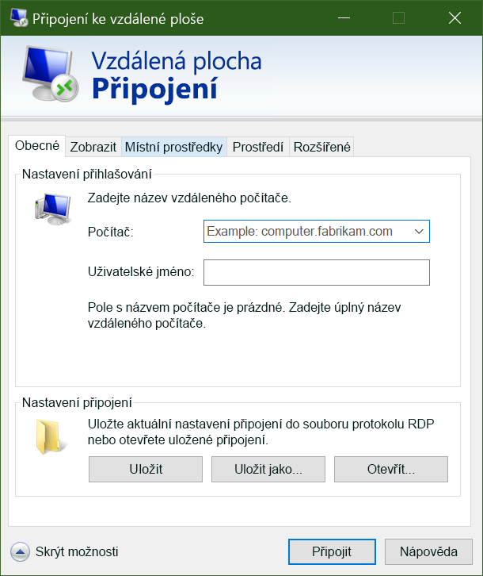

Když teď máme v Azure virtuální počítače s Windows, bude dalším krokem vložení aplikací a dat na tyto virtuální počítače, aby zpracovaly naše dopravní videa. 

Pokud jste však mezi Azure a místní sítí nenastavili síť VPN typu site-to-site, nebudou virtuální počítače v Azure z místní sítě dostupné. Pokud s Azure teprve začínáte, pravděpodobně funkční síť VPN typu site-to-site nemáte. Jak tedy můžete soubory na virtuální počítače Azure přenést? Můžete jednoduše použít funkci Azure Připojení ke vzdálené ploše, díky které nasdílíte své místní disky s novými virtuálními počítači Azure.

Když teď máme nový virtuální počítač s Windows, musíme na něj nainstalovat vlastní software. Existuje několik způsobů, jak to udělat.

- Remote Desktop Protocol (RDP)
- Vlastní skripty
- Vlastní image virtuálních počítačů (s předinstalovaným softwarem)

Pojďme se podívat na nejjednodušší způsob pro virtuální počítače s Windows: Remote Desktop Protocol.

## Co je Remote Desktop Protocol?

Protokol RDP (Remote Desktop Protocol) poskytuje vzdálené připojení k uživatelskému rozhraní počítačů s Windows. Protokol RDP umožňuje přihlásit se ke vzdálenému fyzickému nebo virtuálnímu počítači s Windows a ovládat tento počítač stejně, jako kdybyste seděli přímo u něj. Připojení RDP umožňuje provádět velkou většinu operací, které můžete provést z konzoly fyzického počítače, s výjimkou některých funkcí spojených s napájením a hardwarem.

K připojení RDP je zapotřebí klient RDP. Microsoft poskytuje klienty RDP pro následující operační systémy:

- Windows (integrované)
- MacOS
- iOS
- Android

Následující snímek zobrazuje klienta protokolu RDP v Windows 10.

Existují také open source klienti pro Linux, třeba klient Remmina, který umožňuje připojení k počítači s Windows z distribuce Ubuntu.

## Připojení k virtuálnímu počítači Azure

Jak jsme před chvílí viděli, virtuální počítače Azure komunikují ve virtuální síti. Můžeme jim ale také volitelně přiřadit veřejnou IP adresu. Díky veřejné IP adrese můžeme s virtuálním počítačem komunikovat přes internet. Případně můžeme nastavit virtuální privátní síť (VPN), která propojí místní síť s Azure, takže se můžete k virtuálnímu počítači připojit zabezpečeně bez veřejné IP adresy. Tento přístup je popsaný v jiném modulu, a pokud vás tato možnost zajímá, je plně zdokumentovaná.

Nezapomeňte, že v Azure se veřejné IP adresy často přidělují dynamicky. To znamená, že se IP adresa může v průběhu času měnit – u virtuálních počítačů k tomu dochází při restartu. Pokud se chcete místo k názvu připojovat přímo k IP adrese a potřebujete mít jistotu, že se nezmění, můžete si připlatit za přidělení statické adresy.

### Jak se připojit k virtuálnímu počítači v Azure pomocí protokolu RDP?

Připojení k virtuálnímu počítači v Azure pomocí protokolu RDP je jednoduchý proces. Na webu Azure Portal přejděte do vlastností virtuálního počítače a v horní části klikněte na **Připojit**. Zobrazí se vám IP adresy přiřazené k virtuálnímu počítači a dostanete možnost stáhnout si předkonfigurovaný soubor **RDP**, který systém Windows potom otevře v klientovi protokolu RDP. Můžete se připojit přes veřejnou IP adresu virtuálního počítače uvedenou v souboru RDP. Případně pokud se připojujete přes síť VPN nebo propojení ExpressRoute, můžete vybrat interní IP adresu. Můžete také pro připojení vybrat číslo portu.

Pokud pro virtuální počítač používáte statickou veřejnou IP adresu, můžete si soubor **RDP** uložit na svůj počítač. Pokud používáte dynamické přidělování IP adres, soubor **RDP** zůstane platný jenom po dobu spuštění virtuálního počítače. Jakmile virtuální počítač restartujete, bude potřeba stáhnout nový soubor **RDP**.

> [!TIP]
> Můžete také zadat veřejnou IP adresu virtuálního počítače do klienta RDP ve Windows a kliknout na **Připojit**.

Když se připojíte, většinou se zobrazí dvě upozornění. Jsou to:

-**Upozornění vydavatele** – kvůli tomu, že soubor **RDP** nemá veřejný podpis.
- **Upozornění certifikátu** – kvůli tomu, že certifikát počítače není důvěryhodný.

V testovacích prostředích můžete tato upozornění ignorovat. V produkčních prostředích by měl být soubor **RDP** podepsaný pomocí nástroje **RDPSIGN.EXE** a v úložišti **důvěryhodných kořenových certifikačních autorit** klienta by se měl nacházet certifikát počítače.

Pojďme se zkusit připojit prostřednictvím protokolu RDP k našemu virtuálnímu počítači.