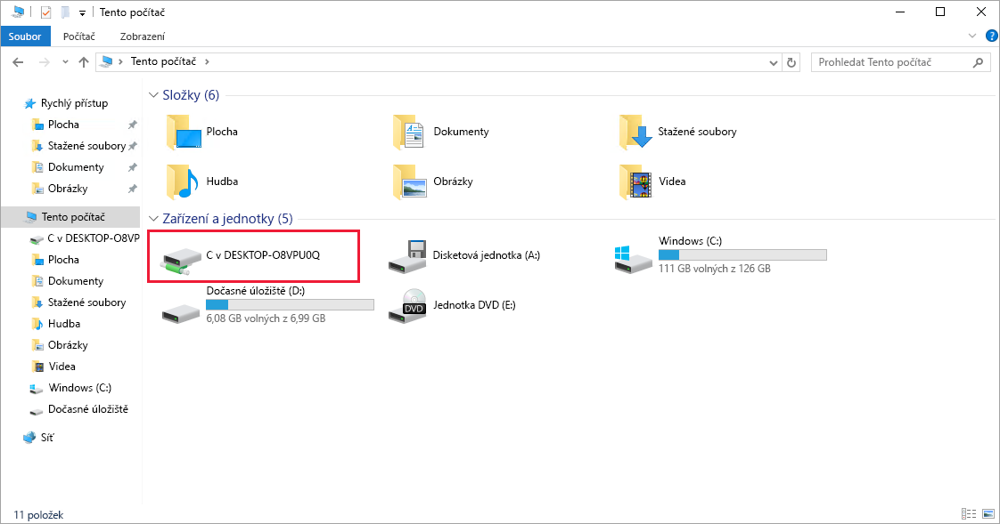
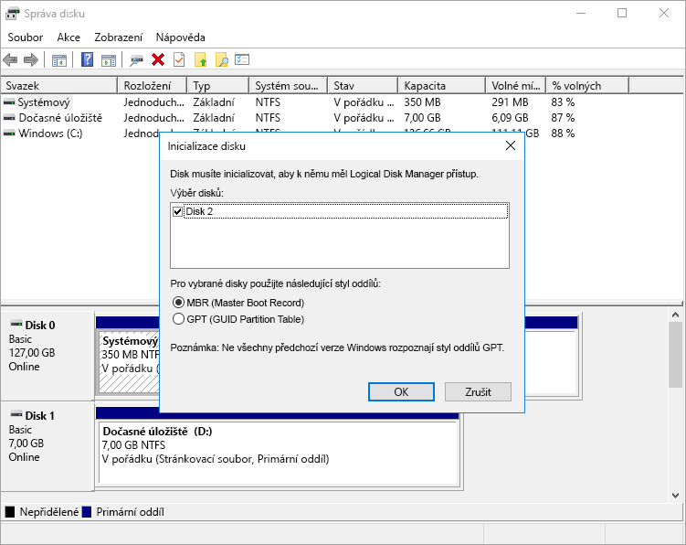

Nasadili a spustili jsme virtuální počítač s Windows, není ale nakonfigurovaný pro zpracování žádných úloh.

Připomínáme, že naším scénářem je systém zpracování videa. Naše platforma přijímá soubory prostřednictvím protokolu FTP. Dopravní kamery nahrávají videoklipy na známou adresu URL, která je namapovaná na složku na serveru. Vlastní software na každém virtuálním počítači s Windows běží jako služba, sleduje složku a zpracovává každý nahraný klip. Pak předá normalizované video našim algoritmům, které běží v dalších službách Azure.

Abychom zajistili podporu tohoto scénáře, je třeba nakonfigurovat několik položek:

- Nainstalovat službu FTP a otevřít porty, které potřebuje ke komunikaci
- Nainstalovat proprietární kodek videa jedinečný pro systém kamer příslušného města
- Nainstalovat službu překódování, která zpracovává nahraná videa

Mnohé z těchto položek jsou typické úlohy správy, kterými se tady nebudeme prakticky zabývat, a nebudeme instalovat software. Místo toho projdeme jednotlivé kroky a ukážeme si, jak _by bylo možné_ instalovat vlastní software nebo software třetích stran prostřednictvím Vzdálené plochy. Začněme tím, že získáme informace o připojení.

## Připojení k virtuálnímu počítači prostřednictvím protokolu RDP (Remote Desktop Protocol)

Pro připojení k virtuálnímu počítači Azure prostřednictvím klienta protokolu RDP budete potřebovat:

- Veřejnou IP adresu virtuálního počítače (nebo privátní, pokud je virtuální počítač nakonfigurovaný pro připojení k vaší síti)
- Číslo portu

Tyto informace můžete zadat do klienta protokolu RDP nebo stáhnout předem nakonfigurovaný soubor **RDP**.

### Stažení souboru RDP

1. Na [webu Azure Portal](https://portal.azure.com/learn.docs.microsoft.com?azure-portal=true) se ujistěte, že je otevřený panel **Přehled** pro virtuální počítač, který jste vytvořili dřív. Pokud potřebujete virtuální počítač otevřít, najdete ho v části **Všechny prostředky**. Na panelu Přehled jsou různé informace o virtuálním počítači.

    - Vidíte, jestli je virtuální počítač spuštěný.
    - Můžete ho zastavit nebo restartovat.
    - Můžete získat veřejnou IP adresu pro připojení k virtuálnímu počítači.
    - Prohlédněte si činnost procesoru, disku a sítě.

1. V horní části podokna klikněte na tlačítko **Připojit**.

1. V okně **Připojit k virtuálnímu počítači** si poznamenejte zobrazenou **IP adresu** a **číslo portu** a kliknutím na **Stáhnout soubor RDP** uložte soubor do počítače.

1. Před připojením upravíme několik nastavení. Ve Windows najděte soubor pomocí Průzkumníka, klikněte pravým tlačítkem a vyberte **Upravit**. V MacOS budete muset soubor nejdřív otevřít pomocí klienta protokolu RDP a pak kliknout pravým tlačítkem na položku v zobrazeném seznamu a vybrat **Upravit**.

1. Můžete upravovat různá nastavení, která řídí možnosti při připojování k virtuálnímu počítači Azure. Je vhodné prověřit tato nastavení:

    - **Zobrazení:** Ve výchozím nastavení se použije zobrazení na celé obrazovce. Můžete nastavit nižší rozlišení nebo použít všechny monitory, pokud máte víc než jeden.
    - **Místní prostředky:** Místní jednotky pevných disků můžete sdílet s virtuálním počítačem – budete moct kopírovat soubory z fyzického počítače do virtuálního. Klikněte na tlačítko **Další** v části **Místní zařízení a prostředky** a vyberte, co se má sdílet.
    - **Vzhled:** Můžete upravit vzhled podle kvality sítě.

1. Sdílejte místní jednotku C:, aby byla viditelná pro virtuální počítač.

1. Přejděte zpět na kartu **Obecné** a kliknutím na **Uložit** uložte změny. Později se můžete k úpravám tohoto souboru vrátit a vyzkoušet jiná nastavení.

### Připojení k virtuálnímu počítači s Windows

1. Kliknutím na tlačítko **Připojit** se začněte připojovat k virtuálnímu počítači.

1. V dialogovém okně **Připojení ke vzdálené ploše** si všimněte upozornění o zabezpečení a IP adresy vzdáleného počítače a pak klikněte na **Připojit**.

1. V dialogovém okně **Zabezpečení Windows** zadejte uživatelské jméno a heslo, které jste použili v krocích 6 a 7.

    > [!NOTE]
    > Pokud pro připojení k virtuálnímu počítači používáte klienta pro Windows, jako výchozí se nastaví známé identity v počítači. Můžete kliknout na položku **Víc možností**, vybrat položku Použít jiný účet a zadat jinou kombinaci uživatelského jména a hesla.

1. V druhém dialogovém okně **Připojení ke vzdálené ploše** si všimněte chyb certifikátu a klikněte na **Ano**.

### Instalace rolí pracovních procesů

Při prvním připojení k virtuálnímu počítači se serverem Windows se spustí Správce serveru. To vám umožní přiřadit roli pracovního procesu pro běžné webové nebo datové úlohy. Správce serveru můžete spustit i z nabídky Start.

Na tomto místě bychom k serveru přidali roli Webový server. Tímto postupem se nainstaluje služba ISS a v rámci konfigurace pak můžete vypnout požadavky HTTP a povolit server FTP. Můžeme také ignorovat službu IIS a nainstalovat server FTP třetí strany. Pak bychom nakonfigurovali server FTP tak, aby umožňoval přístup ke složce s velkými objemy dat, kterou jsme přidali do virtuálního počítače.

Vzhledem k tomu, že tady tuto konfiguraci nebudeme provádět v praxi, Správce serveru jen zavřeme.

## Instalace vlastního softwaru

Při instalaci softwaru můžeme použít dva přístupy. První přístup: Tento virtuální počítač je připojený k internetu. Pokud je pro potřebný software k dispozici možnost stažení instalačního programu, můžete otevřít webový prohlížeč v relaci RDP, stáhnout software a nainstalovat ho. Druhý přístup: Pokud se jedná o vlastní software (například vlastní službu), můžete ho zkopírovat z místního počítače do virtuálního počítače a nainstalovat ho. Podívejme se na druhý přístup.

1. Otevřete Průzkumníka souborů. Klikněte na **Tento počítač** na bočním panelu. Mělo by se zobrazit několik jednotek:

    - Jednotka Windows (C:) představující operační systém
    - Jednotka dočasného úložiště (D:)
    - Místní jednotka C: (bude mít jiný název, než je uvedeno níže)

    

Pokud máte přístup k místnímu disku, můžete kopírovat soubory pro vlastní software do virtuálního počítače a instalovat software. V praxi to dělat nebudeme, protože se jedná jen o simulovaný scénář, dovedete si ale představit, jak by to fungovalo.

Zajímavější je zjistit, co v seznamu jednotek _chybí_. Všimněte si, že jednotka **Data** není zobrazená. Služba Azure přidala virtuální pevný disk, ale neinicializovala ho.

## Inicializace datových disků

Všechny další jednotky, které vytvoříte od začátku, se musí inicializovat a naformátovat. Tento proces je stejný jako u fyzické jednotky.

1. Z nabídky Start spusťte nástroj **Správa disků**. Je možné, že budete muset nejprve přejít do nástroje Správa počítače a až potom do Správy disků, případně zkuste vyhledat „Správa disků“ z nabídky Start.

1. Zobrazí se upozornění, že byl nalezen neinicializovaný disk.

    

1. Kliknutím na **OK** disk inicializujte. Disk se pak zobrazí v seznamu svazků, kde ho můžete naformátovat a přiřadit mu písmeno jednotky.

1. Otevřete Průzkumníka souborů. Datová jednotka by se měla být zobrazená.

1. Pokračujte ukončením klienta protokolu RDP a odhlášením od virtuálního počítače. Server bude dál běžet.

Protokol RDP umožňuje pracovat s virtuálním počítačem Azure stejně jako s místním počítačem. Prostřednictvím přístupu k uživatelskému rozhraní plochy můžete tento virtuální počítač spravovat stejně jako jakýkoli jiný počítač s Windows: instalovat software, konfigurovat role, upravovat funkce a provádět další běžné úkoly. Tento proces je ale manuální – pokud musíme pokaždé instalovat nějaký software, zvažte automatizaci procesu s použitím skriptování.