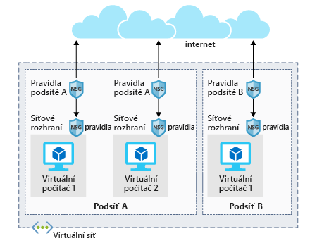

Nainstalovali jsme vlastní software, nastavili FTP server a nakonfigurovali virtuální počítač pro příjem našich videosouborů. Pokud se však pokusíme připojit k naší veřejné IP adrese s využitím protokolu FTP, zjistíme, že je blokovaná. 

Úpravy konfigurace serveru se běžně provádějí u vybavení v místním prostředí. V tomto smyslu můžete virtuální počítače Azure vnímat jako rozšíření tohoto prostředí. Pomocí nástrojů Azure Portal, Azure CLI nebo Azure PowerShellu je možné mimo jiné provádět změny v konfiguraci, spravovat sítě a povolit nebo blokovat provoz.

S některými základními informacemi a možnostmi správy jste se seznámili již v panelu **Přehled** pro virtuální počítač. Pojďme se blíže seznámit s konfigurací sítě.

## Otevření portů virtuálních počítačů Azure

Ve výchozím nastavení jsou nové virtuální počítače uzamčeny. 

Aplikace mohou vytvářet odchozí požadavky, ale příchozí provoz je povolený jen z virtuální sítě (například další prostředky ze stejné místní sítě) a z nástroje Azure Load Balancer (kontrolní testy).

Pokud chcete upravit konfiguraci pro podporu protokolu FTP, jsou nutné dva kroky. Při vytváření nového virtuálního počítače máte možnost otevřít několik běžných portů (RDP, HTTP, HTTPS a SSH). Pokud ovšem potřebujete jiné změny brány firewall, bude potřeba je provést ručně.

Tento postup se skládá ze dvou kroků:

1. Vytvořte skupinu zabezpečení sítě.
2. Vytvořte příchozí pravidlo povolující provoz na portu 20 a 21 a získejte tak aktivní podporu FTP.

### Co je skupina zabezpečení sítě?

Virtuální sítě (VNet) jsou základem pro model sítí Azure a poskytují izolaci a ochranu. Skupiny zabezpečení sítě jsou hlavním nástrojem, který slouží ke kontrole dodržování pravidel síťového provozu na úrovni sítě. Skupiny zabezpečení sítě představují volitelnou vrstvu zabezpečení. Tato vrstva funguje jako softwarová brána firewall, která ve virtuální síti filtruje příchozí a odchozí provoz. 

Skupiny zabezpečení můžete přidružit k síťovému rozhraní (pravidla pro jednotlivé hostitele), podsíti ve virtuální síti (pokud je chcete použít pro více prostředků) nebo k oběma úrovním. 

#### Pravidla skupin zabezpečení

Skupiny zabezpečení sítě používají _pravidla_, která povolí nebo zakážou provoz v síti. Každé pravidlo má určenou adresu zdroje a cíle (nebo rozsah), protokol, port (nebo rozsah), směr (příchozí nebo odchozí), číselně vyjádřenou prioritu a informaci, zda provoz, který odpovídá pravidlu, povolit nebo zakázat. Následující obrázek znázorňuje pravidla skupin zabezpečení sítě použitá na úrovni podsítě a síťového rozhraní.

Každá skupina zabezpečení má sadu výchozích pravidel zabezpečení, která používají výchozí síťová pravidla popsaná výše. Výchozí pravidla nemůžete změnit, ale _můžete_ je přepsat.

#### Jak Azure používá síťová pravidla

Při příchozím provozu zpracuje Azure skupinu zabezpečení přidruženou k podsíti a pak skupinu zabezpečení použitou u síťového rozhraní. Odchozí provoz se zpracovává v opačném pořadí (napřed síťové rozhraní a potom podsíť).

> [!WARNING]
> Nezapomeňte, že skupiny zabezpečení jsou na obou úrovních volitelné. Pokud se nepoužije žádná skupina zabezpečení, Azure **povolí veškerý provoz**. Pokud má virtuální počítač veřejnou IP adresu, může to být velké riziko, zejména když operační systém nemá bránu firewall.

Pravidla se vyhodnocují v _pořadí podle priority_. Začíná se pravidlem, které má **nejnižší prioritu**. Pravidla odmítnutí vyhodnocování vždy **zastaví**. Pokud například pravidlo síťového rozhraní zablokuje odchozí žádost, nekontrolují se pravidla použitá u podsítě. Aby provoz prošel skupinou zabezpečení, musí projít _všemi_ použitými skupinami.

Posledním pravidlem je vždy pravidlo **Zamítnout vše**. Jde o výchozí pravidlo přidané do každé skupiny zabezpečení pro příchozí a odchozí provoz s prioritou 65500. To znamená, že aby provoz mohl projít skupinou zabezpečení, _musíte mít pravidlo, které ho povolí_, jinak ho poslední výchozí pravidlo zablokuje.

> [!NOTE]
> Zvláštním případem je protokol SMTP (port 25), kdy záleží na úrovni předplatného a datu vytvoření účtu, protože jinak může být odchozí provoz přes SMTP zablokovaný. Můžete požádat, aby toto omezení bylo v odůvodněných případech odebráno.

Pro tento virtuální počítač jsme nevytvořili skupinu zabezpečení. Pojďme ji vytvořit a použít.

## Vytváření skupin zabezpečení sítě

Jako skoro všechno v Azure i skupiny zabezpečení jsou spravované prostředky. Můžete je vytvořit na webu Azure Portal nebo skriptovacími nástroji příkazového řádku. Problematické je definování těchto pravidel. Podívejme se na definování nového pravidla pro povolení protokolu FTP.